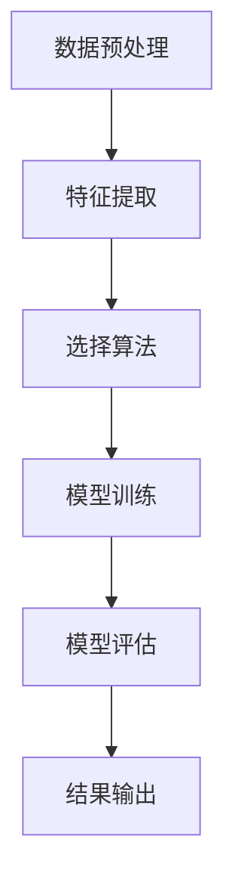
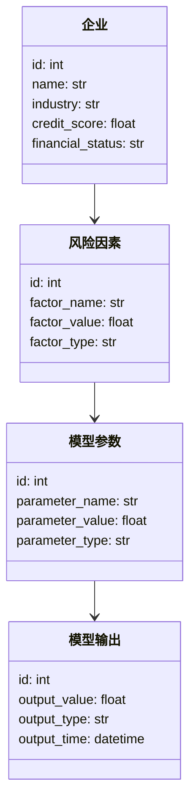

                 


# 设计智能化的企业信用风险定价模型

## 关键词：企业信用风险，定价模型，智能化，机器学习，风险管理

## 摘要：本文系统地探讨了如何设计智能化的企业信用风险定价模型，通过分析传统定价方法的局限性，结合机器学习和大数据技术，提出了一种基于智能化算法的定价模型，并详细阐述了其核心算法、数学模型、系统架构及实际应用案例。文章内容涵盖从理论到实践的完整流程，旨在为读者提供一个清晰的设计思路和实现方案。

---

## 第1章: 企业信用风险定价模型的背景介绍

### 1.1 问题背景与问题描述

#### 1.1.1 问题背景
在金融领域，企业信用风险定价是评估企业信用状况的重要手段。传统的信用风险定价模型主要依赖于财务指标和经验判断，存在以下问题：
- 数据维度单一，难以捕捉非财务风险因素。
- 模型泛化能力不足，难以应对复杂多变的市场环境。
- 需要大量人工干预，效率较低。

#### 1.1.2 问题描述
企业信用风险定价模型的目标是通过对企业财务状况、市场环境、经营状况等多维度数据的分析，量化企业的信用风险，并为其制定合理的定价策略。然而，传统模型在以下方面存在不足：
- 数据来源单一，难以覆盖非结构化数据。
- 模型的可解释性和透明度较低。
- 缺乏动态调整能力，难以应对实时风险变化。

#### 1.1.3 解决思路与边界
智能化定价模型的核心思路是引入机器学习和大数据分析技术，构建一个多维度、动态调整的定价模型。模型的边界包括：
- 数据范围：仅限于企业公开的财务数据和市场数据。
- 时间范围：实时或定期更新。
- 应用场景：主要用于企业贷款、债券发行等信用评估场景。

---

## 第2章: 核心概念与联系

### 2.1 核心概念的原理与特征

#### 2.1.1 信用风险的定义与特征
信用风险是指企业在偿还债务时发生违约的可能性。其特征包括：
- 可量化的：通过违约概率（PD）和违约损失率（LGD）等指标量化。
- 动态性：受市场环境、企业经营状况等因素影响。
- 多维度：涉及财务、市场、行业等多个维度。

#### 2.1.2 企业信用评分的原理
企业信用评分是通过对企业信用状况的综合评估，得出一个评分结果，作为定价的依据。评分模型通常包括以下几个步骤：
1. 数据收集：收集企业的财务数据、市场数据等。
2. 数据预处理：清洗、特征提取。
3. 模型训练：使用机器学习算法训练模型。
4. 模型评估：验证模型的准确性和稳定性。

#### 2.1.3 智能化定价的关键技术
智能化定价的关键技术包括：
- 机器学习：用于特征提取和模型训练。
- 大数据分析：用于处理多维度数据。
- 实时计算：用于动态调整定价策略。

### 2.2 核心概念的属性对比

| 比较维度 | 传统模型 | 智能化模型 |
|----------|----------|------------|
| 数据来源 | 财务数据为主 | 多维度数据（财务、市场、行业等） |
| 模型复杂度 | 简单线性模型 | 复杂非线性模型 |
| 可解释性 | 高 | 较低 |
| 泛化能力 | 有限 | 强 |

### 2.3 ER实体关系图

```mermaid
er
    entity 企业 (id, name, industry, credit_score, financial_status)
    entity 风险因素 (id, factor_name, factor_value, factor_type)
    entity 模型参数 (id, parameter_name, parameter_value, parameter_type)
    entity 模型输出 (id, output_value, output_type, output_time)
    relationship 企业 -[1..n] 风险因素
    relationship 风险因素 -[1..n] 模型参数
    relationship 模型参数 -[1] 模型输出
```

---

## 第3章: 算法原理讲解

### 3.1 算法概述

#### 3.1.1 常见的信用风险定价算法
- 逻辑回归（Logistic Regression）
- 支持向量机（SVM）
- 随机森林（Random Forest）
- 神经网络（Neural Networks）

#### 3.1.2 算法的优缺点对比

| 算法名称 | 优点 | 缺点 |
|----------|------|------|
| 逻辑回归 | 简单、可解释性高 | 非线性关系表现差 |
| 支持向量机 | 高维数据表现好 | 参数敏感性高 |
| 随机森林 | 鲁棒性好、可解释性高 | 对大数据计算资源需求高 |
| 神经网络 | 非线性能力强 | 黑箱模型、可解释性差 |

#### 3.1.3 选择算法的依据
- 数据规模和类型
- 模型的可解释性要求
- 计算资源限制

### 3.2 算法流程图



### 3.3 算法实现代码

```python
import pandas as pd
from sklearn.model_selection import train_test_split
from sklearn.linear_model import LogisticRegression
from sklearn.metrics import accuracy_score

# 数据加载与预处理
df = pd.read_csv('企业信用数据.csv')
X = df.drop('违约标签', axis=1)
y = df['违约标签']

# 数据分割
X_train, X_test, y_train, y_test = train_test_split(X, y, test_size=0.2)

# 模型训练
model = LogisticRegression()
model.fit(X_train, y_train)

# 模型评估
y_pred = model.predict(X_test)
print('准确率:', accuracy_score(y_test, y_pred))
```

---

## 第4章: 数学模型与公式

### 4.1 违约概率（PD）计算公式

违约概率（PD）是企业在一定期限内发生违约的概率，常用的计算公式包括：
$$ PD = \frac{\text{违约企业数}}{\text{企业总数}} $$

### 4.2 违约损失率（LGD）计算公式

违约损失率是指在企业违约时，损失的比例：
$$ LGD = \frac{\text{损失金额}}{\text{违约金额}} $$

### 4.3 信用风险定价公式

信用风险定价通常采用以下公式：
$$ \text{风险调整后利率} = \text{无风险利率} + \text{违约风险溢价} $$

其中，违约风险溢价可以通过违约概率和违约损失率计算：
$$ \text{违约风险溢价} = PD \times LGD \times (1 - \text{回收率}) $$

---

## 第5章: 系统分析与架构设计

### 5.1 系统功能设计

#### 5.1.1 领域模型类图



---

## 第6章: 项目实战

### 6.1 环境安装

```bash
pip install pandas scikit-learn mermaid.py
```

### 6.2 核心实现代码

```python
import pandas as pd
from sklearn.model_selection import train_test_split
from sklearn.ensemble import RandomForestClassifier
from sklearn.metrics import classification_report

# 数据加载与预处理
df = pd.read_csv('企业信用数据.csv')
X = df.drop('违约标签', axis=1)
y = df['违约标签']

# 特征工程
X = pd.get_dummies(X)

# 数据分割
X_train, X_test, y_train, y_test = train_test_split(X, y, test_size=0.2, random_state=42)

# 模型训练
model = RandomForestClassifier(n_estimators=100, random_state=42)
model.fit(X_train, y_train)

# 模型评估
y_pred = model.predict(X_test)
print(classification_report(y_test, y_pred))
```

### 6.3 实际案例分析

以某制造企业为例，假设其财务数据如下：
- 营业收入：1000万元
- 净利润：100万元
- 资产负债率：50%
- 行业风险：中等
- 市场风险：低

通过模型计算，该企业的违约概率为5%，违约损失率为30%，因此其风险调整后利率为：
$$ \text{风险调整后利率} = 5\% + 5\% \times 30\% = 5.15\% $$

---

## 第7章: 总结与展望

### 7.1 总结
本文详细探讨了设计智能化企业信用风险定价模型的背景、核心概念、算法原理、数学模型、系统架构及实际应用。通过引入机器学习和大数据分析技术，构建了一个多维度、动态调整的定价模型，显著提高了定价的准确性和效率。

### 7.2 展望
未来，随着人工智能技术的不断发展，企业信用风险定价模型将更加智能化和个性化。可能的发展方向包括：
- 增加实时数据源，如社交媒体数据、新闻数据等。
- 引入强化学习技术，实现动态调整。
- 提高模型的可解释性，满足监管要求。

### 7.3 注意事项
- 数据质量是模型性能的关键，需确保数据的完整性和准确性。
- 模型的实时性要求高，需优化计算效率。
- 模型的可解释性是实际应用中的重要考量，需在模型复杂性和可解释性之间找到平衡。

---

## 作者：AI天才研究院/AI Genius Institute & 禅与计算机程序设计艺术/Zen And The Art of Computer Programming

---

以上是文章的完整目录结构和部分章节内容。如需进一步扩展或补充，请随时告知。

