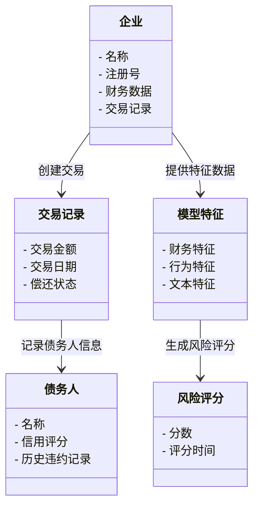

                 


# 设计智能化的企业信用风险定价模型

## 关键词：企业信用风险、智能化定价、机器学习、信用评分、风险评估

## 摘要： 
本文旨在探讨如何设计智能化的企业信用风险定价模型。随着企业信用风险的复杂性日益增加，传统的信用风险定价方法已难以满足现代金融市场的需求。本文通过结合机器学习、大数据分析和金融学理论，详细阐述了智能化信用风险定价模型的设计思路、核心算法、系统架构和实际应用。我们从企业信用风险的基本概念出发，逐步深入分析，最终构建一个高效、准确且可扩展的智能化信用风险定价系统。

---

# 第1章: 企业信用风险定价模型的背景与意义

## 1.1 企业信用风险的定义与重要性

### 1.1.1 信用风险的基本概念
企业信用风险是指企业在赊销、贷款等信用交易中，由于交易对手无法履行合同义务而给企业带来的潜在损失。信用风险是企业面临的三大主要风险之一，其他两个风险是市场风险和流动性风险。

### 1.1.2 信用风险对企业的影响
信用风险直接关系到企业的财务健康和生存能力。如果企业未能及时回收应收账款，可能面临资金链断裂的风险，甚至导致企业倒闭。此外，信用风险还会影响企业的信用评级和融资成本。

### 1.1.3 信用风险定价的核心目标
信用风险定价的核心目标是通过量化分析，确定企业在信用交易中的风险成本，并将其融入定价策略中，以实现风险与收益的平衡。

---

## 1.2 智能化定价模型的必要性

### 1.2.1 传统信用风险定价的局限性
传统的信用风险定价方法主要依赖于财务指标和经验判断，具有主观性强、数据维度有限、模型复杂性不足等缺点。随着企业规模的扩大和市场环境的复杂化，传统方法已难以满足需求。

### 1.2.2 智能化定价的优势
智能化定价模型通过引入机器学习、大数据分析和自然语言处理等技术，能够从海量数据中提取更多的特征信息，构建更复杂的模型，从而更准确地评估信用风险。

### 1.2.3 企业信用风险智能化定价的未来趋势
随着人工智能和大数据技术的快速发展，智能化信用风险定价将成为未来的主要趋势。企业需要借助智能化模型，实时监控和预测信用风险，从而做出更科学的决策。

---

## 1.3 本书的核心内容与目标

### 1.3.1 本书的研究范围
本书主要研究如何利用机器学习技术设计智能化的企业信用风险定价模型，涵盖数据采集、特征提取、模型训练、结果解释等全过程。

### 1.3.2 本书的核心目标
通过理论与实践相结合的方式，为读者提供一套完整的智能化信用风险定价模型的设计方法，帮助企业在复杂的市场环境中更好地管理信用风险。

### 1.3.3 本书的结构安排
本书分为七章，内容从基础到应用逐步展开，包括信用风险的基本概念、智能化定价模型的核心算法、系统架构设计、项目实战案例等。

---

# 第2章: 企业信用风险定价模型的核心概念

## 2.1 模型的基本结构

### 2.1.1 模型的输入变量
信用风险定价模型的输入变量通常包括企业的财务数据（如收入、利润、资产负债率）、市场数据（如行业趋势、宏观经济指标）、交易数据（如应收账款、应付账款）以及非结构化数据（如新闻、社交媒体信息）。

### 2.1.2 模型的输出结果
模型的输出结果是信用风险评分，通常以分数形式表示，分数越高表示信用风险越小，反之亦然。

### 2.1.3 模型的评价指标
模型的评价指标包括准确率、召回率、F1分数、AUC值等，用于衡量模型的预测能力和准确性。

---

## 2.2 核心概念与联系

### 2.2.1 信用风险与企业经营状况的关系
信用风险与企业的经营状况密切相关。企业财务状况恶化、管理混乱或市场环境不利都会增加信用风险。

### 2.2.2 智能化模型与传统模型的对比
智能化模型通过引入机器学习算法，能够更好地捕捉非线性关系和复杂特征，提高模型的预测精度和可解释性。

### 2.2.3 模型的可解释性与黑箱问题
机器学习模型（如神经网络）通常具有黑箱特性，难以解释具体决策逻辑。而传统模型（如线性回归）具有较高的可解释性。

---

## 2.3 模型的边界与外延

### 2.3.1 模型的适用范围
模型适用于企业间的信用交易，但不适用于个人信用风险评估。

### 2.3.2 模型的局限性
模型的局限性包括数据不足、模型过拟合、特征工程复杂等问题。

### 2.3.3 模型的优化方向
未来的研究方向包括引入更多的非结构化数据、优化算法性能、提高模型的可解释性等。

---

## 2.4 实体关系图（ER图）

以下是一个简化的信用风险定价模型的ER图：

```mermaid
erd
    企业
    债务人
    交易记录
    风险评分
    模型特征

    企业 -- 右 -> 交易记录: 记录交易
    交易记录 -- 右 -> 债务人: 记录债务人信息
    企业 -- 右 -> 模型特征: 提供特征数据
    模型特征 -- 右 -> 风险评分: 生成风险评分
```

---

## 2.5 领域模型（类图）

以下是一个领域模型的类图：



---

# 第3章: 信用风险定价模型的数学基础

## 3.1 概率论与统计学基础

### 3.1.1 概率分布的基本概念
概率分布描述了随机变量取值的概率，常见的概率分布包括正态分布、二项分布、泊松分布等。

### 3.1.2 统计推断的基本方法
统计推断是通过样本数据推断总体特征的方法，常见的统计推断方法包括点估计、区间估计和假设检验。

### 3.1.3 贝叶斯定理的应用
贝叶斯定理用于根据先验概率和观测数据更新后验概率，广泛应用于信用风险评估。

---

## 3.2 线性回归模型

### 3.2.1 线性回归的数学公式
线性回归的数学公式为：
$$ y = \beta_0 + \beta_1 x_1 + \beta_2 x_2 + \ldots + \beta_n x_n + \epsilon $$
其中，$y$ 是目标变量，$x_i$ 是输入变量，$\beta_i$ 是系数，$\epsilon$ 是误差项。

### 3.2.2 最小二乘法的原理
最小二乘法通过最小化预测值与实际值的平方差之和，求解回归系数。

### 3.2.3 线性回归在信用风险中的应用
线性回归可以用于预测企业的违约概率（PD）和违约损失率（LGD）。

---

## 3.3 非线性模型简介

### 3.3.1 对数几率回归
对数几率回归用于分类问题，其数学公式为：
$$ \ln\left(\frac{p}{1-p}\right) = \beta_0 + \beta_1 x_1 + \ldots + \beta_n x_n $$
其中，$p$ 是目标变量的概率。

### 3.3.2 支持向量机
支持向量机通过构建超平面，将数据点分到不同的类别中。

### 3.3.3 随机森林与梯度提升树
随机森林和梯度提升树是常用的集成学习方法，具有较强的抗过拟合能力和高精度。

---

## 3.4 机器学习算法在信用风险中的应用

### 3.4.1 监督学习与无监督学习的对比
监督学习基于标注数据，无监督学习基于非标注数据。

### 3.4.2 常见算法的优缺点
- **随机森林**：优点是高精度和低过拟合，缺点是解释性较差。
- **XGBoost**：优点是计算速度快，缺点是容易过拟合。
- **神经网络**：优点是强大的非线性拟合能力，缺点是可解释性差。

---

## 3.5 算法实现的数学模型

### 3.5.1 随机森林的原理
随机森林通过随机采样和特征选择，构建多个决策树，最终通过投票或加权平均得到结果。

### 3.5.2 XGBoost的优化策略
XGBoost通过正则化和提升树的深度，优化模型的泛化能力。

### 3.5.3 神经网络的基本结构
神经网络由输入层、隐藏层和输出层组成，通过反向传播算法更新权重。

---

## 3.6 机器学习模型的评价指标

### 3.6.1 准确率
准确率是指模型正确预测的样本数占总样本数的比例。

### 3.6.2 召回率
召回率是指模型正确预测的正类样本数占实际正类样本数的比例。

### 3.6.3 F1分数
F1分数是准确率和召回率的调和平均数。

### 3.6.4 AUC值
AUC值是受试者工作特征曲线下的面积，用于衡量分类模型的区分能力。

---

## 3.7 机器学习模型的优化

### 3.7.1 参数调优
参数调优包括学习率、树深度、正则化系数等参数的调整。

### 3.7.2 数据增强
数据增强通过增加数据的多样性和平衡性，提高模型的泛化能力。

### 3.7.3 模型集成
模型集成通过组合多个模型的结果，提高模型的准确性和稳定性。

---

## 3.8 机器学习模型的实现步骤

### 3.8.1 数据预处理
数据预处理包括数据清洗、特征提取和数据标准化。

### 3.8.2 模型训练
模型训练包括选择算法、调整参数和验证模型。

### 3.8.3 模型评估
模型评估包括计算准确率、召回率、F1分数和AUC值。

---

## 3.9 机器学习模型的实现代码

### 3.9.1 环境安装
需要安装以下Python库：
- scikit-learn
- xgboost
- pandas
- numpy
- matplotlib

### 3.9.2 数据加载
```python
import pandas as pd
data = pd.read_csv('credit_risk.csv')
```

### 3.9.3 数据预处理
```python
from sklearn.preprocessing import StandardScaler
scaler = StandardScaler()
X = scaler.fit_transform(data.drop('target', axis=1))
y = data['target']
```

### 3.9.4 模型训练
```python
from sklearn.ensemble import RandomForestClassifier
model = RandomForestClassifier(n_estimators=100, max_depth=5, random_state=42)
model.fit(X, y)
```

### 3.9.5 模型评估
```python
from sklearn.metrics import accuracy_score, recall_rate, f1_score, auc
y_pred = model.predict(X)
print('Accuracy:', accuracy_score(y, y_pred))
print('Recall:', recall_rate(y, y_pred))
print('F1 Score:', f1_score(y, y_pred))
```

---

## 3.10 机器学习模型的优化

### 3.10.1 参数调整
使用网格搜索优化模型参数：
```python
from sklearn.model_selection import GridSearchCV
param_grid = {'n_estimators': [100, 200], 'max_depth': [5, 10]}
grid_search = GridSearchCV(RandomForestClassifier(), param_grid, cv=5)
grid_search.fit(X, y)
print('Best Parameters:', grid_search.best_params_)
```

### 3.10.2 模型集成
使用投票法集成多个模型的结果：
```python
from sklearn.ensemble import VotingClassifier
model1 = RandomForestClassifier(n_estimators=100, max_depth=5, random_state=42)
model2 = XGBoostClassifier(n_estimators=100, learning_rate=0.1, max_depth=5)
model3 = LogisticRegression(penalty='l2', C=1)
voting_model = Voting

