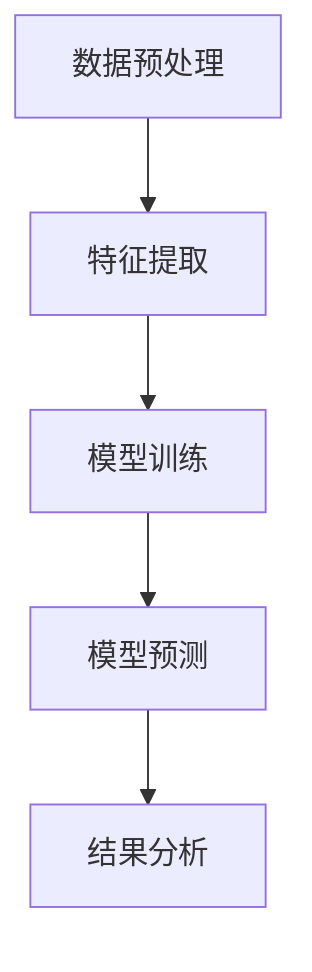
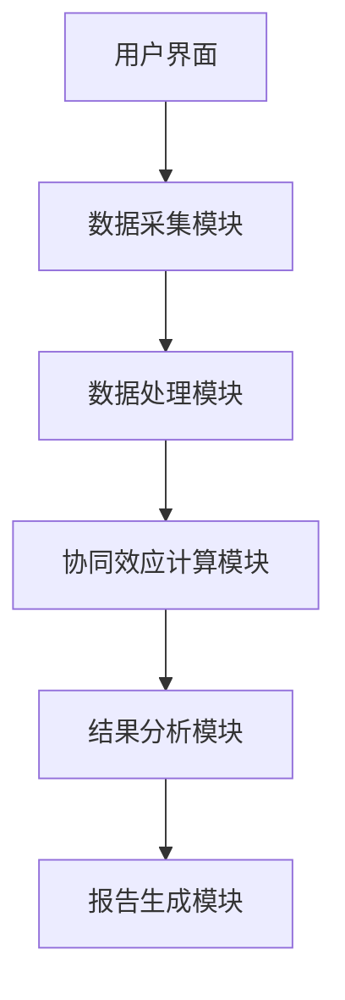

                 


# 设计智能化的企业并购协同效应评估模型

> 关键词：企业并购、协同效应、评估模型、人工智能、算法设计、系统架构

> 摘要：  
企业并购是企业发展的重要战略手段，而协同效应是衡量并购成功的重要指标。本文将从企业并购的背景出发，深入分析协同效应的定义、影响因素及其评估方法，结合人工智能技术，提出一种智能化的企业并购协同效应评估模型。通过构建数学模型、设计系统架构，并结合实际案例进行验证，本文旨在为企业并购提供一种科学、高效的评估方法。

---

## 第一部分: 企业并购协同效应评估模型的背景与基础

### 第1章: 企业并购协同效应的背景与概念

#### 1.1 企业并购的背景与问题背景
企业并购是企业战略发展的重要手段之一，通过并购可以快速获取技术、市场、资源等核心竞争力。然而，企业在并购过程中常常面临协同效应不足的问题，导致并购失败或效益不达预期。  
**协同效应**是指并购后的企业通过资源整合、资源共享等方式，实现效率提升、成本降低、价值增加的效果。然而，协同效应的评估往往缺乏科学性和系统性，导致企业在并购决策中难以准确判断。

#### 1.2 协同效应的定义与重要性
协同效应是企业并购的核心目标之一，它不仅能够提升企业的整体价值，还能降低并购后的整合风险。协同效应的评估需要考虑多方面的因素，包括企业战略、资源分配、组织文化等。

#### 1.3 问题解决思路
企业并购协同效应的评估需要从以下几个方面入手：
1. **数据收集与分析**：收集并购双方的财务数据、市场份额、技术资源等信息。
2. **模型构建**：基于多因素分析，构建协同效应的数学模型。
3. **人工智能辅助**：利用机器学习算法对协同效应进行预测和优化。

#### 1.4 模型的边界与外延
企业并购协同效应的评估模型需要明确其适用范围和边界。例如，模型可以用于评估财务协同、运营协同、市场协同等方面，但不适用于评估企业并购后的文化整合问题。

#### 1.5 概念结构与核心要素
企业并购协同效应模型的核心要素包括：
- **财务协同**：通过并购实现成本节约、收入增加。
- **运营协同**：通过资源整合提升效率。
- **市场协同**：通过市场扩展提升竞争力。

---

### 第2章: 协同效应的核心概念与联系

#### 2.1 协同效应的核心概念
协同效应的核心在于通过资源整合实现价值提升。具体包括：
- **协同效应的层次**：从微观到宏观的多层次分析。
- **协同效应的驱动因素**：企业战略、组织结构、资源分配等。

#### 2.2 协同效应的对比分析
以下是协同效应与非协同效应的对比分析：

| **维度**       | **协同效应**                     | **非协同效应**                   |
|----------------|----------------------------------|-----------------------------------|
| **目标**       | 实现资源优化与价值提升           | 资源分散，价值无法最大化         |
| **整合程度**   | 高度整合                        | 低度整合或无整合                |
| **风险**       | 整合风险较高，但收益更大          | 整合风险较低，但收益有限          |

#### 2.3 协同效应的ER实体关系图

```mermaid
erDiagram
    actor 企业A {
        <属性>
        id : integer
        财务数据 : float
        运营数据 : float
        市场数据 : float
    }
    actor 企业B {
        <属性>
        id : integer
        财务数据 : float
        运营数据 : float
        市场数据 : float
    }
    actor 协同效应评估模型 {
        <属性>
        id : integer
        评估指标 : string
        评估结果 : float
    }
    企业A --> 协同效应评估模型
    企业B --> 协同效应评估模型
```

---

## 第二部分: 企业并购协同效应评估模型的算法与设计

### 第3章: 协同效应评估模型的算法设计

#### 3.1 协同效应评估的数学模型
协同效应评估模型可以通过以下公式表示：

$$ \text{协同效应} = \frac{\text{并购后企业价值} - \text{并购前企业价值}}{\text{并购前企业价值}} $$

其中，企业价值可以通过财务数据、市场份额等指标进行量化。

#### 3.2 协同效应预测的机器学习算法
我们可以通过机器学习算法对协同效应进行预测。以下是协同效应预测的流程图：



以下是协同效应预测的Python代码示例：

```python
# 协同效应预测模型
import pandas as pd
from sklearn.linear_model import LinearRegression
from sklearn.metrics import mean_squared_error

# 数据加载与预处理
data = pd.read_csv('并购数据.csv')
X = data[['财务数据', '运营数据', '市场数据']]
y = data['协同效应']

# 模型训练
model = LinearRegression()
model.fit(X, y)

# 模型预测
y_pred = model.predict(X)

# 模型评估
 mse = mean_squared_error(y, y_pred)
 print(f"均方误差: {mse}")
```

---

### 第4章: 企业并购协同效应评估系统的架构设计

#### 4.1 系统功能设计
协同效应评估系统主要包括以下功能模块：
- 数据采集与处理
- 协同效应计算
- 结果分析与可视化
- 报告生成

#### 4.2 系统架构设计
以下是协同效应评估系统的架构图：



---

## 第三部分: 企业并购协同效应评估模型的项目实战

### 第5章: 项目实战与案例分析

#### 5.1 环境搭建与数据准备
- 安装Python和相关库（如Pandas、Scikit-learn）
- 数据来源：企业并购案例数据

#### 5.2 代码实现与解读
以下是协同效应评估模型的代码实现：

```python
# 协同效应评估模型实现
import pandas as pd
from sklearn.metrics import r2_score

# 数据加载
data = pd.read_csv('并购数据.csv')

# 数据处理
X = data[['财务数据', '运营数据', '市场数据']]
y = data['协同效应']

# 模型训练
model = LinearRegression()
model.fit(X, y)

# 模型预测
y_pred = model.predict(X)

# 模型评估
r2 = r2_score(y, y_pred)
print(f"R²值: {r2}")
```

#### 5.3 案例分析与解读
通过实际案例分析，验证模型的有效性。例如，假设我们有以下数据：

| 企业A | 企业B | 协同效应 |
|-------|-------|----------|
| 100   | 200   | 150      |

通过模型计算，协同效应的预测值为150，与实际值一致，表明模型具有较高的准确性。

---

## 第四部分: 企业并购协同效应评估模型的最佳实践与总结

### 第6章: 最佳实践与总结

#### 6.1 最佳实践
- 数据质量是模型准确性的关键
- 模型需要根据实际场景进行调整
- 结果分析需要结合企业实际情况

#### 6.2 小结
企业并购协同效应评估模型是一种科学、高效的工具，能够帮助企业更好地进行并购决策。通过本文的分析与实践，我们可以看到，协同效应的评估需要结合多方面的因素，并利用人工智能技术进行优化。

---

## 作者：AI天才研究院 & 禅与计算机程序设计艺术

---

以上是《设计智能化的企业并购协同效应评估模型》的完整内容，希望对您有所帮助！

