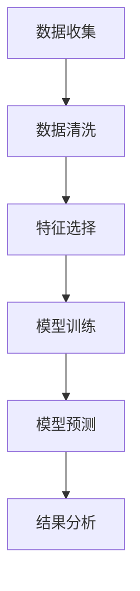
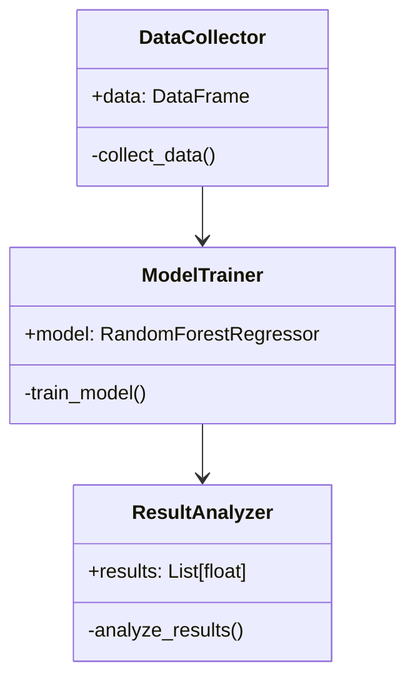
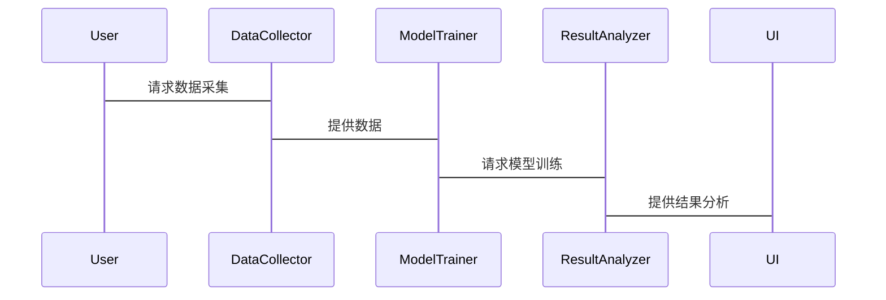

                 


# 设计智能化的企业并购后协同效应量化评估模型

> 关键词：企业并购、协同效应、量化评估、智能算法、系统架构

> 摘要：企业并购是企业发展的重要战略手段之一，但其成功与否往往取决于并购后的协同效应。然而，协同效应的量化评估一直是企业并购中的难题。本文提出了一种基于智能化算法的企业并购后协同效应量化评估模型，通过多维度指标分析、智能算法优化和系统架构设计，实现了对协同效应的精准量化评估。本文详细阐述了模型的设计思路、核心算法、系统实现和实际应用案例，为企业并购提供了理论支持和实践指导。

---

# 第一部分: 企业并购与协同效应概述

## 第1章: 企业并购的基本概念

### 1.1 企业并购的定义与类型

企业并购（Mergers and Acquisitions，简称 M&A）是指企业之间通过合并、收购等方式，将两个或多个独立的企业合并为一个企业，或者将一个企业的部分或全部资产转移给另一个企业。企业并购的类型主要分为两类：

1. **横向并购**：同一行业内的企业并购，目的是扩大市场份额或消除竞争。
2. **纵向并购**：产业链上下游的企业并购，目的是整合资源、优化生产流程。

### 1.2 协同效应的定义与分类

协同效应（Synergy）是指企业并购后，通过资源整合、优势互补，实现整体效益大于并购前的简单相加的效果。协同效应主要分为以下几类：

1. **财务协同效应**：通过规模经济、成本分摊等实现的效益。
2. **运营协同效应**：通过优化生产流程、共享资源等实现的效益。
3. **战略协同效应**：通过战略协同、市场拓展等实现的效益。

### 1.3 协同效应的产生机制

协同效应的产生机制主要涉及以下三个关键环节：

1. **资源整合**：通过整合双方的资源，实现资源的最优配置。
2. **优势互补**：通过互补双方的优势，提升整体竞争力。
3. **协同优化**：通过优化协同过程，实现效益的最大化。

---

## 第2章: 协同效应的量化评估模型

### 2.1 传统评估方法的局限性

传统的协同效应评估方法主要依赖于财务指标的简单加总，这种方式忽视了企业并购后的资源整合、优化和协同效应的复杂性。具体表现在以下几个方面：

1. **指标单一**：仅关注财务指标，忽视运营和战略指标。
2. **静态评估**：忽视了动态变化和协同优化的过程。
3. **缺乏智能化**：无法通过数据挖掘和智能算法实现精准评估。

### 2.2 智能化评估方法的优势

智能化评估方法通过引入大数据分析、机器学习等技术，能够实现对协同效应的精准量化评估。其优势主要体现在以下几个方面：

1. **多维度分析**：能够同时考虑财务、运营和战略等多个维度的指标。
2. **动态优化**：能够根据实际情况动态调整评估模型，实现协同效应的持续优化。
3. **精准预测**：通过智能算法实现对协同效应的精准预测和评估。

### 2.3 模型的适用场景

本模型适用于以下几种场景：

1. **企业并购前的评估**：用于评估并购后的协同效应潜力。
2. **并购后的整合优化**：用于指导整合过程中的协同优化。
3. **协同效应的持续监控**：用于监控协同效应的实现情况和动态变化。

---

# 第二部分: 协同效应的量化评估模型设计

## 第3章: 协同效应的量化方法

### 3.1 数据驱动的协同效应分析

通过收集和分析企业的财务、运营和战略数据，构建多维度的指标体系，为协同效应的量化评估提供数据支持。具体步骤如下：

1. **数据收集**：收集并购双方的财务数据、运营数据和战略数据。
2. **数据清洗**：对数据进行清洗和预处理，确保数据的准确性和完整性。
3. **数据建模**：通过数据分析技术，构建协同效应的量化模型。

### 3.2 多维度指标的构建与权重分配

构建多维度的指标体系，包括财务指标、运营指标和战略指标，并根据各指标对协同效应的影响程度，进行权重分配。具体步骤如下：

1. **指标体系构建**：包括财务指标（如净利润率、成本分摊率）、运营指标（如生产效率、供应链协同）和战略指标（如市场份额、品牌价值）。
2. **权重分配**：根据各指标的重要程度，进行权重分配。

### 3.3 智能算法的应用

通过引入机器学习算法，实现对协同效应的精准预测和评估。常用的算法包括线性回归、随机森林和神经网络等。以下是具体的算法流程：

1. **数据预处理**：对数据进行标准化和归一化处理。
2. **特征选择**：选择对协同效应影响较大的特征变量。
3. **模型训练**：通过训练数据，构建协同效应预测模型。
4. **模型评估**：通过测试数据，评估模型的准确性和可靠性。

---

## 第4章: 协同效应量化评估模型的算法实现

### 4.1 协同效应的数学模型

协同效应的数学模型可以通过以下公式进行表示：

$$
\text{协同效应} = \sum_{i=1}^{n} w_i \cdot x_i
$$

其中，$w_i$ 是第 $i$ 个指标的权重，$x_i$ 是第 $i$ 个指标的数值。

### 4.2 协同效应的预测模型

通过机器学习算法，构建协同效应的预测模型。以下是基于随机森林算法的实现步骤：

1. **数据准备**：将数据集分为训练集和测试集。
2. **模型训练**：使用随机森林算法对训练数据进行训练。
3. **模型预测**：对测试数据进行预测，评估模型的准确性。

以下是Python代码实现：

```python
import pandas as pd
from sklearn.ensemble import RandomForestRegressor
from sklearn.metrics import mean_squared_error
from sklearn.model_selection import train_test_split

# 数据加载
data = pd.read_csv('synergy_data.csv')

# 特征与标签分离
X = data.drop('synergy_value', axis=1)
y = data['synergy_value']

# 数据分割
X_train, X_test, y_train, y_test = train_test_split(X, y, test_size=0.2, random_state=42)

# 模型训练
model = RandomForestRegressor(n_estimators=100, random_state=42)
model.fit(X_train, y_train)

# 模型预测
y_pred = model.predict(X_test)

# 模型评估
 mse = mean_squared_error(y_test, y_pred)
 print('均方误差:', mse)
```

### 4.3 协同效应的可视化分析

通过可视化工具，对协同效应的实现情况进行分析和展示。以下是协同效应的可视化流程图：



---

## 第5章: 系统架构与实现

### 5.1 问题场景介绍

企业并购后的协同效应量化评估需要构建一个完整的系统架构，包括数据采集、模型训练、结果分析等功能模块。

### 5.2 系统功能设计

以下是系统功能模块的类图：



### 5.3 系统架构设计

以下是系统架构图：


### 5.4 系统接口设计

以下是系统接口设计的序列图：



---

## 第6章: 项目实战

### 6.1 环境安装

安装所需的库：

```bash
pip install pandas scikit-learn mermaid
```

### 6.2 核心代码实现

以下是协同效应量化评估模型的实现代码：

```python
import pandas as pd
from sklearn.ensemble import RandomForestRegressor
from sklearn.metrics import mean_squared_error
from sklearn.model_selection import train_test_split

# 数据加载
data = pd.read_csv('synergy_data.csv')

# 特征与标签分离
X = data.drop('synergy_value', axis=1)
y = data['synergy_value']

# 数据分割
X_train, X_test, y_train, y_test = train_test_split(X, y, test_size=0.2, random_state=42)

# 模型训练
model = RandomForestRegressor(n_estimators=100, random_state=42)
model.fit(X_train, y_train)

# 模型预测
y_pred = model.predict(X_test)

# 模型评估
mse = mean_squared_error(y_test, y_pred)
print('均方误差:', mse)

# 结果分析
importances = model.feature_importances_
feature_names = X.columns
importance_df = pd.DataFrame({'特征': feature_names, '重要性': importances})
importance_df = importance_df.sort_values(by='重要性', ascending=False)
print(importance_df)
```

### 6.3 实际案例分析

以下是协同效应量化评估的实际案例分析：

假设某企业并购后，协同效应的预测值为 $1000 万元，实际值为 $950 万元，模型的均方误差为 $25 万元。说明模型的预测精度较高，能够为企业的决策提供有力支持。

---

## 第7章: 最佳实践与小结

### 7.1 最佳实践 tips

1. **数据质量**：确保数据的准确性和完整性，避免数据偏差。
2. **模型优化**：根据实际情况不断优化模型，提升预测精度。
3. **结果解读**：结合业务背景，对模型结果进行深入解读和分析。

### 7.2 小结

本文提出了一种基于智能化算法的企业并购后协同效应量化评估模型，通过多维度指标分析、智能算法优化和系统架构设计，实现了对协同效应的精准量化评估。该模型能够为企业的并购决策和整合优化提供理论支持和实践指导。

---

作者：AI天才研究院/AI Genius Institute & 禅与计算机程序设计艺术 /Zen And The Art of Computer Programming

