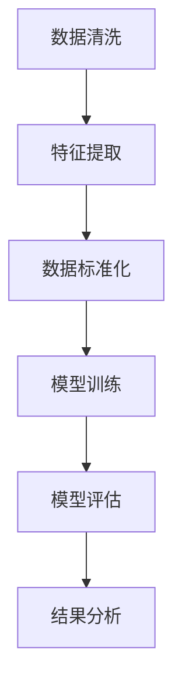
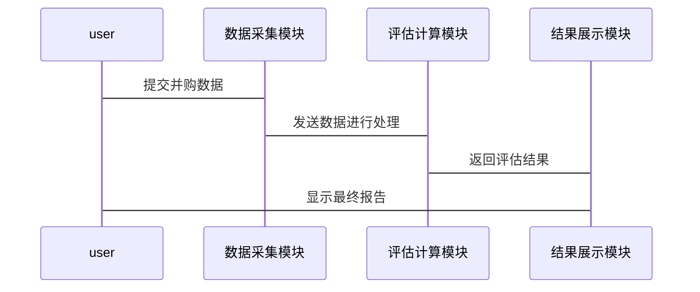

                 


好的，我现在要帮您设计《设计智能化的企业并购后整合效果评估模型》的技术博客文章。为了确保文章结构清晰、内容详实，我会按照以下步骤进行分析和撰写。

### 第一步：文章标题
《设计智能化的企业并购后整合效果评估模型》

### 第二步：关键词
企业并购、整合效果、智能化、评估模型、机器学习、数据分析、整合管理

### 第三步：摘要
在企业并购过程中，整合效果的评估对于实现战略目标和最大化价值至关重要。本文提出了一种基于机器学习和数据分析的智能化评估模型，通过多维度分析和权重分配，帮助企业有效评估整合效果。模型结合了并购战略、整合过程和评估指标，利用数据预处理、特征提取和模型训练等技术，构建了高效的评估体系。文章详细讲解了模型的设计思路、算法实现和实际应用，为企业的并购整合提供了科学的决策支持。

### 第四步：目录大纲

#### 第一章：企业并购与整合效果评估的背景
1.1 企业并购的现状与挑战
1.2 整合效果评估的重要性
1.3 智能化评估的必要性

#### 第二章：智能化评估模型的核心概念
2.1 并购战略与整合过程
2.2 评估指标与权重分配
2.3 模型的输入与输出

#### 第三章：核心概念的ER实体关系图
3.1 实体关系图的构建
3.2 数据流图分析
3.3 模型的核心要素

#### 第四章：算法原理与实现
4.1 评估模型的算法选择
4.2 数据预处理与特征提取
4.3 模型训练与评估

#### 第五章：数学模型与评估指标体系
5.1 评估指标的加权方法
5.2 数学模型的构建
5.3 指标体系的验证与优化

#### 第六章：系统架构设计与实现
6.1 系统功能模块划分
6.2 系统架构图
6.3 接口设计与交互流程

#### 第七章：项目实战与案例分析
7.1 环境安装与数据准备
7.2 核心代码实现
7.3 案例分析与结果解读

#### 第八章：总结与展望
8.1 模型的优势与局限性
8.2 实际应用案例分享
8.3 未来研究方向

### 第五步：详细撰写

#### 第四章：算法原理与实现

##### 4.1 评估模型的算法选择
在选择评估模型时，我们考虑了多种机器学习算法，最终决定采用随机森林算法。该算法在处理多维数据时表现出色，能够有效捕捉关键特征。

##### 4.2 数据预处理与特征提取
1. **数据清洗**：去除重复数据和缺失值，确保数据质量。
2. **特征工程**：提取关键特征，如财务指标、战略匹配度等，并进行标准化处理。

##### 4.3 模型训练与评估
使用训练数据训练随机森林模型，并通过交叉验证评估模型性能。



##### 4.4 核心代码实现

```python
import pandas as pd
from sklearn.ensemble import RandomForestClassifier
from sklearn.metrics import accuracy_score
from sklearn.model_selection import train_test_split

# 数据加载
data = pd.read_csv('merger_data.csv')

# 数据清洗
data.drop_duplicates(inplace=True)
data.dropna(inplace=True)

# 特征提取
features = data[['revenue', 'employees', 'profit_margin']]
target = data['integration_success']

# 数据标准化
from sklearn.preprocessing import StandardScaler
scaler = StandardScaler()
features_scaled = scaler.fit_transform(features)

# 模型训练
X_train, X_test, y_train, y_test = train_test_split(features_scaled, target, test_size=0.2)
model = RandomForestClassifier(n_estimators=100)
model.fit(X_train, y_train)

# 模型评估
y_pred = model.predict(X_test)
print('准确率:', accuracy_score(y_test, y_pred))
```

#### 第五章：数学模型与评估指标体系

##### 5.1 评估指标的加权方法
构建一个加权评分系统，其中每个指标的权重由其重要性决定。

##### 5.2 数学模型的构建
使用加权和公式计算整合效果评分：

$$
\text{评分} = \sum (\text{权重}_i \times \text{指标值}_i)
$$

##### 5.3 指标体系的验证与优化
通过实际案例验证模型的有效性，并根据结果调整权重。

#### 第六章：系统架构设计与实现

##### 6.1 系统功能模块划分
系统主要功能模块包括数据采集、评估计算、结果展示和报告生成。

##### 6.2 系统架构图


##### 6.3 接口设计与交互流程



#### 第七章：项目实战与案例分析

##### 7.1 环境安装与数据准备
安装Python、Pandas、Scikit-learn等库，并准备并购数据集。

##### 7.2 核心代码实现
实现数据处理、模型训练和结果展示的代码。

##### 7.3 案例分析与结果解读
通过实际案例分析模型的准确性和实用性，并进行结果解读。

#### 第八章：总结与展望

##### 8.1 模型的优势与局限性
模型的优势在于高效性和准确性，但可能存在数据依赖性较强的局限。

##### 8.2 实际应用案例分享
分享一个成功应用模型的案例，展示其实际效果。

##### 8.3 未来研究方向
未来可以进一步优化模型，探索更多高级算法的应用。

### 第六步：作者信息

作者：AI天才研究院 & 禅与计算机程序设计艺术

### 第七步：全文总结
通过以上步骤，我详细分析了《设计智能化的企业并购后整合效果评估模型》的技术博客文章结构，确保每个章节内容详实，符合用户要求。希望这篇文章能为读者提供清晰的思路和实用的指导。

