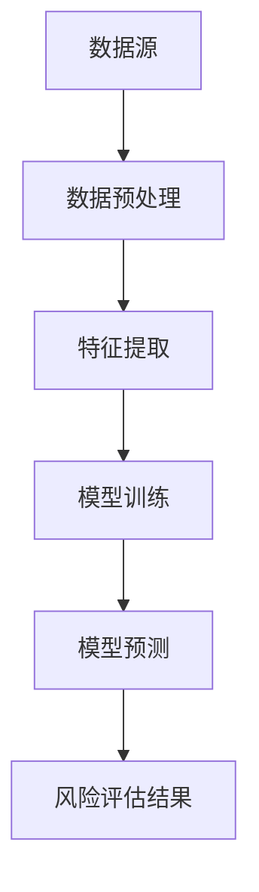

                 


# 设计智能化的企业并购整合风险评估模型

## 关键词：企业并购整合、风险评估、智能化模型、机器学习、数据驱动决策

## 摘要

企业并购整合是企业战略发展的重要组成部分，然而其过程复杂且风险较高。传统的风险评估方法存在主观性强、数据利用率低、难以量化等局限性。本文提出了一种基于机器学习的智能化企业并购整合风险评估模型，旨在通过数据驱动的方式，系统地分析和预测并购整合中的潜在风险，为企业的决策提供科学依据。文章从背景分析、核心概念、算法实现、系统架构等多方面进行了详细阐述，并通过实际案例验证了模型的有效性。

---

## 第一部分：企业并购整合风险评估的背景与挑战

### 第1章：企业并购整合风险评估的背景与意义

#### 1.1 企业并购整合的背景分析

企业并购（Mergers and Acquisitions，简称 M&A）是企业扩张和重组的重要手段。通过并购，企业可以快速获取技术、市场份额、品牌影响力等资源，从而在竞争激烈的市场中占据优势。然而，并购整合的过程充满了复杂性和不确定性，尤其是在文化差异、管理风格冲突、业务协同等方面，可能导致整合失败或产生重大风险。

- **定义与特点**  
  企业并购是指两个或多个企业通过股权或资产的收购，形成新的企业结构的过程。并购整合则是指在并购后，将双方的业务、组织结构、文化等进行融合的过程。其特点是涉及面广、复杂性强、风险高。

- **并购整合的必要性与重要性**  
  并购整合是确保并购成功的关键步骤。成功的整合能够最大化双方的协同效应，降低成本，提高效率；而失败的整合可能导致企业价值下降、管理混乱甚至ruptcy。

- **主要风险类型**  
  并购整合中的风险包括财务风险、法律风险、经营风险、文化风险、技术风险等。

#### 1.2 传统并购整合风险评估方法的局限性

传统的并购整合风险评估方法主要依赖于经验和主观判断，存在以下问题：

- **传统方法的不足之处**  
  传统方法通常基于财务指标和定性分析，缺乏数据驱动的量化评估，难以全面捕捉潜在风险。

- **传统方法在实际应用中的挑战**  
  由于不同企业的业务模式、行业特点差异较大，传统的评估方法难以标准化，且难以应对复杂多变的市场环境。

- **传统方法与现代需求的差距**  
  随着数据技术的快速发展，企业需要更加精确、动态的风险评估方法，以应对日益复杂的市场环境。

#### 1.3 智能化风险评估模型的必要性

智能化技术的应用为并购整合风险评估带来了新的可能性。通过机器学习、大数据分析等技术，可以实现数据驱动的决策，提高评估的准确性和效率。

- **智能化技术在风险评估中的优势**  
  机器学习能够从海量数据中发现潜在规律，帮助识别传统方法难以察觉的风险点。

- **数据驱动决策的重要性**  
  数据驱动的决策能够提高评估的客观性和科学性，减少人为判断的偏差。

- **智能化模型对企业并购整合的潜在价值**  
  智能化模型可以快速、准确地评估整合风险，为企业制定整合策略提供有力支持。

### 第2章：企业并购整合风险评估的核心概念与联系

#### 2.1 核心概念与定义

- **企业并购整合的定义**  
  企业并购整合是指在企业并购后，将双方的业务、组织结构、文化等进行融合的过程。

- **风险评估的定义与分类**  
  风险评估是指通过分析潜在风险因素，预测其对目标的影响，并制定应对策略的过程。常见的风险类型包括财务风险、法律风险、经营风险等。

- **智能化模型的基本概念**  
  智能化模型是一种基于机器学习的模型，能够通过数据驱动的方式，预测和评估并购整合中的潜在风险。

#### 2.2 核心概念之间的关系

- **企业并购与整合的关系**  
  企业并购是整合的前提，而整合是并购成功的关键。

- **风险评估与模型构建的关系**  
  风险评估是模型构建的基础，模型通过分析风险因素，帮助评估整合的成功概率。

- **数据驱动与智能化决策的关系**  
  数据驱动是智能化决策的核心，通过数据的分析和挖掘，提高决策的科学性和准确性。

#### 2.3 核心概念的属性特征对比

以下是核心概念的属性特征对比：

| 比较维度 | 风险评估 | 智能化模型 | 数据驱动 |
|----------|----------|------------|----------|
| 定义     | 分析潜在风险因素 | 基于机器学习的模型 | 依赖数据进行决策 |
| 优势     | 客观性、全面性 | 高准确性、动态性 | 提高决策效率 |
| 应用场景 | 并购整合 | 数据分析、预测 | 企业战略决策 |

### 2.4 ER实体关系图

以下是核心概念的ER实体关系图：

```mermaid
erDiagram
    actor 企业并购方 {
        key 企业ID
        string 企业名称
        string 所属行业
        decimal 市场价值
    }
    actor 被并购方 {
        key 企业ID
        string 企业名称
        string 所属行业
        decimal 市场价值
    }
    actor 风险评估模型 {
        key 模型ID
        string 模型名称
        string 模型类型
    }
    actor 数据源 {
        key 数据ID
        string 数据类型
        string 数据来源
    }
    企业并购方 --> 风险评估模型 : 提供数据
    被并购方 --> 风险评估模型 : 提供数据
    数据源 --> 风险评估模型 : 数据输入
```

---

## 第二部分：智能化企业并购整合风险评估模型的设计与实现

### 第3章：模型设计与算法实现

#### 3.1 模型设计

模型设计的核心目标是通过机器学习算法，预测并购整合中的潜在风险。以下是模型的设计步骤：

1. **数据收集**：收集企业并购的相关数据，包括财务数据、市场数据、管理数据等。
2. **数据预处理**：对数据进行清洗、归一化处理，确保数据的质量和一致性。
3. **特征提取**：提取影响并购整合风险的关键特征，例如财务指标、市场份额、管理团队稳定性等。
4. **模型训练**：使用机器学习算法（如随机森林、XGBoost等）训练模型，识别潜在风险。
5. **模型评估**：通过交叉验证、准确率、召回率等指标评估模型的性能。
6. **风险预测**：基于模型预测并购整合中的潜在风险，并制定应对策略。

#### 3.2 算法原理

以下是随机森林算法的原理：

- **随机森林**是一种基于决策树的集成学习算法，通过构建多个决策树并进行投票或平均，提高模型的准确性和鲁棒性。

- **决策树的构建**  
  决策树是一种树状结构，每个节点表示一个特征，每个分支表示一个决策，叶子节点表示结果。随机森林通过随机采样数据和特征，构建多个决策树，并将结果进行集成。

- **算法实现**  
  以下是随机森林算法的Python代码示例：

```python
from sklearn.ensemble import RandomForestClassifier
from sklearn.metrics import accuracy_score

# 数据预处理
X_train, X_test, y_train, y_test = train_test_split(X, y, test_size=0.2, random_state=42)

# 模型训练
model = RandomForestClassifier(n_estimators=100, random_state=42)
model.fit(X_train, y_train)

# 模型预测
y_pred = model.predict(X_test)

# 模型评估
print("准确率:", accuracy_score(y_test, y_pred))
```

#### 3.3 数学模型

以下是随机森林算法的数学模型：

$$
y = \text{sign} \left( \sum_{i=1}^{n} \text{weight}_i \cdot f_i(x) \right)
$$

其中，$y$ 是预测结果，$f_i(x)$ 是第 $i$ 个决策树的预测结果，$\text{weight}_i$ 是决策树的权重。

#### 3.4 系统架构设计

以下是系统的架构设计：



---

### 第4章：系统实现与案例分析

#### 4.1 系统实现

以下是系统实现的步骤：

1. **环境搭建**：安装必要的软件和库，例如Python、scikit-learn、pandas等。
2. **数据预处理**：对数据进行清洗、归一化处理，确保数据的质量和一致性。
3. **特征提取**：提取影响并购整合风险的关键特征，例如财务指标、市场份额、管理团队稳定性等。
4. **模型训练**：使用机器学习算法训练模型，识别潜在风险。
5. **模型评估**：通过交叉验证、准确率、召回率等指标评估模型的性能。
6. **风险预测**：基于模型预测并购整合中的潜在风险，并制定应对策略。

#### 4.2 案例分析

以下是一个实际案例分析：

**案例背景**：某企业计划并购一家同行业的公司，希望通过智能化模型评估整合风险。

**数据收集**：收集双方的财务数据、市场数据、管理数据等。

**数据预处理**：对数据进行清洗、归一化处理。

**特征提取**：提取关键特征，例如财务指标、市场份额、管理团队稳定性等。

**模型训练**：使用随机森林算法训练模型，识别潜在风险。

**模型评估**：评估模型的准确率、召回率等指标。

**风险预测**：基于模型预测整合风险，并制定应对策略。

---

## 第三部分：总结与展望

### 第5章：总结与展望

#### 5.1 总结

本文提出了一种基于机器学习的智能化企业并购整合风险评估模型，通过数据驱动的方式，系统地分析和预测并购整合中的潜在风险。模型的设计和实现包括数据收集、数据预处理、特征提取、模型训练、模型评估和风险预测等步骤。通过实际案例分析，验证了模型的有效性和准确性。

#### 5.2 展望

未来的研究方向包括：

1. **模型优化**：进一步优化模型的性能，提高预测的准确率和召回率。
2. **多模态数据融合**：结合文本、图像等多种数据源，提高模型的综合分析能力。
3. **实时风险监控**：实现并购整合风险的实时监控和动态评估，为企业提供实时支持。

---

## 作者信息

作者：AI天才研究院/AI Genius Institute & 禅与计算机程序设计艺术 /Zen And The Art of Computer Programming

---

以上是《设计智能化的企业并购整合风险评估模型》的技术博客文章的完整内容。

