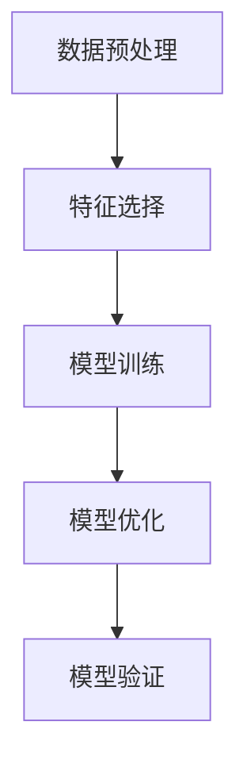
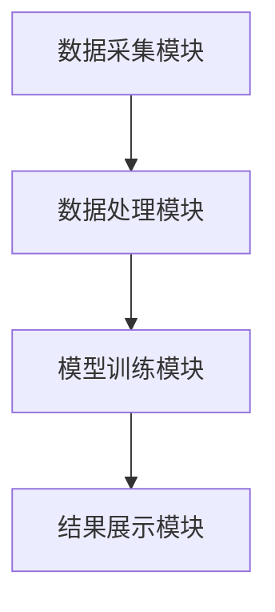

                 


# 设计智能化的企业并购文化整合成功率预测模型

---

## 关键词：
企业并购、文化整合、预测模型、机器学习、智能化

---

## 摘要：
企业并购中的文化整合是决定并购成功与否的关键因素之一。然而，文化整合的成功率受到多种复杂因素的影响，包括企业战略、组织结构、员工适应性等。本文旨在通过设计一个智能化的企业并购文化整合成功率预测模型，结合机器学习和数据分析的方法，从多维度对企业文化整合的成功率进行预测和优化。通过本文的分析和实践，读者可以掌握如何利用技术手段提升企业并购的文化整合成功率。

---

## 目录

---

# 第1章: 企业并购文化整合成功率预测模型的背景与概念

## 1.1 问题背景
### 1.1.1 企业并购的历史与发展
企业并购（Mergers and Acquisitions, M&A）是企业战略发展的重要手段之一。通过并购，企业可以快速扩大规模、获取新技术、进入新市场或提升竞争力。然而，并购的成功率往往低于预期，其中文化整合问题是一个重要的失败原因。

### 1.1.2 文化整合在企业并购中的重要性
文化整合是指在并购后，新企业将两个或多个不同文化背景的组织、团队或个体进行融合的过程。文化整合的成功与否直接影响到企业的协同效应、员工满意度和整体绩效。如果文化整合失败，可能导致员工流失、工作效率下降甚至企业战略目标无法实现。

### 1.1.3 并购失败的常见原因
- 战略目标不一致
- 管理风格冲突
- 企业文化差异
- 员工适应性问题
- 信息不对称
- 文化整合计划不完善

## 1.2 问题描述
### 1.2.1 文化整合的定义与内涵
文化整合不仅仅是企业结构的调整，更是企业价值观、管理风格、员工行为规范等多方面的融合。成功的文化整合需要双方企业在战略、组织、文化和人力资源等多个维度上达成一致。

### 1.2.2 文化整合对并购成功率的影响
文化整合的成功率直接决定了并购后的组织能否高效运作。如果文化整合失败，企业可能面临以下问题：
- 员工士气低落
- 内部沟通不畅
- 企业战略目标无法实现
- 财务表现不佳

### 1.2.3 当前文化整合预测的难点与挑战
- 数据获取困难
- 文化因素的复杂性
- 数据维度不足
- 模型泛化能力有限

## 1.3 问题解决思路
### 1.3.1 数据驱动的解决方案
通过收集和分析企业并购相关的数据，包括企业文化、管理风格、员工满意度等，构建一个基于数据的预测模型。

### 1.3.2 智能化预测模型的构建思路
利用机器学习算法，从多维度数据中提取特征，构建文化整合成功率的预测模型。

### 1.3.3 相关领域的研究现状与不足
- 现有研究主要集中在企业并购的财务分析和战略规划
- 文化整合的成功率预测研究较少
- 数据维度和模型复杂度有待提升

## 1.4 边界与外延
### 1.4.1 模型的适用范围
适用于企业并购后文化整合的成功率预测，尤其适用于中大型企业。

### 1.4.2 模型的限制与不足
- 数据获取难度大
- 模型对某些特定行业的适用性有限
- 预测结果需要结合实际情况进行调整

## 1.5 概念结构与核心要素
### 1.5.1 模型的核心要素分析
- 企业文化匹配度
- 管理风格一致性
- 员工适应性
- 信息共享能力
- 战略一致性

### 1.5.2 各要素之间的关系
企业文化的匹配度影响员工的适应性和信息共享能力，进而影响文化整合的成功率。

### 1.5.3 模型的逻辑框架
$$ \text{文化整合成功率} = f(\text{企业文化匹配度}, \text{管理风格一致性}, \text{员工适应性}, \text{信息共享能力}, \text{战略一致性}) $$

---

# 第2章: 企业并购文化整合成功率预测模型的核心概念与联系

## 2.1 核心概念原理
### 2.1.1 数据采集与特征提取
通过企业并购案例数据，提取相关特征，包括：
- 企业文化匹配度
- 管理风格一致性
- 员工适应性
- 信息共享能力
- 战略一致性

### 2.1.2 数据预处理与清洗
对数据进行清洗和标准化处理，确保数据质量。

### 2.1.3 模型训练与优化
利用机器学习算法对数据进行训练，优化模型参数，提升预测精度。

### 2.1.4 模型验证与评估
通过交叉验证和评估指标（如准确率、召回率、F1分数）对模型进行评估。

## 2.2 核心概念属性特征对比
下表展示了各核心概念的属性特征对比：

| 概念 | 属性特征 | 描述 |
|------|----------|------|
| 企业文化匹配度 | 一致性 | 企业文化是否一致 |
|      | 合适性 | 企业文化是否适合整合 |
| 管理风格一致性 | 协调性 | 管理风格是否协调 |
|      | 可行性 | 管理风格是否可行 |
| 员工适应性 | 适应性 | 员工是否适应新文化 |
|      | 反应性 | 员工对文化整合的反应 |
| 信息共享能力 | 及时性 | 信息共享是否及时 |
|      | 完整性 | 信息共享是否完整 |
| 战略一致性 | 目标一致性 | 战略目标是否一致 |
|      | 行动一致性 | 战略行动是否一致 |

## 2.3 ER实体关系图
以下是一个简单的ER实体关系图：

```mermaid
erd
    企业并购案例
    ----> id: ID
    ----> 企业文化匹配度: float
    ----> 管理风格一致性: float
    ----> 员工适应性: float
    ----> 信息共享能力: float
    ----> 战略一致性: float
    ----> 文化整合成功率: float
```

---

# 第3章: 企业并购文化整合成功率预测模型的算法原理

## 3.1 算法原理概述
### 3.1.1 算法选择
基于机器学习的随机森林算法（Random Forest）。

### 3.1.2 算法流程
1. 数据预处理：清洗和标准化数据。
2. 特征选择：提取关键特征。
3. 模型训练：利用随机森林算法进行训练。
4. 模型优化：调整参数，提升预测精度。
5. 模型验证：通过交叉验证评估模型性能。

## 3.2 算法流程图
以下是一个简单的算法流程图：



## 3.3 算法数学模型
随机森林算法的数学模型如下：

$$ y = \sum_{i=1}^{n} \theta_i x_i $$

其中，$\theta_i$ 是特征的重要性系数，$x_i$ 是特征向量。

---

# 第4章: 企业并购文化整合成功率预测模型的系统架构设计

## 4.1 系统架构概述
### 4.1.1 系统功能模块
- 数据采集模块：负责采集企业并购案例数据。
- 数据处理模块：对数据进行清洗和标准化。
- 模型训练模块：利用随机森林算法进行模型训练。
- 结果展示模块：展示文化整合成功率的预测结果。

## 4.2 系统功能模块设计
### 4.2.1 数据采集模块
- 数据来源：企业并购案例数据库。
- 数据格式：CSV或Excel格式。

### 4.2.2 数据处理模块
- 数据清洗：去除重复数据和异常值。
- 数据标准化：对数据进行归一化处理。

### 4.2.3 模型训练模块
- 模型选择：随机森林算法。
- 参数调整：优化模型参数，提升预测精度。

### 4.2.4 结果展示模块
- 结果可视化：通过图表展示文化整合成功率的预测结果。
- 结果解读：对预测结果进行分析和解读。

## 4.3 系统架构图
以下是一个简单的系统架构图：



---

# 第5章: 企业并购文化整合成功率预测模型的项目实战

## 5.1 项目背景介绍
### 5.1.1 项目目标
构建一个智能化的企业并购文化整合成功率预测模型。

### 5.1.2 项目需求
- 数据采集与处理。
- 模型训练与优化。
- 结果展示与分析。

## 5.2 核心代码实现
### 5.2.1 数据预处理
```python
import pandas as pd
from sklearn.preprocessing import StandardScaler

# 读取数据
data = pd.read_csv('merger_data.csv')

# 删除缺失值
data = data.dropna()

# 标准化处理
scaler = StandardScaler()
data_scaled = scaler.fit_transform(data)
```

### 5.2.2 模型训练
```python
from sklearn.ensemble import RandomForestRegressor
from sklearn.model_selection import train_test_split
from sklearn.metrics import mean_squared_error

# 划分训练集和测试集
X_train, X_test, y_train, y_test = train_test_split(data_scaled, data['success_rate'], test_size=0.2)

# 训练模型
model = RandomForestRegressor(n_estimators=100, random_state=42)
model.fit(X_train, y_train)

# 预测结果
y_pred = model.predict(X_test)

# 评估模型
mse = mean_squared_error(y_test, y_pred)
print('均方误差:', mse)
```

### 5.2.3 模型优化
```python
from sklearn.model_selection import GridSearchCV

# 调参
param_grid = {
    'n_estimators': [100, 200],
    'max_depth': [None, 10, 20],
    'min_samples_split': [2, 5]
}

grid_search = GridSearchCV(model, param_grid, cv=5)
grid_search.fit(X_train, y_train)

# 最佳参数
best_params = grid_search.best_params_
print('最佳参数:', best_params)
```

### 5.2.4 结果展示
```python
import matplotlib.pyplot as plt

# 绘制预测结果与实际结果的对比图
plt.scatter(y_test, y_pred)
plt.xlabel('Actual Success Rate')
plt.ylabel('Predicted Success Rate')
plt.title('Success Rate Prediction')
plt.show()
```

## 5.3 项目实战小结
通过实际案例分析，我们可以看到，智能化的企业并购文化整合成功率预测模型能够有效帮助企业识别文化整合的关键因素，优化并购策略，提升并购成功率。

---

# 第6章: 企业并购文化整合成功率预测模型的最佳实践

## 6.1 最佳实践 tips
### 6.1.1 数据质量的重要性
确保数据的完整性和准确性。

### 6.1.2 模型调优的技巧
通过网格搜索等方法优化模型参数。

### 6.1.3 结果验证的方法
利用交叉验证评估模型性能。

## 6.2 小结
企业并购文化整合的成功率预测是一个复杂但重要的问题。通过智能化的模型和数据分析技术，我们可以帮助企业更好地进行文化整合，提升并购成功率。

## 6.3 注意事项
- 数据隐私保护
- 模型的可解释性
- 结果的实际应用性

## 6.4 拓展阅读
- 《企业并购与文化整合》
- 《机器学习实战》
- 《随机森林算法的应用》

---

# 作者信息

作者：AI天才研究院（AI Genius Institute） & 禅与计算机程序设计艺术（Zen And The Art of Computer Programming）

---

感谢您的耐心阅读！如果对本文内容有疑问或需要进一步探讨，请随时联系作者。

