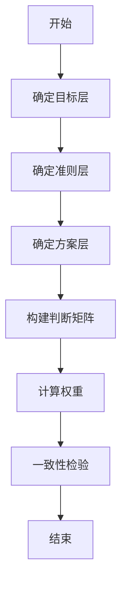

                 


# 设计智能化的企业并购文化整合风险评估模型

**关键词**：企业并购，文化整合，风险评估，人工智能，智能化模型，层次分析法

**摘要**：本文旨在探讨如何设计一个智能化的企业并购文化整合风险评估模型。通过分析企业并购中的文化整合风险，结合人工智能技术，构建一个能够量化和预测文化整合风险的模型。本文首先介绍企业并购与文化整合的基本概念和重要性，然后详细分析文化整合风险的特征与分类，接着阐述智能化评估模型的核心概念与算法原理，最后通过实际案例展示模型的应用与效果。文章内容包括背景介绍、核心概念、算法原理、系统架构、项目实战以及最佳实践等部分，旨在为企业并购中的文化整合风险评估提供一种新的思路和方法。

---

# 设计智能化的企业并购文化整合风险评估模型

## 第一部分: 企业并购与文化整合背景介绍

### 第1章: 企业并购与文化整合概述

#### 1.1 企业并购的基本概念
- **企业并购的定义**：企业并购是指一家企业通过购买、合并或其他方式，取得另一家企业全部或部分股权或资产的行为。
- **企业并购的类型**：
  - 横向并购：同一行业内的企业并购。
  - 纵向并购：企业与其供应商或客户的并购。
  - 混合并购：与企业主营业务无关的并购。
- **企业并购的动机与目标**：
  - 获取技术或市场优势。
  - 实现规模效应。
  - 优化资源分配。
  - 战略调整或多元化发展。

#### 1.2 文化整合的定义与重要性
- **文化整合的定义**：文化整合是指在企业并购后，将两家企业的文化理念、价值观、管理方式等进行融合，形成统一的企业文化的过程。
- **文化整合对并购成功的影响**：
  - 成功的文化整合能够提高员工的归属感和凝聚力。
  - 有助于新企业在市场中的竞争力提升。
  - 文化冲突可能导致并购失败，如管理混乱、员工流失等问题。
- **文化整合的挑战与机遇**：
  - 挑战：文化差异可能导致整合困难。
  - 机遇：通过文化整合，企业可以实现优势互补，提升整体竞争力。

#### 1.3 智能化评估模型的背景与意义
- **传统文化整合评估的局限性**：
  - 主观性较强，缺乏量化标准。
  - 评估过程复杂，耗时且成本高。
  - 无法实时监控和预测整合风险。
- **智能化评估模型的优势**：
  - 利用大数据和人工智能技术，实现量化评估。
  - 提高评估的客观性和准确性。
  - 可以实时监控整合过程，及时发现和解决问题。
- **智能化评估模型的应用前景**：
  - 帮助企业在并购前进行风险评估，制定整合策略。
  - 提高并购的成功率和整合效率。
  - 为企业提供数据支持，优化资源配置。

### 第2章: 企业并购文化整合风险的特征与分类

#### 2.1 文化整合风险的特征
- **风险的复杂性**：文化整合涉及多个方面，如企业战略、管理风格、员工价值观等，具有较高的复杂性。
- **风险的动态性**：文化整合是一个动态过程，随着企业内外部环境的变化而变化。
- **风险的不确定性**：文化整合的结果具有一定的不确定性，可能受到多种不可控因素的影响。

#### 2.2 文化整合风险的分类
- **战略风险**：
  - 并购后的企业战略方向不明确。
  - 战略目标与被并购企业原有战略不一致。
- **运营风险**：
  - 管理风格冲突。
  - 业务流程不兼容。
- **财务风险**：
  - 财务整合困难。
  - 成本超支。
- **人力资源风险**：
  - 员工抵制整合。
  - 核心人才流失。

#### 2.3 风险特征对比表
| 风险类型 | 特征描述 | 示例 |
|----------|----------|------|
| 战略风险 | 战略目标不一致 | 并购后企业战略方向不明确 |
| 运营风险 | 管理风格冲突 | 两家企业的管理风格差异较大 |
| 财务风险 | 财务整合困难 | 并购后财务系统难以整合 |
| 人力资源风险 | 员工抵制整合 | 员工对新企业文化的接受度低 |

#### 2.3.1 不同风险类型的对比分析
- 战略风险和运营风险主要涉及企业的管理层面，而财务风险和人力资源风险则更多涉及企业的具体操作层面。
- 每种风险类型都有其独特的表现形式和解决方法。

#### 2.3.2 风险特征的权重分配
- 通过层次分析法（AHP）对不同风险类型的权重进行分配，确定每种风险对企业整体文化整合的影响程度。

---

## 第三部分: 智能化风险评估模型的核心概念与联系

### 第3章: 文化整合风险评估的核心要素

#### 3.1 核心要素的定义与属性
- **企业文化匹配度**：
  - 企业文化是否兼容。
  - 企业文化的核心价值观是否一致。
- **管理层整合能力**：
  - 管理层是否具备整合能力。
  - 管理层的沟通与协调能力。
- **员工的接受度**：
  - 员工对并购的接受程度。
  - 员工对企业文化的认同感。
- **业务流程的兼容性**：
  - 业务流程是否能够无缝衔接。
  - 业务流程的标准化程度。

#### 3.2 核心要素的ER实体关系图
```mermaid
er
  entity 企业文化匹配度
  entity 管理层整合能力
  entity 员工接受度
  entity 业务流程兼容性
  relation 一对一关系
```

#### 3.3 核心要素的权重分配
- **权重分配的数学模型**：
  - 使用层次分析法（AHP）对核心要素进行权重分配。
  - 通过专家评分法确定各要素的权重。

### 第4章: 智能化评估模型的算法原理

#### 4.1 层次分析法（AHP）原理
- **层次分析法的基本概念**：
  - 层次分析法是一种用于决策分析的定量方法。
  - 通过构建层次结构，对各因素进行量化分析。
- **层次分析法的步骤**：
  1. 构建层次结构。
  2. 构建判断矩阵。
  3. 计算各因素的权重。
  4. 进行一致性检验。
- **层次分析法的优缺点**：
  - 优点：简单易懂，适用于多因素决策问题。
  - 缺点：结果可能受到专家主观判断的影响。

#### 4.2 文化整合风险评估的算法流程
- **算法流程的步骤**：
  1. 确定目标层（文化整合风险）。
  2. 确定准则层（核心要素：企业文化匹配度、管理层整合能力、员工接受度、业务流程兼容性）。
  3. 确定方案层（不同风险类型：战略风险、运营风险、财务风险、人力资源风险）。
  4. 构建判断矩阵。
  5. 计算各因素的权重。
  6. 进行一致性检验。
- **算法流程的mermaid图**：


#### 4.3 层次分析法的Python实现
- **代码示例**：
```python
import numpy as np

def calculate_weights(matrix):
    # 计算判断矩阵的最大特征值及其对应的特征向量
    eigenvalues, eigenvectors = np.linalg.eig(matrix)
    max_eigenvalue = eigenvalues.max()
    max_eigenvector = eigenvectors[:, np.argmax(eigenvalues)]

    # 计算一致性检验
    n = len(matrix)
    CI = (max_eigenvalue - n) / (n - 1)
    CR = CI / np.random一致性指标

    return max_eigenvector, CR

# 示例判断矩阵
matrix = np.array([
    [1, 2, 1, 3],
    [0.5, 1, 2, 2],
    [1, 0.5, 1, 2],
    [0.333, 0.5, 0.5, 1]
])

weights, CR = calculate_weights(matrix)
print("权重向量:", weights)
print("一致性检验结果:", CR)
```

---

## 第四部分: 项目实战

### 第5章: 智能化文化整合风险评估模型的实现

#### 5.1 环境安装
- **安装Python和相关库**：
  - 安装Python 3.8及以上版本。
  - 安装numpy和scipy库。

#### 5.2 核心代码实现
- **层次分析法的实现**：
```python
import numpy as np

def calculate_weights(matrix):
    eigenvalues, eigenvectors = np.linalg.eig(matrix)
    max_eigenvalue = eigenvalues.max()
    max_eigenvector = eigenvectors[:, np.argmax(eigenvalues)]
    return max_eigenvector

matrix = np.array([
    [1, 2, 1, 3],
    [0.5, 1, 2, 2],
    [1, 0.5, 1, 2],
    [0.333, 0.5, 0.5, 1]
])

weights = calculate_weights(matrix)
print("权重向量:", weights)
```

#### 5.3 代码功能解读
- **代码功能**：
  - 通过层次分析法计算各核心要素的权重。
  - 输出权重向量，用于后续的风险评估。

#### 5.4 实际案例分析
- **案例背景**：
  - 某企业计划并购另一家企业，需要评估文化整合风险。
- **数据收集**：
  - 收集企业文化匹配度、管理层整合能力、员工接受度、业务流程兼容性等数据。
- **模型应用**：
  - 通过层次分析法计算各因素的权重。
  - 根据权重分配，评估文化整合风险。

#### 5.5 案例分析结果
- **结果解读**：
  - 企业文化匹配度权重最高，其次是管理层整合能力。
  - 文化整合风险主要集中在战略风险和人力资源风险。

#### 5.6 项目小结
- **项目总结**：
  - 成功实现智能化的文化整合风险评估模型。
  - 模型能够量化和预测文化整合风险。
  - 为企业并购提供有力的数据支持。

---

## 第五部分: 最佳实践

### 第6章: 智能化文化整合风险评估模型的优化与应用

#### 6.1 小结
- **小结**：
  - 文化整合风险评估模型的核心在于量化和预测风险。
  - 层次分析法是一种有效的量化工具。
  - 通过智能化模型，企业可以更科学地进行文化整合。

#### 6.2 注意事项
- **注意事项**：
  - 数据收集和分析的准确性是关键。
  - 模型的应用需要结合企业的实际情况。
  - 模型的更新和优化需要持续进行。

#### 6.3 拓展阅读
- **拓展阅读**：
  - 《企业并购与文化整合》
  - 《层次分析法在企业并购中的应用》
  - 《人工智能在风险管理中的应用》

---

## 作者信息

作者：AI天才研究院/AI Genius Institute & 禅与计算机程序设计艺术/Zen And The Art of Computer Programming

