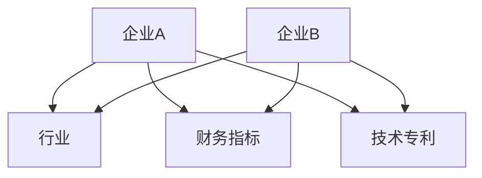
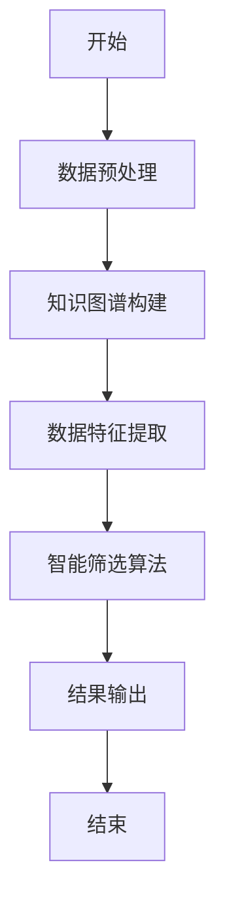
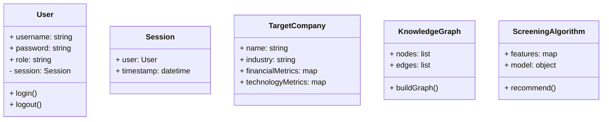
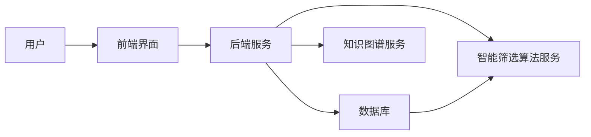
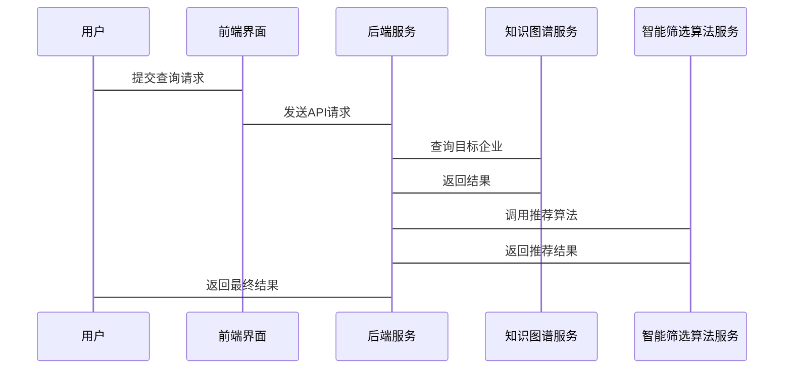

                 


# 设计智能化的企业并购目标筛选模型

> 关键词：企业并购，目标筛选，人工智能，知识图谱，数据特征提取，智能筛选算法

> 摘要：本文详细介绍了如何设计智能化的企业并购目标筛选模型，涵盖背景介绍、核心概念、算法原理、系统架构设计、项目实战及案例分析。通过系统化的分析和实际案例，展示了如何利用人工智能技术提升企业并购目标筛选的效率和准确性。

---

## 第1章: 企业并购目标筛选模型的背景介绍

### 1.1 问题背景与问题描述
#### 1.1.1 传统企业并购中的痛点
企业并购是企业战略发展的重要手段，但传统的目标筛选过程存在以下痛点：
- **信息不对称**：难以全面获取目标企业的详细信息。
- **效率低下**：人工筛选目标企业耗时耗力。
- **主观性较强**：依赖经验丰富的并购专家，存在主观判断偏差。

#### 1.1.2 并购目标筛选的关键问题
- **如何高效获取目标企业信息？**
- **如何准确评估目标企业的价值？**
- **如何快速匹配企业战略需求与目标企业特点？**

#### 1.1.3 智能化筛选的必要性
- **提升效率**：通过自动化手段快速筛选大量企业。
- **提高准确性**：利用数据驱动的方法减少人为误差。
- **增强决策支持**：为企业提供数据支持的决策依据。

### 1.2 问题解决与边界外延
#### 1.2.1 智能化筛选的核心目标
- **高效获取目标企业信息**：通过爬虫技术、API接口等方式获取企业公开数据。
- **精准评估企业价值**：利用机器学习算法对企业的财务、市场、技术等多维度进行评估。
- **快速匹配企业需求**：基于企业战略目标，匹配最合适的目标企业。

#### 1.2.2 模型的边界与适用范围
- **边界**：主要针对公开上市企业，数据范围有限，无法覆盖完全非公开的企业信息。
- **适用范围**：适用于企业战略规划、投资决策、风险评估等领域。

#### 1.2.3 模型的外延与扩展性
- **扩展行业**：从单一行业扩展到多个行业。
- **数据源扩展**：从公开数据扩展到半公开数据和内部数据。
- **模型优化**：从简单的筛选模型优化到复杂的预测模型。

### 1.3 核心概念与结构
#### 1.3.1 模型的核心要素
- **数据来源**：企业公开数据（如财务报表、新闻报道）、行业报告等。
- **筛选维度**：财务指标（如ROE、净利润率）、市场指标（如市场份额）、技术指标（如专利数量）等。
- **算法模型**：基于机器学习的推荐算法、知识图谱构建等。

#### 1.3.2 概念结构与组成
- **输入**：企业的战略需求、行业关键词。
- **过程**：数据清洗、特征提取、知识图谱构建、智能筛选算法。
- **输出**：目标企业列表、企业画像、匹配度评分。

---

## 第2章: 核心概念与联系

### 2.1 模型的核心原理
#### 2.1.1 知识图谱构建
- **知识图谱**：通过构建企业之间的关系网络，帮助识别潜在的并购目标。
- **构建方法**：使用图嵌入技术（如Word2Vec）对企业及其关系进行建模。

#### 2.1.2 数据特征提取
- **文本特征提取**：从企业新闻、财报中提取关键词和情感特征。
- **数值特征提取**：从财务数据中提取关键指标（如ROE、净利润率）。

#### 2.1.3 智能筛选算法
- **推荐算法**：基于协同过滤、深度学习的推荐算法。
- **相似度计算**：使用余弦相似度、Jaccard相似度等方法进行企业匹配。

### 2.2 核心概念对比分析
#### 2.2.1 概念属性对比表

| 概念       | 属性1：数据来源 | 属性2：筛选维度 | 属性3：算法模型 |
|------------|----------------|----------------|----------------|
| 知识图谱    | 公开数据       | 关系网络       | 图嵌入技术     |
| 特征提取    | 多源数据       | 文本、数值      | Word2Vec       |
| 智能筛选    | 综合数据       | 综合指标       | 协同过滤、深度学习 |

#### 2.2.2 ER实体关系图（mermaid）



---

## 第3章: 算法原理讲解

### 3.1 算法流程
#### 3.1.1 算法流程图（mermaid）



### 3.2 算法实现
#### 3.2.1 数据预处理
- **数据清洗**：去除重复数据、填补缺失值。
- **数据标准化**：对数值特征进行归一化处理。

#### 3.2.2 知识图谱构建
- **节点表示**：使用Word2Vec对企业的文本描述进行嵌入表示。
- **边关系**：构建企业间的关系（如同一行业、上下游关系）。

#### 3.2.3 数据特征提取
- **文本特征**：使用TF-IDF提取关键词。
- **数值特征**：提取财务指标（如ROE、净利润率）。

#### 3.2.4 智能筛选算法
- **协同过滤**：基于用户-企业矩阵进行推荐。
- **深度学习模型**：使用图神经网络（如GAT）进行企业关系分析。

#### 3.2.5 算法代码实现
```python
def build_knowledge_graph(data):
    # 构建知识图谱
    pass

def extract_features(data):
    # 提取特征
    pass

def intelligent_screening_algorithm(features):
    # 智能筛选算法
    pass
```

---

## 第4章: 系统分析与架构设计

### 4.1 问题场景介绍
- **场景描述**：企业需要快速筛选潜在并购目标。
- **用户角色**：企业战略部门、投资经理。

### 4.2 项目介绍
- **项目目标**：构建智能化的企业并购目标筛选系统。
- **项目范围**：覆盖多个行业，支持多种筛选维度。

### 4.3 系统功能设计
#### 4.3.1 领域模型（mermaid类图）



### 4.4 系统架构设计
#### 4.4.1 系统架构图（mermaid）



### 4.5 系统接口设计
- **API接口**：
  - `/api/targets?query=technology`：根据技术关键词筛选目标企业。
  - `/api/recommend?user_id=1`：根据用户偏好推荐目标企业。

### 4.6 系统交互设计
#### 4.6.1 交互流程（mermaid序列图）



---

## 第5章: 项目实战

### 5.1 环境安装
- **工具安装**：安装Python、Jupyter Notebook、TensorFlow、Networkx等。
- **数据获取**：获取企业公开数据（如通过API接口获取）。

### 5.2 核心代码实现
#### 5.2.1 数据预处理
```python
import pandas as pd

data = pd.read_csv('companies.csv')
data.drop_duplicates(inplace=True)
data.fillna(method='ffill', inplace=True)
```

#### 5.2.2 知识图谱构建
```python
import networkx as nx

G = nx.Graph()
G.add_nodes_from(['CompanyA', 'CompanyB', 'CompanyC'])
G.add_edges_from([('CompanyA', 'CompanyB'), ('CompanyB', 'CompanyC')])
```

#### 5.2.3 特征提取
```python
from sklearn.feature_extraction.text import TfidfVectorizer

vectorizer = TfidfVectorizer()
features = vectorizer.fit_transform(documents)
```

#### 5.2.4 算法实现
```python
from sklearn.neighbors import NearestNeighbors

model = NearestNeighbors(n_neighbors=5, algorithm='ball_tree').fit(features)
distances, indices = model.kneighbors(new_query_vector.reshape(1, -1))
```

### 5.3 案例分析
- **案例背景**：某科技公司寻找人工智能领域的并购目标。
- **筛选过程**：通过知识图谱和推荐算法，筛选出3家潜在目标企业。
- **结果分析**：根据匹配度评分，推荐前3名企业。

### 5.4 项目小结
- **项目成果**：成功构建智能化筛选模型。
- **经验总结**：数据质量和算法选择对结果影响较大。

---

## 第6章: 案例分析与经验总结

### 6.1 案例分析
#### 6.1.1 案例背景
- **行业**：科技行业。
- **目标**：寻找人工智能领域的并购目标。

#### 6.1.2 筛选过程
- **数据来源**：公开的企业信息、行业报告。
- **筛选维度**：技术专利数量、研发投入、市场份额。

#### 6.1.3 筛选结果
- **目标企业1**：技术专利数量与自身企业匹配度高。
- **目标企业2**：市场份额与战略目标匹配。
- **目标企业3**：财务状况良好，风险较低。

### 6.2 经验总结
- **数据质量的重要性**：高质量的数据是模型准确性的基础。
- **算法选择的灵活性**：根据具体情况选择合适的算法。
- **结果验证的必要性**：通过实际案例验证模型的有效性。

### 6.3 最佳实践
- **数据预处理**：确保数据的完整性和准确性。
- **算法优化**：根据实际需求调整模型参数。
- **结果解释**：为用户提供可理解的解释，增强信任度。

---

## 第7章: 总结与展望

### 7.1 全文总结
本文详细介绍了智能化的企业并购目标筛选模型的设计与实现过程，从背景介绍到算法实现，再到系统架构设计和项目实战，全面覆盖了模型的各个方面。

### 7.2 未来展望
- **扩展应用**：从单一行业扩展到多个行业。
- **数据源扩展**：引入更多数据源，如社交媒体数据。
- **模型优化**：进一步优化算法，提升模型的准确性和效率。

---

## 作者：AI天才研究院/AI Genius Institute & 禅与计算机程序设计艺术 /Zen And The Art of Computer Programming

