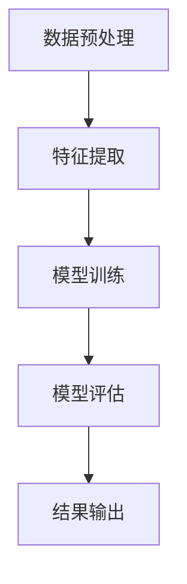
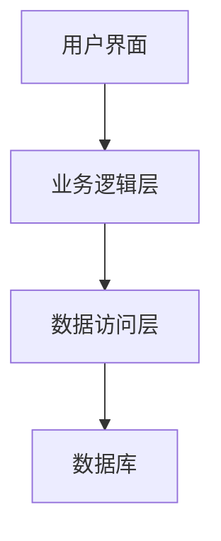
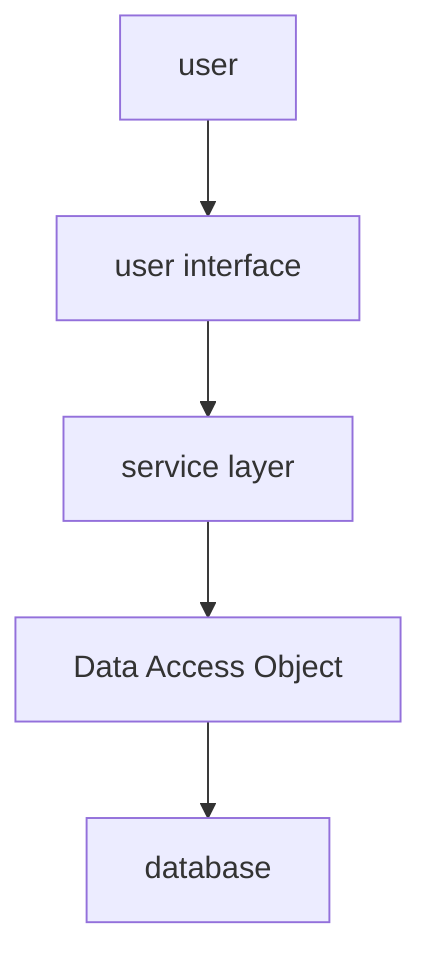
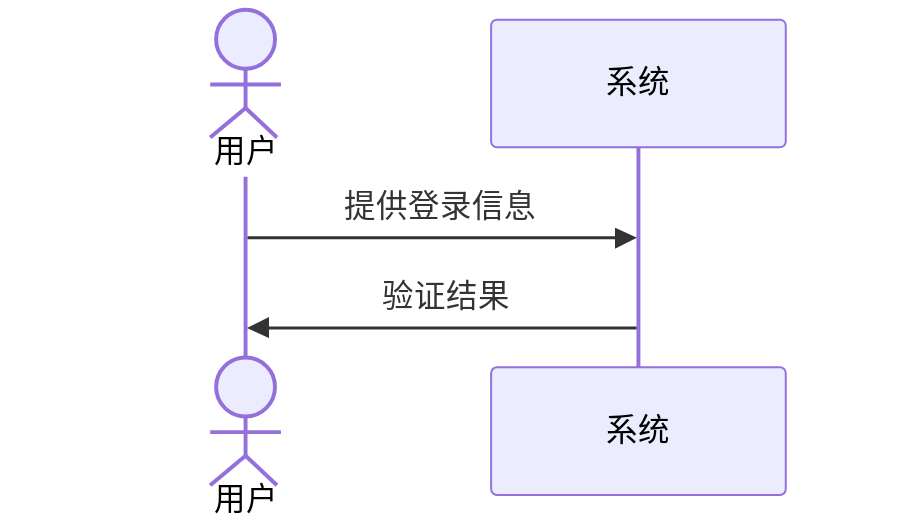
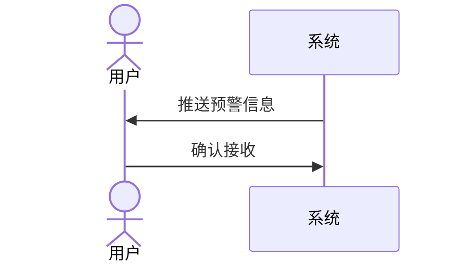

                 


# 设计智能化的企业财务压力预警系统

> 关键词：企业财务压力，智能化预警系统，机器学习，系统架构，算法原理

> 摘要：随着企业经营环境的日益复杂化，财务压力预警系统的智能化设计变得至关重要。本文从背景、核心概念、算法原理、系统架构到项目实战，全面解析如何构建一个高效的智能化财务压力预警系统，为企业提供及时、准确的预警信息，降低财务风险。

---

# 第1章: 企业财务压力预警系统背景

## 1.1 企业财务压力的定义与重要性

### 1.1.1 什么是企业财务压力
企业财务压力是指企业在经营过程中由于资金链断裂、债务负担过重、盈利能力下降等原因，可能导致企业生存和发展受到威胁的情况。

### 1.1.2 财务压力对企业的影响
- 影响企业正常运营
- 导致企业信用评级下降
- 可能引发企业破产

### 1.1.3 财务压力预警的必要性
- 提前发现潜在风险
- 为管理层提供决策支持
- 降低企业经营风险

## 1.2 财务压力预警系统的现状

### 1.2.1 现有财务预警方法的局限性
- 传统方法依赖人工分析，效率低
- 数据来源单一，覆盖面有限
- 预警模型缺乏动态调整能力

### 1.2.2 智能化预警系统的兴起
- 人工智能技术的发展推动预警系统的智能化
- 大数据分析能力提升预警准确性
- 云计算技术提供强大计算支持

### 1.2.3 当前市场中的解决方案
- 基于机器学习的预警模型
- 数据挖掘技术的应用
- 云计算支持的实时预警系统

## 1.3 财务压力预警系统的核心要素

### 1.3.1 数据来源
- 财务报表数据
- 市场数据
- 行业基准数据

### 1.3.2 预警模型
- 机器学习模型
- 统计模型
- 时间序列分析模型

### 1.3.3 预警指标
- 流动比率
- 速动比率
- 利息覆盖倍数

---

# 第2章: 财务压力预警系统的核心概念

## 2.1 财务压力预警系统的核心原理

### 2.1.1 数据采集与处理
- 数据清洗
- 数据标准化
- 数据特征提取

### 2.1.2 预警模型的构建
- 特征选择
- 模型训练
- 模型评估

### 2.1.3 预警结果的输出
- 风险评分
- 预警级别
- 预警建议

## 2.2 财务压力预警系统的属性特征对比

### 2.2.1 数据驱动性
- 基于数据驱动的预警
- 数据实时更新
- 数据来源多样化

### 2.2.2 实时性
- 实时数据采集与处理
- 实时预警结果输出
- 动态调整预警模型

### 2.2.3 可解释性
- 模型的可解释性
- 预警结果的透明性
- 便于用户理解

## 2.3 财务压力预警系统的ER实体关系图

```mermaid
erDiagram
    actor 用户
    actor 管理员
    actor 数据源
    database 数据库
    entity 财务数据
    entity 预警指标
    entity 预警结果

    用户 --> 数据源: 提供数据
    数据源 --> 数据库: 存储数据
    用户 --> 数据库: 查询数据
    管理员 --> 数据库: 管理数据
    数据库 --> 预警指标: 计算指标
    数据库 --> 预警结果: 输出结果
```

---

# 第3章: 财务压力预警系统的算法原理

## 3.1 算法选择与流程

### 3.1.1 机器学习算法的选择
- 线性回归
- 支持向量机 (SVM)
- 随机森林

### 3.1.2 算法流程图展示



## 3.2 算法实现细节

### 3.2.1 数据预处理
- 数据清洗
- 数据标准化
- 数据分割（训练集、测试集）

### 3.2.2 模型训练
- 特征选择
- 模型训练
- 超参数优化

### 3.2.3 模型评估
- 准确率
- 召回率
- F1分数

## 3.3 数学模型与公式

### 3.3.1 预警评分公式
$$ 预警评分 = \alpha \cdot \text{流动比率} + \beta \cdot \text{速动比率} + \gamma \cdot \text{利息覆盖倍数} $$

### 3.3.2 风险概率计算公式
$$ P(\text{风险}) = \frac{\text{违约企业数}}{\text{总企业数}} $$

---

# 第4章: 财务压力预警系统的系统架构设计

## 4.1 问题场景介绍

### 4.1.1 企业财务压力的典型场景
- 销售下降
- 成本上升
- 债务到期压力

### 4.1.2 系统的目标与范围
- 实时监控财务指标
- 自动生成预警报告
- 提供风险缓解建议

## 4.2 系统功能设计

### 4.2.1 数据采集模块
- 数据接口设计
- 数据清洗功能
- 数据存储功能

### 4.2.2 预警计算模块
- 数据分析功能
- 模型计算功能
- 结果存储功能

### 4.2.3 预警结果展示模块
- 风险等级展示
- 预警报告生成
- 可视化分析

## 4.3 系统架构设计

### 4.3.1 分层架构图



### 4.3.2 模块交互流程图



## 4.4 系统接口设计

### 4.4.1 数据接口
- 数据输入接口
- 数据输出接口
- 数据更新接口

### 4.4.2 用户接口
- 登录接口
- 查询接口
- 设置预警阈值接口

## 4.5 系统交互流程图

### 4.5.1 用户登录流程



### 4.5.2 预警信息推送流程



---

# 第5章: 项目实战

## 5.1 环境安装与配置

### 5.1.1 开发环境搭建
- 安装Python
- 安装Jupyter Notebook
- 安装依赖库（如scikit-learn、pandas）

### 5.1.2 数据库安装
- 安装MySQL
- 数据库连接配置
- 数据表创建

### 5.1.3 依赖库安装
- 使用pip安装所需库

## 5.2 核心代码实现

### 5.2.1 数据处理代码

```python
import pandas as pd

# 数据加载
data = pd.read_csv('financial_data.csv')

# 数据清洗
data.dropna(inplace=True)

# 数据标准化
from sklearn.preprocessing import StandardScaler
scaler = StandardScaler()
scaled_data = scaler.fit_transform(data)
```

### 5.2.2 预警模型代码

```python
from sklearn.ensemble import RandomForestClassifier

# 模型训练
model = RandomForestClassifier()
model.fit(scaled_data, target)

# 模型评估
print(model.score(scaled_data, target))
```

## 5.3 实际案例分析

### 5.3.1 案例背景
某制造企业面临销售下降和成本上升的双重压力，需要通过预警系统提前发现潜在风险。

### 5.3.2 数据分析与建模
- 数据预处理
- 特征选择
- 模型训练
- 结果解读

## 5.4 项目小结

### 5.4.1 项目成果
- 成功构建智能化预警系统
- 提高财务风险预警的准确性
- 提供有效的风险缓解建议

### 5.4.2 经验总结
- 数据质量对模型性能影响重大
- 模型选择需要结合业务场景
- 系统架构设计要注重可扩展性

---

# 第6章: 总结与展望

## 6.1 本文总结
- 本文详细介绍了企业财务压力预警系统的智能化设计
- 从背景、核心概念、算法原理到系统架构和项目实战，全面解析了系统的构建过程

## 6.2 未来展望
- 结合更多新兴技术（如区块链、物联网）提升预警系统的智能化水平
- 探索更先进的算法模型，提高预警准确性
- 扩展应用场景，为企业提供更全面的财务风险管理解决方案

---

作者：AI天才研究院/AI Genius Institute & 禅与计算机程序设计艺术 /Zen And The Art of Computer Programming

