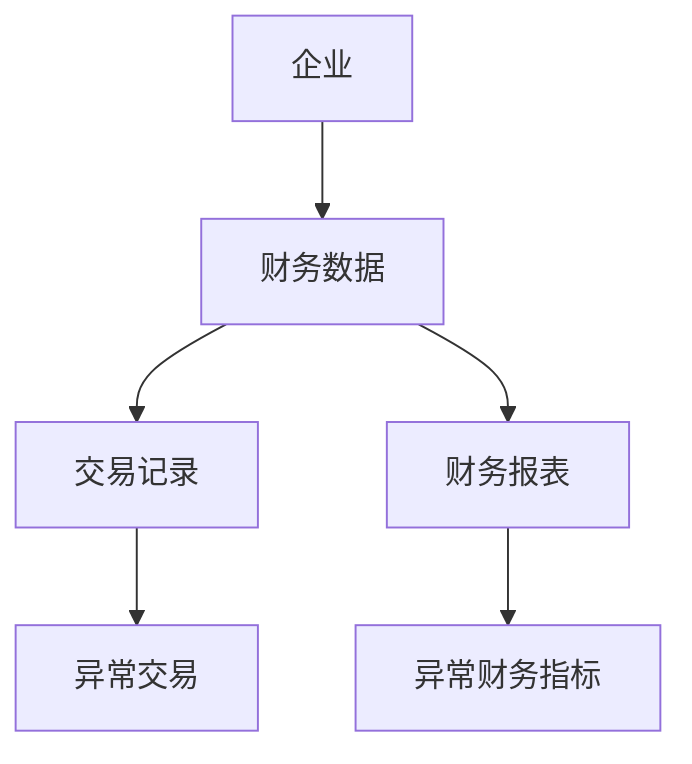
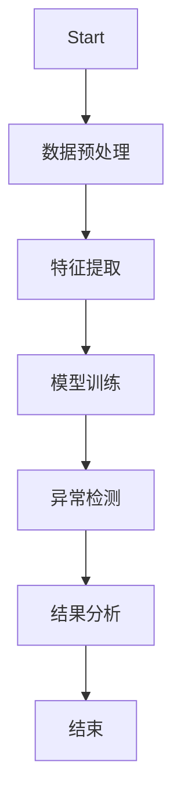
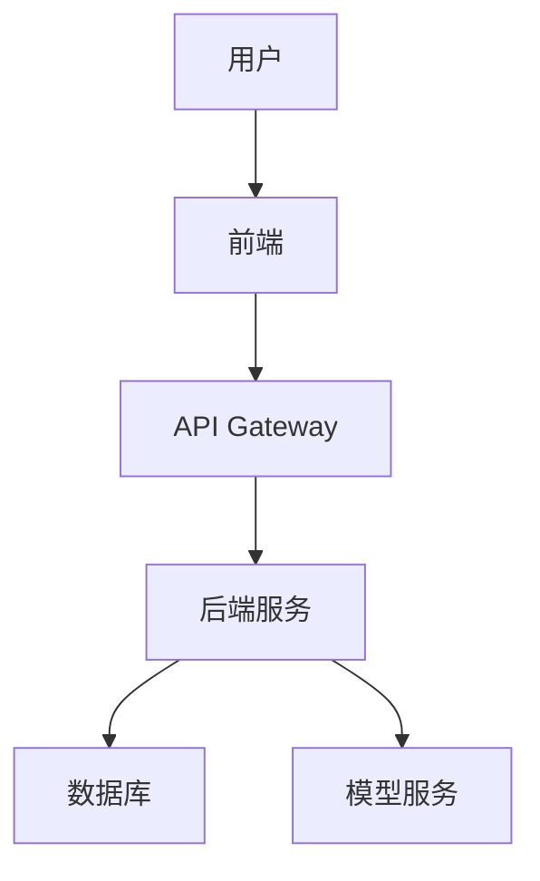
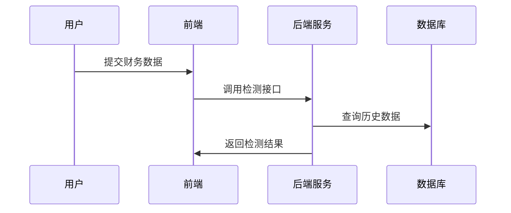

                 


# 设计智能化的企业财务异常检测模型

## 关键词：
企业财务异常检测，智能化模型，机器学习，数据挖掘，异常检测，财务风险预警

## 摘要：
企业财务异常检测是保障企业财务健康和合规性的重要环节。随着企业规模的扩大和财务数据的复杂化，传统的财务异常检测方法逐渐显现出效率低下、准确性不足的问题。本文将从背景、核心概念、算法原理、系统架构到项目实战，全面介绍如何设计智能化的企业财务异常检测模型。通过结合数据预处理、特征提取、算法选择和模型优化等关键步骤，本文旨在提供一种高效、准确的财务异常检测方案，为企业风险预警和管理提供有力支持。

---

# 第一部分: 企业财务异常检测模型的背景与概念

## 第1章: 财务异常检测的背景与问题描述

### 1.1 问题背景
企业财务数据的复杂性和多样性使得传统的财务异常检测方法难以应对现代企业的需求。传统的检测方法依赖于人工审核和经验判断，效率低下且容易出现人为错误。随着企业规模的扩大和财务数据的多样化，如何快速、准确地识别潜在的财务异常成为企业面临的重要挑战。

### 1.2 问题描述
财务异常检测的核心目标是通过分析企业的财务数据，识别出可能存在的异常交易、虚假财务报表或其他违反财务规范的行为。这些异常可能包括收入虚增、成本虚减、资产虚增等，对企业的财务健康和合规性构成威胁。

### 1.3 问题解决思路
智能化财务异常检测模型的设计思路包括以下几个方面：
1. **数据预处理**：清洗和标准化财务数据，提取关键特征。
2. **特征提取**：从财务数据中提取能够反映异常的特征，例如财务比率、交易频率等。
3. **算法选择**：选择适合异常检测的机器学习算法，如Isolation Forest、One-Class SVM等。
4. **模型优化**：通过调参和模型集成提升检测准确率。

### 1.4 概念结构与核心要素
- **企业**：作为主体，其财务数据是检测的对象。
- **财务数据**：包括财务报表、交易记录等。
- **异常交易**：指违反财务规范的交易行为。
- **异常财务指标**：指偏离正常范围的财务指标。

---

## 第2章: 智能化模型的核心概念

### 2.1 模型原理
智能化财务异常检测模型通过机器学习算法对财务数据进行分析，识别出潜在的异常。其核心步骤包括数据预处理、特征提取、模型训练和预测。

### 2.2 核心概念的特征对比
| 特征 | 正常数据 | 异常数据 |
|------|----------|----------|
| 收入 | 稳定增长 | 突然激增 |
| 成本 | 与收入匹配 | 低于收入 |
| 利润 | 合理区间 | 过高或过低 |

### 2.3 ER实体关系图


---

# 第二部分: 智能化财务异常检测模型的算法原理

## 第3章: 算法原理与实现

### 3.1 算法选择
在智能化模型中，选择合适的算法是关键。Isolation Forest算法因其高效的异常检测能力和对高维数据的适应性，被广泛应用于财务异常检测。

### 3.2 算法流程


### 3.3 数学公式
Isolation Forest算法通过构建随机树来隔离异常点。其核心公式如下：

$$
\text{异常分数} = \frac{\text{路径长度}}{\text{平均路径长度}}
$$

---

# 第三部分: 系统分析与架构设计

## 第4章: 系统分析与架构设计

### 4.1 问题场景介绍
企业财务异常检测系统需要处理海量财务数据，实时检测异常，并提供预警。

### 4.2 系统功能设计
- **数据采集**：从企业系统中获取财务数据。
- **数据预处理**：清洗和标准化数据。
- **模型训练**：训练异常检测模型。
- **异常检测**：实时检测财务数据中的异常。
- **预警通知**：通过邮件或消息队列通知相关人员。

### 4.3 系统架构图


### 4.4 接口设计
- **数据接口**：提供REST API用于数据上传。
- **检测接口**：提供API用于实时检测。

### 4.5 交互设计


---

# 第四部分: 项目实战

## 第5章: 项目实战与案例分析

### 5.1 环境安装
需要安装Python、机器学习库（如scikit-learn、xgboost）和数据处理库（如pandas、numpy）。

### 5.2 核心代码实现
```python
import pandas as pd
from sklearn.ensemble import IsolationForest

# 数据加载
data = pd.read_csv('financial_data.csv')

# 数据预处理
data = data.dropna()
data = (data - data.mean()) / data.std()

# 模型训练
model = IsolationForest(n_estimators=100, random_state=42)
model.fit(data)

# 异常检测
y_pred = model.predict(data)
```

### 5.3 案例分析
通过分析一个企业的财务数据，识别出异常的收入增长和成本虚减，帮助企业及时发现潜在的财务问题。

---

## 第6章: 实际案例分析与应用

### 6.1 案例分析
通过一个实际案例，展示模型如何识别异常的财务数据。

### 6.2 应用场景
- **财务审计**：帮助审计人员快速发现异常。
- **风险预警**：实时监控企业财务状况。

---

## 第7章: 总结与展望

### 7.1 总结
智能化财务异常检测模型通过机器学习算法和大数据技术，显著提高了检测的效率和准确性。

### 7.2 展望
未来，随着AI技术的发展，财务异常检测将更加智能化和自动化，为企业提供更强大的风险预警能力。

---

# 作者：AI天才研究院 & 禅与计算机程序设计艺术

