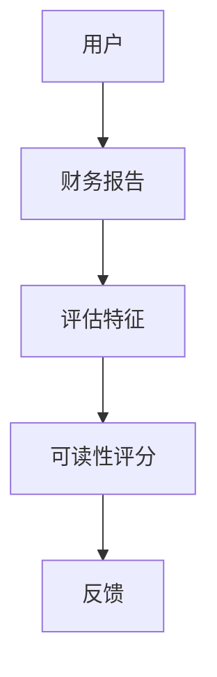
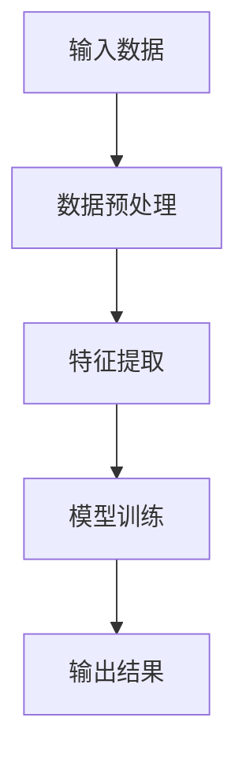
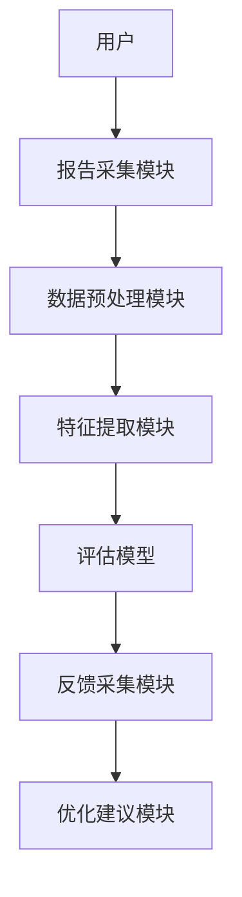
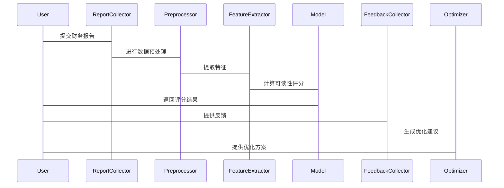

                 


# 设计智能化的企业财务报告可读性动态评估模型

## 关键词：企业财务报告，可读性评估，智能化模型，动态评估，技术实现

## 摘要：  
本文详细探讨了设计智能化的企业财务报告可读性动态评估模型的方法与实现。通过分析当前财务报告可读性评估的痛点，提出了基于自然语言处理和机器学习的智能化解决方案。本文从模型的背景、核心概念、算法原理、系统架构设计到项目实战，全面阐述了该模型的设计与实现过程，为企业的财务报告质量管理提供了新的思路。

---

# 第1章: 企业财务报告可读性评估的背景与问题

## 1.1 问题背景

### 1.1.1 企业财务报告的重要性  
企业财务报告是反映企业财务状况、经营成果和现金流量的重要文件，是投资者、债权人、监管机构等利益相关方了解企业经营状况的核心依据。然而，财务报告的复杂性和专业性常常导致其可读性较差，尤其是对非专业读者而言。

### 1.1.2 财务报告可读性问题的现状  
目前，财务报告的可读性评估主要依赖人工经验或简单的文本长度指标，这种方式不仅效率低下，且难以量化和动态调整。随着企业规模的扩大和业务的复杂化，传统评估方法已无法满足现代企业的需求。

### 1.1.3 提升财务报告可读性的必要性  
提升财务报告的可读性有助于提高信息传递效率，增强利益相关方对企业的信任，同时也有助于企业优化内部管理，提升财务透明度。

---

## 1.2 问题描述

### 1.2.1 财务报告可读性的影响因素  
财务报告的可读性受到多种因素的影响，包括文本复杂度、专业术语使用频率、信息组织结构等。此外，报告的篇幅、排版和语言表达方式也会影响可读性。

### 1.2.2 当前评估方法的局限性  
传统评估方法主要依赖主观判断，缺乏客观性和动态性。例如，仅通过文本长度判断可读性，忽略了内容的逻辑性和信息的组织方式。

### 1.2.3 智能化评估的需求  
随着人工智能和自然语言处理技术的发展，智能化评估工具能够更高效、更准确地分析财务报告的可读性，为用户提供个性化的优化建议。

---

## 1.3 问题解决思路

### 1.3.1 引入智能化技术的必要性  
智能化技术能够通过自动化分析和学习，帮助我们更精准地评估财务报告的可读性。例如，使用自然语言处理技术提取文本特征，结合机器学习模型进行评估。

### 1.3.2 动态评估模型的核心目标  
动态评估模型的目标是根据财务报告的内容和结构，动态调整评估指标权重，提供实时的可读性评分，并根据反馈优化模型性能。

### 1.3.3 模型的边界与外延  
模型的边界包括财务报告的文本内容、格式和排版，而其外延则涉及报告生成工具的优化、读者理解度的提升以及企业内部的知识管理。

---

## 1.4 模型的核心要素

### 1.4.1 数据来源与处理  
模型的数据来源包括财务报告文本、读者反馈数据和行业标准数据。数据处理包括文本清洗、特征提取和数据标注。

### 1.4.2 评估指标体系  
评估指标包括文本复杂度、术语使用频率、信息组织结构、排版布局和语言表达方式等。

### 1.4.3 模型的输入输出关系  
模型的输入是财务报告文本和相关数据，输出是可读性评分和优化建议。

---

## 1.5 本章小结  
本章从背景、问题描述和解决思路三个方面，详细分析了设计智能化财务报告可读性动态评估模型的必要性，并提出了模型的核心要素和实现目标。

---

# 第2章: 智能化评估模型的核心概念与联系

## 2.1 核心概念原理

### 2.1.1 智能化评估的基本原理  
智能化评估基于自然语言处理和机器学习技术，通过提取文本特征、构建评估模型并动态调整权重，实现对财务报告可读性的精准评估。

### 2.1.2 动态评估的机制  
动态评估模型能够根据实时反馈动态调整评估指标权重，确保评估结果的准确性和实用性。

### 2.1.3 可读性评估的关键指标  
关键指标包括文本长度、术语使用频率、句子复杂度和信息组织结构等。

---

## 2.2 核心概念属性对比

| 指标 | 传统评估 | 智能化评估 |
|------|-----------|------------|
| 数据来源 | 文本长度 | 文本内容、结构、反馈 |
| 评估方式 | 主观判断 | 自动化分析、动态调整 |
| 输出结果 | 简单评分 | 细化评分、优化建议 |

---

## 2.3 ER实体关系图



---

## 2.4 本章小结  
本章通过核心概念的对比和实体关系图，详细分析了智能化评估模型的工作原理和实现机制，为后续的算法设计奠定了基础。

---

# 第3章: 模型算法原理与数学基础

## 3.1 算法原理

### 3.1.1 模型的整体流程  


---

## 3.2 数学模型与公式

### 3.2.1 评估指标的加权公式  
$$ \text{可读性评分} = \sum_{i=1}^{n} w_i x_i $$
其中，$w_i$ 是第 $i$ 个指标的权重，$x_i$ 是第 $i$ 个指标的评分。

### 3.2.2 动态调整的数学表达  
$$ w_i(t+1) = w_i(t) + \alpha \cdot \Delta w_i $$
其中，$\alpha$ 是学习率，$\Delta w_i$ 是权重调整量。

---

## 3.3 代码实现

### 3.3.1 数据预处理
```python
def preprocess(text):
    # 分词处理
    tokens = text.split()
    # 去除停用词
    stopwords = set(["的", "了", "是", ...])
    filtered_tokens = [token for token in tokens if token not in stopwords]
    return filtered_tokens
```

### 3.3.2 特征提取
```python
def extract_features(tokens):
    # 文本长度
    length = len(tokens)
    # 专业术语数量
    domain_terms = sum(1 for token in tokens if token in DOMAIN_TERMS_SET)
    return [length, domain_terms]
```

### 3.3.3 模型训练
```python
import numpy as np
from sklearn.linear_model import LinearRegression

# 训练数据
X = np.array([[100, 20], [80, 15], [120, 25]])
y = np.array([7, 6, 8])

model = LinearRegression()
model.fit(X, y)
```

---

## 3.4 本章小结  
本章详细讲解了模型的算法原理和数学基础，通过代码实现展示了如何从数据预处理到特征提取，再到模型训练的完整流程。

---

# 第4章: 系统分析与架构设计

## 4.1 问题场景介绍

### 4.1.1 企业财务报告的典型场景  
企业财务报告通常包括资产负债表、利润表和现金流量表等部分，文本内容复杂且专业性强。

### 4.1.2 模型的应用环境  
模型可以应用于企业内部的财务报告生成工具，帮助优化报告的可读性。

### 4.1.3 用户需求分析  
用户需求包括实时评估、个性化优化建议和历史数据对比。

---

## 4.2 系统功能设计

### 4.2.1 数据采集模块  
负责采集财务报告文本和相关数据。

### 4.2.2 评估模块  
实现文本预处理、特征提取和可读性评分计算。

### 4.2.3 反馈与优化模块  
根据评估结果提供优化建议并动态调整模型参数。

---

## 4.3 系统架构设计



---

## 4.4 系统接口设计

| 接口名称 | 输入 | 输出 |
|----------|------|------|
| 评估接口 | 文本数据 | 可读性评分 |
| 优化接口 | 反馈数据 | 优化建议 |

---

## 4.5 系统交互流程



---

## 4.6 本章小结  
本章通过系统分析与架构设计，详细展示了智能化财务报告可读性评估模型的实现框架和交互流程。

---

# 第5章: 项目实战与优化

## 5.1 环境安装

### 5.1.1 Python环境配置  
安装Python 3.8及以上版本，并安装必要的库，如 `numpy`, `sklearn`, `jieba`。

### 5.1.2 数据集准备  
收集企业财务报告文本数据，并进行标注处理。

---

## 5.2 核心实现

### 5.2.1 数据预处理代码  
```python
import jieba

def preprocess(text):
    tokens = jieba.lcut(text)
    stopwords = set(["的", "了", "是", ...])
    filtered_tokens = [token for token in tokens if token not in stopwords]
    return filtered_tokens
```

### 5.2.2 模型训练代码  
```python
from sklearn.feature_extraction import DictVectorizer
from sklearn.linear_model import LogisticRegression

# 训练数据
data = [
    {"length": 100, "domain_terms": 20},
    {"length": 80, "domain_terms": 15},
    {"length": 120, "domain_terms": 25}
]
labels = [7, 6, 8]

vec = DictVectorizer()
X = vec.fit_transform(data)
model = LogisticRegression()
model.fit(X, labels)
```

---

## 5.3 案例分析

### 5.3.1 数据输入  
输入一份财务报告文本，经过预处理和特征提取后，模型计算出可读性评分为8分。

### 5.3.2 模型优化  
根据反馈数据，动态调整模型权重，提升评估精度。

---

## 5.4 本章小结  
本章通过项目实战展示了模型的实现过程，并通过案例分析验证了模型的有效性。

---

# 第6章: 总结与展望

## 6.1 总结

### 6.1.1 核心成果  
设计并实现了智能化的企业财务报告可读性动态评估模型，解决了传统评估方法的局限性。

### 6.1.2 关键技术  
基于自然语言处理和机器学习的技术，实现了动态评估和优化建议。

---

## 6.2 未来展望

### 6.2.1 模型优化  
进一步优化模型结构，提升评估精度和效率。

### 6.2.2 应用场景拓展  
将模型应用于更多领域，如法律文本、技术文档等。

### 6.2.3 多模态分析  
结合图像识别技术，实现多模态的财务报告评估。

---

## 6.3 最佳实践 Tips

- 数据预处理是关键，需确保数据质量和代表性。
- 模型训练需结合领域知识，优化特征提取方式。
- 动态调整权重时，需合理设置学习率，避免过拟合。

---

## 6.4 本章小结  
本章总结了本文的核心成果，并展望了未来的研究方向，同时提供了实际应用中的注意事项和最佳实践建议。

---

## 作者：AI天才研究院 & 禅与计算机程序设计艺术

