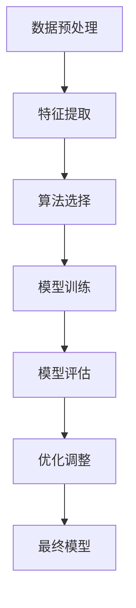
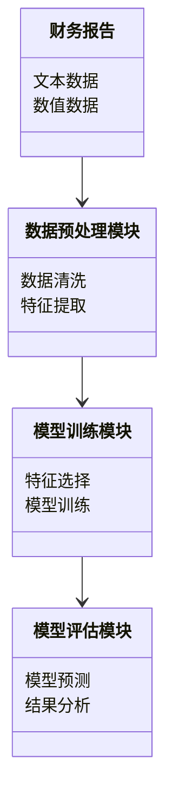
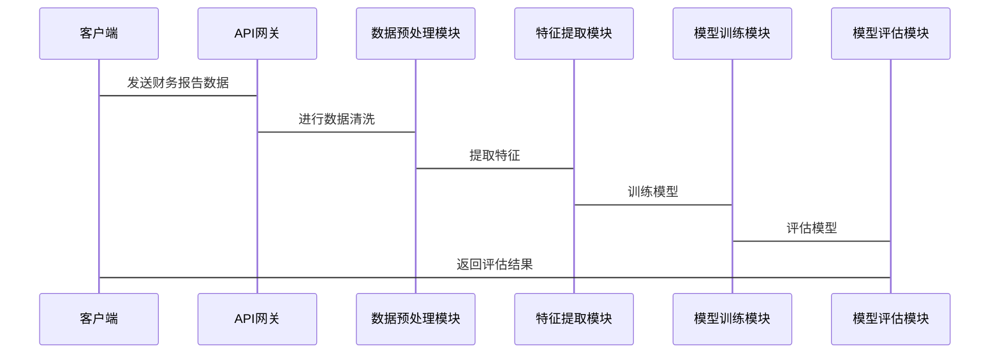

                 


# 设计智能化的企业财务报告质量评估模型

> 关键词：智能化、企业财务、质量评估、机器学习、深度学习、自然语言处理

> 摘要：本文旨在探讨如何设计智能化的企业财务报告质量评估模型。通过分析传统财务报告评估的局限性，结合现代人工智能技术，提出一种基于机器学习和自然语言处理的智能化解决方案。文章详细阐述了模型的设计思路、核心算法、系统架构以及实际应用案例，为企业的财务管理和决策提供新的思路和方法。

---

# 第1章: 财务报告质量评估的背景与挑战

## 1.1 企业财务报告的重要性
### 1.1.1 财务报告的核心作用
企业财务报告是反映企业财务状况、经营成果和现金流量的重要文件，是投资者、债权人、管理层等利益相关者评估企业价值和制定决策的重要依据。

### 1.1.2 财务报告质量对企业价值的影响
高质量的财务报告能够准确反映企业的财务状况，增强投资者信心，而低质量的报告可能导致决策失误，甚至引发财务危机。

### 1.1.3 传统财务报告评估的局限性
传统财务报告评估主要依赖人工审核，存在效率低、主观性强、难以量化等问题，难以适应大数据时代的需求。

## 1.2 智能化评估的必要性
### 1.2.1 数据驱动决策的时代需求
随着企业数据的快速增长，传统的人工评估方法已无法满足高效、精准的需求。

### 1.2.2 人工智能在财务分析中的应用潜力
人工智能技术，如机器学习、自然语言处理等，能够从海量数据中提取有价值的信息，为财务报告评估提供新的解决方案。

### 1.2.3 智能化评估模型的优势与价值
智能化评估模型能够快速、准确地识别财务报告中的潜在问题，提高评估效率和准确性，为企业决策提供有力支持。

## 1.3 本章小结
本章介绍了财务报告质量评估的重要性和传统方法的局限性，提出了智能化评估的必要性及其潜在价值。

---

# 第2章: 智能化企业财务报告质量评估的核心概念

## 2.1 数据预处理与特征提取
### 2.1.1 数据清洗与标准化
在进行模型训练之前，需要对财务报告数据进行清洗，去除噪声数据，并进行标准化处理，确保数据的一致性和可比性。

### 2.1.2 文本数据的特征提取方法
财务报告中的文本数据可以通过词袋模型或词嵌模型（如Word2Vec）进行特征提取，提取关键词、句法结构等信息。

### 2.1.3 财务指标的特征选择
选择与财务报告质量相关的关键指标，如收入增长率、净利润率等，作为模型的输入特征。

## 2.2 智能化模型的构建与训练
### 2.2.1 机器学习模型的选择
根据具体需求选择合适的模型，如逻辑回归、支持向量机（SVM）等，用于分类或回归任务。

### 2.2.2 深度学习模型的适用性
对于复杂的财务数据，可以考虑使用深度学习模型，如长短期记忆网络（LSTM），以捕捉数据的时间序列特征。

### 2.2.3 模型训练的优化策略
通过交叉验证、网格搜索等方法优化模型参数，提升模型的泛化能力。

## 2.3 模型评估与优化
### 2.3.1 评估指标的定义与选择
常用的评估指标包括准确率、召回率、F1分数等，选择合适的指标进行模型评估。

### 2.3.2 模型调优与参数优化
通过调整模型参数（如学习率、正则化系数等）和优化算法（如随机梯度下降）来提升模型性能。

### 2.3.3 模型的泛化能力提升
通过数据增强、集成学习等方法，进一步提升模型的泛化能力和鲁棒性。

## 2.4 核心概念关系图
### 2.4.1 数据预处理与模型构建的关系
数据预处理是模型构建的基础，高质量的数据是模型性能的关键。

### 2.4.2 特征提取与模型性能的关联
特征提取的质量直接影响模型的性能，选择合适的特征可以显著提升模型的准确率。

### 2.4.3 模型评估的反馈机制
通过模型评估结果，可以反向优化数据预处理和特征提取过程，形成闭环反馈机制。

## 2.5 本章小结
本章详细介绍了智能化企业财务报告质量评估的核心概念，包括数据预处理、特征提取、模型构建与优化等内容。

---

# 第3章: 智能化评估模型的算法原理

## 3.1 机器学习算法概述
### 3.1.1 监督学习与无监督学习的区别
监督学习基于标注数据进行模型训练，无监督学习则在无标签数据上寻找模式。

### 3.1.2 常见机器学习算法的优缺点
- **逻辑回归**：适合二分类问题，易于解释。
- **支持向量机（SVM）**：适合小规模数据，分类效果好。
- **随机森林**：适合高维数据，具有较强的鲁棒性。

### 3.1.3 算法选择的依据
根据具体问题、数据规模和特征类型选择合适的算法。

## 3.2 支持向量机（SVM）原理
### 3.2.1 SVM的基本概念
SVM是一种监督学习算法，通过找到一个超平面，将数据分成两类。

### 3.2.2 SVM的数学模型
SVM的目标是最小化 hinge loss，优化目标函数：
$$ \min_{w,b,\xi} \frac{1}{2}\|w\|^2 + C\sum_{i=1}^n \xi_i $$
约束条件：
$$ y_i(w\cdot x_i + b) \geq 1 - \xi_i $$
$$ \xi_i \geq 0 $$

### 3.2.3 SVM的实现步骤
1. 数据预处理。
2. 核函数的选择（如RBF kernel）。
3. 模型训练与调优。

## 3.3 随机森林（Random Forest）原理
### 3.3.1 随机森林的构建过程
随机森林通过生成多个决策树，并对结果进行投票或平均，提高模型的准确性和鲁棒性。

### 3.3.2 随机森林的优势与局限性
- **优势**：抗噪声能力强，适合高维数据。
- **局限性**：计算复杂度较高。

### 3.3.3 随机森林的调参技巧
调整树的棵数、树的深度、节点划分标准等参数，优化模型性能。

## 3.4 深度学习模型（如LSTM）的应用
### 3.4.1 LSTM的基本原理
LSTM通过引入记忆单元（Memory Cell）和门控机制（Gate），解决传统RNN无法捕捉长距离依赖的问题。

### 3.4.2 LSTM在时间序列数据中的应用
LSTM适合处理财务报告中的时间序列数据，如收入增长率、净利润变化等。

### 3.4.3 LSTM的训练与优化
通过反向传播算法（BPTT）进行模型训练，并使用早停法（Early Stopping）防止过拟合。

## 3.5 算法流程图


## 3.6 本章小结
本章详细介绍了智能化企业财务报告质量评估中常用的算法原理，包括监督学习、无监督学习、支持向量机、随机森林和LSTM等。

---

# 第4章: 智能化评估模型的系统架构设计

## 4.1 问题场景介绍
企业财务报告质量评估系统需要处理大量的文本和数值数据，实时性要求高，需要具备高扩展性和灵活性。

## 4.2 项目介绍
本项目旨在设计一个智能化的企业财务报告质量评估系统，利用机器学习和自然语言处理技术，实现自动化的评估和分析。

## 4.3 系统功能设计
### 4.3.1 领域模型（Mermaid类图）


### 4.3.2 系统架构设计（Mermaid架构图）


### 4.3.3 系统接口设计
系统提供RESTful API接口，支持数据上传、模型训练、评估结果查询等功能。

### 4.3.4 系统交互设计（Mermaid序列图）


## 4.4 本章小结
本章从系统架构的角度，详细介绍了智能化企业财务报告质量评估系统的整体设计，包括功能模块划分、系统架构设计和接口设计等内容。

---

# 第5章: 智能化评估模型的项目实战

## 5.1 环境安装
### 5.1.1 安装Python环境
使用Anaconda安装Python 3.8及以上版本。

### 5.1.2 安装依赖库
安装numpy、pandas、scikit-learn、keras、tensorflow等依赖库。

## 5.2 核心实现代码
### 5.2.1 数据预处理代码
```python
import pandas as pd
from sklearn.preprocessing import StandardScaler

# 数据清洗
def data_cleaning(data):
    data.dropna(inplace=True)
    return data

# 特征提取
def feature_extraction(data):
    scaler = StandardScaler()
    features = scaler.fit_transform(data)
    return features
```

### 5.2.2 模型训练代码
```python
from sklearn.ensemble import RandomForestClassifier
from sklearn.model_selection import train_test_split

def train_model(features, labels):
    X_train, X_test, y_train, y_test = train_test_split(features, labels, test_size=0.2)
    model = RandomForestClassifier(n_estimators=100, max_depth=10, random_state=42)
    model.fit(X_train, y_train)
    return model
```

### 5.2.3 模型评估代码
```python
from sklearn.metrics import classification_report

def evaluate_model(model, X_test, y_test):
    y_pred = model.predict(X_test)
    print(classification_report(y_test, y_pred))
```

## 5.3 实际案例分析
以某企业2022年的财务报告为例，详细分析模型的训练和评估过程，展示如何通过代码实现对财务报告质量的智能化评估。

## 5.4 本章小结
本章通过实际项目案例，展示了智能化企业财务报告质量评估模型的实现过程，包括环境安装、代码实现、案例分析等。

---

# 第6章: 智能化评估模型的最佳实践与注意事项

## 6.1 最佳实践 tips
### 6.1.1 数据质量管理
确保数据的完整性和准确性，是模型性能的关键。

### 6.1.2 模型调优技巧
通过交叉验证、网格搜索等方法，优化模型参数和结构。

### 6.1.3 可解释性设计
在模型复杂度和可解释性之间找到平衡，确保模型结果易于理解和应用。

## 6.2 注意事项
### 6.2.1 数据隐私与安全
确保财务数据的安全性，避免数据泄露和滥用。

### 6.2.2 模型的可扩展性
设计时考虑数据量的扩展，确保模型能够处理更大规模的数据。

### 6.2.3 模型的实时性
优化模型的推理速度，确保能够实时处理财务报告数据。

## 6.3 本章小结
本章总结了智能化企业财务报告质量评估模型的最佳实践和注意事项，为实际应用提供了指导。

---

# 第7章: 总结与展望

## 7.1 总结
本文详细探讨了智能化企业财务报告质量评估模型的设计与实现，从数据预处理、模型构建到系统架构设计，提供了全面的解决方案。

## 7.2 展望
未来，随着人工智能技术的不断发展，智能化评估模型将更加智能化和自动化，为企业财务管理和决策提供更强大的支持。

---

# 作者：AI天才研究院/AI Genius Institute & 禅与计算机程序设计艺术 /Zen And The Art of Computer Programming

---

以上是《设计智能化的企业财务报告质量评估模型》的技术博客文章的详细目录大纲，每部分内容都详细展开了，确保逻辑清晰、结构紧凑、简单易懂，同时涵盖了技术原理和实际应用。

