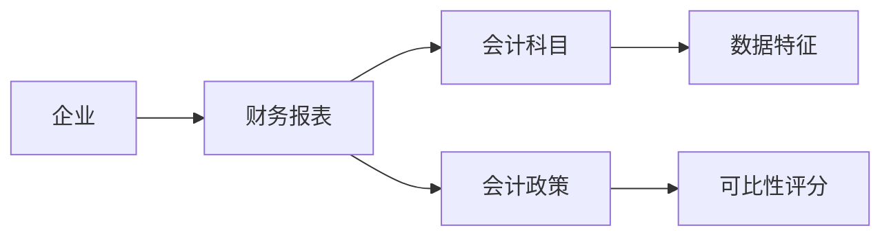
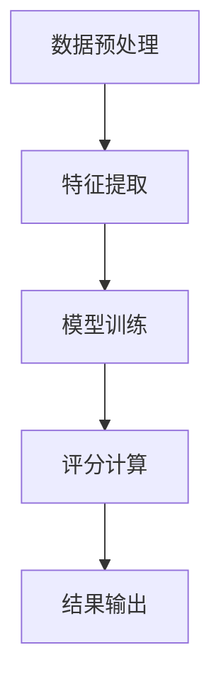
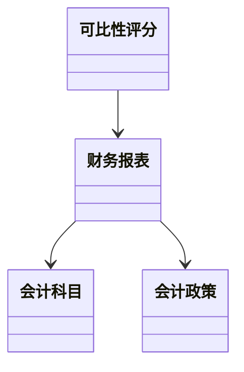
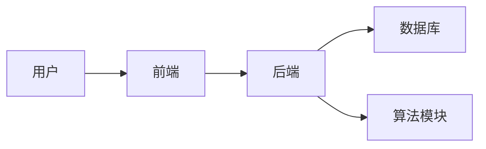
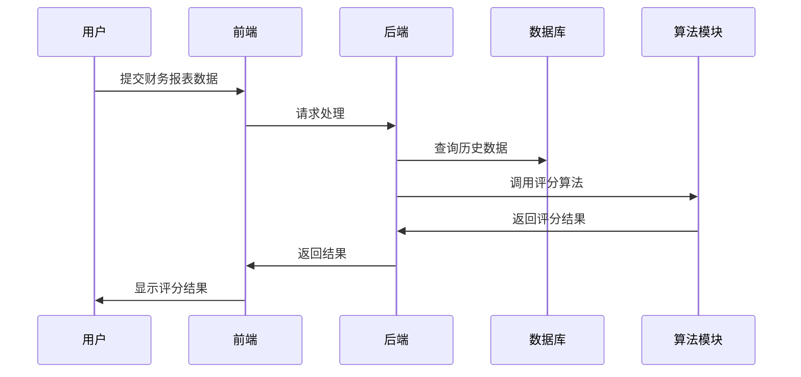

                 


# 设计智能化的企业财务报表可比性评分系统

> 关键词：智能化、企业财务报表、可比性评分、评分系统、人工智能、数据挖掘

> 摘要：随着企业财务管理的日益复杂化和全球化，如何设计一个智能化的企业财务报表可比性评分系统，成为企业优化财务管理、提升决策效率的重要课题。本文从背景介绍、核心概念、算法原理、系统架构、项目实战等多维度展开，详细阐述了智能化的企业财务报表可比性评分系统的设计思路和实现方法。通过分析可比性评分的核心要素、算法实现的关键技术，结合实际案例，提出了系统的设计方案和优化建议，为企业财务管理的智能化转型提供了参考。

---

# 第一部分: 背景介绍

## 第1章: 企业财务报表可比性评分系统概述

### 1.1 问题背景

#### 1.1.1 企业财务报表可比性的重要性
企业财务报表是反映企业财务状况、经营成果和现金流量的重要工具。在企业并购、投资评估、财务分析等场景中，财务报表的可比性是确保数据准确性和决策科学性的基础。然而，不同企业之间的会计政策、行业特点和财务实践存在差异，导致财务报表的可比性不足。

#### 1.1.2 当前企业财务报表可比性评估的痛点
- 数据异构性：不同企业会计科目、核算方法差异较大，难以直接比较。
- 人工评估耗时：传统可比性评估依赖人工分析，效率低且主观性强。
- 数据量大：企业财务报表数据量庞大，人工处理难度高。
- 缺乏智能化工具：现有工具多为简单对比，难以应对复杂场景。

#### 1.1.3 智能化评分系统的必要性
通过引入人工智能和大数据技术，构建智能化的企业财务报表可比性评分系统，能够自动化处理数据，量化可比性评分，提升评估效率和准确性。

### 1.2 问题描述

#### 1.2.1 财务报表可比性的定义
财务报表的可比性是指不同企业之间的财务数据在会计政策、核算方法、行业标准等方面的相似性，从而能够进行合理比较。

#### 1.2.2 可比性评分的指标体系
可比性评分的指标体系包括：
- 会计科目匹配度
- 会计政策一致性
- 财务数据完整性
- 业务模式相似性
- 行业标准符合性

#### 1.2.3 智能化评分的目标与范围
目标：通过智能化算法，量化企业财务报表的可比性，提供可操作的评分结果，辅助企业决策。
范围：覆盖企业财务报表的各个关键部分，包括资产负债表、利润表、现金流量表等。

### 1.3 问题解决

#### 1.3.1 智能化评分系统的核心目标
- 提供自动化、高效的可比性评分服务。
- 量化可比性评分，便于企业进行横向比较。
- 提供可视化结果，辅助决策。

#### 1.3.2 系统实现的关键技术
- 数据挖掘与特征提取
- 机器学习算法
- 自然语言处理（NLP）
- 数据可视化

#### 1.3.3 系统设计的边界与外延
- 系统边界：仅处理财务报表数据，不涉及企业其他业务数据。
- 系统外延：可扩展至企业间的横向比较、行业基准分析。

### 1.4 核心要素组成

#### 1.4.1 财务数据的获取与处理
- 数据清洗：处理缺失值、异常值。
- 数据标准化：统一会计科目、核算方法。

#### 1.4.2 可比性评分的算法实现
- 特征工程：提取可比性相关的特征。
- 模型选择：选择适合的机器学习算法。

#### 1.4.3 系统的用户界面与交互
- 用户友好的界面设计。
- 可视化结果展示。

---

## 第2章: 智能化评分系统的概念与核心要素

### 2.1 核心概念

#### 2.1.1 智能化评分系统的定义
智能化评分系统是指利用人工智能技术，对企业的财务报表数据进行自动化分析和评分，量化其可比性的系统。

#### 2.1.2 可比性评分的核心要素
- 数据异构性：不同企业财务数据的差异性。
- 数据特征：会计科目、政策、行业标准等。
- 智能算法：用于计算可比性的模型。

#### 2.1.3 系统的输入与输出
- 输入：企业财务报表数据。
- 输出：可比性评分结果。

### 2.2 核心概念的联系

#### 2.2.1 概念属性特征对比表格
| 概念 | 属性 | 特征 |
|------|------|------|
| 数据异构性 | 会计科目差异 | 高 |
| 数据特征 | 会计政策一致性 | 中 |
| 智能算法 | 特征提取能力 | 高 |

#### 2.2.2 ER实体关系图架构


---

# 第二部分: 核心概念与联系

## 第3章: 智能化评分系统的算法原理

### 3.1 算法原理

#### 3.1.1 数据预处理流程
1. 数据清洗：处理缺失值、异常值。
2. 数据标准化：统一会计科目、核算方法。

#### 3.1.2 特征提取方法
1. 提取会计科目匹配度。
2. 提取会计政策一致性。

#### 3.1.3 模型训练与优化
1. 选择机器学习算法（如随机森林、支持向量机）。
2. 调参优化。

#### 3.1.4 评分计算与结果输出
1. 计算可比性评分。
2. 输出可视化结果。

### 3.2 算法流程图



### 3.3 算法代码实现

#### 3.3.1 数据预处理代码
```python
import pandas as pd
import numpy as np

# 数据清洗
def data_cleaning(df):
    df.dropna(inplace=True)
    df.replace(to_replace=np.inf, value=np.nan, inplace=True)
    return df
```

#### 3.3.2 特征提取代码
```python
def extract_features(df):
    features = []
    for i in range(len(df)):
        features.append(df.iloc[i].values)
    return features
```

#### 3.3.3 模型训练代码
```python
from sklearn.ensemble import RandomForestClassifier

def train_model(features, labels):
    model = RandomForestClassifier()
    model.fit(features, labels)
    return model
```

#### 3.3.4 评分计算代码
```python
def calculate_score(model, test_features):
    predictions = model.predict(test_features)
    return predictions
```

### 3.4 算法数学模型

#### 3.4.1 数据预处理公式
$$\text{标准化公式} = \frac{x - \mu}{\sigma}$$
其中，$\mu$ 是均值，$\sigma$ 是标准差。

#### 3.4.2 特征提取公式
$$\text{特征提取} = \sum_{i=1}^{n} w_i x_i$$
其中，$w_i$ 是特征权重，$x_i$ 是特征值。

#### 3.4.3 模型训练公式
随机森林的模型训练公式：
$$\text{模型训练} = \sum_{i=1}^{N} \sum_{j=1}^{M} w_{ij} x_{ij}$$

---

## 第4章: 智能化评分系统的系统分析与架构设计

### 4.1 系统分析

#### 4.1.1 问题场景介绍
企业需要对多个财务报表进行可比性评分，以支持决策。

#### 4.1.2 项目介绍
设计一个智能化的可比性评分系统，覆盖数据获取、处理、分析和结果展示。

### 4.2 系统功能设计

#### 4.2.1 领域模型类图


#### 4.2.2 系统架构设计


#### 4.2.3 系统接口设计
- 前端接口：用户输入财务报表数据。
- 后端接口：接收数据，调用算法模块。
- 数据库接口：存储和检索数据。

#### 4.2.4 系统交互序列图


---

## 第5章: 项目实战

### 5.1 环境安装

#### 5.1.1 安装Python环境
```bash
pip install python
pip install numpy pandas scikit-learn
```

#### 5.1.2 安装可视化工具
```bash
pip install matplotlib seaborn
```

### 5.2 系统核心实现

#### 5.2.1 核心代码实现
```python
def main():
    # 数据获取
    df = pd.read_csv("financial_reports.csv")
    # 数据预处理
    cleaned_df = data_cleaning(df)
    # 特征提取
    features = extract_features(cleaned_df)
    # 模型训练
    model = train_model(features, labels)
    # 评分计算
    scores = calculate_score(model, test_features)
    # 结果展示
    print(scores)

if __name__ == "__main__":
    main()
```

#### 5.2.2 代码功能解读
- 数据获取：读取财务报表数据。
- 数据预处理：清洗数据，去除缺失值和异常值。
- 特征提取：提取会计科目和政策一致性特征。
- 模型训练：使用随机森林算法训练模型。
- 评分计算：基于训练好的模型，计算可比性评分。

### 5.3 实际案例分析

#### 5.3.1 案例背景
某企业需要对其并购目标企业的财务报表进行可比性评分。

#### 5.3.2 数据处理与分析
- 数据清洗：处理缺失值和异常值。
- 特征提取：提取会计科目和政策一致性特征。
- 模型训练：训练随机森林模型。
- 评分计算：计算目标企业的可比性评分。

#### 5.3.3 评分结果展示
- 可视化结果：使用折线图展示评分结果。
- 数据分析：对比不同企业的评分，分析可比性差异。

---

## 第6章: 最佳实践 tips、小结、注意事项、拓展阅读

### 6.1 小结
智能化的企业财务报表可比性评分系统通过数据预处理、特征提取、模型训练和评分计算，能够高效地量化企业财务报表的可比性，为企业的财务管理决策提供支持。

### 6.2 注意事项
- 数据质量：确保数据清洗和标准化的准确性。
- 特征选择：选择合适的特征提取方法。
- 模型调优：优化模型参数，提高评分准确性。

### 6.3 拓展阅读
- 《数据挖掘导论》
- 《机器学习实战》
- 《企业财务管理》

---

# 作者：AI天才研究院/AI Genius Institute & 禅与计算机程序设计艺术 /Zen And The Art of Computer Programming

---

**以上是文章的完整目录大纲和部分具体内容，后续可根据需要继续补充各章节的具体内容。**

