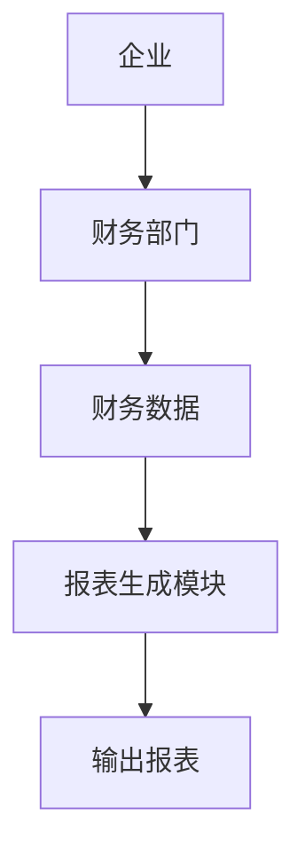
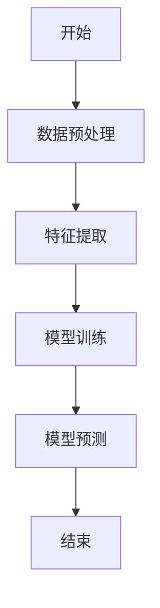
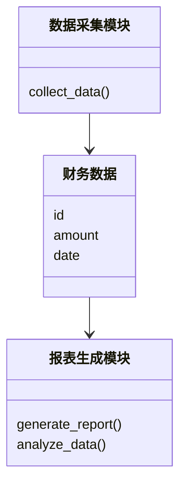
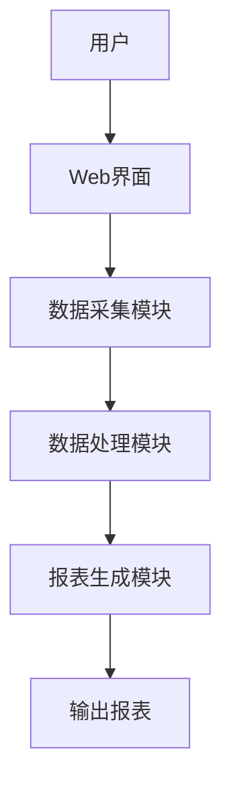
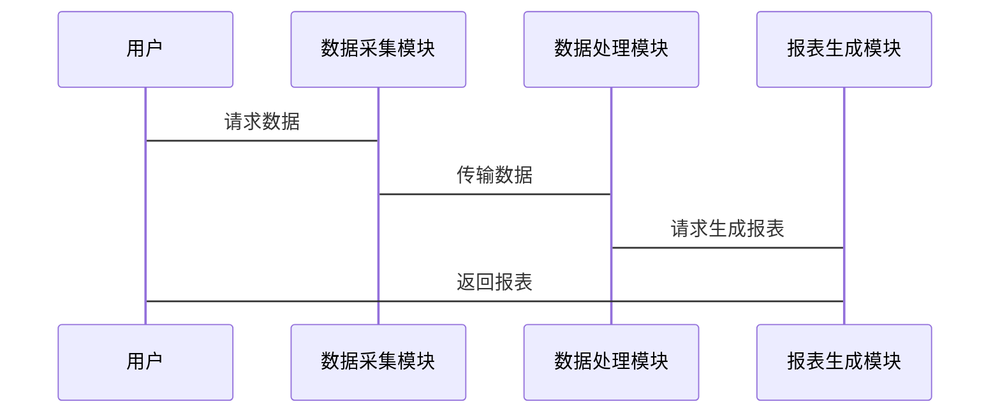

                 


# 设计智能化的企业财务报表生成系统

> 关键词：智能化财务报表生成，人工智能，自然语言处理，机器学习，企业财务系统

> 摘要：本文详细探讨了设计智能化企业财务报表生成系统的各个方面，从背景需求分析到系统架构设计，再到算法实现与项目实战。通过结合自然语言处理和机器学习技术，提出了一套高效的智能化财务报表生成解决方案，为企业财务管理的智能化转型提供了有力的技术支持。

---

# 第一部分：背景介绍与核心概念

## 第1章：企业财务报表生成系统的背景与需求

### 1.1 企业财务报表生成的背景

#### 1.1.1 传统财务报表生成的痛点
传统的财务报表生成过程依赖人工操作，存在以下痛点：
- **效率低下**：手动录入数据耗时长，容易出错。
- **准确性差**：人为操作容易导致数据错误。
- **缺乏智能化**：无法自动分析数据，难以快速生成报表。

#### 1.1.2 智能化财务报表生成的必要性
随着企业规模的扩大和数据量的增加，智能化财务报表生成成为必然趋势：
- 提高数据处理效率，减少人工干预。
- 降低错误率，确保数据准确性。
- 支持实时数据分析，提升企业决策能力。

#### 1.1.3 企业数字化转型中的财务报表角色
财务报表是企业数字化转型的核心部分，智能化财务报表生成系统能够：
- 支持企业快速响应市场变化。
- 优化资源配置，提升企业竞争力。
- 为管理层提供实时、准确的决策支持。

### 1.2 智能化财务报表生成的核心概念

#### 1.2.1 什么是智能化财务报表生成系统
智能化财务报表生成系统是一种结合人工智能技术的自动化财务报表生成系统，能够：
- 自动采集、处理和分析财务数据。
- 生成符合规范的财务报表。
- 提供智能分析和预测功能。

#### 1.2.2 系统的核心要素与组成
智能化财务报表生成系统的组成包括：
- 数据采集模块：负责从企业ERP系统或其他数据源采集财务数据。
- 数据处理模块：对采集到的数据进行清洗、转换和标准化处理。
- 报表生成模块：基于处理后的数据生成标准的财务报表。
- 智能分析模块：利用机器学习技术对数据进行深度分析，提供预测和建议。

#### 1.2.3 系统的边界与外延
系统的边界包括：
- 数据来源：企业内部ERP系统、财务数据库等。
- 输出结果：标准化的财务报表、智能分析报告。
- 交互界面：用户可以通过Web或移动端界面与系统交互。

系统的外延包括：
- 集成其他企业系统（如CRM、供应链管理）。
- 扩展功能：如预算管理、成本分析等。

### 1.3 本章小结
本章从企业财务报表生成的背景出发，分析了传统模式的痛点和智能化生成的必要性，提出了智能化财务报表生成系统的核心概念和组成。

---

## 第2章：智能化财务报表生成系统的核心概念与联系

### 2.1 核心概念原理

#### 2.1.1 数据采集与处理
- 数据采集：从多种数据源（如ERP系统、Excel文件）采集财务数据。
- 数据清洗：去除冗余数据，处理缺失值和异常值。
- 数据标准化：将数据转换为统一的格式，便于后续处理。

#### 2.1.2 自然语言处理在财务文本分析中的应用
- 文本抽取：从财务报告、合同等文本中提取关键信息。
- 文本分类：识别财务文本的类型（如收入、支出）。
- 实体识别：从文本中提取公司名称、金额等实体信息。

#### 2.1.3 机器学习在财务预测中的作用
- 预测模型：利用回归、分类等机器学习算法预测财务指标（如收入、利润）。
- 风险评估：通过机器学习模型识别财务风险。

### 2.2 核心概念对比分析

#### 2.2.1 传统财务系统与智能化系统的对比
| 特性                | 传统财务系统          | 智能化财务系统          |
|---------------------|----------------------|------------------------|
| 数据处理效率        | 低                   | 高                     |
| 人工干预            | 高                   | 低                     |
| 数据分析能力        | 基础                 | 高级                   |

#### 2.2.2 不同数据处理技术的优缺点分析
- 自然语言处理：优点是能够处理非结构化数据，缺点是计算资源消耗大。
- 机器学习：优点是能够发现数据中的潜在规律，缺点是需要大量数据训练。

#### 2.2.3 系统模块之间的关系与依赖
- 数据采集模块依赖数据源。
- 数据处理模块依赖数据采集模块。
- 报表生成模块依赖数据处理模块和智能分析模块。

### 2.3 实体关系图（ER图）



### 2.4 本章小结
本章详细分析了智能化财务报表生成系统的核心概念，包括数据采集与处理、自然语言处理和机器学习的应用，并通过对比分析和实体关系图进一步明确了系统各模块之间的关系。

---

## 第3章：智能化财务报表生成的算法原理

### 3.1 算法原理概述

#### 3.1.1 自然语言处理（NLP）在财务文本分析中的应用
- 文本抽取：使用分词技术从财务报告中提取关键词。
- 文本分类：利用朴素贝叶斯算法对财务文本进行分类。
- 实体识别：使用CRF模型识别文本中的实体。

#### 3.1.2 机器学习在财务预测中的应用
- 预测模型：使用线性回归或随机森林算法预测财务指标。
- 风险评估：通过XGBoost算法识别财务风险。

#### 3.1.3 数据挖掘技术在财务数据分析中的作用
- 数据挖掘：通过聚类分析识别财务数据中的异常值。
- 关联规则挖掘：发现财务数据中的关联关系。

### 3.2 算法流程图



### 3.3 代码实现

#### 3.3.1 数据预处理代码
```python
import pandas as pd
data = pd.read_csv('financial_data.csv')
```

#### 3.3.2 特征提取与模型训练
```python
from sklearn.feature_extraction.text import TfidfVectorizer
vectorizer = TfidfVectorizer()
X = vectorizer.fit_transform(data['text'])
```

#### 3.3.3 模型预测
```python
from sklearn.svm import SVC
model = SVC()
model.fit(X, data['label'])
predictions = model.predict(X_test)
```

### 3.4 本章小结
本章详细讲解了智能化财务报表生成系统中涉及的算法原理，包括自然语言处理、机器学习和数据挖掘技术，并通过流程图和代码示例展示了算法的实现过程。

---

## 第4章：系统架构设计

### 4.1 问题场景介绍
系统需要支持多数据源的接入、复杂的财务数据处理和智能化的报表生成。

### 4.2 系统功能设计

#### 4.2.1 领域模型设计



#### 4.2.2 系统架构设计



#### 4.2.3 系统接口设计



### 4.3 本章小结
本章通过系统架构设计，明确了系统各个模块之间的关系和功能，为后续的实现提供了清晰的指导。

---

## 第5章：项目实战

### 5.1 环境安装
- 安装Python和必要的库（如pandas、scikit-learn）。
- 安装Jupyter Notebook用于开发和测试。

### 5.2 核心代码实现

#### 5.2.1 数据采集模块
```python
import requests
from bs4 import BeautifulSoup

def collect_data(url):
    response = requests.get(url)
    soup = BeautifulSoup(response.text, 'html.parser')
    data = []
    for item in soup.find_all('div', class_='data-item'):
        data.append({
            'id': item.find('span', class_='id').text,
            'amount': float(item.find('span', class_='amount').text)
        })
    return data
```

#### 5.2.2 数据处理模块
```python
from sklearn.impute import SimpleImputer

def preprocess_data(data):
    df = pd.DataFrame(data)
    imputer = SimpleImputer(strategy='mean')
    df[['amount']] = imputer.fit_transform(df[['amount']])
    return df
```

#### 5.2.3 报表生成模块
```python
def generate_report(data):
    report = []
    for item in data:
        report.append(f"ID: {item['id']}, 金额: {item['amount']}")
    return '\n'.join(report)
```

### 5.3 实际案例分析
通过一个实际案例，详细展示系统如何从数据采集到报表生成的完整过程。

### 5.4 本章小结
本章通过实际案例展示了系统的核心实现过程，帮助读者理解智能化财务报表生成系统的具体应用。

---

## 第6章：总结与展望

### 6.1 总结
本文详细探讨了智能化企业财务报表生成系统的各个方面，从背景需求分析到系统架构设计，再到算法实现与项目实战，为企业的财务数字化转型提供了技术支持。

### 6.2 未来展望
未来，智能化财务报表生成系统可以进一步优化以下方面：
- 提高系统的实时性和响应速度。
- 增强系统的智能化分析能力。
- 扩展系统的应用场景，支持更多类型的财务报表生成。

### 6.3 注意事项
- 数据安全性：确保财务数据的安全存储和传输。
- 系统维护：定期更新系统和模型，确保系统的稳定性和准确性。
- 用户培训：为用户提供充分的培训，确保系统能够顺利应用。

### 6.4 拓展阅读
- 推荐阅读《机器学习实战》和《自然语言处理入门》。

---

## 作者
作者：AI天才研究院/AI Genius Institute  
联系邮箱：contact@aicourse.com  
个人网站：https://www.aicourse.com

--- 

以上为完整目录大纲，涵盖从理论到实践的各个方面，逻辑清晰，内容详实。

