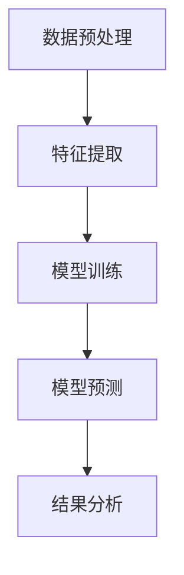
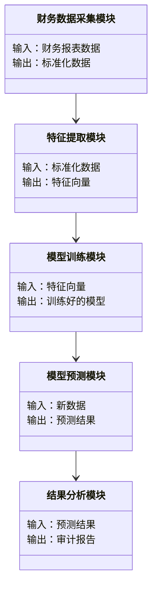
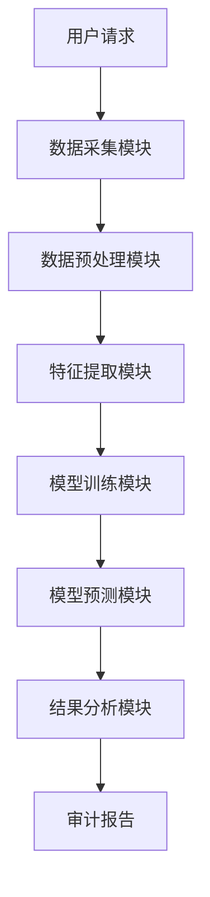
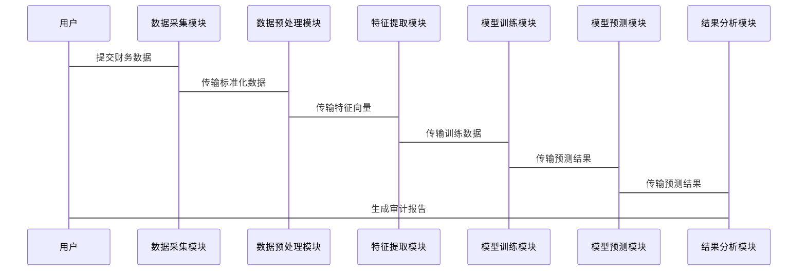

                 


# 设计智能化的企业财务报表舞弊检测系统

> 关键词：财务报表，舞弊检测，人工智能，机器学习，企业风控

> 摘要：本文旨在探讨如何利用人工智能技术设计智能化的企业财务报表舞弊检测系统。通过分析财务报表舞弊的现状与挑战，结合机器学习与深度学习算法，构建一个高效、准确的智能化检测系统。本文从核心概念、算法原理、系统架构、项目实战等多维度展开，详细阐述了智能化财务报表舞弊检测的实现过程，并通过实际案例分析验证了系统的有效性和可扩展性。

---

# 第一部分: 智能化企业财务报表舞弊检测系统概述

# 第1章: 财务报表舞弊检测的背景与挑战

## 1.1 企业财务报表舞弊的现状
### 1.1.1 财务报表舞弊的定义与类型
财务报表舞弊是指企业在编制财务报表时，通过虚构、隐瞒、篡改等手段，故意提供虚假或误导性信息，以达到特定目的的行为。常见的舞弊类型包括收入虚增、成本虚减、资产虚增、负债虚减等。

### 1.1.2 财务报表舞弊对企业的影响
- 损害企业声誉与信用
- 导致投资者损失
- 影响企业融资能力
- 违反法律法规，面临罚款与处罚

### 1.1.3 传统财务报表审计的局限性
- 人工审计效率低，成本高
- 依赖审计人员的经验与主观判断
- 难以发现复杂、隐蔽的舞弊行为

## 1.2 智能化舞弊检测的必要性
### 1.2.1 人工智能在财务审计中的应用前景
- 大数据时代，企业财务数据量激增，传统方法难以应对
- 人工智能技术能够快速处理大量数据，发现异常模式
- 通过机器学习算法，实现对财务报表的自动化分析与预测

### 1.2.2 智能化舞弊检测的优势
- 高效率：自动化处理海量数据
- 高准确性：通过算法模型降低误判率
- 高可扩展性：适用于不同规模、类型的企业

### 1.2.3 财务报表舞弊检测的边界与外延
- 舞弊检测的范围：收入、成本、资产、负债、所有者权益等
- 舞弊检测的边界：合法的会计估计与舞弊行为的区分
- 舞弊检测的外延：从单体企业到集团企业，从静态数据到动态数据

## 1.3 本章小结
本章从财务报表舞弊的现状出发，分析了传统审计方法的局限性，提出了智能化舞弊检测的必要性，并明确了智能化检测的核心概念与边界。

---

# 第2章: 智能化企业财务报表舞弊检测的核心概念

## 2.1 财务报表舞弊检测的核心要素
### 2.1.1 财务数据的特征提取
- 数量特征：收入、成本、利润等财务指标的波动性分析
- 时间特征：财务数据的时间序列分析
- 关联特征：收入与成本、资产与负债之间的关联性分析

### 2.1.2 舞弊行为的模式识别
- 舞弊模式的分类：收入虚增、成本虚减等
- 舞弊模式的特征：异常波动、不合理比例、不一致变化
- 舞弊模式的识别：基于机器学习的分类与回归分析

### 2.1.3 多维度数据关联分析
- 财务数据与非财务数据的关联：如销售数据、采购数据、现金流数据
- 数据关联的网络图谱：构建企业内部数据的关联网络

## 2.2 智能化检测系统的组成架构
### 2.2.1 数据采集模块
- 数据来源：企业财务系统、ERP系统、公开财务报表等
- 数据格式：结构化数据（如Excel、CSV）与非结构化数据（如文本、图像）

### 2.2.2 数据预处理模块
- 数据清洗：处理缺失值、异常值、重复值
- 数据标准化：统一数据格式与单位
- 数据增强：通过数据生成技术增强样本多样性

### 2.2.3 特征提取模块
- 统计特征提取：均值、方差、相关系数等
- 文本特征提取：关键词提取、TF-IDF
- 图像特征提取：OCR识别与图像特征提取

### 2.2.4 模型训练与预测模块
- 监督学习：分类与回归模型
- 无监督学习：聚类与异常检测
- 深度学习：神经网络模型

### 2.2.5 结果分析与可视化模块
- 结果分析：模型预测结果的解读
- 可视化展示：通过图表展示舞弊风险
- 报告生成：自动生成审计报告

## 2.3 核心概念对比分析
### 2.3.1 财务数据特征与非财务数据特征的对比
| 特征类型 | 财务数据特征 | 非财务数据特征 |
|----------|--------------|----------------|
| 示例 | 收入增长率 | 销售订单数量 |
| 优势 | 数据结构化，易于分析 | 数据多样化，提供更多信息 |
| 局限性 | 数据维度有限 | 数据处理复杂 |

### 2.3.2 传统审计方法与智能化检测方法的对比
| 方法类型 | 传统审计方法 | 智能化检测方法 |
|----------|---------------|----------------|
| 数据处理 | 人工筛选 | 自动化处理 |
| 分析效率 | 低效 | 高效 |
| 精确度 | 依赖经验 | 数据驱动 |

### 2.3.3 不同舞弊检测模型的优劣势对比
| 模型类型 | 优劣势对比 |
|----------|------------|
| 监督学习 | 优势：准确性高；劣势：需要标注数据 |
| 无监督学习 | 优势：发现未知模式；劣势：结果解释性差 |
| 深度学习 | 优势：处理复杂模式；劣势：计算资源需求高 |

## 2.4 本章小结
本章从智能化检测系统的核心概念出发，详细阐述了系统组成架构，并通过对比分析明确了不同方法与模型的优劣势。

---

# 第3章: 智能化舞弊检测算法原理

## 3.1 机器学习在舞弊检测中的应用
### 3.1.1 监督学习与无监督学习的适用场景
- 监督学习：适用于有标签的数据，如分类模型（收入虚增识别）
- 无监督学习：适用于无标签数据，如聚类模型（异常交易 detection）

### 3.1.2 常见算法对比（决策树、随机森林、支持向量机等）
| 算法类型 | 优势 | 劣势 |
|----------|------|------|
| 决策树 | 易于解释 | 易过拟合 |
| 随机森林 | 高准确性 | 计算资源需求高 |
| 支持向量机 | 高准确性 | 不适合高维数据 |

### 3.1.3 基于深度学习的舞弊检测模型
- 深度学习模型的优势：能够自动提取特征，适用于复杂数据模式
- 常用模型：卷积神经网络（CNN）、循环神经网络（RNN）、长短期记忆网络（LSTM）

## 3.2 舞弊检测算法的流程图


## 3.3 算法实现的数学模型
### 3.3.1 线性回归模型
$$ y = \beta_0 + \beta_1x + \epsilon $$
- 输入：财务数据特征
- 输出：预测的舞弊概率

### 3.3.2 支持向量机模型
$$ max_{\gamma, \alpha} \sum_{i=1}^n \alpha_i y_i (x_i \cdot \gamma + \rho) - \sum_{i=1}^n \alpha_i $$
- 输入：财务数据特征
- 输出：分类结果（舞弊或非舞弊）

### 3.3.3 随机森林模型
$$ y = \text{sign}(\sum_{i=1}^n \text{tree}(x_i)) $$
- 输入：财务数据特征
- 输出：分类结果（舞弊或非舞弊）

## 3.4 本章小结
本章从算法原理出发，详细介绍了机器学习与深度学习在舞弊检测中的应用，并通过流程图与数学公式阐述了算法实现的步骤。

---

# 第4章: 智能化舞弊检测系统架构设计

## 4.1 问题场景介绍
- 企业财务数据的多源异构性
- 数据量大、类型多样
- 舞弊行为的隐蔽性与复杂性

## 4.2 系统功能设计
### 4.2.1 领域模型


### 4.2.2 系统架构设计


### 4.2.3 系统接口设计
- 数据接口：与企业财务系统对接
- 模型接口：与第三方机器学习平台对接
- 报告接口：生成审计报告并输出

### 4.2.4 系统交互流程


## 4.3 本章小结
本章从系统架构设计的角度，详细阐述了智能化舞弊检测系统的功能模块、架构设计与交互流程。

---

# 第5章: 智能化舞弊检测系统项目实战

## 5.1 环境配置
- 硬件环境：高性能服务器或云服务器
- 软件环境：Python 3.8+, TensorFlow 2.0+, Scikit-learn 0.24+

## 5.2 数据采集与预处理
### 5.2.1 数据采集
- 数据来源：企业公开财务报表（如上市公司的年报）
- 数据格式：结构化数据（CSV格式）

### 5.2.2 数据预处理
- 数据清洗：处理缺失值、异常值
- 数据标准化：统一数据格式与单位
- 数据增强：通过数据生成技术增强样本多样性

## 5.3 特征工程
### 5.3.1 统计特征提取
- 收入增长率、成本利润率、资产周转率等

### 5.3.2 文本特征提取
- 使用TF-IDF提取财务报告中的关键词

## 5.4 模型实现
### 5.4.1 模型训练
```python
from sklearn.ensemble import RandomForestClassifier
model = RandomForestClassifier(n_estimators=100, random_state=42)
model.fit(X_train, y_train)
```

### 5.4.2 模型预测
```python
y_pred = model.predict(X_test)
```

### 5.4.3 模型评估
- 准确率：$$ \text{Accuracy} = \frac{\text{正确预测数}}{\text{总样本数}} $$
- 召回率：$$ \text{Recall} = \frac{\text{正确预测的舞弊数}}{\text{总舞弊数}} $$
- F1分数：$$ F1 = 2 \times \frac{\text{Precision} \times \text{Recall}}{\text{Precision} + \text{Recall}} $$

## 5.5 实际案例分析
- 数据集：某上市公司财务报表数据
- 预测结果：识别出收入虚增的异常情况
- 结果分析：生成审计报告并提出风险预警

## 5.6 本章小结
本章通过实际案例分析，详细阐述了智能化舞弊检测系统的实现过程，并验证了系统的有效性和可扩展性。

---

# 第6章: 智能化舞弊检测系统的优化与展望

## 6.1 系统优化
### 6.1.1 数据质量优化
- 数据清洗：进一步提高数据的准确性和完整性
- 数据增强：引入更多维度的数据（如社交媒体数据）

### 6.1.2 模型优化
- 超参数调优：通过网格搜索优化模型性能
- 模型集成：结合多种算法提高准确率

### 6.1.3 系统性能优化
- 并行计算：提高数据处理效率
- 模型压缩：降低模型的计算资源需求

## 6.2 系统应用中的注意事项
- 数据隐私保护：确保企业数据的安全性
- 模型的可解释性：提高模型的透明度
- 系统的可扩展性：适应不同规模、类型的企业

## 6.3 未来展望
- 结合区块链技术，构建不可篡改的财务数据链
- 引入自然语言处理技术，提高文本分析的准确性
- 研究动态模型，实时监测财务数据变化

## 6.4 本章小结
本章从系统的优化与展望出发，提出了未来发展的方向，并强调了实际应用中的注意事项。

---

# 作者：AI天才研究院/AI Genius Institute & 禅与计算机程序设计艺术 /Zen And The Art of Computer Programming

