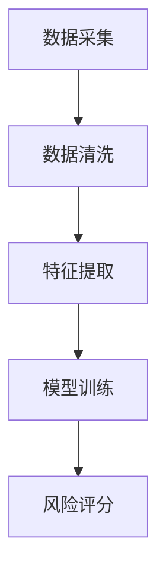
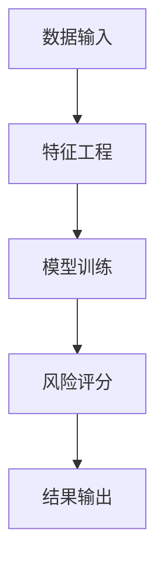
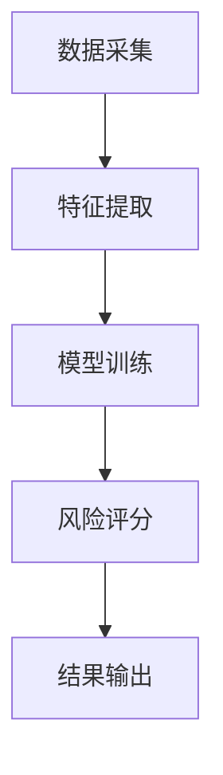
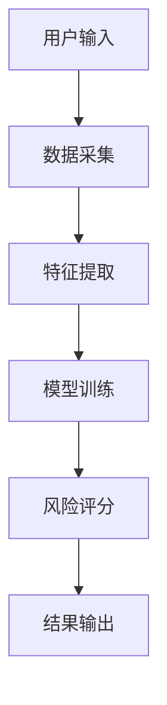

                 


# 设计智能化的企业财务报表舞弊风险评分系统

## 关键词：企业财务报表、舞弊风险、评分系统、人工智能、机器学习、自然语言处理

## 摘要：  
本文详细探讨了如何设计智能化的企业财务报表舞弊风险评分系统。通过结合人工智能和大数据分析技术，提出了一种基于机器学习的舞弊风险评分模型，能够有效识别和预测企业财务报表中的潜在舞弊行为。文章从背景介绍、核心概念、算法原理、数学模型、系统架构、项目实战到最佳实践等方面进行了全面分析，并通过具体案例展示了系统的实际应用效果。

---

# 第1章: 企业财务报表舞弊风险的背景与挑战

## 1.1 财务报表舞弊的现状与问题  
### 1.1.1 财务报表舞弊的定义与特征  
财务报表舞弊是指企业在编制财务报表时，通过虚构、隐瞒、伪造等手段，故意提供虚假或误导性的财务信息，以掩盖真实的财务状况和经营成果。其主要特征包括数据不一致、异常波动、逻辑不合理等。  

### 1.1.2 财务报表舞弊对企业的影响  
舞弊行为不仅会导致企业经济损失，还可能引发信任危机，甚至面临法律风险。例如，企业可能因财务造假而被罚款、退市，或者面临投资者的诉讼。  

### 1.1.3 传统财务报表审计的局限性  
传统审计方法依赖人工审查和经验判断，效率低、成本高，且难以覆盖大规模数据。此外，审计人员的主观性和有限的样本容量可能导致漏检或误判。  

## 1.2 舞弊风险评分系统的重要性  
### 1.2.1 舞弊风险评分系统的定义  
舞弊风险评分系统是一种基于人工智能技术，通过分析企业的财务数据、经营行为和市场环境，量化评估企业财务报表舞弊风险的系统。  

### 1.2.2 舞弊风险评分系统的优势  
- **高效性**：自动化处理海量数据，大幅提高审计效率。  
- **准确性**：通过机器学习模型，减少人为判断的误差。  
- **实时性**：能够实时监控企业财务数据，及时发现异常情况。  

### 1.2.3 舞弊风险评分系统在企业中的应用前景  
随着人工智能技术的快速发展，舞弊风险评分系统在企业风险管理、审计优化和合规监管等领域具有广阔的应用前景。  

## 1.3 本章小结  
本章介绍了财务报表舞弊的现状与问题，分析了传统审计方法的局限性，并强调了舞弊风险评分系统的重要性及其应用价值。

---

# 第2章: 财务报表舞弊风险评分系统的核心概念  

## 2.1 舞弊风险评分系统的工作原理  
### 2.1.1 数据采集与处理  
系统通过API接口或文件导入的方式，获取企业的财务报表数据、经营数据和市场数据，并进行清洗和预处理。  

### 2.1.2 特征提取与分析  
从财务数据中提取关键特征，例如收入与成本的匹配性、资产与负债的比例等，并通过可视化工具进行分析。  

### 2.1.3 风险评分与预测  
基于机器学习模型，对企业的财务数据进行风险评分，并预测舞弊的可能性。  

## 2.2 舞弊风险评分系统的核心要素  
### 2.2.1 数据来源与类型  
- **财务数据**：收入、利润、资产、负债等。  
- **经营数据**：销售、采购、库存等。  
- **市场数据**：行业趋势、市场环境等。  

### 2.2.2 特征工程与模型选择  
- **特征工程**：通过降维、标准化等方法优化特征。  
- **模型选择**：常用的模型包括逻辑回归、随机森林和神经网络等。  

### 2.2.3 评分标准与阈值设置  
根据企业的行业特点和风险偏好，设置合理的评分标准和阈值。  

## 2.3 舞弊风险评分系统与传统审计方法的对比  
### 2.3.1 传统审计方法的局限性  
- 依赖人工判断，效率低。  
- 样本容量有限，难以覆盖全部数据。  

### 2.3.2 舞弊风险评分系统的创新性  
- 自动化处理数据，提高效率。  
- 利用机器学习模型，提高准确性。  

### 2.3.3 两者结合的可行性  
将舞弊风险评分系统与传统审计方法结合，可以实现优势互补，进一步提升审计效果。  

## 2.4 本章小结  
本章详细介绍了舞弊风险评分系统的核心概念和工作原理，并分析了其与传统审计方法的对比。

---

# 第3章: 舞弊风险评分系统的算法原理  

## 3.1 舞弊风险评分系统的核心算法  
### 3.1.1 机器学习算法在舞弊检测中的应用  
常用的算法包括逻辑回归、随机森林和梯度提升树（如XGBoost、LightGBM）。  

### 3.1.2 自然语言处理技术在财务报表分析中的应用  
通过NLP技术，可以分析财务报表中的文本信息，提取关键词和语义特征。  

## 3.2 舞弊风险评分系统的流程图  
### 3.2.1 数据流图  


### 3.2.2 算法流程图  


## 3.3 算法实现的数学模型  
### 3.3.1 财务指标的加权模型  
$$ \text{风险评分} = \sum_{i=1}^{n} w_i \cdot x_i $$  
其中，$w_i$ 是第 $i$ 个特征的权重，$x_i$ 是第 $i$ 个特征的值。  

### 3.3.2 风险评分的数学公式  
$$ \text{风险评分} = \frac{\sum_{i=1}^{n} w_i \cdot x_i}{\sum_{i=1}^{n} w_i} $$  

## 3.4 本章小结  
本章详细介绍了舞弊风险评分系统的算法原理，并通过流程图和数学公式展示了系统的实现过程。

---

# 第4章: 舞弊风险评分系统的数学模型与公式  

## 4.1 财务指标的加权模型  
### 4.1.1 指标权重的确定方法  
通过主成分分析（PCA）或人工经验确定各个财务指标的权重。  

### 4.1.2 加权计算公式  
$$ \text{加权评分} = \sum_{i=1}^{n} w_i \cdot x_i $$  

## 4.2 风险评分的数学公式  
### 4.2.1 风险评分模型  
$$ \text{风险评分} = \frac{\sum_{i=1}^{n} w_i \cdot x_i}{\sum_{i=1}^{n} w_i} $$  

### 4.2.2 风险评分的阈值设定  
根据企业的风险承受能力和历史数据，设置合理的阈值。例如，评分大于0.8表示高风险，评分小于0.2表示低风险。  

## 4.3 案例分析与公式应用  
### 4.3.1 案例背景  
假设某企业的收入与成本匹配性较差，资产与负债比例异常。  

### 4.3.2 公式应用与结果分析  
根据加权评分公式，计算出该企业的风险评分为0.7，超过阈值，系统提示高风险。  

## 4.4 本章小结  
本章通过数学公式和案例分析，详细讲解了舞弊风险评分系统的评分模型和应用方法。

---

# 第5章: 舞弊风险评分系统的系统架构设计  

## 5.1 系统功能模块划分  
### 5.1.1 数据采集模块  
负责从企业财务系统中获取数据。  

### 5.1.2 特征提取模块  
对财务数据进行特征提取和处理。  

### 5.1.3 模型训练模块  
基于机器学习算法，训练舞弊风险评分模型。  

### 5.1.4 风险评分模块  
根据训练好的模型，对企业的财务报表进行风险评分。  

## 5.2 系统架构设计图  


### 5.2.2 模块交互图  


## 5.3 系统接口设计  
### 5.3.1 数据接口  
- 输入接口：接收企业的财务数据。  
- 输出接口：输出风险评分结果。  

### 5.3.2 用户接口  
- 输入：企业财务数据。  
- 输出：风险评分报告。  

## 5.4 本章小结  
本章详细介绍了舞弊风险评分系统的系统架构设计，并通过图表展示了模块划分和交互流程。

---

# 第6章: 舞弊风险评分系统的项目实战  

## 6.1 环境安装与配置  
### 6.1.1 开发环境搭建  
安装Python、机器学习库（如scikit-learn、XGBoost）和数据处理工具（如Pandas、NumPy）。  

### 6.1.2 数据集准备  
收集企业的财务数据，清洗和预处理后，将其分为训练集和测试集。  

## 6.2 系统核心代码实现  
### 6.2.1 数据处理代码  
```python
import pandas as pd

# 数据加载
data = pd.read_csv('financial_data.csv')

# 数据清洗
data.dropna(inplace=True)
data = data[ data['收入'] > 0 ]
```

### 6.2.2 特征提取代码  
```python
from sklearn.preprocessing import StandardScaler

# 特征提取
features = data[['收入', '成本', '资产', '负债']]
scaler = StandardScaler()
features_scaled = scaler.fit_transform(features)
```

### 6.2.3 模型训练代码  
```python
from sklearn.ensemble import RandomForestClassifier

# 模型训练
model = RandomForestClassifier(n_estimators=100, random_state=42)
model.fit(features_scaled, data['标签'])
```

### 6.2.4 风险评分代码  
```python
# 风险评分
importances = model.feature_importances_
risk_score = sum(importances * features_scaled)
```

## 6.3 案例分析与结果解读  
### 6.3.1 案例背景  
某企业收入与成本匹配性较差，资产与负债比例异常。  

### 6.3.2 代码应用与结果分析  
根据模型预测，该企业的风险评分为0.7，属于高风险范围。  

## 6.4 本章小结  
本章通过项目实战，详细讲解了舞弊风险评分系统的环境搭建、数据处理、模型训练和结果分析过程。

---

# 第7章: 舞弊风险评分系统的最佳实践  

## 7.1 小结  
舞弊风险评分系统通过结合人工智能技术，能够高效、准确地识别企业财务报表中的舞弊行为。  

## 7.2 注意事项  
- 数据质量是关键，确保数据的完整性和准确性。  
- 模型需要不断优化和更新，以应对新的舞弊手段。  

## 7.3 拓展阅读  
推荐阅读《机器学习实战》、《Python机器学习》等书籍，深入学习相关技术。  

## 7.4 本章小结  
本章总结了舞弊风险评分系统的最佳实践，并提出了需要注意的事项和拓展学习的方向。

---

# 作者：AI天才研究院/AI Genius Institute & 禅与计算机程序设计艺术 /Zen And The Art of Computer Programming

