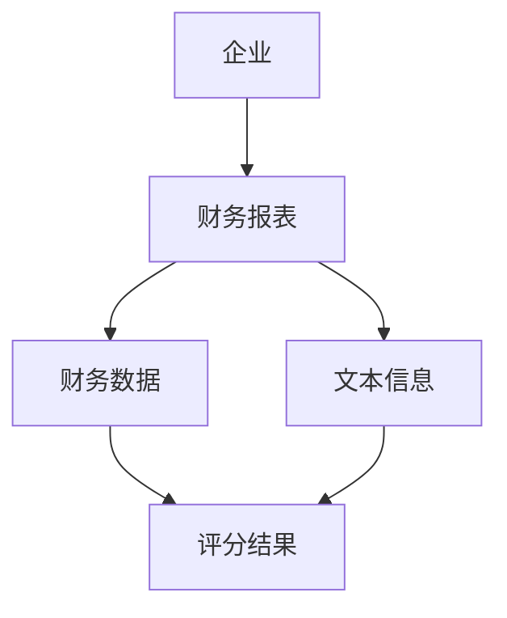
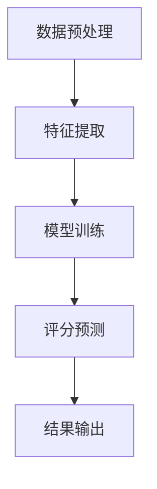

                 


# 设计智能化的企业财务报表质量评分系统

## 关键词：
- 智能化
- 财务报表
- 质量评分
- 机器学习
- 数据分析
- 自然语言处理
- 财务健康评估

## 摘要：
本文详细探讨了设计智能化的企业财务报表质量评分系统的全过程，从问题背景到系统架构设计，再到项目实战，全面分析了如何利用机器学习和自然语言处理技术来提升财务报表的质量评分。文章首先介绍了传统财务报表分析的局限性，然后详细阐述了智能化评分系统的原理、算法实现和系统架构设计。通过实际案例分析和代码实现，展示了如何构建一个高效、准确的财务报表质量评分系统。最后，文章总结了设计过程中的一些最佳实践和注意事项，为读者提供了一个完整的解决方案。

---

# 正文

## 第一部分：背景介绍与核心概念

### 第1章：企业财务报表质量评分系统概述

#### 1.1 问题背景与重要性
##### 1.1.1 传统财务报表分析的局限性
传统的财务报表分析主要依赖人工审查和经验判断。这种方法耗时耗力，且容易受到主观因素的影响，难以保证评分的客观性和一致性。此外，传统方法通常只能处理结构化的财务数据，难以充分利用非结构化的文本信息（如财务报告中的说明、注释等），导致信息利用不充分。

##### 1.1.2 智能化评分系统的需求与价值
随着企业规模的不断扩大和业务的复杂化，传统的财务报表分析方法已经难以满足现代企业的需求。智能化的财务报表质量评分系统可以通过机器学习和自然语言处理技术，自动提取和分析财务数据及文本信息，快速生成客观、准确的评分结果。这不仅提高了效率，还能帮助企业更好地识别财务风险，优化财务管理。

##### 1.1.3 企业财务健康评估的重要性
企业的财务健康状况直接关系到其生存和发展。通过智能化的财务报表质量评分系统，企业可以及时发现财务问题，采取相应的措施进行调整，从而避免潜在的财务危机。

#### 1.2 核心概念与定义
##### 1.2.1 财务报表质量评分的定义
财务报表质量评分是对企业财务报表的准确性和可靠性进行评估的过程，旨在量化财务报表的质量，帮助企业识别潜在的风险和问题。

##### 1.2.2 智能化评分系统的特征
- **自动化**：系统能够自动采集和分析财务数据及文本信息。
- **智能化**：利用机器学习和自然语言处理技术，自动生成评分结果。
- **实时性**：系统可以实时更新和分析财务数据，提供及时的评分结果。

##### 1.2.3 评分系统的边界与外延
- **边界**：系统仅关注财务报表的质量评分，不涉及企业的实际运营决策。
- **外延**：评分系统可以与其他企业管理系统（如ERP系统）集成，提供更全面的财务分析支持。

#### 1.3 核心要素与组成结构
##### 1.3.1 数据来源与处理流程
- **数据来源**：包括企业的财务报表数据（如收入表、资产负债表）和财务报告中的文本信息。
- **处理流程**：数据预处理、特征提取、模型训练、评分预测。

##### 1.3.2 评分模型的构建逻辑
- **特征提取**：从财务数据和文本中提取关键特征，如收入增长率、资产负债率等。
- **模型训练**：利用机器学习算法（如随机森林、神经网络）对特征进行训练，生成评分模型。
- **评分预测**：将新的财务数据输入模型，生成评分结果。

##### 1.3.3 系统架构的核心要素
- **数据采集模块**：负责采集企业的财务数据和文本信息。
- **数据处理模块**：对数据进行清洗和预处理。
- **模型训练模块**：训练评分模型。
- **评分输出模块**：生成并输出评分结果。

---

## 第二部分：核心概念与联系

### 第2章：核心概念与联系

#### 2.1 核心概念原理
##### 2.1.1 数据特征提取原理
通过分析财务数据和文本信息，提取出能够反映财务报表质量的关键特征，如收入增长趋势、利润波动情况等。

##### 2.1.2 模型训练与优化原理
利用机器学习算法对提取的特征进行训练，优化模型的性能，提高评分的准确性和可靠性。

##### 2.1.3 评分策略的制定原理
根据企业的实际情况，制定合理的评分策略，如设定不同的评分标准和权重。

#### 2.2 概念属性特征对比表

| 特征类型 | 财务指标 | 文本描述 |
|----------|----------|----------|
| 收入情况 | 收入增长率 | 收入增长趋势 |
| 利润情况 | 净利润增长率 | 利润波动情况 |
| 资产情况 | 资产负债率 | 资产结构合理性 |
| 负债情况 | 速动比率 | 负债偿付能力 |

#### 2.3 ER实体关系图


---

## 第三部分：算法原理与数学模型

### 第3章：算法原理讲解

#### 3.1 算法流程


#### 3.2 算法实现代码
```python
import pandas as pd
from sklearn.ensemble import RandomForestClassifier

# 数据预处理
data = pd.read_csv('financial_data.csv')
X = data.drop('label', axis=1)
y = data['label']

# 特征提取
features = X.columns
print(f"特征列表：{features}")

# 模型训练
model = RandomForestClassifier()
model.fit(X, y)

# 模型预测
new_data = pd.read_csv('new_financial_data.csv')
predictions = model.predict(new_data[X.columns])
print(f"预测结果：{predictions}")
```

#### 3.3 数学模型
##### 3.3.1 线性回归模型
$$ \text{评分} = \beta_0 + \beta_1 x_1 + \beta_2 x_2 + \ldots + \beta_n x_n $$

##### 3.3.2 逻辑回归模型
$$ P(y=1) = \frac{1}{1 + e^{-(\beta_0 + \beta_1 x_1 + \ldots + \beta_n x_n)}} $$

---

## 第四部分：系统分析与架构设计

### 第4章：系统分析与架构设计方案

#### 4.1 系统功能设计
##### 4.1.1 数据采集模块
- 从数据库中采集企业的财务数据和文本信息。
##### 4.1.2 数据处理模块
- 对数据进行清洗、归一化处理。
##### 4.1.3 模型训练模块
- 利用机器学习算法训练评分模型。
##### 4.1.4 评分输出模块
- 生成评分结果并输出。

#### 4.2 系统架构设计


#### 4.3 系统接口设计
- 数据输入接口：用于接收企业的财务数据和文本信息。
- 数据输出接口：用于输出评分结果。

#### 4.4 系统交互设计


---

## 第五部分：项目实战

### 第5章：项目实战

#### 5.1 环境安装
- 安装Python和必要的库（如pandas、scikit-learn）。

#### 5.2 系统核心实现
```python
import pandas as pd
from sklearn.ensemble import RandomForestClassifier

# 数据预处理
data = pd.read_csv('financial_data.csv')
X = data.drop('label', axis=1)
y = data['label']

# 模型训练
model = RandomForestClassifier()
model.fit(X, y)

# 模型预测
new_data = pd.read_csv('new_financial_data.csv')
predictions = model.predict(new_data[X.columns])
print(f"预测结果：{predictions}")
```

#### 5.3 代码应用解读与分析
- 数据预处理：对数据进行清洗和归一化处理。
- 特征提取：从数据中提取关键特征。
- 模型训练：利用随机森林算法训练模型。
- 模型预测：对新数据进行预测，生成评分结果。

#### 5.4 实际案例分析
通过实际案例分析，展示如何将系统应用于实际场景中，如何根据评分结果调整企业的财务管理策略。

#### 5.5 项目小结
总结项目实施过程中的经验教训，提出改进建议。

---

## 第六部分：最佳实践

### 第6章：最佳实践

#### 6.1 小结
总结全文的主要内容，强调智能化财务报表质量评分系统的重要性和实际应用价值。

#### 6.2 注意事项
- 数据质量对模型性能的影响。
- 模型调优和优化的重要性。
- 系统维护和更新的必要性。

#### 6.3 拓展阅读
推荐相关的书籍和资源，帮助读者进一步深入学习。

---

## 作者信息

作者：AI天才研究院/AI Genius Institute & 禅与计算机程序设计艺术 /Zen And The Art of Computer Programming

