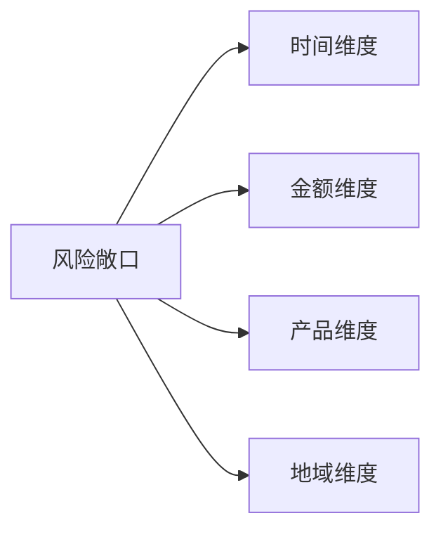
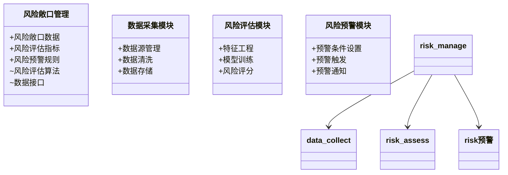
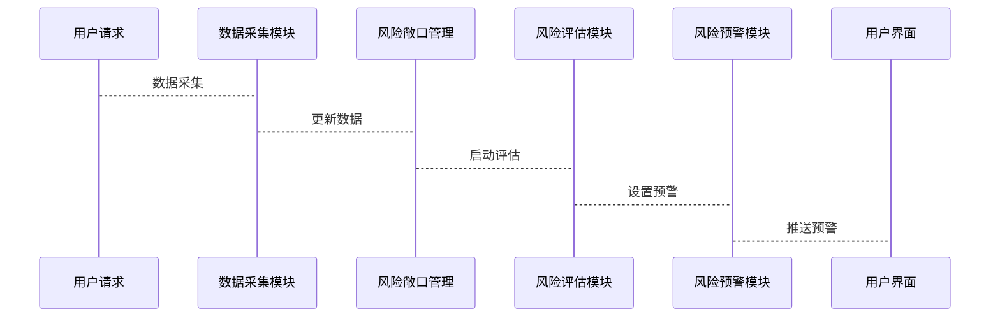

                 


# 设计智能化的企业财务风险敞口动态管理模型

## 关键词：企业财务风险管理，风险敞口，动态管理，智能化，机器学习，大数据分析，自然语言处理

## 摘要：  
本文详细探讨了如何设计智能化的企业财务风险敞口动态管理模型。通过结合大数据分析、机器学习和自然语言处理技术，提出了一种创新的解决方案，能够实时监控和评估企业的财务风险，帮助企业在复杂多变的市场环境中做出更明智的决策。文章从问题背景、核心概念、算法原理、系统架构到实际案例，全面阐述了该模型的设计思路和实现方法，为企业财务管理的智能化转型提供了理论和实践指导。

---

# 第一部分: 背景与基础

## 第1章: 企业财务风险敞口动态管理概述

### 1.1 企业财务风险敞口的定义与重要性
#### 1.1.1 风险敞口的定义
企业财务风险敞口是指企业在经营过程中由于市场波动、经济环境变化或内部管理问题所面临的财务风险敞口。这些风险可能来自于销售收入波动、成本变化、汇率变动、信用风险、流动性风险等。

#### 1.1.2 动态管理的必要性
传统的静态风险管理方法难以应对市场环境的快速变化，而动态管理能够实时跟踪和评估财务风险，帮助企业及时调整策略，避免重大损失。

#### 1.1.3 智能化管理的核心价值
通过智能化技术，企业可以更高效地识别、评估和应对财务风险，从而提高风险管理的准确性和效率。

### 1.2 问题背景与目标
#### 1.2.1 传统财务风险管理的局限性
传统方法依赖人工分析，效率低、主观性强，难以处理海量数据和复杂场景。

#### 1.2.2 当前企业面临的财务风险挑战
全球经济不确定性增加，企业面临更多复杂的财务风险，如供应链中断、汇率波动等。

#### 1.2.3 智能化管理的目标与边界
目标是构建一个动态、智能化的财务风险管理模型，实时监控和评估风险敞口；边界包括企业内部数据和外部市场数据的整合。

### 1.3 核心概念与联系
#### 1.3.1 风险敞口的关键属性
| 属性 | 描述 |
|------|------|
| 时间维度 | 风险敞口随时间变化 |
| 金额维度 | 风险敞口的金额大小 |
| 产品维度 | 涉及的产品或业务线 |
| 地域维度 | 涉及的地理区域 |

#### 1.3.2 智能化管理的实现路径
- 数据采集与清洗
- 风险评估模型构建
- 风险预警与决策支持

#### 1.3.3 核心概念关系图


### 1.4 本章小结

---

## 第2章: 智能化管理的核心技术基础

### 2.1 大数据分析技术
#### 2.1.1 数据采集与处理
- 数据来源：企业财务数据、市场数据、行业数据
- 数据清洗：处理缺失值、异常值
- 数据建模：构建风险评估模型

#### 2.1.2 数据分析与建模
- 数据分析方法：描述性分析、预测性分析
- 数据建模工具：Python、R、SQL

### 2.2 机器学习算法
#### 2.2.1 监督学习
- 线性回归：预测风险敞口大小
- 支持向量机：分类风险类型
- 随机森林：特征重要性分析

#### 2.2.2 非监督学习
- K-means：聚类分析风险敞口
- 层次聚类：发现潜在风险模式

#### 2.2.3 强化学习
- Q-Learning：动态调整风险管理策略

### 2.3 自然语言处理技术
#### 2.3.1 文本数据处理
- 从财务报告中提取关键词
- 分析市场新闻情绪

#### 2.3.2 实体识别与关系抽取
- 使用NLP技术识别企业、产品、事件等实体
- 分析实体之间的关系

### 2.4 本章小结

---

# 第二部分: 模型设计与实现

## 第3章: 动态管理模型的设计思路

### 3.1 风险评估指标体系
#### 3.1.1 指标选择与权重分配
- 指标选择：销售收入波动率、成本变化率、应收账款周转率
- 权重分配：基于历史数据计算

#### 3.1.2 指标动态更新机制
- 定期更新指标权重
- 实时更新指标值

### 3.2 模型构建与优化
#### 3.2.1 数据预处理
- 去除重复数据
- 填补缺失值

#### 3.2.2 特征工程
- 选择关键特征
- 构建特征交互项

#### 3.2.3 模型训练与调优
- 线性回归模型：$y = \beta_0 + \beta_1x_1 + \beta_2x_2 + ... + \beta_nx_n$
- 随机森林模型：集成学习方法

### 3.3 风险预警机制设计
#### 3.3.1 预警阈值设定
- 阈值计算：基于历史数据的百分位数
- 多维度预警：结合多个指标触发预警

#### 3.3.2 多维度预警触发条件
- 组合条件：例如，销售收入下降且成本上升触发红色预警

---

## 第4章: 风险评估算法实现

### 4.1 算法选择与实现
#### 4.1.1 线性回归算法
- 算法流程：
  1. 数据预处理
  2. 模型训练
  3. 模型评估
  4. 模型部署

- mermaid流程图：


#### 4.1.2 随机森林算法
- 算法流程：
  1. 数据分割
  2. 树构建
  3. 预测与集成

- mermaid流程图：


### 4.2 数学模型与公式
#### 4.2.1 线性回归模型
$$ y = \beta_0 + \beta_1x_1 + \beta_2x_2 + ... + \beta_nx_n $$

#### 4.2.2 随机森林模型
- 集成学习公式：
$$ y = \frac{1}{N}\sum_{i=1}^{N} \text{Tree}_i(x) $$

### 4.3 本章小结

---

## 第5章: 系统架构与实现

### 5.1 系统功能设计
#### 5.1.1 领域模型


#### 5.1.2 系统架构


### 5.2 系统接口设计
- 数据接口：RESTful API
- 风险评估接口：提供风险评分查询
- 预警通知接口：推送预警信息

### 5.3 系统交互流程


### 5.4 本章小结

---

# 第三部分: 项目实战

## 第6章: 环境安装与核心实现

### 6.1 环境安装
- 安装Python
- 安装机器学习库：scikit-learn、xgboost
- 安装数据分析库：pandas、numpy
- 安装NLP库：spaCy、NLTK

### 6.2 核心代码实现
#### 6.2.1 数据预处理代码
```python
import pandas as pd
import numpy as np

# 数据加载
data = pd.read_csv('financial_risk.csv')

# 数据清洗
data.dropna(inplace=True)
data.drop_duplicates(inplace=True)
```

#### 6.2.2 特征工程代码
```python
from sklearn.preprocessing import StandardScaler

scaler = StandardScaler()
scaled_features = scaler.fit_transform(data[['revenue', 'cost', 'debt']])
```

#### 6.2.3 模型训练代码
```python
from sklearn.ensemble import RandomForestRegressor

model = RandomForestRegressor(n_estimators=100, random_state=42)
model.fit(scaled_features, data['risk_score'])
```

#### 6.2.4 模型评估代码
```python
from sklearn.metrics import mean_squared_error

y_pred = model.predict(scaled_features)
print(mean_squared_error(data['risk_score'], y_pred))
```

### 6.3 案例分析与解读
#### 6.3.1 数据处理与建模
- 数据预处理：处理缺失值、标准化特征
- 模型训练：随机森林回归模型

#### 6.3.2 模型评估
- 均方误差：评估模型预测准确性
- 混淆矩阵：评估模型分类效果

#### 6.3.3 实际应用
- 使用模型预测未来风险敞口
- 根据预警规则触发风险通知

### 6.4 本章小结

---

## 第7章: 系统优化与扩展

### 7.1 系统优化方案
#### 7.1.1 数据质量控制
- 数据清洗：确保数据准确性和完整性
- 数据增强：引入外部数据源

#### 7.1.2 模型优化
- 超参数调优：网格搜索、随机搜索
- 模型集成：集成多种算法提升性能

#### 7.1.3 系统性能优化
- 并行计算：加速数据处理和模型训练
- 分布式架构：处理大数据量

### 7.2 模型可解释性
#### 7.2.1 特征重要性分析
- 使用SHAP值解释模型决策
- 可视化特征重要性

#### 7.2.2 风险解释报告
- 自动生成风险解释报告
- 提供风险缓解建议

### 7.3 本章小结

---

# 第四部分: 总结与展望

## 第8章: 总结与展望

### 8.1 总结
- 本文提出了智能化的企业财务风险敞口动态管理模型
- 通过机器学习和大数据分析技术，实现了风险的实时监控和预警
- 提供了可扩展的系统架构和优化方案

### 8.2 未来展望
- 引入实时数据流处理技术，提升模型响应速度
- 探索强化学习在风险管理中的应用
- 结合区块链技术，构建分布式风险管理平台

### 8.3 最佳实践 Tips
- 数据质量是模型性能的基础
- 模型需要定期更新和调优
- 风险预警机制要结合企业实际情况

### 8.4 本章小结

---

## 作者：AI天才研究院 & 禅与计算机程序设计艺术

