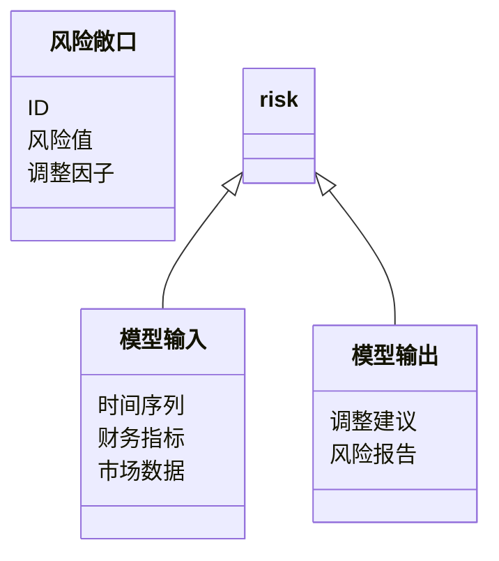
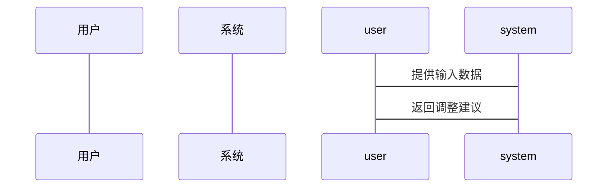

                 


```markdown
# 设计智能化的企业财务风险敞口动态调整模型

> 关键词：企业财务风险管理，风险敞口，动态调整，智能化模型，算法原理，系统架构

> 摘要：本文将详细探讨如何设计一个智能化的企业财务风险敞口动态调整模型，通过分析财务风险敞口的动态变化机制，结合先进的算法和系统架构，提供一个高效、可靠的解决方案。我们将从背景介绍、核心概念、算法原理、系统架构到项目实战，全面解析该模型的设计与实现。

---

# 第1章 企业财务风险敞口动态调整模型的背景与问题描述

## 1.1 企业财务风险管理的重要性
### 1.1.1 企业财务风险的定义与分类
### 1.1.2 风险敞口的形成机制
### 1.1.3 动态调整模型的必要性

## 1.2 问题背景与问题描述
### 1.2.1 当前企业财务风险管理的痛点
### 1.2.2 动态调整模型的提出背景
### 1.2.3 问题解决的思路与目标

## 1.3 问题的边界与外延
### 1.3.1 模型适用的范围与限制
### 1.3.2 模型与现有方法的区别
### 1.3.3 模型的可扩展性与灵活性

## 1.4 核心概念与核心要素
### 1.4.1 风险敞口的核心要素
### 1.4.2 动态调整模型的关键属性
### 1.4.3 模型的输入与输出关系

## 1.5 本章小结

---

# 第2章 动态调整模型的核心概念与联系

## 2.1 核心概念原理
### 2.1.1 风险敞口的动态变化机制
### 2.1.2 模型的输入数据特征
### 2.1.3 模型的输出结果解释

## 2.2 概念属性对比表格
### 2.2.1 风险敞口与传统财务指标对比
### 2.2.2 动态调整模型与其他风险管理模型对比

## 2.3 ER实体关系图
### 2.3.1 实体关系图的构建
### 2.3.2 实体关系图的解释
### 2.3.3 实体关系图的应用

---

# 第3章 动态调整模型的算法原理

## 3.1 算法原理概述
### 3.1.1 算法的核心思想
### 3.1.2 算法的主要步骤
### 3.1.3 算法的数学模型

## 3.2 算法流程图
### 3.2.1 算法的整体流程
### 3.2.2 数据流与控制流的详细描述

## 3.3 算法的数学模型与公式
### 3.3.1 风险敞口的计算公式
$$ R(t) = \alpha \cdot V(t) + \beta \cdot M(t) $$
### 3.3.2 动态调整的数学表达
$$ \Delta R(t) = \gamma \cdot (R(t) - R_{target}) $$

## 3.4 算法的实现与优化
### 3.4.1 算法的实现步骤
### 3.4.2 算法的优化策略
### 3.4.3 算法的性能评估

---

# 第4章 系统分析与架构设计方案

## 4.1 问题场景介绍
### 4.1.1 企业财务风险管理的典型场景
### 4.1.2 动态调整模型的应用场景

## 4.2 项目介绍
### 4.2.1 项目目标
### 4.2.2 项目范围
### 4.2.3 项目需求分析

## 4.3 系统功能设计
### 4.3.1 领域模型（mermaid类图）


## 4.4 系统架构设计
### 4.4.1 系统架构图（mermaid架构图）
```mermaid
container 整体架构 {
    数据层
    业务逻辑层
    表现层
}
```

## 4.5 系统接口设计
### 4.5.1 接口定义
### 4.5.2 接口调用流程

## 4.6 系统交互设计（mermaid序列图）


---

# 第5章 项目实战

## 5.1 环境安装
### 5.1.1 开发环境配置
### 5.1.2 依赖库安装

## 5.2 核心代码实现
### 5.2.1 数据预处理
### 5.2.2 模型训练
### 5.2.3 模型应用

## 5.3 代码应用解读与分析
### 5.3.1 代码结构分析
### 5.3.2 代码实现细节
### 5.3.3 代码优化建议

## 5.4 实际案例分析
### 5.4.1 案例背景
### 5.4.2 案例分析过程
### 5.4.3 案例结果解读

## 5.5 项目小结

---

# 第6章 最佳实践、小结与注意事项

## 6.1 最佳实践 tips
### 6.1.1 数据质量的重要性
### 6.1.2 模型调优的技巧
### 6.1.3 系统维护的注意事项

## 6.2 小结
### 6.2.1 本章总结
### 6.2.2 全书回顾

## 6.3 注意事项
### 6.3.1 模型应用中的潜在风险
### 6.3.2 系统维护中的常见问题
### 6.3.3 用户使用中的注意事项

## 6.4 拓展阅读
### 6.4.1 相关领域书籍推荐
### 6.4.2 其他相关资源链接

---

# 第7章 总结与展望

## 7.1 总结
### 7.1.1 核心内容回顾
### 7.1.2 实践价值总结

## 7.2 展望
### 7.2.1 未来研究方向
### 7.2.2 技术发展趋势

---

# 作者信息

作者：AI天才研究院/AI Genius Institute & 禅与计算机程序设计艺术 /Zen And The Art of Computer Programming

---

**注意**：以上目录大纲为示例内容，具体内容需要根据实际情况进行详细撰写和补充。
```

