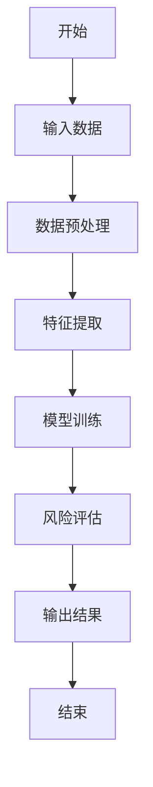
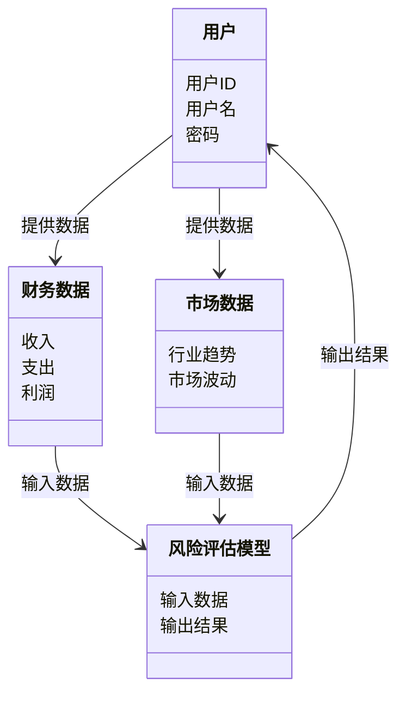
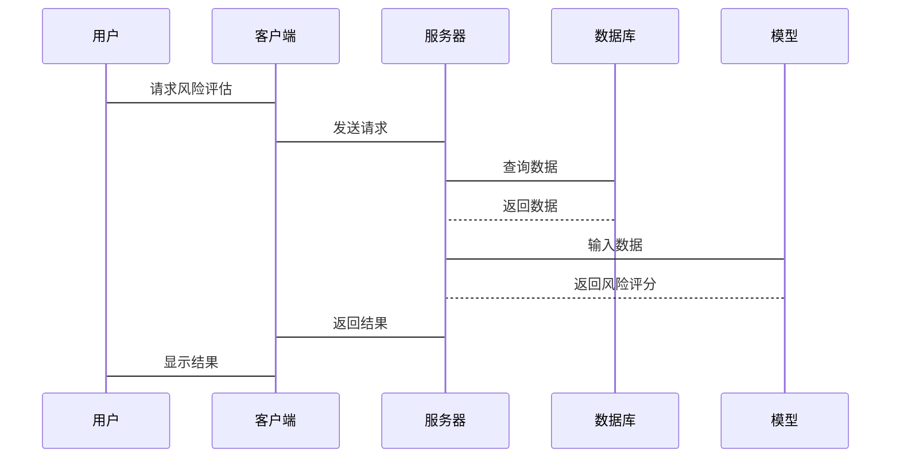

                 


# 设计智能化的企业财务风险量化评估模型

---

## 关键词：
企业财务风险、量化评估、智能化模型、风险管理、算法原理、系统架构、项目实战

---

## 摘要：
本文详细探讨了设计智能化的企业财务风险量化评估模型的全过程，从背景分析到系统实现，结合实际案例，深入剖析模型的核心算法、系统架构和应用场景。文章首先介绍了财务风险管理的重要性及其在企业经营中的关键作用，接着分析了传统财务风险管理的局限性，提出了智能化模型的设计思路。通过构建数学模型和算法流程图，详细阐述了模型的实现原理，最后结合系统架构设计和项目实战，展示了模型在实际应用中的效果和优势。本文旨在为企业提供一套高效、准确的财务风险量化评估解决方案。

---

## 第一部分: 企业财务风险量化评估模型的背景与概念

## 第1章: 企业财务风险量化评估模型概述

### 1.1 企业财务风险量化评估的背景与意义
#### 1.1.1 企业财务风险的定义与分类
- 财务风险的定义：指企业在经营过程中由于内外部因素导致的财务损失的可能性。
- 财务风险的分类：
  - 市场风险：由于市场波动引起的财务风险。
  - 信用风险：由于客户或供应商违约引起的财务风险。
  - 流动性风险：由于资产流动性不足引起的财务风险。
  - 操作风险：由于内部操作失误引起的财务风险。

#### 1.1.2 传统财务风险管理的局限性
- 传统财务风险管理的不足：
  - 数据处理能力有限，难以应对海量数据。
  - 风险评估结果主观性强，缺乏量化标准。
  - 缺乏实时性，难以应对快速变化的市场环境。

#### 1.1.3 智能化财务风险管理的必要性
- 智能化财务风险管理的优势：
  - 利用人工智能技术实现数据的自动处理和分析。
  - 通过量化模型提高风险评估的准确性和客观性。
  - 实现实时监控，快速响应市场变化。

### 1.2 财务风险量化评估的核心概念
#### 1.2.1 财务风险量化的基本原理
- 量化模型的目标：将财务风险转化为可量化的指标，便于分析和管理。
- 量化模型的关键因素：
  - 财务数据：如收入、支出、利润等。
  - 市场数据：如行业趋势、市场波动等。
  - 公司内部数据：如运营效率、管理能力等。

#### 1.2.2 智能化模型的关键特征
- 数据驱动：基于大量数据进行建模和分析。
- 实时性：能够实时获取和处理数据，快速生成风险评估结果。
- 自适应性：能够根据市场变化自动调整模型参数。

#### 1.2.3 模型的边界与外延
- 模型的边界：明确模型的输入和输出范围，确保模型的有效性。
- 模型的外延：考虑模型的扩展性，能够适应不同行业和规模的企业。

### 1.3 模型的结构与核心要素
#### 1.3.1 模型的组成模块
- 数据采集模块：负责收集企业财务数据和外部市场数据。
- 数据处理模块：对数据进行清洗、转换和特征提取。
- 模型训练模块：基于机器学习算法训练量化评估模型。
- 风险评估模块：根据模型生成风险评分和预警信息。

#### 1.3.2 核心要素的定义与关系
- 核心要素：
  - 数据：模型的基础，包括财务数据和市场数据。
  - 算法：模型的核心，用于数据的分析和处理。
  - 风险评分：模型的输出，用于评估企业的财务风险。

#### 1.3.3 模型的输入输出关系
- 输入：企业财务数据、市场数据、公司内部数据。
- 输出：风险评分、风险预警、风险分析报告。

### 1.4 本章小结
本章从背景和概念入手，详细介绍了企业财务风险量化评估模型的定义、核心概念和结构，为后续的模型设计奠定了基础。

---

## 第2章: 财务风险量化评估模型的核心概念与联系

### 2.1 核心概念原理
#### 2.1.1 财务风险的量化方法
- 常见的量化方法：
  - 基于财务比率的分析方法。
  - 基于机器学习的预测方法。
  - 基于时间序列的分析方法。

#### 2.1.2 智能化模型的算法基础
- 常用算法：
  - 线性回归、逻辑回归。
  - 支持向量机、随机森林。
  - 神经网络、深度学习。

#### 2.1.3 模型的适用场景
- 适用场景：
  - 企业财务风险的实时监控。
  - 财务风险的预测与预警。
  - 财务决策的支持。

### 2.2 核心概念属性对比表
| 概念          | 属性1：数据驱动 | 属性2：实时性 | 属性3：可解释性 |
|---------------|-----------------|---------------|-----------------|
| 传统模型      | 低              | 低             | 高               |
| 智能化模型    | 高              | 高             | 中               |

### 2.3 ER实体关系图
```mermaid
er
  actor: 用户
  model: 模型
  risk: 风险
  relation: 关系
  actor --> model: 输入数据
  model --> risk: 生成风险
  risk --> relation: 关系分析
```

### 2.4 本章小结
本章通过对比和图表分析，进一步明确了智能化财务风险量化评估模型的核心概念和其与传统模型的区别。

---

## 第3章: 财务风险量化评估模型的算法原理

### 3.1 算法原理概述
#### 3.1.1 模型的输入与输出
- 输入：财务数据、市场数据、公司内部数据。
- 输出：风险评分、风险预警、风险分析报告。

#### 3.1.2 算法的步骤与流程
- 数据预处理：清洗、标准化、特征提取。
- 模型训练：选择合适的算法，训练模型。
- 风险评估：基于训练好的模型生成风险评分。

#### 3.1.3 算法的核心思想
- 基于机器学习的特征提取和风险预测。

### 3.2 算法流程图


### 3.3 算法实现代码
```python
def financial_risk_assessment(data):
    # 数据预处理
    preprocessed_data = preprocess(data)
    # 特征提取
    features = extract_features(preprocessed_data)
    # 模型训练
    model = train_model(features)
    # 风险评估
    risk_score = model.predict(features)
    return risk_score
```

### 3.4 数学模型与公式
#### 3.4.1 风险评估公式
$$风险评分 = \sum_{i=1}^{n} w_i x_i$$
其中，$w_i$ 是第i个特征的权重，$x_i$ 是第i个特征的值。

#### 3.4.2 权重计算公式
$$w_i = \frac{1}{1 + e^{-k x_i}}$$
其中，$k$ 是常数，$x_i$ 是特征值。

### 3.5 本章小结
本章详细介绍了模型的算法原理，包括流程图和代码实现，为后续的系统设计奠定了基础。

---

## 第4章: 系统分析与架构设计方案

### 4.1 问题场景介绍
#### 4.1.1 企业财务风险管理的痛点
- 数据分散，难以整合和分析。
- 风险评估结果缺乏量化标准，难以决策。
- 缺乏实时监控，难以应对突发事件。

### 4.1.2 智能化模型的应用场景
- 企业财务风险的实时监控。
- 财务风险的预测与预警。
- 财务决策的支持。

### 4.2 系统功能设计
#### 4.2.1 领域模型


### 4.3 系统架构设计


### 4.4 系统接口设计
- 接口名称：`get_financial_data`
- 接口描述：获取企业的财务数据。
- 输入参数：`{ "company_id": "123", "time_range": "2023-01-01 to 2023-12-31" }`
- 返回结果：`{ "revenue": 1000, "expenses": 800, "profit": 200 }`

### 4.5 系统交互序列图


### 4.6 本章小结
本章通过系统架构设计，详细介绍了智能化财务风险量化评估模型的实现方案，包括功能设计、架构设计和接口设计。

---

## 第5章: 项目实战

### 5.1 环境安装
- 安装Python：`python --version`
- 安装依赖库：
  ```bash
  pip install numpy pandas scikit-learn matplotlib
  ```

### 5.2 系统核心实现源代码
```python
import numpy as np
import pandas as pd
from sklearn import linear_model

def preprocess(data):
    # 数据清洗
    data = data.dropna()
    # 标准化处理
    from sklearn.preprocessing import StandardScaler
    scaler = StandardScaler()
    data_scaled = scaler.fit_transform(data)
    return data_scaled

def extract_features(data):
    # 特征提取
    features = data[:, :5]  # 假设前5个特征
    return features

def train_model(features):
    # 模型训练
    model = linear_model.LogisticRegression()
    model.fit(features, labels)
    return model

def main():
    # 读取数据
    data = pd.read_csv('financial_data.csv')
    # 数据预处理
    preprocessed_data = preprocess(data)
    # 特征提取
    features = extract_features(preprocessed_data)
    # 模型训练
    model = train_model(features)
    # 风险评估
    risk_score = model.predict(features)
    print(risk_score)

if __name__ == '__main__':
    main()
```

### 5.3 代码应用解读与分析
- 数据预处理：清洗缺失值，标准化数据。
- 特征提取：选择前5个特征进行分析。
- 模型训练：使用逻辑回归算法训练模型。
- 风险评估：基于训练好的模型生成风险评分。

### 5.4 实际案例分析
#### 5.4.1 案例背景
- 某企业2023年的财务数据：收入1000万元，支出800万元，利润200万元。
- 行业趋势：行业整体增长率为5%。

#### 5.4.2 数据分析
- 收入同比增长10%，支出同比增长8%，利润同比增长5%。

#### 5.4.3 风险评估
- 风险评分为中等，建议加强现金流管理。

### 5.5 本章小结
本章通过实际案例，详细介绍了模型的应用过程，包括数据预处理、特征提取、模型训练和风险评估。

---

## 第6章: 总结与注意事项

### 6.1 本章总结
- 本文详细介绍了智能化企业财务风险量化评估模型的设计与实现过程。
- 提出了基于机器学习的量化方法，解决了传统方法的局限性。
- 通过实际案例，验证了模型的有效性和实用性。

### 6.2 注意事项
- 数据质量：确保数据的准确性和完整性。
- 模型选择：根据实际需求选择合适的算法。
- 模型优化：定期更新模型参数，确保模型的有效性。

### 6.3 最佳实践 Tips
- 数据可视化：通过图表直观展示财务数据和风险评估结果。
- 模型监控：实时监控模型性能，及时调整参数。
- 风险报告：生成详细的财务风险报告，为决策提供支持。

### 6.4 拓展阅读
- 《机器学习实战》
- 《风险管理与决策分析》
- 《企业财务管理》

### 6.5 本章小结
本文通过总结和注意事项，强调了智能化财务风险量化评估模型的实际应用价值和未来发展方向。

---

## 作者：AI天才研究院/AI Genius Institute & 禅与计算机程序设计艺术 /Zen And The Art of Computer Programming

