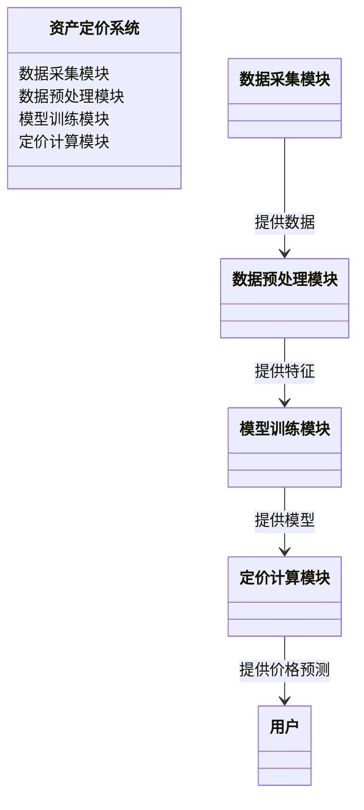
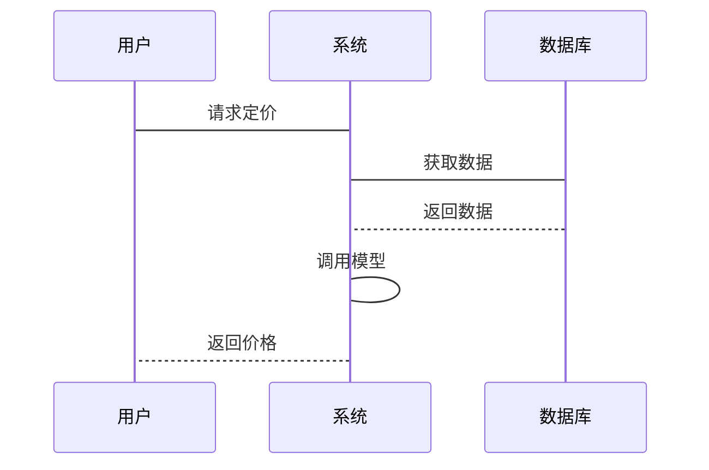

                 


# 设计智能化的资产定价模型

## 关键词

- 资产定价
- 人工智能
- 大数据分析
- 机器学习
- 智能化模型

## 摘要

本文将深入探讨如何设计智能化的资产定价模型，结合人工智能和大数据分析技术，逐步构建一个高效、准确的资产定价系统。从问题背景到解决方案，从算法原理到系统架构，本文将详细阐述每个关键步骤，帮助读者掌握智能化资产定价的核心方法。

---

## 第一部分：背景介绍

### 第1章：智能化资产定价模型概述

#### 1.1 资产定价模型的背景与意义

- **1.1.1 传统资产定价模型的局限性**
  - 传统定价模型（如CAPM和APT）依赖于假设，难以应对复杂市场环境。
  - 数据依赖性强，难以处理非结构化数据。
  - 计算复杂度高，难以实时应用。

- **1.1.2 智能化定价的必要性**
  - 金融市场数据爆炸式增长，传统模型难以处理。
  - 需要实时、动态的定价能力，应对快速变化的市场。
  - 提高定价的准确性和效率，优化投资决策。

- **1.1.3 数据驱动与模型优化的重要性**
  - 利用大数据技术提取更多市场信息。
  - 通过机器学习优化模型，提高预测能力。

#### 1.2 问题描述与目标

- **1.2.1 资产定价的核心问题**
  - 如何准确预测资产的市场价值。
  - 如何处理海量、多源异构的市场数据。
  - 如何构建动态、实时的定价模型。

- **1.2.2 智能化定价的目标**
  - 实现资产价格的实时预测。
  - 提供基于市场变化的动态定价策略。
  - 提高定价模型的鲁棒性和可解释性。

- **1.2.3 关键点：数据驱动与模型优化**
  - 数据的全面性与实时性。
  - 模型的可解释性与泛化能力。

#### 1.3 问题解决与边界

- **1.3.1 AI与大数据技术的应用**
  - 使用机器学习算法（如随机森林、神经网络）处理复杂数据。
  - 利用大数据技术整合多源数据。

- **1.3.2 模型的边界与适用范围**
  - 适用于股票、债券等标准化资产。
  - 适用于市场数据充足、波动性较高的资产。
  - 不适用于数据不足或市场高度管制的资产。

- **1.3.3 资产定价模型的外延**
  - 与风险评估、投资组合优化等其他金融模型的结合。
  - 应用场景扩展，如量化交易、智能投顾。

#### 1.4 概念结构与核心要素

- **1.4.1 资产定价模型的组成**
  - 数据输入：市场数据、财务数据、新闻数据。
  - 模型算法：回归分析、神经网络。
  - 结果输出：资产价格预测、风险评估。

- **1.4.2 核心要素**
  - 数据输入：结构化与非结构化数据的处理。
  - 定价算法：选择合适的机器学习模型。
  - 结果输出：预测价格、置信区间。

- **1.4.3 模型的输入与输出关系**
  - 输入：资产的历史价格、市场指数、经济指标。
  - 输出：预测价格、波动率、风险等级。

---

## 第二部分：核心概念与联系

### 第2章：智能化定价模型的核心原理

#### 2.1 数据的收集与预处理

- **2.1.1 数据来源**
  - 市场数据：股票价格、指数、成交量。
  - 财务数据：公司财报、财务指标。
  - 新闻数据：新闻标题、情绪分析。

- **2.1.2 数据清洗与特征工程**
  - 处理缺失值、异常值。
  - 特征提取：如移动平均线、相对强弱指数。
  - 数据标准化与归一化。

#### 2.2 模型的训练与优化

- **2.2.1 监督学习与无监督学习的应用**
  - 监督学习：回归模型预测价格。
  - 无监督学习：聚类分析市场状态。

- **2.2.2 模型训练的策略**
  - 分割训练集、验证集、测试集。
  - 调参：网格搜索优化模型参数。

- **2.2.3 超参数调优与模型评估**
  - 使用交叉验证评估模型性能。
  - 比较不同模型的准确率、召回率、F1分数。

#### 2.3 核心概念对比表

| 对比维度       | 传统定价模型             | AI定价模型               |
|----------------|--------------------------|--------------------------|
| 数据处理       | 依赖少量结构化数据       | 处理多源异构数据         |
| 计算方式       | 基于假设和公式推导       | 基于数据驱动和机器学习   |
| 结果准确性       | 受限于假设的准确性       | 更高，能捕捉复杂模式     |

#### 2.4 ER实体关系图

```mermaid
erd
  entity 资产 {
    id
    名称
    类型
  }

  entity 市场数据 {
    时间戳
    价格
    成交量
  }

  entity 模型参数 {
    模型类型
    超参数
    训练时间
  }

  资产 --> 市场数据: 关联
  资产 --> 模型参数: 使用
  市场数据 --> 模型参数: 输入
```

---

## 第三部分：算法原理讲解

### 第3章：常用算法与实现

#### 3.1 回归分析

- **3.1.1 简单线性回归**
  - 原理：$y = \beta_0 + \beta_1x + \epsilon$
  - 应用：预测资产价格。

#### 3.2 神经网络

- **3.2.1 多层感知机（MLP）**
  - 结构：输入层、隐藏层、输出层。
  - 训练：反向传播、梯度下降。

#### 3.3 随机森林

- **3.3.1 集成学习**
  - 多棵决策树的集成，提高泛化能力。

#### 3.4 算法实现

```python
import numpy as np
from sklearn.linear_model import LinearRegression
from sklearn.ensemble import RandomForestRegressor

# 数据准备
X = np.array([[1, 2], [3, 4], [5, 6]])
y = np.array([7, 8, 9])

# 线性回归
lr_model = LinearRegression()
lr_model.fit(X, y)
print(lr_model.coef_)  # 输出系数

# 随机森林
rf_model = RandomForestRegressor(n_estimators=100)
rf_model.fit(X, y)
print(rf_model.predict([[7, 8]]))  # 预测
```

#### 3.5 数学模型

- **线性回归模型**
  $$ y = \beta_0 + \beta_1 x + \epsilon $$
- **随机森林模型**
  $$ \hat{y} = \frac{1}{n} \sum_{i=1}^{n} \text{Tree}_i(x) $$

---

## 第四部分：系统分析与架构设计

### 第4章：系统架构设计

#### 4.1 问题场景介绍

- 金融市场中的资产定价问题。
- 实时数据处理需求。

#### 4.2 系统功能设计



#### 4.3 系统架构设计


#### 4.4 系统接口设计

- **数据接口**
  - 输入：资产ID、时间范围。
  - 输出：历史数据。
- **模型接口**
  - 输入：数据特征。
  - 输出：预测价格。

#### 4.5 系统交互



---

## 第五部分：项目实战

### 第5章：项目实现与案例分析

#### 5.1 环境安装

- **工具安装**
  - Python、Jupyter、TensorFlow、Keras、Scikit-learn。

#### 5.2 核心代码实现

```python
import pandas as pd
from sklearn.model_selection import train_test_split
from sklearn.metrics import mean_squared_error

# 数据加载
df = pd.read_csv('assets.csv')

# 数据分割
X = df.drop('price', axis=1)
y = df['price']

X_train, X_test, y_train, y_test = train_test_split(X, y, test_size=0.2)

# 神经网络模型
from tensorflow.keras.models import Sequential
from tensorflow.keras.layers import Dense

model = Sequential()
model.add(Dense(64, activation='relu', input_dim=X_train.shape[1]))
model.add(Dense(1, activation='linear'))

model.compile(optimizer='adam', loss='mse')
model.fit(X_train, y_train, epochs=100, batch_size=32)

# 评估
y_pred = model.predict(X_test)
print(mean_squared_error(y_test, y_pred))
```

#### 5.3 项目实战分析

- **案例分析**
  - 使用股票数据训练模型，预测未来价格。
  - 比较不同模型的预测结果，选择最优模型。

---

## 第六部分：最佳实践与总结

### 第6章：最佳实践与注意事项

#### 6.1 小结

- 数据预处理是关键。
- 模型选择影响结果。
- 持续优化模型性能。

#### 6.2 注意事项

- 数据质量影响模型性能。
- 模型解释性需考虑实际应用场景。
- 避免过拟合，保持泛化能力。

#### 6.3 拓展阅读

- 推荐书籍：《机器学习实战》、《Python机器学习》。
- 在线课程：Coursera上的相关课程。

---

## 作者

作者：AI天才研究院/AI Genius Institute & 禅与计算机程序设计艺术 /Zen And The Art of Computer Programming

