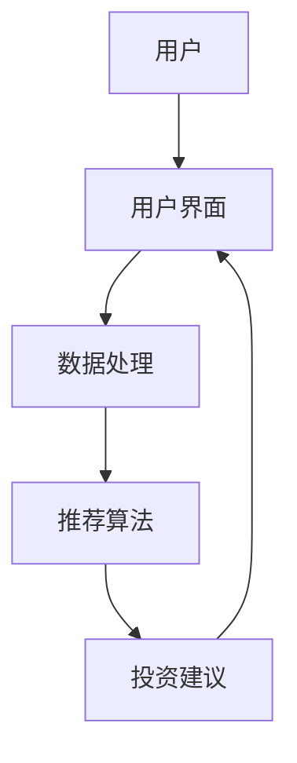

                 


# 设计直观易用的投资理财智能助手用户界面

## 关键词：投资理财，用户界面，智能助手，交互设计，算法推荐

## 摘要：本文深入探讨如何设计直观易用的投资理财智能助手用户界面，结合背景分析、核心概念、算法原理、系统架构和项目实战，为读者提供从理论到实践的全面指导，帮助用户更好地理解投资理财，并做出明智的决策。

---

# 第一部分：投资理财智能助手的设计背景

## 第1章：投资理财智能助手的设计背景

### 1.1 投资理财领域的现状与挑战

#### 1.1.1 当前投资理财工具的痛点分析
- 现有工具功能复杂，难以快速上手。
- 信息过载，用户难以筛选有用信息。
- 缺乏个性化的投资建议，难以满足不同用户需求。

#### 1.1.2 用户在投资理财中的核心需求
- 快速获取关键信息。
- 简明的投资决策支持。
- 个性化的财务规划建议。

#### 1.1.3 智能化工具在投资理财中的作用
- 提供实时数据分析。
- 自动化投资建议。
- 个性化用户交互体验。

---

### 1.2 设计目标与原则

#### 1.2.1 设计目标
- 提供直观易用的用户界面。
- 实现高效的用户交互流程。
- 提供个性化的投资建议。

#### 1.2.2 设计原则
- 以用户为中心的设计。
- 简洁直观的界面设计。
- 可靠的安全性和数据保护。

---

# 第二部分：投资理财智能助手的核心概念与界面设计原则

## 第2章：投资理财智能助手的核心概念

### 2.1 投资理财智能助手的定义与核心功能

#### 2.1.1 核心功能模块
- 实时市场数据监控。
- 投资组合管理。
- 自动化投资建议。

#### 2.1.2 功能模块之间的关系
- 数据流：实时数据 -> 数据分析 -> 投资建议 -> 用户交互。
- 模块交互：用户输入 -> 数据处理 -> 界面展示。

#### 2.1.3 核心概念的属性特征对比表
| 概念       | 属性               | 特征               |
|------------|--------------------|--------------------|
| 实时数据   | 更新频率           | 高频               |
| 数据分析   | 方法               | 统计、机器学习     |
| 投资建议   | 类型               | 短期、长期         |

---

## 第3章：投资理财智能助手的界面设计原则

### 3.1 简洁性与直观性原则

#### 3.1.1 简洁性
- 减少功能冗余，专注于核心功能。
- 界面元素少而精。

#### 3.1.2 直观性
- 使用图形化展示数据。
- 界面布局符合用户习惯。

---

# 第三部分：投资理财智能助手的交互设计与算法原理

## 第4章：交互设计的核心原理

### 4.1 交互设计的基础理论

#### 4.1.1 Fitts定律与交互设计
- Fitts定律：用户点击目标的时间与目标大小和距离有关。
- 应用：按钮设计要足够大，位置要明显。

#### 4.1.2 用户注意力与视觉设计
- 突出重要信息。
- 使用颜色和对比度引导注意力。

#### 4.1.3 交互中的反馈机制
- 操作确认反馈。
- 实时数据更新反馈。

---

## 第5章：推荐算法与用户行为分析

### 5.1 推荐算法的数学模型

#### 5.1.1 协同过滤算法
- 基于用户的相似性推荐。
- 数学公式：
  $$相似度 = \frac{\sum (r_i - \bar{r}) \cdot (r_j - \bar{r})}{\sqrt{\sum (r_i - \bar{r})^2} \cdot \sqrt{\sum (r_j - \bar{r})^2}}$$

#### 5.1.2 基于内容的推荐算法
- 使用物品特征进行推荐。
- 示例代码：
  ```python
  from sklearn.feature_extraction.text import TfidfVectorizer

  vectorizer = TfidfVectorizer()
  tfidf = vectorizer.fit_transform(documents)
  ```

---

# 第四部分：投资理财智能助手的系统架构与实现

## 第6章：系统架构设计

### 6.1 系统功能模块划分

#### 6.1.1 用户界面模块
- 展示实时数据和投资建议。

#### 6.1.2 数据处理模块
- 处理用户输入和数据存储。

#### 6.1.3 推荐算法模块
- 生成个性化投资建议。

#### 6.1.4 系统架构图


---

## 第7章：系统接口设计与交互流程

### 7.1 系统接口设计

#### 7.1.1 接口定义
- RESTful API设计。

#### 7.1.2 接口实现
- 使用Python的Flask框架。

#### 7.1.3 接口测试
- 使用Postman进行测试。

---

# 第五部分：投资理财智能助手的项目实战

## 第8章：项目实战与代码实现

### 8.1 项目环境安装

#### 8.1.1 安装Python和必要的库
- 安装命令：
  ```bash
  pip install numpy pandas flask
  ```

#### 8.1.2 创建项目结构
- 项目目录结构：
  ```
  invest_assistant/
    app/
      routes.py
      main.py
    templates/
      index.html
  ```

#### 8.1.3 实现代码
- 主程序代码：
  ```python
  from flask import Flask, render_template

  app = Flask(__name__)

  @app.route('/')
  def index():
      return render_template('index.html')

  if __name__ == '__main__':
      app.run(debug=True)
  ```

---

## 第9章：实际案例分析与总结

### 9.1 案例分析

#### 9.1.1 数据分析结果
- 示例数据处理代码：
  ```python
  import pandas as pd

  data = pd.read_csv('data.csv')
  print(data.head())
  ```

#### 9.1.2 用户反馈优化
- 根据用户反馈调整界面布局。

---

# 第六部分：总结与展望

## 第10章：总结与未来展望

### 10.1 设计原则回顾
- 简洁性、直观性、以用户为中心。

### 10.2 未来展望
- 引入更多AI技术。
- 优化推荐算法。

---

作者：AI天才研究院 & 禅与计算机程序设计艺术

