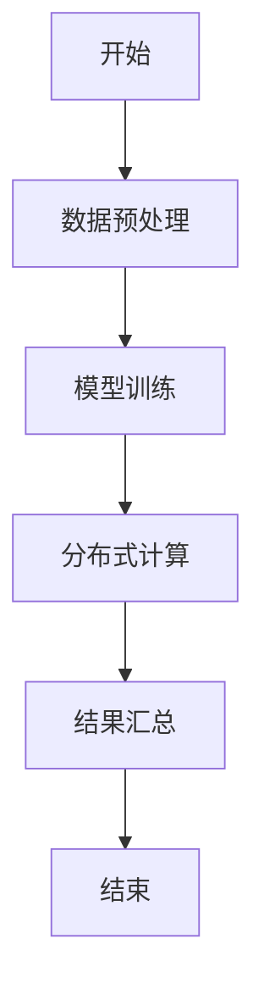

                 


# 设计高可用性金融AI系统架构

## 第一部分：背景介绍

### 第1章：高可用性金融AI系统的背景与挑战

#### 1.1 问题背景
- 1.1.1 金融系统的高可用性需求
- 1.1.2 AI在金融领域的应用现状
- 1.1.3 高可用性AI系统的必要性

#### 1.2 问题描述
- 1.2.1 金融AI系统的关键挑战
- 1.2.2 高可用性目标的定义
- 1.2.3 系统容错与恢复机制的重要性

#### 1.3 问题解决
- 1.3.1 分布式架构的应用
- 1.3.2 容错机制的设计
- 1.3.3 高可用性架构的实现方法

#### 1.4 系统边界与外延
- 1.4.1 系统的输入与输出
- 1.4.2 系统的组成部分
- 1.4.3 系统与其他模块的交互

#### 1.5 核心概念与组成
- 1.5.1 高可用性定义
- 1.5.2 金融AI系统的核心要素
- 1.5.3 系统架构的组成部分

---

## 第二部分：核心概念与联系

### 第2章：高可用性与金融AI系统的核心概念

#### 2.1 核心概念原理
- 2.1.1 高可用性的定义与实现
- 2.1.2 金融AI系统的功能特点
- 2.1.3 容错机制的原理

#### 2.2 概念属性特征对比表
| 概念       | 属性           | 特征描述                           |
|------------|----------------|------------------------------------|
| 高可用性   | 可用性级别     | 高于99.99%                         |
| 金融AI系统 | 数据敏感性     | 高                                   |
| 容错机制   | 错误处理能力   | 强                                   |

#### 2.3 ER实体关系图
```mermaid
er
actor: 用户
system: 高可用性金融AI系统
database: 数据库
participant: 参与者
```

---

## 第三部分：算法原理讲解

### 第3章：高可用性金融AI系统的算法实现

#### 3.1 分布式训练算法


#### 3.2 容错机制算法
```python
def distributed_training(data, nodes):
    results = []
    for node in nodes
```

---

## 第四部分：系统分析与架构设计

### 第4章：高可用性金融AI系统的架构设计

#### 4.1 系统分析
- 4.1.1 问题场景介绍
- 4.1.2 系统功能需求

#### 4.2 系统架构设计
- 4.2.1 领域模型设计
  ```mermaid
  classDiagram
  class 用户 {
      id
      操作
  }
  class 系统 {
      数据处理
      训练模型
  }
  class 数据库 {
      存储数据
  }
  用户 --> 系统: 请求处理
  系统 --> 数据库: 保存数据
  ```

- 4.2.2 系统架构图
  ```mermaid
  architecture
  System: 高可用性金融AI系统
  Nodes: 分布式计算节点
  Database: 数据库
  ```

- 4.2.3 系统接口与交互
  ```mermaid
  sequence
  用户 -> 系统: 请求处理
  系统 -> 数据库: 查询数据
  数据库 -> 系统: 返回数据
  系统 -> 用户: 返回结果
  ```

---

## 第五部分：项目实战

### 第5章：高可用性金融AI系统项目实战

#### 5.1 环境搭建
- 5.1.1 系统环境安装
- 5.1.2 开发工具配置

#### 5.2 核心功能实现
- 5.2.1 分布式训练实现
  ```python
  def distributed_training(data, nodes):
      results = []
      for node in nodes
  ```

- 5.2.2 容错机制实现
  ```python
  def fault_tolerance(data, nodes):
      try:
          for node in nodes
      except:
          handle_failure(node)
  ```

#### 5.3 案例分析
- 5.3.1 典型案例解读
- 5.3.2 代码实现解读

#### 5.4 项目总结
- 5.4.1 项目经验总结
- 5.4.2 遇到的问题及解决方案

---

## 第六部分：最佳实践与注意事项

### 第6章：高可用性金融AI系统的最佳实践

#### 6.1 设计原则
- 6.1.1 分布式架构的设计原则
- 6.1.2 容错机制的设计原则

#### 6.2 测试与验证
- 6.2.1 系统测试方法
- 6.2.2 压力测试与验证

#### 6.3 安全性与合规性
- 6.3.1 数据安全性
- 6.3.2 合规性要求

#### 6.4 系统扩展性
- 6.4.1 系统扩展方法
- 6.4.2 维护与升级

---

## 第七部分：总结与展望

### 第7章：总结与未来展望

#### 7.1 全书总结
- 7.1.1 核心内容回顾
- 7.1.2 关键点总结

#### 7.2 未来展望
- 7.2.1 技术发展预测
- 7.2.2 研究方向建议

---

## 参考文献
- [1]《分布式系统：原理与设计》
- [2]《高可用性系统设计模式》
- [3]《金融AI系统应用案例分析》

## 作者简介
作者：AI天才研究院  
联系邮箱：contact@aicampus.com

