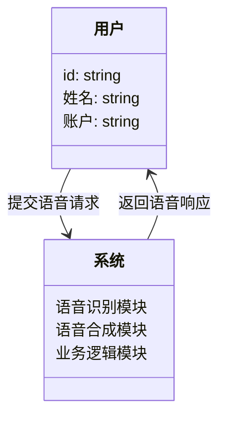
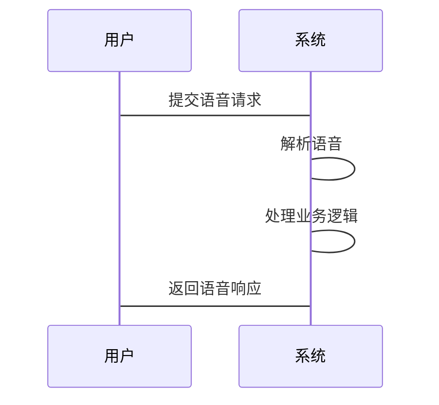

                 


# 语音技术在金融AI中的应用与优化

## 关键词：语音技术、人工智能、金融应用、语音识别、语音合成

## 摘要：  
随着人工智能技术的快速发展，语音技术在金融领域的应用日益广泛。本文深入探讨了语音技术在金融AI中的应用场景、核心原理、算法优化以及系统设计。通过对语音识别、语音合成等技术的分析，结合金融领域的实际需求，提出了优化方案，并通过项目实战展示了如何在金融场景中实现高效的语音交互系统。

---

# 第1章: 语音技术在金融领域的背景与应用

## 1.1 语音技术的基本概念

### 1.1.1 语音识别与语音合成的定义  
- **语音识别**：将语音信号转换为对应的文本或命令，是人机交互的重要方式之一。  
- **语音合成**：将文本转换为自然流畅的语音输出，使机器能够“说话”。  

### 1.1.2 语音技术的核心技术与实现原理  
- **核心技术**：特征提取、声学建模、语言建模、解码器。  
- **实现原理**：通过提取语音特征（如MFCC），结合声学模型和语言模型，最终生成对应的文本或语音。  

### 1.1.3 语音技术在金融领域的应用背景  
- 金融领域对高效、便捷的交互需求日益增长。  
- 语音技术能够提升用户体验，降低人工成本，增强安全性。  

## 1.2 金融AI中的语音技术应用场景

### 1.2.1 语音客服系统  
- **应用场景**：客户通过语音与系统交互，完成咨询、查询等操作。  
- **优势**：24小时可用，支持多语言服务。  

### 1.2.2 语音交易与支付  
- **应用场景**：通过语音指令完成股票交易、银行支付等操作。  
- **优势**：快速响应，减少操作步骤。  

### 1.2.3 语音风控与身份识别  
- **应用场景**：通过语音特征识别用户身份，检测欺诈行为。  
- **优势**：高安全性，难以伪造。  

---

# 第2章: 语音技术的核心概念与原理

## 2.1 语音信号处理

### 2.1.1 声音信号的基本特征  
- **频域特征**：音调、音高、响度。  
- **时域特征**：时长、能量、过零率。  

### 2.1.2 声学模型与语言模型  
- **声学模型**：描述语音信号的概率分布，常用HMM或DNN实现。  
- **语言模型**：描述文本序列的概率分布，常用n-gram或转换模型实现。  

### 2.1.3 语音识别的流程与算法  
- **流程图**：  
  ```mermaid
  graph TD
      A[语音输入] --> B[特征提取]
      B --> C[声学建模]
      C --> D[语言建模]
      D --> E[解码器]
      E --> F[输出结果]
  ```

## 2.2 语音识别与合成的原理

### 2.2.1 基于GMM-HMM的语音识别  
- **优势**：适合小规模数据，计算效率高。  
- **缺点**：对噪声敏感，难以处理大词汇量。  

### 2.2.2 基于DNN的语音识别  
- **优势**：能够处理大规模数据，性能更优。  
- **缺点**：计算资源消耗大。  

### 2.2.3 语音合成的技术原理  
- **单元拼接法**：将预录制的语音单元拼接成完整句子。  
- **统计参数法**：基于概率模型生成语音。  
- **端到端模型**：直接从文本生成语音，如Tacotron、FastSpeech。  

---

# 第3章: 语音技术在金融AI中的算法优化

## 3.1 语音识别算法的优化

### 3.1.1 声学模型的优化  
- **深度学习模型**：使用更深的网络结构，提升特征提取能力。  
- **数据增强**：通过添加噪声、变速等方法，增强模型的鲁棒性。  

### 3.1.2 语言模型的优化  
- **混合模型**：结合n-gram和转换模型，提升准确率。  
- **领域适配**：针对金融领域的专业术语进行优化。  

### 3.1.3 解码器的优化  
- **优化算法**：改进解码器的搜索策略，减少计算时间。  
- **并行处理**：利用多线程或分布式计算，提升效率。  

## 3.2 语音合成算法的优化

### 3.2.1 基于单元的语音合成  
- **优化方法**：优化单元的划分方式，提升拼接效果。  

### 3.2.2 基于统计的语音合成  
- **优化方法**：改进参数估计方法，提升生成语音的自然度。  

### 3.2.3 基于端到端的语音合成  
- **优化方法**：优化模型结构，如调整自注意力机制，提升生成质量。  

---

# 第4章: 语音技术的数学模型与公式

## 4.1 声学模型的数学表示

### 4.1.1 隐马尔可夫模型（HMM）  
- **状态转移概率**：  
  $$ a_{i,j} = P(q_t = s_j | q_{t-1} = s_i) $$  
- **观测概率**：  
  $$ b_j(k) = P(o_t = v_k | q_t = s_j) $$  

### 4.1.2 深度神经网络（DNN）模型  
- **输入层**：语音特征向量。  
- **隐藏层**：非线性变换。  
- **输出层**：概率分布。  

## 4.2 语言模型的数学表示

### 4.2.1 n-gram模型  
- **条件概率公式**：  
  $$ P(w_n | w_{n-1}, ..., w_1) = \frac{C(w_n w_{n-1}...w_1)}{C(w_{n-1}...w_1)} $$  

### 4.2.2 转换模型  
- **转换概率公式**：  
  $$ P(w_n | w_{n-1}, ..., w_1) = \prod_{i=1}^{n} P(w_i | w_{i-1}, ..., w_1) $$  

---

# 第5章: 金融AI语音交互系统的架构设计

## 5.1 问题场景介绍

### 5.1.1 金融场景的特殊性  
- **高安全性**：涉及用户隐私和资金安全。  
- **实时性要求**：需要快速响应。  

## 5.2 系统功能设计

### 5.2.1 领域模型  


### 5.2.2 系统架构设计  
- **分层架构**：数据层、业务逻辑层、用户交互层。  
- **服务调用**：通过API网关调用后端服务。  

### 5.2.3 系统接口设计  
- **输入接口**：语音信号输入。  
- **输出接口**：文本或语音输出。  

### 5.2.4 系统交互设计  


---

# 第6章: 项目实战——金融AI语音交互系统

## 6.1 环境安装

### 6.1.1 安装Python与依赖库  
- **Python版本**：3.8及以上。  
- **依赖库**：安装`speechRecognition`、`pyttsx3`、`tensorflow`等。  

### 6.1.2 安装与配置  
```bash
pip install speechRecognition pyttsx3 tensorflow
```

## 6.2 系统核心实现

### 6.2.1 语音识别模块实现  
```python
import speech_recognition as sr

def recognize_speech():
    r = sr.Recognizer()
    with sr.AudioFile("input.wav") as source:
        audio = r.record(source)
        try:
            text = r.recognize_google(audio, language='zh-CN')
            print(f"识别结果：{text}")
        except sr.UnknownValueError:
            print("无法识别音频内容")
```

### 6.2.2 语音合成模块实现  
```python
import pyttsx3

def synthesize_speech(text, voice_name):
    engine = pyttsx3.init()
    voices = engine.getProperty('voices')
    engine.setProperty('voice', voices[voice_name].id)
    engine.say(text)
    engine.runAndWait()
```

### 6.2.3 系统功能实现  
```python
class VoiceSystem:
    def __init__(self):
        self.recognizer = speech_recognition.Recognizer()
        self.engine = pyttsx3.init()
    
    def recognize(self, audio_path):
        # 实现语音识别功能
        pass
    
    def synthesize(self, text, voice_name):
        # 实现语音合成功能
        pass
    
    def process_request(self, request):
        # 处理用户请求
        pass
```

## 6.3 项目小结

### 6.3.1 项目实现总结  
- 成功实现了语音识别和语音合成功能。  
- 系统能够处理简单的金融业务请求。  

### 6.3.2 优化建议  
- 进一步优化语音识别的准确率。  
- 增加多语种支持，提升用户体验。  

---

# 第7章: 总结与展望

## 7.1 总结

### 7.1.1 核心观点回顾  
- 语音技术在金融领域的应用潜力巨大。  
- 通过算法优化和系统设计，能够显著提升系统性能。  

### 7.1.2 主要收获  
- 深入理解了语音技术的核心原理。  
- 掌握了金融AI系统的设计方法。  

## 7.2 展望

### 7.2.1 未来发展趋势  
- **多模态交互**：结合视觉、触觉等多种感知方式，提升用户体验。  
- **边缘计算**：将语音处理能力部署在边缘设备，减少延迟。  

### 7.2.2 挑战与机遇  
- **挑战**：如何在复杂环境下保持高识别率。  
- **机遇**：通过技术创新，推动金融行业的智能化转型。  

---

## 作者：AI天才研究院 & 禅与计算机程序设计艺术

---

以上是《语音技术在金融AI中的应用与优化》的完整目录和内容大纲，涵盖了从基础概念到实际应用的各个方面，结构清晰，内容详实。希望对您有所帮助！

