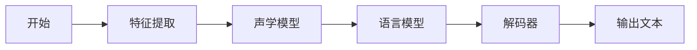
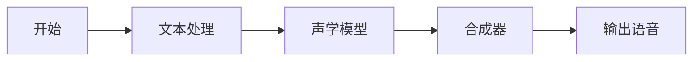
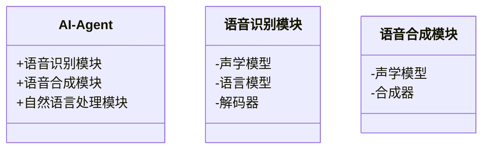
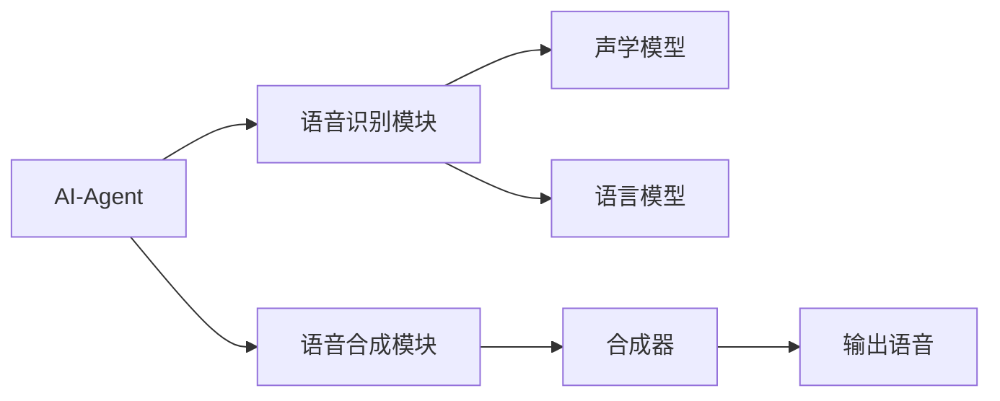
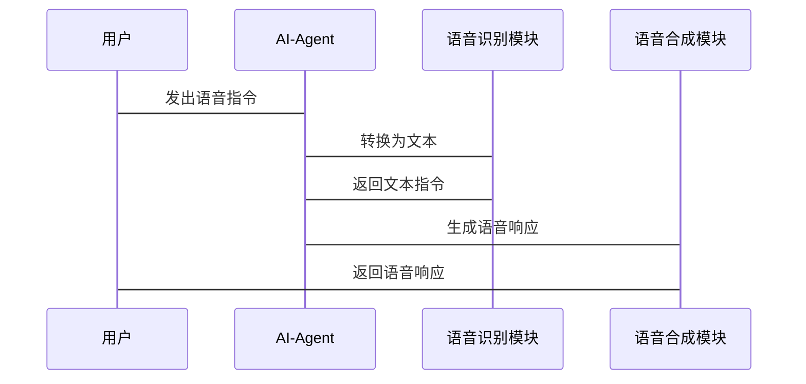

                 


# 语音识别与合成：为AI Agent添加语音交互能力

> 关键词：语音识别，语音合成，AI Agent，语音交互，自然语言处理

> 摘要：本文详细探讨了语音识别与合成技术的核心原理、算法实现及其在AI Agent中的应用。通过分析语音交互的系统架构、算法流程和实际案例，展示了如何为AI Agent添加语音交互能力。文章内容涵盖背景介绍、核心概念、算法原理、系统架构设计、项目实战以及总结展望，为读者提供全面的技术指导。

---

# 第一部分: 语音识别与合成的背景与基础

## 第1章: 语音识别与合成概述

### 1.1 语音识别的基本概念
#### 1.1.1 语音识别的定义
语音识别是将语音信号转换为文本或命令的过程，是人机交互的重要技术。

#### 1.1.2 语音识别的核心技术
- **声学模型**：基于语音信号的概率模型。
- **语言模型**：基于上下文的概率模型。
- **解码器**：将声学信号解码为文本。

#### 1.1.3 语音识别的应用场景
- 智能音箱
- 手机语音助手
- 医疗记录系统

### 1.2 语音合成的基本概念
#### 1.2.1 语音合成的定义
语音合成是将文本转换为语音的过程，是实现语音交互的关键技术。

#### 1.2.2 语音合成的核心技术
- **声学参数提取**：提取音调、音量等参数。
- **声学模型构建**：基于深度学习构建语音生成模型。
- **合成器**：将文本转换为语音。

#### 1.2.3 语音合成的应用场景
- 朗读系统
- 语音导航
- 电子书阅读

### 1.3 语音识别与合成的联系与区别
#### 1.3.1 语音识别与合成的联系
- 两者都涉及语音信号处理。
- 识别是将语音转为文本，合成是将文本转为语音。

#### 1.3.2 语音识别与合成的区别
| 技术 | 语音识别 | 语音合成 |
|------|-----------|-----------|
| 输入 | 语音信号 | 文本 |
| 输出 | 文本/命令 | 语音信号 |
| 应用 | 转录、语音控制 | 朗读、语音播报 |

#### 1.3.3 语音识别与合成的综合应用
例如：用户通过语音识别输入指令，AI Agent通过语音合成返回语音响应。

---

## 第2章: 语音识别与合成的核心概念

### 2.1 语音信号的基本特性
#### 2.1.1 频率、振幅与波形
- 频率：声音的高低。
- 振幅：声音的强弱。
- 波形：声音的数学表示。

#### 2.1.2 采样率与量化
- 采样率：每秒采集的样本数。
- 量化：将模拟信号转换为数字信号。

#### 2.1.3 语音信号的时域与频域分析
- 时域：显示波形的时间轴。
- 频域：显示频率分布的频谱图。

### 2.2 语音识别的核心原理
#### 2.2.1 声学模型
- 基于HMM的声学模型：
  $$ P(x|w) = \prod_{t=1}^{T} a_{t,t+1} $$
- 基于深度学习的声学模型：如LSTM和Transformer。

#### 2.2.2 语言模型
- 基于n-gram的语言模型：
  $$ P(w_i|w_{i-1},w_{i-2},...,w_{i-n}) $$
- 基于深度学习的语言模型：如Transformer。

#### 2.2.3 解码器的作用
- 将声学信号解码为文本。

### 2.3 语音合成的核心原理
#### 2.3.1 声学参数的提取
- 提取音调、音量等参数。

#### 2.3.2 声学模型的构建
- 基于深度学习构建语音生成模型。

#### 2.3.3 合成器的工作流程
- 输入文本，生成语音信号。

### 2.4 本章小结

---

## 第3章: 语音识别与合成的算法原理

### 3.1 语音识别算法
#### 3.1.1 隐马尔可夫模型（HMM）
- 用于建模语音信号的概率分布。
- 状态转移概率：
  $$ a_{i,j} = P(q_{t}=j | q_{t-1}=i) $$
- 发射概率：
  $$ b_j(o_t) = P(o_t | q_t = j) $$

#### 3.1.2 长短期记忆网络（LSTM）
- 用于捕捉长距离依赖关系。

#### 3.1.3 注意力机制（Attention）
- 用于关注输入序列的重要部分。

### 3.2 语音合成算法
#### 3.2.1 基于单元的语音合成
- 使用预处理的语音片段拼接生成语音。

#### 3.2.2 基于统计的语音合成
- 使用概率模型生成语音。

#### 3.2.3 基于深度学习的语音合成
- 使用生成对抗网络（GAN）生成高质量语音。

### 3.3 算法流程图
#### 3.3.1 语音识别算法流程图


#### 3.3.2 语音合成算法流程


---

## 第4章: 系统分析与架构设计

### 4.1 系统功能设计
#### 4.1.1 领域模型


#### 4.1.2 系统架构设计


### 4.2 系统接口设计
#### 4.2.1 接口定义
- 输入：语音信号或文本。
- 输出：文本或语音信号。

#### 4.2.2 交互流程


---

## 第5章: 项目实战

### 5.1 环境安装
- 安装Python、TensorFlow、Keras等工具。

### 5.2 系统核心实现
#### 5.2.1 语音识别实现
```python
import tensorflow as tf
from tensorflow.keras import layers

model = tf.keras.Sequential()
model.add(layers.InputLayer(input_shape=(None, 13)))
model.add(layers.LSTM(128, return_sequences=True))
model.add(layers.Dense(37, activation='softmax'))
```

#### 5.2.2 语音合成实现
```python
import numpy as np
from scipy.io import soundfile

def synthesize_speech(text, model):
    # 输入文本处理
    # 通过模型生成语音信号
    # 输出音频文件
    pass
```

### 5.3 代码解读与分析
#### 5.3.1 语音识别代码解读
- 输入层：处理语音特征向量。
- LSTM层：捕捉时间序列中的长距离依赖。
- Dense层：输出每个时间步的识别结果。

#### 5.3.2 语音合成代码解读
- 输入文本处理：将文本转换为声学参数。
- 模型生成：通过深度学习模型生成语音信号。
- 输出音频：将语音信号保存为音频文件。

### 5.4 实际案例分析
#### 5.4.1 案例介绍
- 使用Python实现一个简单的语音识别系统。

#### 5.4.2 案例分析
- 识别准确率分析。
- 系统性能优化。

### 5.5 项目小结

---

## 第6章: 总结与展望

### 6.1 本章小结
- 介绍了语音识别与合成的核心技术。
- 展示了如何将这些技术应用于AI Agent。

### 6.2 未来展望
- 新兴技术对语音交互的影响。
- 更高精度和实时性的研究方向。

---

# 作者：AI天才研究院/AI Genius Institute & 禅与计算机程序设计艺术 /Zen And The Art of Computer Programming

---

以上是《语音识别与合成：为AI Agent添加语音交互能力》的技术博客文章大纲。

