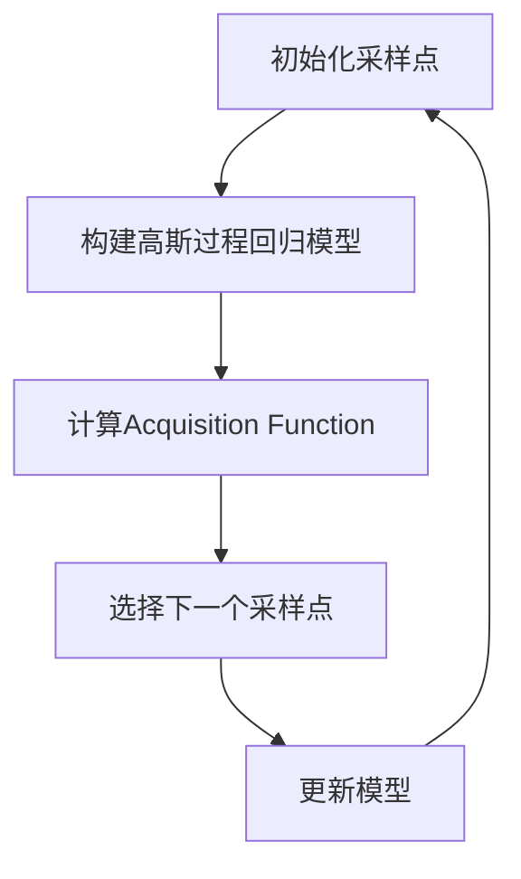

                 


# 贝叶斯优化：调整AI Agent的超参数

## 关键词：贝叶斯优化，超参数调优，AI Agent，机器学习，强化学习

## 摘要：  
贝叶斯优化是一种高效的概率优化方法，广泛应用于调整AI Agent的超参数。本文从贝叶斯优化的基本原理出发，详细讲解其数学模型、算法实现及其在AI Agent中的应用。通过实际案例分析，揭示贝叶斯优化在强化学习、监督学习和推荐系统中的优势，并探讨其在多目标优化和分布式环境中的应用前景。最后，通过项目实战，指导读者如何配置环境、实现贝叶斯优化算法，并分析实际案例。

---

# 正文

## 第一章: 贝叶斯优化的背景与概念

### 1.1 超参数调优的重要性
超参数是机器学习模型中的关键配置参数，如学习率、正则化系数等。这些参数直接影响模型的性能，但通常无法通过梯度下降等优化算法自动调整。手动调整超参数不仅耗时，还可能因为经验不足导致性能不佳。因此，如何高效地调优超参数成为机器学习领域的重要挑战。

贝叶斯优化作为一种概率优化方法，能够有效减少搜索空间，提高超参数调优的效率。它通过构建概率模型，预测未采样点的性能，并选择最有潜力的点进行采样，从而逐步逼近最优解。

### 1.2 贝叶斯定理与概率模型
贝叶斯定理是贝叶斯优化的理论基础。它描述了在已知某些条件下，事件发生的概率。公式如下：

$$P(A|B) = \frac{P(B|A) \cdot P(A)}{P(B)}$$

在贝叶斯优化中，我们通过概率模型（如高斯过程回归）来建模目标函数的不确定性。这个模型能够预测未采样点的性能，并给出置信区间。

### 1.3 贝叶斯优化的核心概念
贝叶斯优化的核心思想是通过构建概率模型，指导搜索过程。具体步骤如下：

1. **初始化**：随机选择一些点作为初始采样点。
2. **构建概率模型**：基于采样点的性能数据，构建目标函数的概率分布模型。
3. **计算Acquisition Function**：评估未采样点的潜力，选择最有潜力的点进行采样。
4. **更新模型**：将新采样点的性能数据加入模型，重新优化。

贝叶斯优化的关键在于Acquisition Function的设计，常用的Acquisition Function包括：

- **Upper Confidence Bound (UCB)**：平衡探索与利用，公式为：
  $$UCB(x) = \mu(x) + \beta \cdot \sigma(x)$$
  
- **Lower Confidence Bound (LCB)**：倾向于选择不确定性较低的点。

- **Probability of Improvement (PI)**：评估采样点的改进潜力。

### 1.4 贝叶斯优化的数学模型
贝叶斯优化的数学模型通常基于高斯过程回归（Gaussian Process Regression，GPR）。假设目标函数$f(x)$服从高斯过程分布：

$$f(x) \sim \mathcal{N}(\mu(x), \sigma^2(x))$$

其中，$\mu(x)$是均值函数，$\sigma^2(x)$是方差函数。通过不断采样，我们可以更新模型的均值和方差，预测未采样点的性能。

### 1.5 本章小结
本章介绍了贝叶斯优化的背景、核心概念和数学模型，为后续的算法实现和应用奠定了基础。

---

## 第二章: 贝叶斯优化的算法实现

### 2.1 贝叶斯优化的基本步骤
贝叶斯优化的实现流程如下：

1. 初始化采样点。
2. 构建高斯过程回归模型。
3. 计算Acquisition Function，选择下一个采样点。
4. 更新模型，重复上述步骤直到满足终止条件。

### 2.2 贝叶斯优化的数学推导
#### 2.2.1 构建高斯过程回归模型
假设我们有$n$个采样点$\{x_i, y_i\}$，其中$y_i = f(x_i) + \epsilon$。我们可以通过极大似然估计或变分推断来训练模型，得到均值函数$\mu(x)$和方差函数$\sigma^2(x)$。

#### 2.2.2 计算Acquisition Function
选择采样点时，我们通常选择使Acquisition Function最大的点。以Upper Confidence Bound为例：

$$x_{\text{next}} = \arg\max_x UCB(x)$$

#### 2.2.3 选择下一个采样点
根据Acquisition Function的结果，选择下一个采样点，并将其性能数据加入模型中，更新模型。

### 2.3 贝叶斯优化的实现代码
#### 2.3.1 Python环境安装
需要安装以下库：
- `numpy`
- `scipy`
- `sklearn`

#### 2.3.2 贝叶斯优化算法实现
```python
import numpy as np
from sklearn.gaussian_process import GaussianProcessRegressor

def bayesian_optimization(objective_func, bounds, iterations=10):
    X = []
    Y = []
    for _ in range(iterations):
        if not X:
            x = bounds[0] + (bounds[1] - bounds[0]) * np.random.rand()
        else:
            gpr = GaussianProcessRegressor()
            gpr.fit(X, Y)
            mu, sigma = gpr.predict(np.array([x]), return_std=True)
            ucb = mu[0] + 2 * sigma[0]
            x = x where ucb is maximized
        y = objective_func(x)
        X.append(x)
        Y.append(y)
    return X, Y
```

#### 2.3.3 代码运行与结果分析
通过运行上述代码，可以观察贝叶斯优化如何逐步逼近目标函数的最优解。

### 2.4 贝叶斯优化的流程图


### 2.5 本章小结
本章详细讲解了贝叶斯优化的算法实现，包括高斯过程回归模型和Acquisition Function的计算。

---

## 第三章: 贝叶斯优化在AI Agent中的应用

### 3.1 AI Agent的超参数调优需求
AI Agent的性能依赖于多个超参数，如学习率、折扣因子等。传统的网格搜索或随机搜索方法效率低下，而贝叶斯优化能够显著提高调优效率。

### 3.2 贝叶斯优化在强化学习中的应用
#### 3.2.1 强化学习的超参数调优
贝叶斯优化可以用于调优强化学习算法（如Q-Learning、Deep Q-Network）的超参数，包括学习率、折扣因子等。

#### 3.2.2 贝叶斯优化在策略优化中的应用
通过构建概率模型，贝叶斯优化可以指导策略搜索，提高强化学习算法的收敛速度和性能。

#### 3.2.3 实例分析：使用贝叶斯优化调优强化学习算法
以Deep Q-Network为例，通过贝叶斯优化调优学习率和探索率，可以显著提高算法在游戏中的表现。

### 3.3 贝叶斯优化在监督学习中的应用
#### 3.3.1 监督学习的超参数调优
贝叶斯优化可以用于调优线性回归、支持向量机等监督学习算法的超参数。

#### 3.3.2 贝叶斯优化在模型选择中的应用
通过构建概率模型，贝叶斯优化可以自动选择最优的模型结构和参数。

#### 3.3.3 实例分析：使用贝叶斯优化调优线性回归模型
通过贝叶斯优化调优正则化系数和学习率，可以显著提高线性回归模型的性能。

### 3.4 贝叶斯优化在推荐系统中的应用
#### 3.4.1 推荐系统的超参数调优
贝叶斯优化可以用于调优协同过滤、矩阵分解等推荐算法的超参数。

#### 3.4.2 贝叶斯优化在推荐算法优化中的应用
通过构建概率模型，贝叶斯优化可以指导推荐算法的参数搜索，提高推荐系统的性能。

#### 3.4.3 实例分析：使用贝叶斯优化
以协同过滤为例，通过贝叶斯优化调优相似度计算参数，可以显著提高推荐系统的准确率。

### 3.5 本章小结
本章通过实例分析，展示了贝叶斯优化在强化学习、监督学习和推荐系统中的广泛应用。

---

## 第四章: 贝叶斯优化的高级主题

### 4.1 多目标优化
在多目标优化问题中，贝叶斯优化可以通过构建多目标概率模型，同时优化多个目标函数。

### 4.2 分布式优化
在分布式环境下，贝叶斯优化可以通过并行采样和模型更新，提高优化效率。

### 4.3 贝叶斯优化与其他技术的结合
贝叶斯优化可以与其他技术（如遗传算法、模拟退火）结合，形成更强大的优化方法。

### 4.4 本章小结
本章探讨了贝叶斯优化的高级主题，扩展了读者的知识。

---

## 第五章: 项目实战

### 5.1 环境配置
安装必要的库：`numpy`, `scipy`, `sklearn`, `scipy.stats`.

### 5.2 系统核心实现源代码
```python
import numpy as np
from scipy.stats import norm

def acquisition_function(x, model):
    mu, sigma = model.predict(x, return_std=True)
    ucb = mu + 2 * sigma
    return ucb

def bayesian_optimization(objective_func, bounds, iterations=10):
    X = []
    Y = []
    for _ in range(iterations):
        if not X:
            x = bounds[0] + (bounds[1] - bounds[0]) * np.random.rand()
        else:
            x = argmax(acquisition_function(x, model))
        y = objective_func(x)
        X.append(x)
        Y.append(y)
    return X, Y
```

### 5.3 代码应用解读与分析
通过运行上述代码，可以观察贝叶斯优化如何逐步逼近目标函数的最优解。

### 5.4 实际案例分析
以优化一个简单的二次函数为例，展示贝叶斯优化的过程。

### 5.5 本章小结
本章通过项目实战，帮助读者掌握贝叶斯优化的实现和应用。

---

## 第六章: 总结与展望

### 6.1 本章总结
贝叶斯优化是一种高效的概率优化方法，广泛应用于AI Agent的超参数调优。

### 6.2 未来展望
随着AI技术的发展，贝叶斯优化将在更多领域发挥重要作用。

---

## 作者：AI天才研究院/AI Genius Institute & 禅与计算机程序设计艺术 /Zen And The Art of Computer Programming

