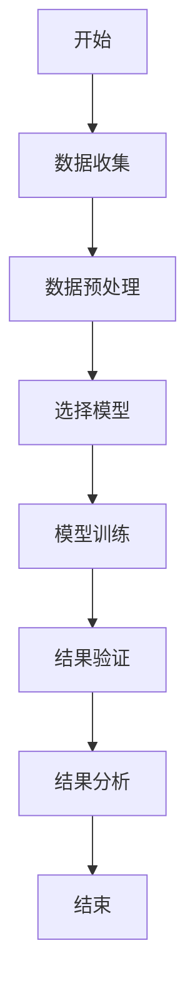
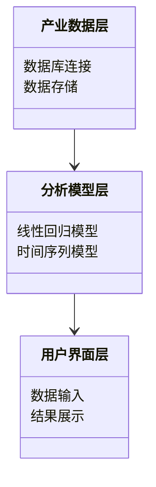
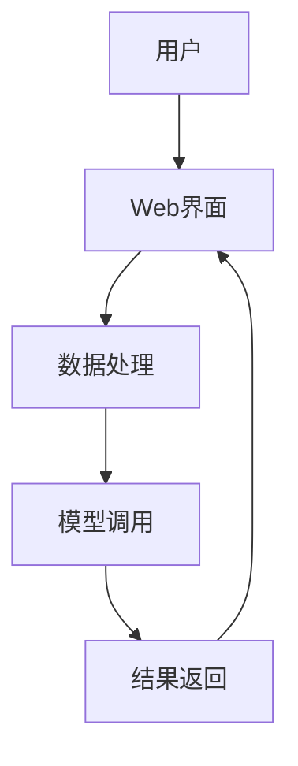
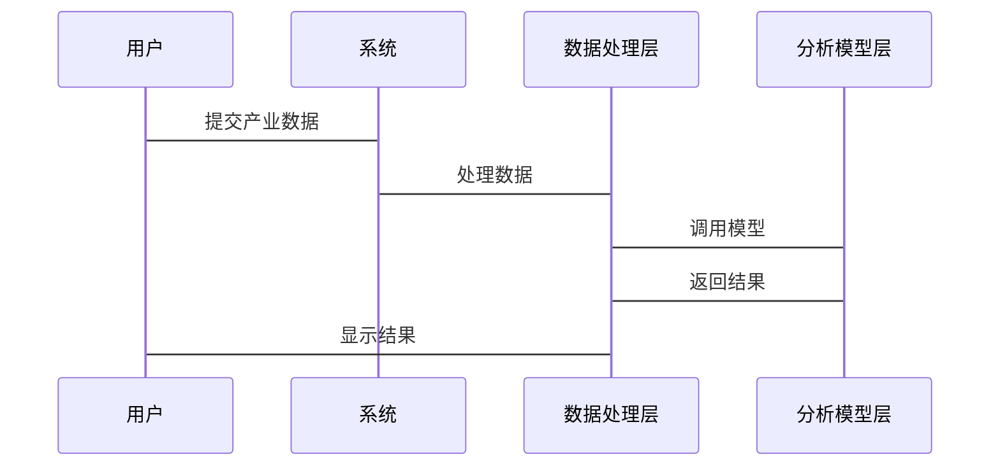

                 


# 费雪的产业发展趋势分析

> 关键词：费雪投资理论，产业发展趋势，投资分析，趋势预测，系统架构

> 摘要：本文深入探讨了费雪投资理论在现代产业分析中的应用，结合数学模型和系统架构，分析了产业发展趋势的预测方法，通过实际案例展示了如何将理论与实践相结合，为投资者提供科学的决策支持。

---

## 第一章：费雪投资理论概述

### 1.1 费雪投资理论的起源与发展

#### 1.1.1 费雪投资理论的起源
菲利普·费雪（Philip Fisher）是20世纪著名的投资专家，他提出了“成长型投资”的概念。费雪认为，投资者应该投资于那些具有持续增长潜力的公司，而非仅仅关注短期收益。这种理论在当时突破了传统的“价值投资”观念，强调企业成长的重要性。

#### 1.1.2 费雪投资理论的核心思想
费雪的核心思想在于，投资成功的关键在于选择那些能够持续创新、扩展市场的公司。他认为，企业的发展不仅仅依赖于市场环境，还取决于管理层的战略眼光和创新能力。这种观点为现代产业分析提供了重要的理论基础。

#### 1.1.3 费雪投资理论在现代投资分析中的地位
尽管费雪的理论提出于20世纪中期，但其核心思想在今天依然具有重要的指导意义。尤其是在当前科技高速发展的时代，企业成长潜力的评估变得更加复杂，费雪的理论为投资者提供了独特的视角。

### 1.2 产业发展趋势分析的重要性

#### 1.2.1 产业发展趋势分析的定义
产业发展趋势分析是指通过对某一产业的历史数据、市场动态、技术创新等因素的分析，预测未来产业的发展方向和潜力。这种分析方法能够帮助投资者识别具有成长性的企业，从而做出更明智的投资决策。

#### 1.2.2 产业发展趋势分析的意义
- **识别投资机会**：通过分析产业发展趋势，投资者可以发现那些处于上升期的产业，从而抓住投资机会。
- **降低投资风险**：趋势分析能够帮助投资者预测未来可能的风险，从而提前做好准备。
- **指导企业战略**：对于企业而言，了解产业趋势有助于制定更有效的市场进入和扩张策略。

#### 1.2.3 费雪投资理论与产业发展趋势分析的结合
费雪的理论强调了企业成长的重要性，而产业发展趋势分析则是将企业成长置于更宏观的产业背景中。两者结合，可以帮助投资者更全面地评估企业的潜力，从而做出更准确的投资决策。

---

## 第二章：产业发展趋势分析的核心概念

### 2.1 产业发展趋势分析的定义与属性

#### 2.1.1 产业发展趋势分析的定义
产业发展趋势分析是一种通过分析产业内部结构、市场需求、技术进步等因素，预测未来产业发展方向的方法。它不仅关注当前的市场状况，还试图揭示产业发展的潜在动力和阻力。

#### 2.1.2 产业发展趋势分析的核心属性对比表

| **属性**       | **描述**                                                                 |
|----------------|--------------------------------------------------------------------------|
| 市场需求       | 产业发展的主要驱动力，包括消费者需求的变化。                           |
| 技术进步       | 技术创新对企业竞争力的影响，决定产业发展的速度和方向。                   |
| 政策环境       | 政府政策对产业的支持或限制，影响产业发展的可能性。                       |
| 竞争格局       | 产业内主要企业的竞争状况，决定产业的集中度和市场结构。                   |
| 经济周期       | 经济波动对产业的影响，影响产业发展的周期性。                             |

#### 2.1.3 产业发展趋势分析的ER实体关系图

```mermaid
er
  entity 产业 (id, name, description)
  entity 企业 (id, name, industry, revenue)
  entity 技术 (id, name, description)
  entity 市场需求 (id, description)
  entity 政策 (id, name, description)
  
  产业 -- 关联 -> 企业
  产业 -- 关联 -> 技术
  产业 -- 关联 -> 市场需求
  产业 -- 关联 -> 政策
```

### 2.2 产业发展趋势分析与传统投资分析的联系

#### 2.2.1 传统投资分析的核心方法
传统投资分析主要依赖于财务指标和市场估值，如市盈率、市净率等。这种方法注重企业的当前财务状况，而忽略了企业的成长潜力。

#### 2.2.2 产业发展趋势分析的独特优势
产业发展趋势分析的优势在于它能够预测未来市场的发展方向，帮助投资者识别那些处于成长期的产业。这种分析方法更加注重企业的长期发展潜力，而非短期财务表现。

#### 2.2.3 两者结合的可行性与必要性
将传统投资分析与产业发展趋势分析结合起来，可以兼顾企业的当前财务状况和未来成长潜力。这种综合分析方法能够帮助投资者做出更全面的投资决策。

### 2.3 不同行业中的产业发展趋势分析

#### 2.3.1 高科技行业的产业发展趋势分析
高科技行业的发展受到技术创新和市场需求的双重影响。通过分析技术专利数量、研发投入和市场需求，可以预测高科技产业的未来发展趋势。

#### 2.3.2 制造业的产业发展趋势分析
制造业的产业发展趋势受到自动化技术、生产成本和政策环境的影响。通过分析这些因素，可以预测制造业的未来发展方向。

#### 2.3.3 服务业的产业发展趋势分析
服务业的发展趋势受到消费者需求、服务质量和技术应用的影响。通过分析这些因素，可以预测服务业的未来发展趋势。

---

## 第三章：产业发展趋势分析的算法原理

### 3.1 产业发展趋势预测的数学模型

#### 3.1.1 线性回归模型
线性回归模型是一种简单而有效的预测工具，适用于市场趋势的线性变化。其数学公式如下：

$$ y = \beta_0 + \beta_1x + \epsilon $$

其中，$y$ 是预测值，$x$ 是自变量，$\beta_0$ 和 $\beta_1$ 是回归系数，$\epsilon$ 是误差项。

#### 3.1.2 时间序列分析模型
时间序列分析模型适用于分析历史数据，预测未来趋势。其数学公式如下：

$$ R_t = \alpha + \beta R_{t-1} + \epsilon_t $$

其中，$R_t$ 是当前的值，$R_{t-1}$ 是前一期的值，$\alpha$ 和 $\beta$ 是参数，$\epsilon_t$ 是误差项。

#### 3.1.3 非线性回归模型
非线性回归模型适用于复杂的变化趋势，其数学公式如下：

$$ y = \beta_0 e^{\beta_1x} + \epsilon $$

其中，$y$ 是预测值，$x$ 是自变量，$\beta_0$ 和 $\beta_1$ 是参数，$\epsilon$ 是误差项。

### 3.2 产业发展趋势预测的数学公式

#### 3.2.1 线性回归公式
$$ y = \beta_0 + \beta_1x + \epsilon $$

#### 3.2.2 时间序列模型公式
$$ R_t = \alpha + \beta R_{t-1} + \epsilon_t $$

### 3.3 产业发展趋势预测的算法流程



#### 3.3.1 数据收集与预处理
- 数据收集：收集相关产业的历史数据，包括市场需求、技术进步、政策环境等。
- 数据预处理：对数据进行清洗、归一化处理，确保数据质量。

#### 3.3.2 模型训练与验证
- 模型训练：使用训练数据训练回归模型。
- 模型验证：使用测试数据验证模型的准确性。

#### 3.3.3 结果分析与优化
- 结果分析：分析模型的预测结果，找出误差的原因。
- 模型优化：根据分析结果优化模型参数，提高预测准确性。

---

## 第四章：产业发展趋势分析的系统架构设计

### 4.1 系统功能设计



### 4.2 系统架构设计



### 4.3 系统接口设计

- 数据输入接口：用于接收用户输入的产业数据。
- 模型调用接口：用于调用分析模型，进行趋势预测。
- 结果展示接口：用于将预测结果展示给用户。

### 4.4 系统交互流程



---

## 第五章：产业发展趋势分析的项目实战

### 5.1 环境安装

- **Python安装**：安装Python 3.x版本。
- **库安装**：使用pip安装numpy、pandas、scikit-learn等库。

### 5.2 核心实现源代码

```python
import numpy as np
import pandas as pd
from sklearn.linear_model import LinearRegression
from sklearn.metrics import mean_squared_error

# 数据加载
data = pd.read_csv('industry_data.csv')

# 数据预处理
X = data[['GDP', 'tech_investment']]
y = data['revenue']

# 模型训练
model = LinearRegression()
model.fit(X, y)

# 预测结果
y_pred = model.predict(X)

# 模型评估
mse = mean_squared_error(y, y_pred)
print(f"均方误差：{mse}")
```

### 5.3 案例分析与解读

以高科技产业为例，分析其发展趋势。通过收集该产业的历史数据，使用线性回归模型进行预测，评估模型的准确性，并根据结果制定投资策略。

### 5.4 项目小结

通过实际案例的分析，展示了产业发展趋势分析的具体实施过程。模型的选择和优化是关键，同时数据的质量直接影响预测结果的准确性。

---

## 第六章：产业发展趋势分析的最佳实践

### 6.1 小结

- 产业发展趋势分析是投资决策的重要工具，通过结合费雪投资理论和现代数据分析技术，能够更准确地预测产业趋势。
- 在实际应用中，需要综合考虑多种因素，合理选择模型，并不断优化分析方法。

### 6.2 注意事项

- 数据收集：确保数据的准确性和完整性。
- 模型选择：根据具体情况选择合适的模型。
- 结果解读：避免过度解读模型结果，结合实际情况进行分析。

### 6.3 拓展阅读

- 《投资学基础》
- 《数据分析实战》
- 《费雪投资理论与现代应用》

---

## 作者：AI天才研究院 & 禅与计算机程序设计艺术

通过本文的详细分析，我们不仅了解了费雪投资理论的核心思想，还掌握了产业发展趋势分析的具体方法。希望这些内容能够为投资者提供有价值的参考，帮助他们在复杂多变的市场环境中做出明智的投资决策。

