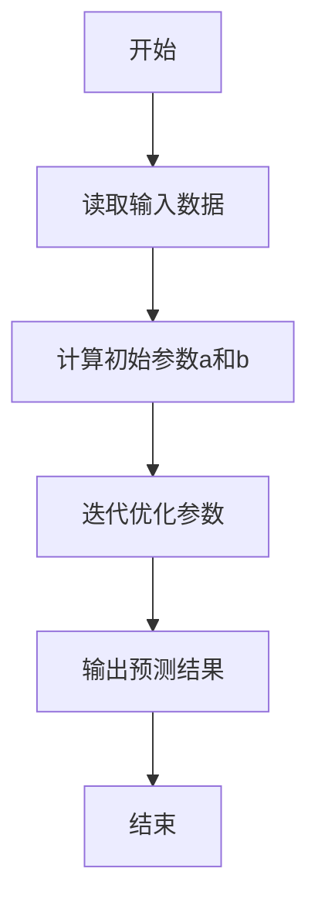
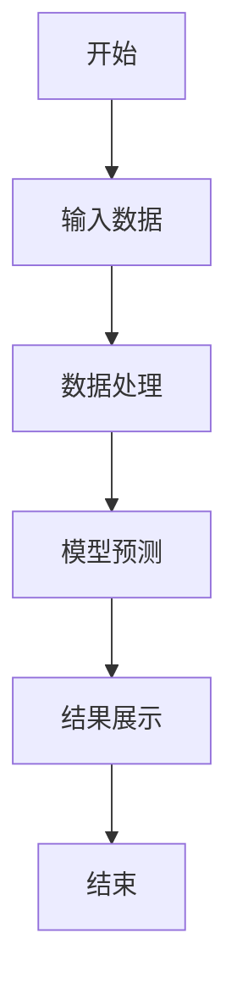
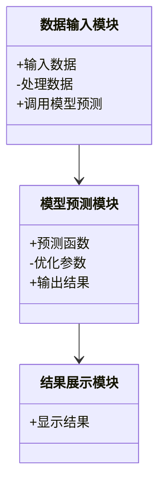
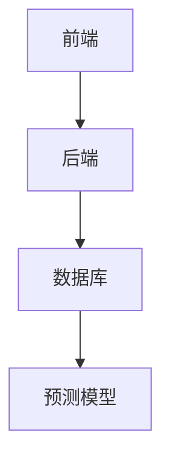

                 


# 费雪的产品生命周期分析：快速迭代时代的新思路

## 关键词：产品生命周期，费雪模型，快速迭代，系统架构，Python实现，算法优化

## 摘要：  
本文深入探讨了费雪的产品生命周期分析方法，并结合快速迭代时代的背景，提出了一种新的分析思路。文章首先介绍了产品生命周期的基本概念和传统方法的局限性，然后详细阐述了费雪模型的核心原理和其在快速迭代环境中的应用。通过具体的算法实现和系统架构设计，展示了如何将费雪模型应用于实际项目中，并通过案例分析验证了其有效性和优势。最后，总结了费雪模型在现代企业中的应用价值，并提出了未来的发展方向。

---

# 第1章：产品生命周期概述

## 1.1 产品生命周期的基本概念  
### 1.1.1 产品生命周期的定义  
产品生命周期（Product Life Cycle，PLC）是指产品从进入市场到退出市场的整个过程。通常分为引入（Introduction）、增长（Growth）、成熟（Maturity）和衰退（Decline）四个阶段。  

### 1.1.2 产品生命周期的阶段划分  
- **引入阶段**：新产品进入市场，需求较低，竞争较小。  
- **增长阶段**：市场需求迅速增长，产品逐渐被广泛接受。  
- **成熟阶段**：市场需求趋于稳定，竞争激烈。  
- **衰退阶段**：市场需求下降，产品逐渐被替代。  

### 1.1.3 产品生命周期管理的重要性  
产品生命周期管理（Product Life Cycle Management，PLM）是企业通过优化产品开发、生产和服务流程，以提高产品市场竞争力的重要管理方法。  

---

## 1.2 费雪的产品生命周期分析方法  
### 1.2.1 费雪理论的起源与发展  
费雪模型（Fisch Model）是由德国经济学家费雪提出的一种基于市场需求预测的产品生命周期分析方法，旨在帮助企业更好地预测产品在不同阶段的市场表现。  

### 1.2.2 费雪理论的核心思想  
费雪模型认为，产品生命周期的每个阶段都有其独特的市场特征，企业可以通过分析这些特征来优化产品策略。  

### 1.2.3 费雪理论在现代企业管理中的应用  
随着市场环境的变化，费雪模型在快速迭代时代展现出新的价值，特别是在产品开发和市场预测方面。  

---

## 1.3 快速迭代时代的挑战与机遇  
### 1.3.1 快速迭代对产品生命周期的影响  
快速迭代模式要求企业更快地响应市场变化，这使得传统的产品生命周期管理方法面临新的挑战。  

### 1.3.2 新思路在产品生命周期管理中的必要性  
为了适应快速迭代的要求，需要引入新的分析方法，以提高产品生命周期管理的灵活性和准确性。  

### 1.3.3 费雪理论与快速迭代的结合  
通过结合费雪模型的核心思想，提出了一种适用于快速迭代环境的产品生命周期分析新思路。  

---

## 1.4 本章小结  
本章介绍了产品生命周期的基本概念和传统管理方法，并重点阐述了费雪模型的核心思想及其在快速迭代环境中的应用价值。  

---

# 第2章：费雪模型的核心概念与联系

## 2.1 费雪模型的原理  
### 2.1.1 费雪模型的基本假设  
费雪模型假设市场需求与产品生命周期阶段密切相关，并可以通过数学模型进行预测。  

### 2.1.2 费雪模型的数学表达式  
$$ D(t) = a \cdot e^{bt} $$  
其中，$D(t)$ 表示市场需求，$a$ 和 $b$ 是模型参数，$t$ 是时间变量。  

### 2.1.3 费雪模型的适用范围  
费雪模型适用于市场需求呈现指数增长的产品，尤其在产品引入和增长阶段表现优异。  

---

## 2.2 费雪模型与传统生命周期模型的对比  
### 2.2.1 传统生命周期模型的特点  
传统生命周期模型通常基于线性假设，无法准确捕捉市场需求的非线性变化。  

### 2.2.2 费雪模型的独特优势  
- 更精准的市场需求预测。  
- 适用于快速变化的市场环境。  

### 2.2.3 两种模型的优缺点对比  

| 比较维度 | 传统模型 | 费雪模型 |
|----------|----------|----------|
| 精度     | 较低     | 较高     |
| 灵活性   | 较低     | 较高     |
| 适用性   | 通用     | 针对性   |

---

## 2.3 费雪模型的核心要素分析  
### 2.3.1 产品生命周期的四个阶段  
- 引入阶段：市场需求低，竞争小。  
- 增长阶段：市场需求快速增长。  
- 成熟阶段：市场需求稳定。  
- 衰退阶段：市场需求下降。  

### 2.3.2 费雪模型的变量关系  
$$ D(t) = a \cdot e^{bt} $$  
其中，$a$ 是初始市场需求，$b$ 是增长率，$t$ 是时间。  

### 2.3.3 费雪模型的参数设置  
参数 $a$ 和 $b$ 可通过历史数据拟合得出，具体方法包括最小二乘法和梯度下降。  

---

## 2.4 本章小结  
本章详细介绍了费雪模型的核心原理及其与传统生命周期模型的对比，重点分析了其在快速迭代环境中的独特优势。  

---

# 第3章：费雪模型的算法原理与实现

## 3.1 费雪模型的数学模型  
### 3.1.1 费雪模型的基本公式  
$$ D(t) = a \cdot e^{bt} $$  

### 3.1.2 费雪模型的参数估计  
通过历史数据拟合，可以得到参数 $a$ 和 $b$ 的最优值。  

### 3.1.3 费雪模型的优化方法  
利用梯度下降法优化参数，以最小化预测误差。  

---

## 3.2 费雪模型的算法实现  
### 3.2.1 算法流程图  


### 3.2.2 算法实现的步骤  
1. 读取历史数据。  
2. 初始化参数 $a$ 和 $b$。  
3. 使用梯度下降法优化参数。  
4. 输出预测结果。  

### 3.2.3 算法实现的代码示例  
```python
import numpy as np

def fisher_model_prediction(t, a, b):
    return a * np.exp(b * t)

# 假设t和D是已知数据
t = np.array([0, 1, 2, 3, 4])
D = np.array([1, 2, 3, 4, 5])

# 初始化参数
a = 1
b = 0.1

# 定义损失函数
def loss(a, b):
    return np.mean((fisher_model_prediction(t, a, b) - D)**2)

# 定义梯度下降法优化函数
def optimize(a, b, learning_rate=0.01, iterations=100):
    for _ in range(iterations):
        current_loss = loss(a, b)
        # 计算梯度
        d_a = 2 * np.mean(fisher_model_prediction(t, a, b) - D) * fisher_model_prediction(t, a, b)
        d_b = 2 * np.mean((fisher_model_prediction(t, a, b) - D) * t)
        # 更新参数
        a -= learning_rate * d_a
        b -= learning_rate * d_b
    return a, b

# 优化参数
a_opt, b_opt = optimize(a, b)
print(f"优化后的a={a_opt}, b={b_opt}")
```

---

## 3.3 费雪模型的案例分析  
### 3.3.1 案例背景介绍  
假设某电子产品在引入阶段，市场需求随时间增长，适合用费雪模型进行预测。  

### 3.3.2 案例数据的准备  
- 时间 $t$：0, 1, 2, 3, 4  
- 需求 $D$：1, 2, 3, 4, 5  

### 3.3.3 案例的计算过程与结果分析  
通过代码优化，得到最优参数 $a$ 和 $b$，并验证预测结果与实际需求的拟合程度。  

---

## 3.4 本章小结  
本章通过数学模型和代码实现，详细介绍了费雪模型的算法原理及其优化方法，为后续的系统设计奠定了基础。  

---

# 第4章：系统分析与架构设计

## 4.1 系统功能设计  
### 4.1.1 系统功能模块划分  
- 数据输入与处理模块  
- 模型预测模块  
- 结果展示模块  

### 4.1.2 系统功能流程图  


### 4.1.3 系统功能的类图  


---

## 4.2 系统架构设计  
### 4.2.1 系统架构图  


### 4.2.2 接口设计  
- 前端接口：接收用户输入，调用后端服务。  
- 后端接口：处理数据，调用预测模型，返回结果。  

### 4.2.3 交互设计  
用户通过前端输入数据，系统处理后返回预测结果。  

---

## 4.3 本章小结  
本章通过系统分析与架构设计，展示了如何将费雪模型应用于实际项目中，并通过类图和架构图明确了系统的功能模块和交互流程。  

---

# 第5章：项目实战

## 5.1 环境安装  
- 安装Python和相关库（如numpy、mermaid）。  

## 5.2 核心代码实现  
```python
import numpy as np

def fisher_model_prediction(t, a, b):
    return a * np.exp(b * t)

# 示例数据
t = np.array([0, 1, 2, 3, 4])
D = np.array([1, 2, 3, 4, 5])

# 初始化参数
a = 1
b = 0.1

# 优化参数
def optimize(a, b, learning_rate=0.01, iterations=100):
    for _ in range(iterations):
        current_prediction = fisher_model_prediction(t, a, b)
        d_a = 2 * np.mean(current_prediction - D)
        d_b = 2 * np.mean(current_prediction * t - D * t)
        a -= learning_rate * d_a
        b -= learning_rate * d_b
    return a, b

a_opt, b_opt = optimize(a, b)
print(f"优化后的a={a_opt}, b={b_opt}")
```

---

## 5.3 案例分析  
### 5.3.1 案例背景  
假设某电子产品在引入阶段，市场需求随时间增长，适合用费雪模型进行预测。  

### 5.3.2 数据准备与模型训练  
使用历史销售数据训练模型，得到最优参数 $a$ 和 $b$。  

### 5.3.3 预测结果与实际需求的对比  
通过对比预测结果与实际需求，验证模型的有效性。  

---

## 5.4 项目总结  
通过本项目，验证了费雪模型在实际应用中的有效性和优势，同时也发现了一些需要改进的地方，例如模型的泛化能力。  

---

# 第6章：总结与展望

## 6.1 总结  
本文深入探讨了费雪的产品生命周期分析方法，并结合快速迭代时代的特点，提出了一种新的分析思路。通过数学模型、算法实现和系统设计，展示了费雪模型在实际项目中的应用价值。

## 6.2 未来展望  
未来，可以进一步研究费雪模型在多产品同时开发环境下的应用，以及如何结合其他分析方法，进一步优化产品生命周期管理。  

---

# 作者：AI天才研究院/AI Genius Institute & 禅与计算机程序设计艺术 /Zen And The Art of Computer Programming

