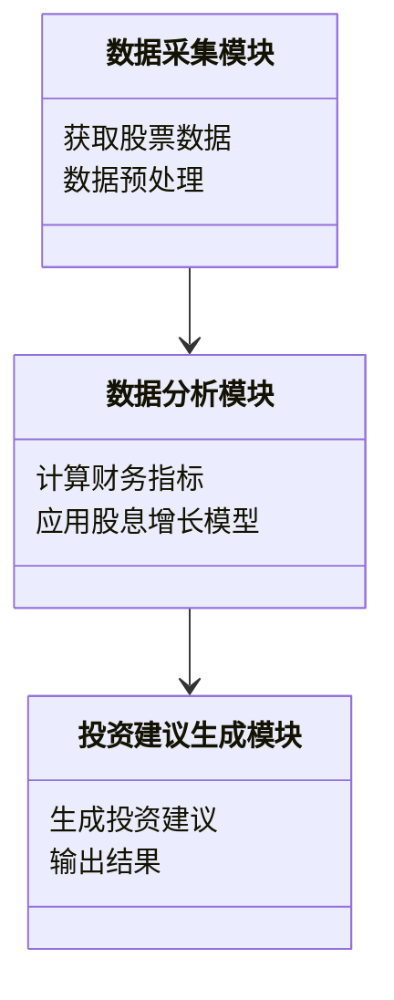

                 


# 费雪的优质成长股理论：寻找未来的赢家

> 关键词：费雪投资理论，优质成长股，成长股投资，股息增长模型，内在价值，投资策略，风险管理

> 摘要：本文深入探讨了菲利普·费雪的优质成长股理论，分析其核心概念、数学模型及投资策略，并通过实际案例展示其在现代投资中的应用。文章结合系统架构设计和项目实战，提供从理论到实践的完整指南，帮助读者理解和应用这一经典投资理论。

---

## 第一部分：费雪投资理论的背景与核心概念

### 第1章：费雪投资理论的背景

#### 1.1 费雪的生平与投资哲学

菲利普·费雪（Philip Fisher）是20世纪的投资大师，被誉为“成长股之父”。他于1903年出生于美国加利福尼亚州，1926年进入投资行业。费雪的投资哲学以长期关注企业的基本面和成长潜力为核心，强调选择具有强大竞争优势和持续盈利能力的公司进行投资。他的投资理念对现代投资理论的发展产生了深远影响。

#### 1.2 费雪理论的提出背景

20世纪30年代至60年代，美国股市经历了多次剧烈波动，投资者普遍寻求一种稳定的投资策略。费雪在这一时期提出了优质成长股的概念，强调通过深入分析企业的财务状况和市场地位，选择那些具有长期增长潜力的公司进行投资。

#### 1.3 费雪理论的现代意义

尽管费雪的投资理论提出于数十年前，但其核心思想在现代投资实践中依然具有重要的指导意义。特别是在当前全球经济不确定性增加的背景下，费雪的优质成长股理论为投资者提供了在复杂市场环境中寻找稳定收益的策略。

---

### 第2章：优质成长股的定义与特征

#### 2.1 优质成长股的定义

优质成长股是指那些具有持续增长潜力、强大的市场竞争力和稳定的盈利能力的公司股票。这类公司通常在行业内处于领先地位，具有较高的ROE（净资产收益率）和稳定的收入增长。

#### 2.2 优质成长股的核心特征

| 特征               | 描述                                   |
|--------------------|----------------------------------------|
| 持续增长潜力       | 公司收入和利润具有稳定的增长趋势     |
| 强大的市场竞争力   | 公司在行业内具有显著的竞争优势     |
| 高ROE              | 净资产收益率较高，反映公司盈利能力   |
| 稳定的股息增长     | 公司能够持续派发股息并增长股息       |
| 良好的管理团队     | 公司管理层具有清晰的长期发展战略     |

#### 2.3 优质成长股与价值股的区别

| 方面       | 优质成长股                              | 价值股                              |
|------------|------------------------------------------|--------------------------------------|
| 投资逻辑   | 基于未来的增长潜力                      | 基于当前的低估值                      |
| 估值方法   | 市盈率（P/E）和市销率（P/S）             | 市净率（P/B）和股息率                |
| 投资期限   | 长期投资                                | 中短期投资                          |

---

## 第二部分：费雪投资理论的核心要素

### 第3章：成长股的评估指标

#### 3.1 净利润增长率

净利润增长率是衡量公司盈利能力增长的重要指标。计算公式为：

$$ 净利润增长率 = \frac{本年净利润 - 上年净利润}{上年净利润} \times 100\% $$

#### 3.2 营业收入增长率

营业收入增长率反映公司收入的增长情况：

$$ 营业收入增长率 = \frac{本年营业收入 - 上年营业收入}{上年营业收入} \times 100\% $$

#### 3.3 净资产收益率（ROE）

ROE是衡量公司盈利能力的关键指标：

$$ ROE = \frac{净利润}{净资产} \times 100\% $$

---

### 第4章：费雪的“三步分析法”

#### 4.1 第一步：识别企业的竞争优势

竞争优势是企业长期增长的核心动力。费雪建议投资者关注公司的市场地位、产品创新能力以及管理团队的稳定性。

#### 4.2 第二步：评估企业的财务健康状况

通过分析公司的财务报表，重点关注资产负债表、利润表和现金流量表，评估公司的财务健康状况。

#### 4.3 第三步：判断企业的成长潜力

通过分析公司的未来增长潜力，包括行业发展趋势、市场需求和公司战略。

---

## 第三部分：费雪投资理论的数学模型与算法

### 第5章：费雪成长股评估模型

#### 5.1 模型的输入变量

- 收入增长率（Growth Rate）
- 净利润增长率（Net Profit Growth Rate）
- ROE（净资产收益率）
- 股息率（Dividend Yield）

#### 5.2 模型的输出结果

- 成长股评分（Growth Score）
- 投资建议（Buy, Hold, Sell）

#### 5.3 模型的数学公式

$$ Growth\ Score = 0.4 \times Growth\ Rate + 0.3 \times Net\ Profit\ Growth\ Rate + 0.2 \times ROE + 0.1 \times Dividend\ Yield $$

---

### 第6章：费雪股息增长模型

#### 6.1 模型的假设条件

- 公司的股息增长率保持不变
- 股票的折现率保持不变

#### 6.2 模型的数学公式

$$ P = \frac{D}{k - g} $$

其中，$D$为当前股息，$k$为折现率，$g$为股息增长率。

---

## 第四部分：系统分析与架构设计

### 第7章：投资系统的需求分析

#### 7.1 系统的目标

- 自动化筛选优质成长股
- 计算股票的内在价值
- 提供投资建议

#### 7.2 系统的功能需求

- 数据采集模块
- 数据分析模块
- 投资建议生成模块

---

### 第8章：投资系统的架构设计

#### 8.1 模块划分



---

## 第五部分：项目实战

### 第9章：项目环境与工具安装

#### 9.1 工具选择

- Python编程语言
- Pandas数据处理库
- Matplotlib数据可视化库
- 股票数据分析API（如Yahoo Finance）

---

### 第10章：项目核心实现

#### 10.1 成长股筛选算法的实现

```python
def calculate_growth_score(revenue_growth, net_profit_growth, roe, dividend_yield):
    growth_score = 0.4 * revenue_growth + 0.3 * net_profit_growth + 0.2 * roe + 0.1 * dividend_yield
    return growth_score

# 示例数据
revenue_growth = 0.15
net_profit_growth = 0.10
roe = 0.25
dividend_yield = 0.05

growth_score = calculate_growth_score(revenue_growth, net_profit_growth, roe, dividend_yield)
print("成长股评分:", growth_score)
```

---

## 第六部分：总结与展望

### 第11章：总结

菲利普·费雪的优质成长股理论为投资者提供了寻找长期赢家的策略。通过深入分析企业的财务状况、竞争优势和成长潜力，结合数学模型和系统设计，投资者可以更好地进行投资决策。

### 第12章：展望

随着金融市场的不断发展，优质成长股的投资策略仍具有重要的现实意义。未来，投资者可以结合人工智能和大数据分析，进一步提升投资决策的科学性和准确性。

---

## 附录：进一步阅读的资源

- 《成长股投资：菲利普·费雪的投资策略》
- 《股票投资实战技巧》

---

作者：AI天才研究院/AI Genius Institute & 禅与计算机程序设计艺术/Zen And The Art of Computer Programming

