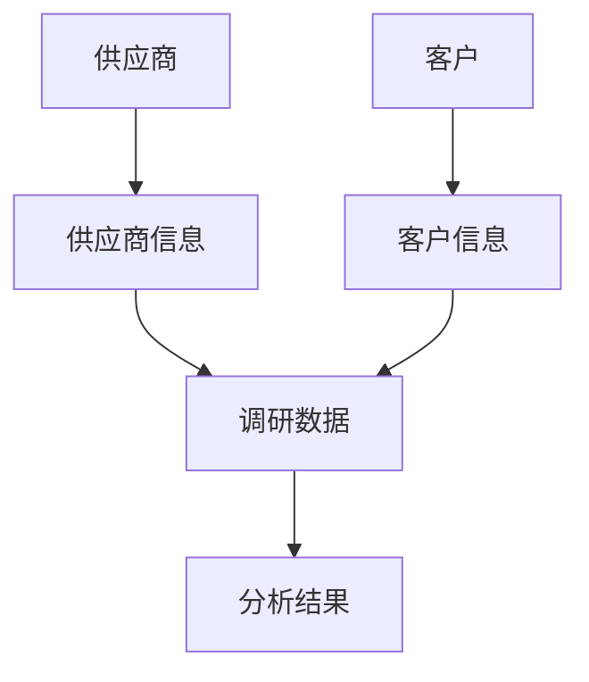
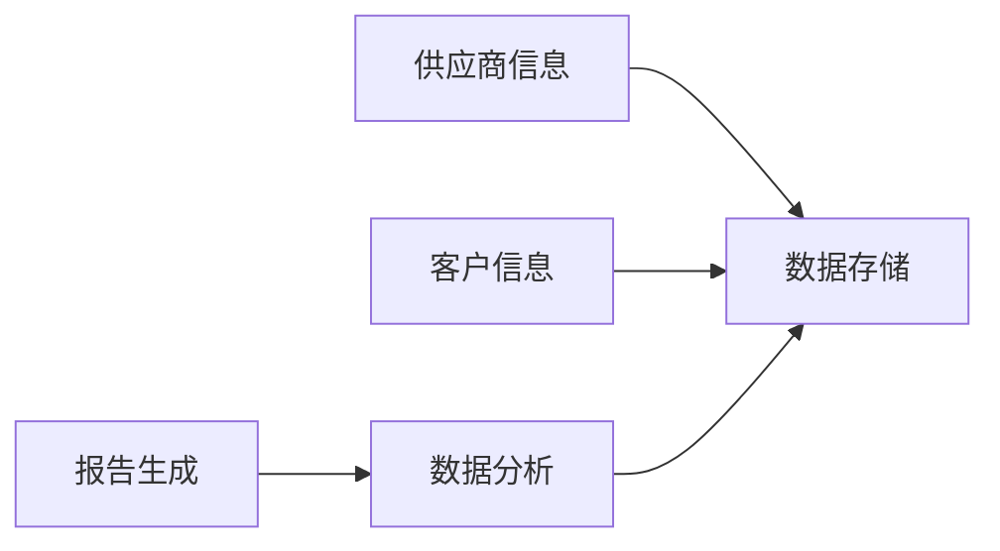
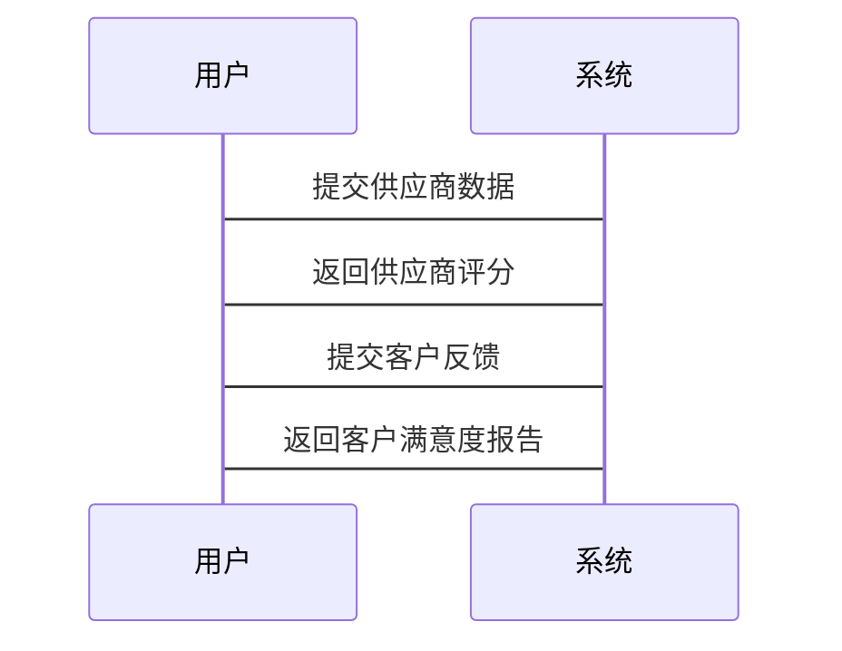

                 


# 费雪的供应商客户调研：360度了解公司

## 关键词：费雪调研，供应商客户，企业分析，数据收集，算法原理，系统架构，项目实战

## 摘要：本文通过详细分析费雪的供应商客户调研方法，从背景、核心概念、算法原理到系统架构和项目实战，全面阐述了如何通过360度了解公司，从而优化供应链管理和客户关系。文章结合实际案例，提供具体的操作步骤和代码示例，帮助读者掌握这一方法。

---

## 第一部分: 费雪的供应商客户调研背景与核心概念

### 第1章: 供应商客户调研的背景与问题背景

#### 1.1 问题背景
##### 1.1.1 企业供应链管理的重要性
在现代企业中，供应链管理是企业运营的核心之一。供应商的稳定性和客户满意度直接影响企业的成本、效率和声誉。通过对供应商和客户的全面调研，企业可以更好地优化供应链，提升客户体验。

##### 1.1.2 供应商和客户在企业中的核心地位
供应商是企业原材料、服务和技术的来源，而客户是企业产品和服务的接收者。两者都是企业成功的关键因素，因此了解他们的需求、痛点和行为模式至关重要。

##### 1.1.3 供应商客户调研的必要性
企业需要通过调研了解供应商的能力、信誉和稳定性，同时了解客户的需求变化和满意度，以便及时调整策略。

#### 1.2 问题描述
##### 1.2.1 供应商客户调研的核心目标
- 供应商：评估供应商的能力、交货时间、质量和服务水平。
- 客户：了解客户的需求、满意度和忠诚度。

##### 1.2.2 调研中常见的问题与挑战
- 数据收集困难：供应商和客户可能不愿意提供详细信息。
- 数据量大：需要处理大量数据，分析复杂。
- 数据隐私：保护供应商和客户信息的安全。

##### 1.2.3 供应商客户调研的边界与外延
- 边界：仅关注直接影响企业运营的核心供应商和客户。
- 外延：扩展到间接供应商和潜在客户。

#### 1.3 问题解决与核心要素
##### 1.3.1 费雪调研方法的核心理念
通过全面、系统的方法，收集和分析供应商和客户的数据，为企业提供决策支持。

##### 1.3.2 供应商客户调研的核心要素与组成
- 供应商信息：资质、生产能力、交货周期。
- 客户信息：需求、反馈、满意度。
- 数据分析：供应商评分、客户画像。

##### 1.3.3 调研结果对企业决策的影响
- 优化供应链：选择可靠的供应商，降低采购成本。
- 提升客户体验：根据客户需求调整产品和服务。

### 第2章: 费雪调研方法的核心概念与联系

#### 2.1 费雪调研方法的核心原理
##### 2.1.1 费雪调研的基本原理
通过多维度的数据收集和分析，全面评估供应商和客户的价值。

##### 2.1.2 供应商和客户画像的构建逻辑
- 供应商画像：基于生产能力、交货周期、质量稳定性。
- 客户画像：基于需求、反馈、满意度。

##### 2.1.3 费雪调研的核心算法与模型
- 层次分析法（AHP）：用于供应商评分。
- 聚类分析：用于客户分群。

#### 2.2 核心概念对比分析
##### 2.2.1 供应商与客户调研的对比分析
| 维度 | 供应商 | 客户 |
|------|--------|------|
| 目标 | 评估供应商能力 | 了解客户需求 |
| 方法 | 调查供应商资质 | 调查客户反馈 |

##### 2.2.2 不同行业中的调研差异
- 制造业：关注供应商的生产能力。
- 服务业：关注客户的满意度。

##### 2.2.3 调研数据的特征对比表格
| 特征 | 供应商 | 客户 |
|------|--------|------|
| 数据类型 | 定量为主 | 定性为主 |

#### 2.3 费雪调研的ER实体关系图


---

## 第二部分: 费雪供应商客户调研的算法原理

### 第3章: 费雪调研的核心算法与实现

#### 3.1 层次分析法（AHP）
##### 3.1.1 算法原理
层次分析法是一种决策辅助方法，通过构建层次结构，计算各因素的权重，得出综合评分。

##### 3.1.2 算法实现步骤
1. 构建层次结构。
2. 确定各因素的权重。
3. 计算综合评分。

##### 3.1.3 Python实现示例
```python
import numpy as np

def ahp(matrix, weights):
    return np.dot(matrix, weights)

# 示例数据
matrix = np.array([[1, 2, 3],
                    [4, 5, 6],
                    [7, 8, 9]])
weights = np.array([0.3, 0.4, 0.3])
result = ahp(matrix, weights)
print(result)
```

---

## 第三部分: 费雪供应商客户调研的数学模型与公式

### 第4章: 费雪调研的数学模型

#### 4.1 供应商评分模型
##### 4.1.1 模型公式
$$ S = \sum_{i=1}^{n} w_i x_i $$
其中，\( S \) 是供应商评分，\( w_i \) 是权重，\( x_i \) 是各维度得分。

##### 4.1.2 示例计算
供应商A：生产能力=80，交货周期=90，质量=85。
权重：生产能力=0.4，交货周期=0.3，质量=0.3。
$$ S = 0.4 \times 80 + 0.3 \times 90 + 0.3 \times 85 = 83.5 $$

#### 4.2 客户满意度分析
##### 4.2.1 模型公式
$$ C = \sum_{i=1}^{m} p_i s_i $$
其中，\( C \) 是客户满意度，\( p_i \) 是问题概率，\( s_i \) 是解决满意度。

##### 4.2.2 示例计算
客户A：需求匹配度=90，服务响应=80。
$$ C = 0.5 \times 90 + 0.5 \times 80 = 85 $$

---

## 第四部分: 费雪供应商客户调研的系统分析与架构设计

### 第5章: 系统分析与架构设计

#### 5.1 系统分析
##### 5.1.1 问题场景介绍
企业需要通过系统化的方法，收集和分析供应商和客户的数据，优化供应链和客户关系。

##### 5.1.2 系统功能设计
- 数据收集模块：收集供应商和客户信息。
- 数据分析模块：计算供应商评分和客户满意度。
- 报告生成模块：生成分析报告。

#### 5.2 系统架构设计
##### 5.2.1 系统架构图


##### 5.2.2 接口设计
- 数据接口：提供REST API，接收供应商和客户数据。
- 报告接口：返回分析报告。

##### 5.2.3 交互流程图


---

## 第五部分: 费雪供应商客户调研的项目实战

### 第6章: 项目实战

#### 6.1 环境安装与数据准备
##### 6.1.1 环境安装
- 安装Python和必要的库（如numpy、pandas）。
- 安装Jupyter Notebook用于数据分析。

##### 6.1.2 数据准备
- 供应商数据：包括生产能力、交货周期、质量。
- 客户数据：包括需求、反馈、满意度。

#### 6.2 核心代码实现
##### 6.2.1 供应商评分计算
```python
import pandas as pd

# 数据准备
data = {
    '供应商': ['A', 'B', 'C'],
    '生产能力': [80, 70, 90],
    '交货周期': [85, 90, 75],
    '质量': [85, 70, 90]
}

df = pd.DataFrame(data)

# 计算供应商评分
weights = [0.4, 0.3, 0.3]
df['评分'] = df[['生产能力', '交货周期', '质量']].apply(lambda x: sum(w * x[i] for i, w in enumerate(weights)), axis=1)

print(df)
```

##### 6.2.2 客户满意度分析
```python
import matplotlib.pyplot as plt

# 数据准备
customer_data = {
    '客户': ['客户1', '客户2', '客户3'],
    '需求匹配度': [90, 80, 85],
    '服务响应': [85, 90, 70]
}

df = pd.DataFrame(customer_data)

# 计算客户满意度
df['满意度'] = (df['需求匹配度'] * 0.5) + (df['服务响应'] * 0.5)

# 可视化
plt.bar(df['客户'], df['满意度'])
plt.title('客户满意度分析')
plt.show()
```

#### 6.3 项目小结
通过实际案例，展示了如何利用费雪调研方法进行供应商和客户分析，帮助企业优化供应链和客户关系。

---

## 第六部分: 费雪供应商客户调研的最佳实践与总结

### 第7章: 最佳实践与总结

#### 7.1 关键点总结
- 数据收集的全面性。
- 算法选择的合理性。
- 结果应用的有效性。

#### 7.2 小结
费雪供应商客户调研方法通过系统化的数据分析，帮助企业全面了解供应商和客户，优化供应链和客户关系。

#### 7.3 注意事项
- 数据隐私保护。
- 供应商和客户的合规性。
- 调研结果的应用效果。

#### 7.4 拓展阅读
推荐书籍和资源，帮助读者深入学习相关知识。

---

## 作者信息

作者：AI天才研究院/AI Genius Institute & 禅与计算机程序设计艺术 /Zen And The Art of Computer Programming

