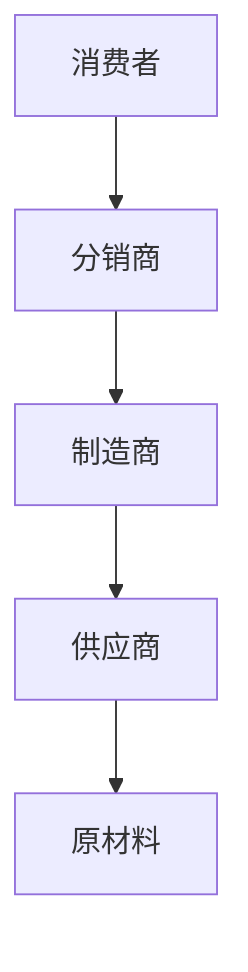
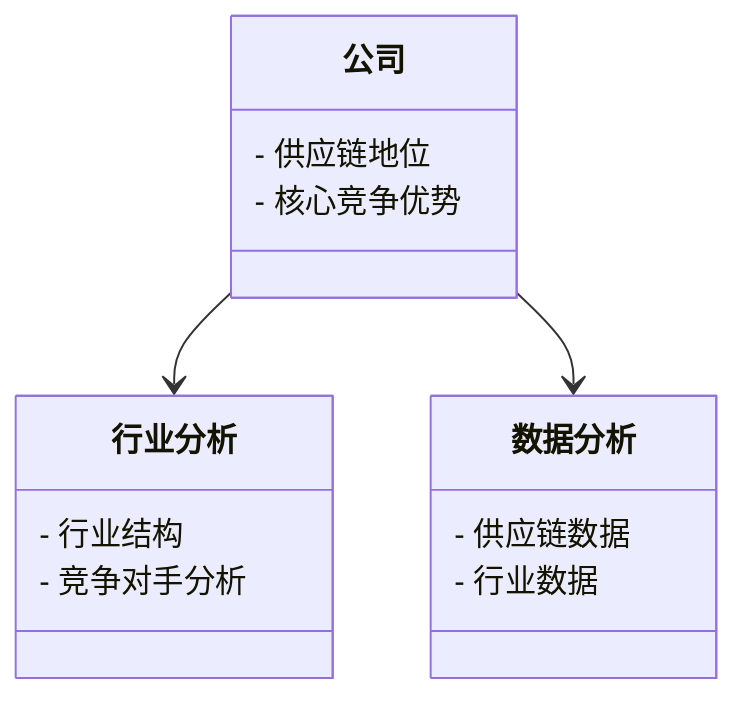

                 


# 费雪的供应链分析：了解公司在产业链中的地位

## 关键词：供应链分析, 产业链地位, 费雪理论, 供应链优化, 企业战略

## 摘要：本文将深入探讨费雪的供应链分析方法，帮助读者了解公司在产业链中的地位。通过分析供应链的结构、竞争优势、行业动态以及数学模型，结合实际案例，系统地讲解如何通过供应链分析优化企业战略。文章内容涵盖供应链的基本概念、数学模型、系统架构设计、项目实战等，为读者提供全面的供应链分析知识。

---

## 第一部分: 供应链分析概述

### 第1章: 供应链分析的背景与基础

#### 1.1 供应链的基本概念

##### 1.1.1 供应链的定义与特点

供应链是指从供应商到消费者的整个价值流，包括原材料采购、生产、分销、交付等环节。其特点包括复杂性、动态性和协同性。供应链的复杂性来源于多个参与者之间的协调，动态性体现在市场需求变化和技术进步上，而协同性则要求各环节高效配合。

##### 1.1.2 费雪的供应链分析理论基础

费雪的供应链分析理论强调企业应从整体视角审视其在供应链中的位置。他认为，企业应通过优化供应链结构、提升协作效率和降低运营成本来增强竞争力。

##### 1.1.3 了解公司供应链地位的重要性

了解公司在供应链中的地位，有助于企业制定有效的战略。例如，若公司处于供应链的关键节点，可以通过优化库存管理或提升生产效率来降低成本，从而提高整体竞争力。

#### 1.2 供应链分析的核心问题

##### 1.2.1 问题背景与问题描述

供应链分析的核心问题是如何通过优化资源配置和提高协作效率来提升企业的竞争力。具体问题包括：如何识别供应链中的瓶颈环节？如何降低供应链的运营成本？如何提高供应链的响应速度？

##### 1.2.2 问题解决的思路与方法

费雪的供应链分析方法包括：（1）绘制供应链流程图，识别关键环节；（2）分析各环节的成本和效率，找出优化点；（3）制定优化策略，如引入新技术或调整供应商。

##### 1.2.3 供应链分析的边界与外延

供应链分析的边界包括企业内部的生产环节和外部的供应商与分销渠道。其外延则涉及市场需求预测、客户关系管理等更广泛的因素。

#### 1.3 供应链的核心要素与结构

##### 1.3.1 供应链的主要组成要素

供应链的主要要素包括：供应商、制造商、分销商、零售商和消费者。每个要素在供应链中扮演不同的角色，共同构成完整的价值流。

##### 1.3.2 供应链的运作流程与逻辑

供应链的运作流程包括：需求预测、采购、生产、分销和交付。每个环节都需要高效协同，确保产品按时交付并满足质量要求。

##### 1.3.3 供应链分析的核心指标与KPI

供应链分析的核心指标包括：交货周期、库存周转率、采购成本和供应链透明度。这些指标可以帮助企业衡量供应链的整体效率和成本。

---

## 第二部分: 公司在供应链中的定位与竞争优势

### 第2章: 供应链结构与公司定位

#### 2.1 供应链结构与公司定位

##### 2.1.1 供应链的上游、中游与下游

供应链分为上游（供应商）、中游（制造商）和下游（分销商和零售商）。公司在供应链中的位置决定了其在价值创造中的角色。

##### 2.1.2 公司在供应链中的角色与位置

公司可能作为供应商、制造商或分销商。不同的角色决定了其在供应链中的责任和目标。

##### 2.1.3 供应链中的关键节点与控制点

关键节点包括原材料采购、生产制造和物流配送。公司应通过控制这些节点来优化供应链效率。

#### 2.2 供应链分析的核心概念与联系

##### 2.2.1 核心概念的原理与特征

供应链分析涉及的关键概念包括：价值流、协同效应和竞争优势。这些概念相互关联，共同影响企业的竞争力。

##### 2.2.2 供应链的ER图架构

以下是供应链的实体关系图：

```mermaid
er
actor 公司 {
  role 供应商
  role 制造商
  role 分销商
}
actor 供应商 {
  --> 环节 原材料采购
}
actor 制造商 {
  --> 环节 生产制造
}
actor 分销商 {
  --> 环节 物流配送
}
```

##### 2.2.3 供应链分析的Mermaid流程图

以下是供应链的流程图：



---

## 第三部分: 供应链分析的数学模型与算法原理

### 第3章: 供应链分析的数学模型

#### 3.1 供应链分析的数学模型

##### 3.1.1 供应链优化的线性规划模型

线性规划模型用于优化供应链的成本和效率。例如，以下模型用于最小化总成本：

$$ \text{Minimize} \quad \sum_{i=1}^{n} c_i x_i $$
$$ \text{Subject to} \quad \sum_{i=1}^{n} a_i x_i \geq b $$

其中，\( c_i \) 是第 \( i \) 个环节的成本，\( x_i \) 是该环节的投入量，\( a_i \) 和 \( b \) 是约束条件的系数和常数。

##### 3.1.2 供应链网络流的数学表达

网络流模型用于优化物流路径。例如，以下模型用于确定最优配送路径：

$$ \text{Minimize} \quad \sum_{i=1}^{m} \sum_{j=1}^{n} f_{ij} x_{ij} $$
$$ \text{Subject to} \quad \sum_{j=1}^{n} x_{ij} = d_i \quad \forall i $$

其中，\( f_{ij} \) 是从节点 \( i \) 到节点 \( j \) 的物流成本，\( d_i \) 是节点 \( i \) 的需求量。

##### 3.1.3 供应链成本的分解与计算

供应链成本包括采购成本、生产成本和物流成本。以下是成本分解的公式：

$$ \text{总成本} = \text{采购成本} + \text{生产成本} + \text{物流成本} $$

---

## 第四部分: 系统架构设计与实现

### 第4章: 系统架构设计与实现

#### 4.1 系统功能设计

##### 4.1.1 领域模型

以下是领域模型的Mermaid图：



##### 4.1.2 系统架构设计

以下是系统架构的Mermaid图：


#### 4.2 系统实现

##### 4.2.1 核心代码实现

以下是供应链分析的核心代码：

```python
def supply_chain_analysis(supplier, manufacturer, distributor):
    # 分析供应商的成本
    supplier_cost = calculate_supplier_cost(supplier)
    # 分析制造商的生产效率
    manufacturer_efficiency = calculate_manufacturer_efficiency(manufacturer)
    # 分析分销商的交付能力
    distributor_capacity = calculate_distributor_capacity(distributor)
    # 综合评分
    total_score = supplier_cost + manufacturer_efficiency + distributor_capacity
    return total_score

def calculate_supplier_cost(supplier):
    return supplier.cost_per_unit * supplier.quantity

def calculate_manufacturer_efficiency(manufacturer):
    return manufacturer.production_capacity / manufacturer.time

def calculate_distributor_capacity(distributor):
    return distributor.delivery_speed * distributor.num_customers
```

---

## 第五部分: 项目实战与案例分析

### 第5章: 项目实战与案例分析

#### 5.1 项目实战

##### 5.1.1 环境安装与配置

需要安装Python和相关数据分析库（如Pandas、NumPy）。

##### 5.1.2 核心代码实现

以下是项目的核心代码：

```python
import pandas as pd

def main():
    # 读取供应链数据
    data = pd.read_csv('supply_chain_data.csv')
    # 数据预处理
    data = preprocess_data(data)
    # 分析供应链地位
    result = analyze_supply_chain(data)
    # 输出结果
    print(result)

def preprocess_data(data):
    # 删除缺失值
    data = data.dropna()
    return data

def analyze_supply_chain(data):
    # 计算各环节的成本
    costs = data['cost'].sum()
    # 计算总效率
    efficiency = data['efficiency'].mean()
    return {'总成本': costs, '平均效率': efficiency}

if __name__ == "__main__":
    main()
```

##### 5.1.3 案例分析与解读

以某制造企业为例，分析其供应链成本和效率。通过数据预处理和分析，发现物流环节是成本的主要来源，并提出了优化建议。

---

## 第六部分: 总结与展望

### 第6章: 总结与展望

#### 6.1 总结

本文系统地介绍了费雪的供应链分析方法，涵盖了供应链的基本概念、数学模型、系统架构设计和项目实战。通过理论与实践的结合，帮助读者了解公司在供应链中的地位，并掌握优化供应链的方法。

#### 6.2 注意事项

在实际应用中，需注意数据的准确性和模型的适用性。同时，应结合企业的实际情况，灵活调整分析策略。

#### 6.3 未来展望

未来，随着人工智能和大数据技术的发展，供应链分析将更加智能化和精准化。企业应积极拥抱新技术，提升供应链管理的效率和竞争力。

---

## 作者：AI天才研究院/AI Genius Institute & 禅与计算机程序设计艺术 /Zen And The Art of Computer Programming

---

以上是文章的完整内容，希望对您有所帮助！

