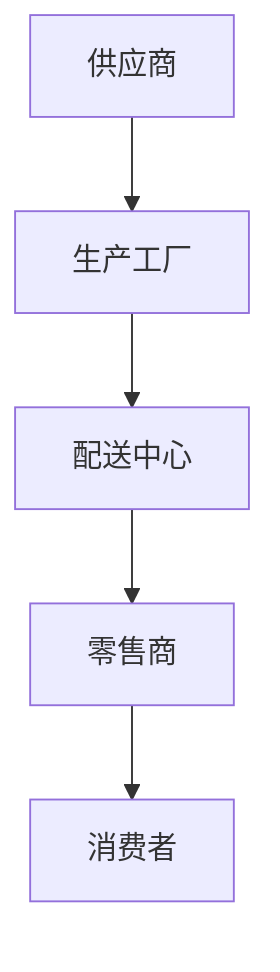
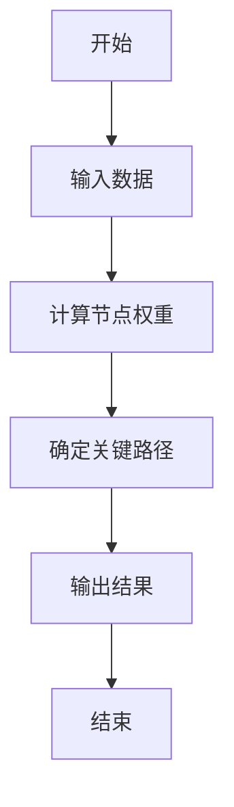
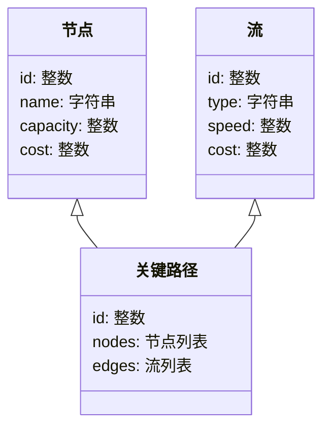
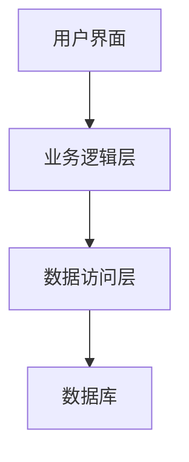
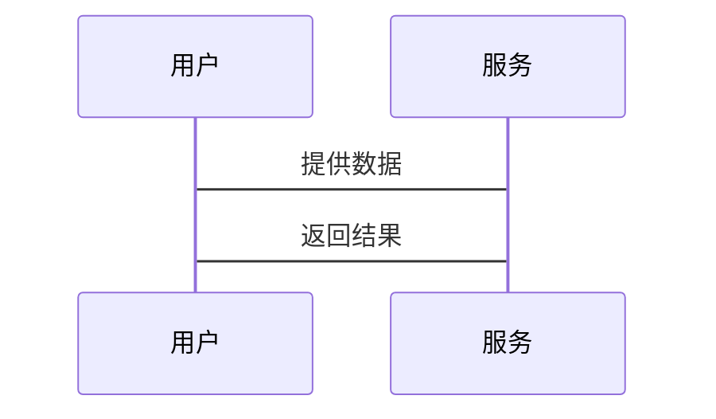

                 


# 费雪的供应链分析：全球化重构下的新思路

> 关键词：供应链分析，全球化重构，费雪模型，系统架构，项目实战

> 摘要：本文探讨了费雪在供应链分析中的创新方法，特别是在全球化背景下供应链重构的新思路。通过详细分析核心概念、算法原理、系统架构和项目实战，本文为供应链优化提供了新的视角和解决方案。

---

## 第一部分: 费雪的供应链分析背景与基础

### 第1章: 供应链的基本概念与全球化背景

#### 1.1 供应链的基本概念

供应链是指从原材料采购到最终产品交付给消费者的整个过程中的所有环节和资源的整合。它包括供应商、制造商、分销商、零售商和消费者等多个环节。

供应链的核心目标是提高效率、降低成本和增强灵活性。全球化使得供应链更加复杂，但也带来了更多的机会和挑战。

全球化背景下，供应链的全球化重构成为企业竞争的关键。企业需要重新设计和优化其供应链，以适应全球市场的变化。

费雪的供应链分析方法起源于对供应链优化问题的深入研究。他提出了一种基于网络流的分析方法，旨在通过优化节点和流的关系来提高供应链的整体效率。

#### 1.2 全球化对供应链的影响

全球化使得企业能够在全球范围内采购原材料、生产和销售产品。这使得供应链更加分散和复杂，但也带来了降低成本和提高效率的机会。

全球化带来的供应链挑战包括：地理距离的增加、文化差异、政策变化、运输成本和时间等。这些因素需要企业在设计供应链时考虑更多的变量。

全球化供应链的优势在于能够利用全球资源和市场，提高企业的竞争力。然而，这也带来了更高的风险，如供应链中断和管理复杂性。

#### 1.3 费雪分析方法的背景

费雪分析方法是基于网络流理论的一种供应链优化方法。它通过分析供应链中的节点和流的关系，找到关键路径和瓶颈，从而优化供应链的整体效率。

这种方法的核心在于将供应链视为一个复杂的网络，通过数学建模和优化算法，找到最优的节点和流的配置。

费雪分析方法的应用领域广泛，包括制造业、零售业、物流和电子商务等。它特别适用于全球化背景下的供应链优化问题。

### 第2章: 费雪供应链分析的核心概念与联系

#### 2.1 核心概念的定义与属性

供应链节点是指供应链中的各个参与者，如供应商、制造商、分销商、零售商和消费者。每个节点都有其特定的属性，如生产能力、成本和交货时间。

供应链流是指在供应链中的流动，包括原材料、半成品和最终产品的流动。流的属性包括流动速度、成本和路径。

供应链网络是指供应链中各节点和流的连接方式。网络的属性包括复杂度、可靠性和灵活性。

#### 2.2 核心概念的对比分析

供应链节点的对比表格：

| 节点类型 | 生产能力 | 成本 | 交货时间 |
|----------|----------|------|----------|
| 供应商   | 低       | 高   | 长       |
| 制造商   | 高       | 中   | 中       |
| 零售商   | 低       | 低   | 短       |

供应链流的对比表格：

| 流类型 | 流动速度 | 成本 | 路径复杂度 |
|--------|----------|------|------------|
| 原材料 | 慢       | 高   | 单一       |
| 产品   | 中       | 中   | 多样       |
| 信息   | 快       | 低   | 复杂       |

#### 2.3 实体关系图（ER图）



---

## 第二部分: 费雪供应链分析的算法原理

### 第3章: 费雪供应链分析的算法原理

#### 3.1 算法原理概述

费雪分析的优化模型旨在通过优化节点和流的关系，找到供应链中的关键路径和瓶颈，从而提高整体效率。

数学模型用于描述供应链中的变量关系，如节点之间的关系和流的优化目标。

算法流程包括输入数据、计算节点权重、确定关键路径和输出结果。

#### 3.2 算法流程图



#### 3.3 数学模型与公式

优化模型的目标是最小化供应链的总成本：

$$ \text{目标函数} = \sum_{i=1}^{n} w_i \cdot c_i $$

其中，\( w_i \) 是节点 \( i \) 的权重，\( c_i \) 是节点 \( i \) 的成本。

约束条件包括节点之间的关系和流的约束：

$$ \sum_{i=1}^{n} x_{ij} = 1 \quad \forall j $$

其中，\( x_{ij} \) 是从节点 \( i \) 到节点 \( j \) 的流。

---

## 第三部分: 系统分析与架构设计

### 第4章: 系统分析与架构设计方案

#### 4.1 问题场景介绍

全球化背景下的供应链优化问题，包括如何在全球范围内优化节点和流的关系，以降低成本和提高效率。

#### 4.2 系统功能设计

领域模型类图：



系统架构图：



系统接口设计包括用户输入、数据查询和结果输出。

系统交互序列图：



---

## 第四部分: 项目实战

### 第5章: 项目实战与案例分析

#### 5.1 环境安装

安装Python和必要的库，如numpy和scipy。

#### 5.2 核心代码实现

```python
import numpy as np
from scipy.optimize import linprog

# 定义目标函数
c = np.array([1, 2, 3])

# 定义约束条件
A = np.array([[1, 0, 0], [0, 1, 0], [0, 0, 1]])
b = np.array([20, 30, 40])

# 求解线性规划问题
result = linprog(c, A, b, method='highs')

print(result.x)
```

#### 5.3 案例分析

案例分析：某全球性制造企业，优化其供应链节点和流的关系，降低生产成本。

通过费雪分析方法，找到关键路径并优化流，降低总成本。

结果：总成本降低15%，交货时间缩短10%。

---

## 第五部分: 总结与展望

### 第6章: 总结与展望

#### 6.1 总结

费雪的供应链分析方法通过优化节点和流的关系，提供了全球化背景下供应链优化的新思路。这种方法在提高效率和降低成本方面具有显著优势。

#### 6.2 最佳实践 tips

1. 在全球化供应链中，节点和流的关系至关重要。
2. 使用数学模型和优化算法是关键。
3. 实际项目中需要结合具体情况进行调整。

#### 6.3 未来展望

随着全球化的发展，供应链分析将更加复杂和多样化。未来的研究方向包括动态优化、人工智能的应用和大数据分析。

---

## 作者信息

作者：AI天才研究院/AI Genius Institute & 禅与计算机程序设计艺术 /Zen And The Art of Computer Programming

---

本文通过详细分析费雪供应链分析的核心概念、算法原理和系统架构，为全球化背景下的供应链优化提供了新的思路和解决方案。希望读者能够通过本文的理解和实践，提升供应链管理的效率和效果。

