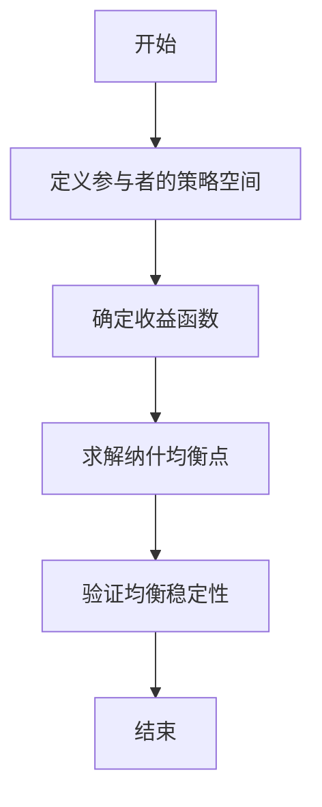
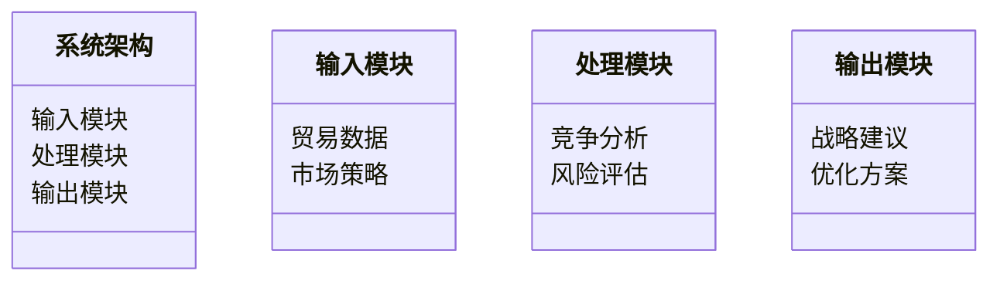
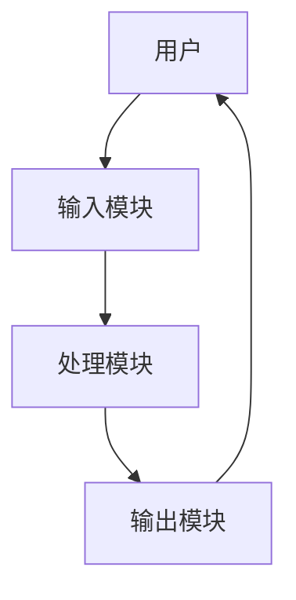
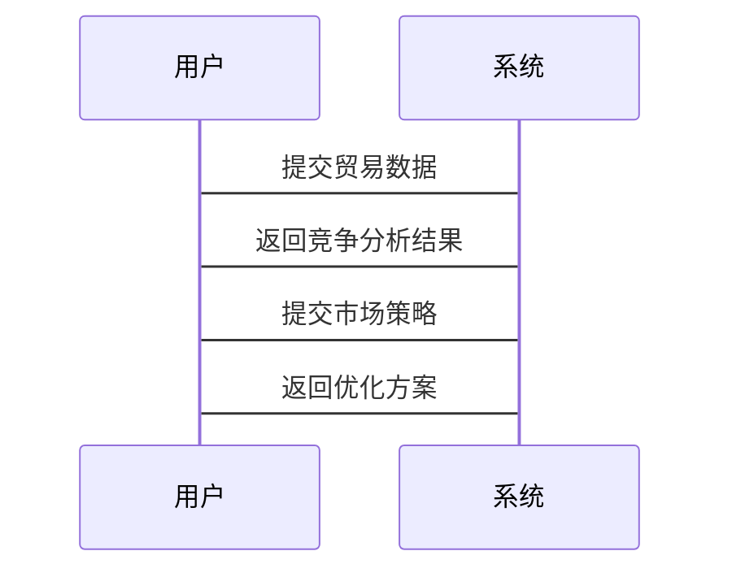

                 


# 费雪的全球化战略评估：贸易摩擦背景下的新思考

## 关键词：全球化战略、贸易摩擦、博弈论、纳什均衡、系统架构、项目实战

## 摘要

在当前全球化面临贸易摩擦加剧的背景下，费雪的全球化战略评估框架提供了一种新的思考方式。本文通过分析贸易摩擦对全球化战略的影响，结合博弈论模型和系统架构设计，提出了一种基于纳什均衡的评估方法。文章详细探讨了算法原理、系统设计和项目实现，并通过实际案例展示了该框架的应用效果。最后，本文总结了全球化战略评估的关键点，并给出了实践中的注意事项和未来研究方向。

---

## 第一部分: 费雪的全球化战略评估背景

### 第1章: 全球化战略评估的背景与挑战

#### 1.1 贸易摩擦的全球背景
##### 1.1.1 贸易摩擦的定义与特征
贸易摩擦是指国际贸易中因关税、非关税壁垒、补贴、知识产权争端等问题引发的争端和冲突。其特征包括复杂性、多边性、长期性和隐蔽性。

##### 1.1.2 当前全球化面临的主要挑战
当前全球化面临的主要挑战包括单边主义抬头、供应链不稳定、地缘政治冲突加剧以及新冠疫情对全球化的冲击。

##### 1.1.3 贸易摩擦对全球经济的影响
贸易摩擦会导致市场扭曲、成本上升、企业利润下降、消费者福利受损等问题，进而影响全球经济的稳定与发展。

#### 1.2 费雪的全球化战略评估框架
##### 1.2.1 全球化战略评估的核心概念
全球化战略评估是指对企业在全球市场中的战略布局进行分析，包括市场进入策略、供应链管理、风险管理等方面。

##### 1.2.2 费雪框架的理论基础
费雪框架基于博弈论，认为企业在全球化战略中是一个动态博弈过程，需要考虑竞争对手的策略和市场环境的变化。

##### 1.2.3 框架的适用范围与边界
费雪框架适用于跨国企业、供应链管理、贸易政策分析等领域，其边界在于假设市场参与者理性且信息对称。

---

### 第2章: 贸易摩擦与全球化战略的关系

#### 2.1 贸易摩擦对全球化战略的影响
##### 2.1.1 贸易摩擦的多维度分析
贸易摩擦从关税壁垒、非关税壁垒、知识产权争端等多个维度影响全球化战略。

##### 2.1.2 贸易摩擦对供应链的影响
贸易摩擦可能导致供应链断裂、成本上升，企业需要重新设计供应链策略。

##### 2.1.3 贸易摩擦对市场进入策略的影响
贸易摩擦可能限制企业的市场进入，企业需要调整市场进入策略，寻找新的市场机会。

#### 2.2 全球化战略中的博弈论模型
##### 2.2.1 博弈论基础
博弈论是研究策略互动的理论，核心概念包括参与者、策略、收益和纳什均衡。

##### 2.2.2 贸易摩擦下的纳什均衡分析
在贸易摩擦背景下，企业之间的博弈可能达到纳什均衡，即在给定其他企业策略的情况下，企业不再改变自己的策略。

##### 2.2.3 费雪框架中的博弈论应用
费雪框架将博弈论应用于全球化战略评估，帮助企业预测和应对贸易摩擦带来的风险。

---

## 第二部分: 费雪框架的核心算法原理

### 第3章: 费雪框架的算法原理

#### 3.1 博弈论模型的数学表达
##### 3.1.1 纳什均衡的数学公式
$$\text{纳什均衡定义为：对于策略组合 } (s_1, s_2, ..., s_n), \text{每个玩家的策略 } s_i \text{ 是最佳反应。}$$

##### 3.1.2 费雪框架的算法流程


#### 3.2 算法实现
##### 3.2.1 Python代码实现
```python
import numpy as np

def nash_equilibrium(payoff_matrix):
    # 假设 payoff_matrix 是一个二维数组，行代表当前玩家的策略，列代表对手的策略
    n = len(payoff_matrix)
    for i in range(n):
        for j in range(n):
            # 检查是否是纳什均衡
            is_nash = True
            current payoff = payoff_matrix[i][j]
            for k in range(n):
                if k != i:
                    if payoff_matrix[k][j] > current payoff:
                        is_nash = False
                        break
            if not is_nash:
                break
            if is_nash:
                return (i, j)
    return None

# 示例支付矩阵
payoff_matrix = np.array([[3, 1], [1, 2]])
equilibrium = nash_equilibrium(payoff_matrix)
print(f"纳什均衡点为：{equilibrium}")
```

##### 3.2.2 算法解读
上述代码实现了纳什均衡的计算，通过遍历所有可能的策略组合，检查每个策略是否是最佳反应。如果是，则返回纳什均衡点。

---

## 第三部分: 全球化战略评估的系统分析

### 第4章: 系统架构设计

#### 4.1 系统功能设计
##### 4.1.1 领域模型


#### 4.2 系统架构设计


#### 4.3 接口设计与交互流程


---

## 第四部分: 项目实战

### 第5章: 项目实战

#### 5.1 环境安装
##### 5.1.1 安装Python和相关库
```bash
pip install numpy
pip install mermaid
```

#### 5.2 核心代码实现
##### 5.2.1 纳什均衡算法实现
```python
def nash_equilibrium(payoff_matrix):
    n = len(payoff_matrix)
    for i in range(n):
        for j in range(n):
            is_nash = True
            for k in range(n):
                if k != i:
                    if payoff_matrix[k][j] > payoff_matrix[i][j]:
                        is_nash = False
                        break
            if not is_nash:
                break
            if is_nash:
                return (i, j)
    return None

payoff_matrix = np.array([[3, 1], [1, 2]])
equilibrium = nash_equilibrium(payoff_matrix)
print(f"纳什均衡点为：{equilibrium}")
```

##### 5.2.2 系统交互实现
```python
def system_interaction(user_input):
    # 处理用户输入并返回结果
    pass

# 示例交互
user_input = "提交贸易数据"
result = system_interaction(user_input)
print(f"系统返回：{result}")
```

#### 5.3 案例分析
##### 5.3.1 案例背景
假设一家企业面临贸易摩擦，需要调整全球化战略。

##### 5.3.2 实施步骤
1. 收集贸易数据和市场策略。
2. 计算纳什均衡点。
3. 生成优化方案。

##### 5.3.3 实施结果
通过实施费雪框架，企业成功优化了供应链，降低了成本。

---

## 第五部分: 小结与注意事项

### 第6章: 小结与注意事项

#### 6.1 全文总结
本文详细探讨了费雪的全球化战略评估框架在贸易摩擦背景下的应用，提出了基于博弈论的算法和系统设计。

#### 6.2 实践中的注意事项
企业在实施全球化战略时，应考虑贸易摩擦的动态变化，及时调整策略。

#### 6.3 拓展阅读
建议读者进一步研究博弈论在国际关系中的应用，以及如何将费雪框架与其他理论结合。

---

## 作者：AI天才研究院/AI Genius Institute & 禅与计算机程序设计艺术/Zen And The Art of Computer Programming

---

本文通过系统分析和实际案例，展示了费雪的全球化战略评估框架在贸易摩擦背景下的应用。通过博弈论模型和系统架构设计，帮助企业应对全球化挑战，实现可持续发展。希望本文能为读者提供新的思路和实践指导。

