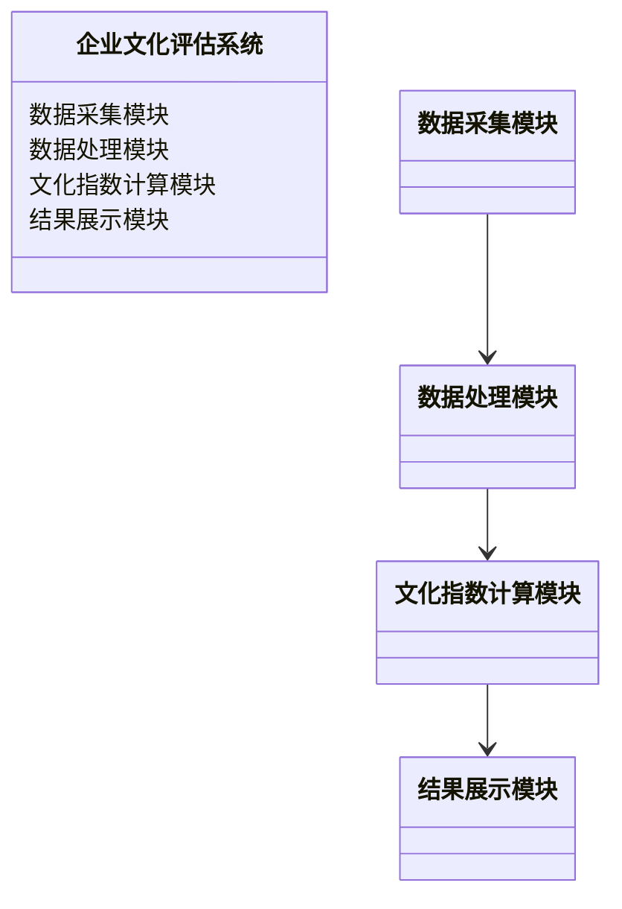
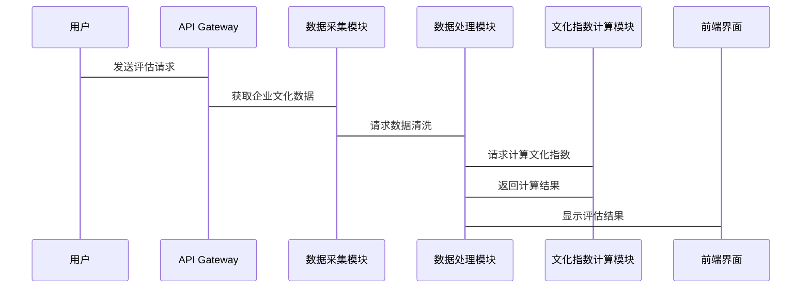

                 


# 费雪的公司文化评估：优秀企业的隐形资产

## 关键词：企业文化评估、费雪模型、公司文化、企业价值、文化指数

## 摘要：企业文化是企业的灵魂，是企业长期发展的隐形资产。本文深入探讨了费雪企业文化评估模型，分析了其核心概念、评估方法和系统架构，通过实际案例展示了如何应用费雪模型进行企业文化评估，并提出了系统的最佳实践建议。

## 第一部分：引言

## 第1章：企业文化的重要性与评估背景

### 1.1 企业文化的核心概念
- 1.1.1 企业文化的定义与内涵
- 1.1.2 企业文化对企业价值的影响
- 1.1.3 企业文化评估的必要性

### 1.2 费雪企业文化评估模型的背景
- 1.2.1 传统企业文化评估方法的局限性
- 1.2.2 费雪模型的提出与核心思想
- 1.2.3 费雪模型的应用场景与优势

## 第2章：费雪企业文化评估模型的核心概念

### 2.1 费雪模型的构成
- 2.1.1 模型的框架与结构
- 2.1.2 核心要素与权重分配
- 2.1.3 模型的数学表达式

### 2.2 核心要素的详细说明
- 2.2.1 价值观与使命的评估指标
- 2.2.2 领导风格与管理方式
- 2.2.3 员工参与度与满意度
- 2.2.4 组织结构与沟通效率

### 2.3 费雪模型的核心要素对比表
| 核心要素 | 评估指标 | 权重 | 评估方法 |
|----------|----------|------|----------|
| 价值观   | 一致性、创新性 | 30% | 问卷调查、数据分析 |
| 领导风格 | 激励性、透明度 | 25% | 面谈、观察法 |
| 员工参与 | 满意度、参与度 | 20% | 调查、行为分析 |
| 组织结构 | 协作性、效率 | 25% | 流程分析、效率指标 |

### 2.4 费雪模型的ER实体关系图
```mermaid
er
actor 费雪模型, 负责评估企业文化的核心要素
```

## 第3章：费雪企业文化评估的算法原理

### 3.1 费雪模型的评估指标
- 3.1.1 各个核心要素的具体指标
- 3.1.2 指标之间的相互关系

### 3.2 费雪模型的数学表达式
$$ 费雪文化指数 = \sum_{i=1}^{n} (w_i \times s_i) $$
其中，\( w_i \) 为第i个核心要素的权重，\( s_i \) 为第i个核心要素的评分。

## 第4章：企业文化评估的系统分析与架构设计

### 4.1 问题场景介绍
- 企业文化评估系统的需求背景
- 评估系统的目标与范围

### 4.2 系统功能设计


### 4.3 系统架构设计


### 4.4 系统接口设计
- API接口定义：RESTful API
- 数据格式：JSON

### 4.5 系统交互流程


## 第5章：项目实战

### 5.1 环境安装
- 安装Python和必要的库（如numpy, pandas, matplotlib）
- 安装Jupyter Notebook用于数据分析和可视化

### 5.2 系统核心实现源代码

```python
import numpy as np
import pandas as pd
import matplotlib.pyplot as plt

# 定义费雪文化指数计算函数
def fisher_cultural_index(values, leadership, employee_involvement, org_structure):
    # 权重分别为30%, 25%, 20%, 25%
    weights = [0.3, 0.25, 0.2, 0.25]
    scores = [values, leadership, employee_involvement, org_structure]
    # 计算加权和
    cultural_index = sum(w * s for w, s in zip(weights, scores))
    return cultural_index

# 示例数据
values_score = 85  # 价值观与使命的评分，满分100
leadership_score = 80  # 领导风格评分
employee_score = 85  # 员工参与度评分
org_score = 90  # 组织结构评分

# 计算文化指数
cultural_index = fisher_cultural_index(values_score, leadership_score, employee_score, org_score)
print(f"费雪文化指数: {cultural_index}%")

# 可视化结果
plt.figure(figsize=(10, 6))
plt.bar(['价值观', '领导风格', '员工参与度', '组织结构'], [values_score, leadership_score, employee_score, org_score])
plt.title('企业文化评估指标')
plt.ylabel('评分')
plt.show()
```

### 5.3 代码应用解读与分析
- 代码实现费雪模型的核心计算逻辑
- 使用Python和相关库进行数据处理和可视化
- 示例数据展示如何计算文化指数并进行可视化分析

### 5.4 实际案例分析
- 通过一个中型企业的案例，展示如何应用费雪模型进行评估
- 分步分析各个核心要素的评分及其对文化指数的影响
- 讨论评估结果对企业管理决策的意义

### 5.5 项目小结
- 项目实现的成果
- 项目过程中遇到的挑战及解决方案
- 对企业文化的深入理解

## 第6章：最佳实践

### 6.1 核心要点回顾
- 费雪模型的理论基础
- 企业文化评估的关键步骤
- 系统架构设计的重要性

### 6.2 实践中的注意事项
- 数据采集的准确性和全面性
- 权重的合理分配
- 评估结果的客观性和可操作性

### 6.3 小结
- 企业文化评估的长期意义
- 持续优化企业文化的重要性
- 费雪模型在企业管理中的应用前景

## 第7章：总结与展望

### 7.1 总结
- 费雪模型的优势
- 企业文化评估的系统化方法
- 技术与管理的结合

### 7.2 展望
- 费雪模型的未来发展
- 企业文化评估的数字化转型
- 人工智能在企业文化评估中的应用潜力

## 作者：AI天才研究院/AI Genius Institute & 禅与计算机程序设计艺术 /Zen And The Art of Computer Programming

---

**注**：本文为《费雪的公司文化评估：优秀企业的隐形资产》一书的部分内容概要，完整内容请参考书籍。

