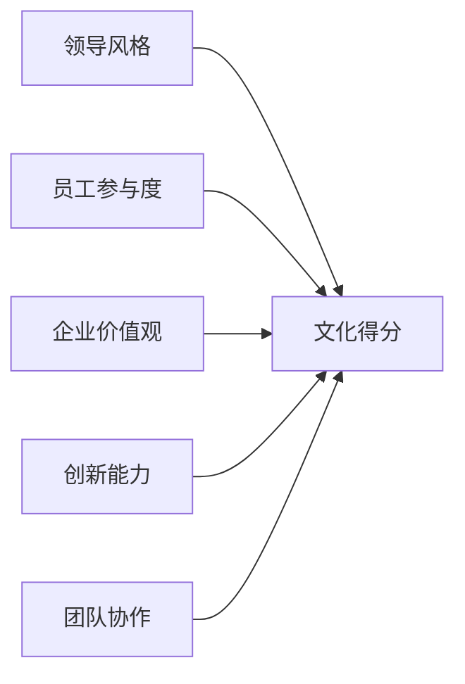
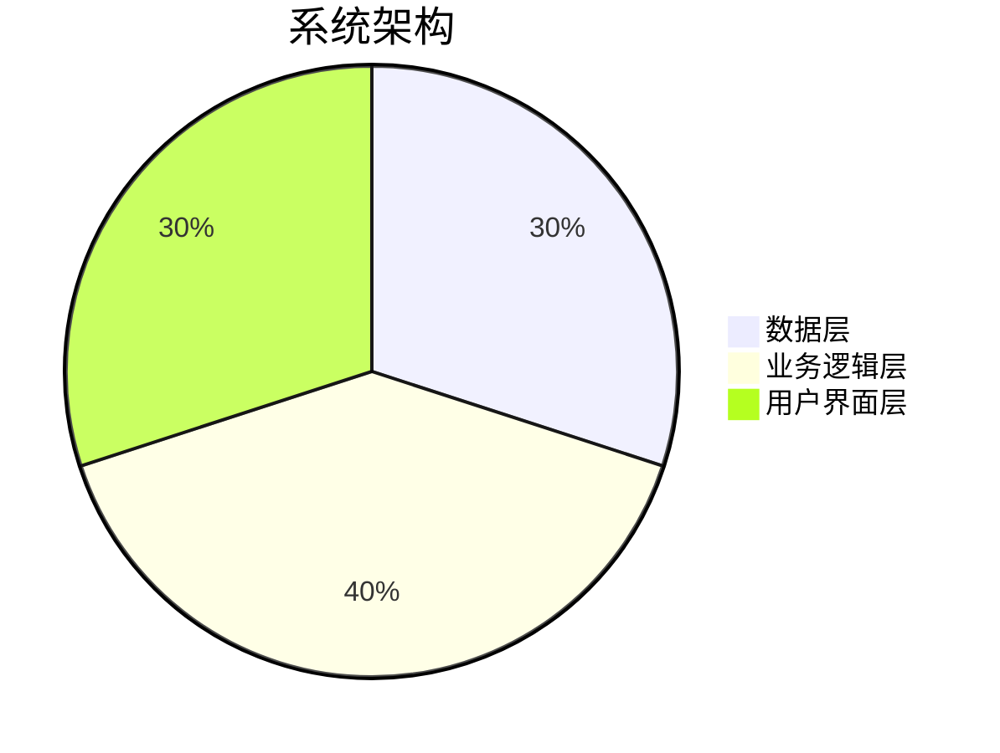

                 


# 费雪的公司文化评估：长期成功的基石

## 关键词：公司文化评估，费雪，长期成功，企业文化管理，投资学，管理学

## 摘要：  
公司文化是企业长期成功的核心基石，而如何科学地评估和管理公司文化则是企业领导者和投资者关注的焦点。本文将深入探讨费雪的公司文化评估方法，结合技术与管理的视角，分析其理论基础、评估维度、数学模型、系统架构及实际应用，为企业构建积极向上的文化环境提供实践指导。

---

## 第一部分：公司文化评估的背景与重要性

### 第1章：公司文化评估的背景介绍

#### 1.1 公司文化的基本概念  
公司文化是指企业在长期发展过程中形成的共同价值观、行为准则和工作方式的总和。它不仅影响员工的行为，还塑造了企业的外部形象和市场表现。  

- **1.1.1 公司文化的定义与内涵**  
  公司文化是一个复杂的系统，包含愿景、使命、价值观、领导风格、员工关系等核心要素。  

- **1.1.2 公司文化与企业绩效的关系**  
  研究表明，积极向上的企业文化能够显著提升员工满意度、创新能力和企业盈利能力。  

- **1.1.3 公司文化评估的重要性**  
  通过评估公司文化，企业可以识别文化中的优势与不足，有针对性地进行优化和改进。  

#### 1.2 费雪的成长股投资理念  
费雪是成长股投资的鼻祖，他强调投资于具有强大成长潜力的企业，而公司文化正是这种潜力的重要体现。  

- **1.2.1 费雪投资理论的核心观点**  
  费雪认为，企业的长期成功不仅取决于财务表现，还与其文化氛围密切相关。  

- **1.2.2 成长股的定义与特点**  
  成长股是指那些收入和利润持续增长的企业，而这种增长往往与其积极的文化密切相关。  

- **1.2.3 费雪如何通过公司文化评估选择投资标的**  
  费雪在选择投资标的时，会深入分析企业的文化，确保其具备持续创新和成长的潜力。  

---

## 第二部分：公司文化评估的核心维度与模型

### 第2章：公司文化评估的核心维度

#### 2.1 领导风格与决策过程  
领导风格是公司文化的重要组成部分，直接影响员工的士气和企业的创新能力。  

- **2.1.1 领导风格的分类及其对文化的影响**  
  领导风格可以分为集权型、民主型和放任型。民主型领导风格更有利于构建开放、包容的企业文化。  

- **2.1.2 费雪对领导风格的重视**  
  费雪认为，优秀的领导者应具备战略眼光和团队协作能力，能够激发员工的潜力。  

#### 2.2 员工参与度与团队协作  
员工参与度是衡量公司文化的重要指标，高参与度的团队更有可能实现创新和高效协作。  

- **2.2.1 员工参与度的衡量标准**  
  包括员工对工作的满意度、参与决策的频率以及对公司的忠诚度。  

- **2.2.2 团队协作对文化的影响**  
  良好的团队协作能够增强企业的凝聚力，促进知识共享和创新。  

#### 2.3 企业价值观与使命愿景  
企业价值观和使命愿景是公司文化的灵魂，决定了企业的长期发展方向。  

- **2.3.1 企业价值观的形成**  
  企业价值观通常由企业的创始人或管理层共同制定，并在实践中不断优化。  

- **2.3.2 使命愿景对企业文化的影响**  
  明确的使命愿景能够为企业提供方向感，激励员工为共同目标而努力。  

### 第3章：公司文化评估的综合模型

#### 3.1 费雪文化评估模型的构建  
费雪文化评估模型是一个多维度的系统，结合了领导风格、员工参与度和企业价值观等多个因素。  

- **3.1.1 模型的构成要素**  
  包括领导风格、员工参与度、企业价值观、创新能力和团队协作五个核心要素。  

- **3.1.2 各要素之间的关系**  
  各要素相互关联、相互促进，共同构成一个完整的评估体系。  

#### 3.2 模型的数学表达  
通过加权平均的方法，我们可以量化公司文化的整体得分。  

- **3.2.1 文化得分的计算公式**  
  $$文化得分 = \sum_{i=1}^{n} w_i \cdot x_i$$  
  其中，$w_i$ 是第i个维度的权重，$x_i$ 是该维度的评估值。  

- **3.2.2 权重的分配**  
  根据经验，领导风格占40%，员工参与度占30%，企业价值观占20%，创新能力和团队协作各占5%。  

#### 3.3 模型的可视化表示  
以下是费雪文化评估模型的mermaid图表示：  



---

## 第三部分：公司文化评估的方法与工具

### 第4章：公司文化评估的主要方法

#### 4.1 定性评估方法  
定性评估通过观察和访谈等方式，获取公司文化的非量化信息。  

- **4.1.1 领导风格的评估**  
  通过观察领导者的行为和决策方式，评估其风格是否符合企业文化目标。  

- **4.1.2 员工参与度的评估**  
  通过员工满意度调查和访谈，了解员工对工作的态度和参与度。  

#### 4.2 定量评估方法  
定量评估通过数据和指标，量化公司文化的各个维度。  

- **4.2.1 创新能力的评估**  
  可以通过专利数量、新产品发布频率等指标来衡量企业的创新能力。  

- **4.2.2 团队协作的评估**  
  可以通过团队项目的完成情况和员工之间的合作效率来评估。  

#### 4.3 综合评估方法  
综合评估结合定性和定量方法，全面评估公司文化的优缺点。  

- **4.3.1 综合评估模型的构建**  
  结合定性和定量数据，构建一个全面的评估体系。  

- **4.3.2 案例分析**  
  通过具体案例，展示如何应用综合评估方法来优化企业文化。  

---

## 第四部分：公司文化评估的系统架构与实现

### 第5章：系统分析与架构设计方案

#### 5.1 问题场景介绍  
本文将构建一个公司文化评估系统，帮助企业管理者量化和优化企业文化。  

#### 5.2 系统功能设计  
系统的功能模块包括数据采集、评估计算、结果分析和优化建议。  

- **5.2.1 数据采集模块**  
  通过问卷调查、访谈等方式，采集企业文化相关的数据。  

- **5.2.2 评估计算模块**  
  使用费雪文化评估模型，计算企业文化得分。  

#### 5.3 系统架构设计  
系统的架构包括数据层、业务逻辑层和用户界面层。  



#### 5.4 系统接口设计  
系统需要与数据库、用户终端和其他第三方服务进行交互。  

- **5.4.1 数据库接口**  
  使用关系型数据库存储企业文化评估数据。  

- **5.4.2 用户界面接口**  
  提供友好的用户界面，方便用户进行数据输入和结果查看。  

#### 5.5 系统交互设计  
系统的主要交互流程包括数据输入、评估计算和结果展示。  

```mermaid
sequenceDiagram
    actor 用户
    participant 数据采集模块
    participant 评估计算模块
    participant 结果展示模块
    用户 -> 数据采集模块: 提交企业文化数据
    数据采集模块 -> 评估计算模块: 传输数据
    评估计算模块 -> 结果展示模块: 返回评估结果
    用户 <- 结果展示模块: 查看评估结果
```

---

## 第五部分：公司文化评估的项目实战

### 第6章：项目实战与案例分析

#### 6.1 环境安装  
安装必要的软件和工具，包括数据库、编程语言和可视化工具。  

- **6.1.1 数据库安装**  
  使用MySQL或PostgreSQL等关系型数据库。  

- **6.1.2 编程语言安装**  
  安装Python和相关库，如pandas、numpy。  

#### 6.2 系统核心实现  
实现公司文化评估的核心算法，包括数据采集、计算和结果展示。  

- **6.2.1 数据采集模块的实现**  
  使用Python编写问卷调查脚本，采集企业文化数据。  

- **6.2.2 评估计算模块的实现**  
  根据费雪文化评估模型，编写计算文化得分的代码。  

#### 6.3 代码实现与解读  
以下是评估计算模块的核心代码示例：  

```python
import pandas as pd

# 定义文化评估模型的权重
weights = {'领导风格': 0.4, '员工参与度': 0.3, '企业价值观': 0.2, '创新能力': 0.05, '团队协作': 0.05}

# 读取输入数据
data = pd.read_csv('culture_data.csv')

# 计算文化得分
culture_score = sum(weights[dim] * data[dim] for dim in weights)

# 输出结果
print('文化得分：', culture_score)
```

#### 6.4 案例分析  
通过具体案例，展示如何应用费雪评估方法优化企业文化。  

- **6.4.1 案例背景**  
  某科技公司希望通过优化企业文化提升员工满意度和创新力。  

- **6.4.2 评估与优化**  
  根据评估结果，发现员工参与度较低，于是公司采取措施提升员工参与度，如增加员工反馈机制和团队建设活动。  

---

## 第六部分：最佳实践与总结

### 第7章：最佳实践与注意事项

#### 7.1 最佳实践 tips  
- 定期进行企业文化评估，及时发现问题并优化。  
- 鼓励员工参与文化管理，增强员工的主人翁意识。  

#### 7.2 小结  
公司文化评估是企业长期成功的重要保障，通过科学的评估方法和系统化的管理，企业能够构建积极向上的文化环境。  

#### 7.3 注意事项  
- 在评估过程中，要注意数据的准确性和代表性。  
- 文化优化需要长期坚持，不能急于求成。  

#### 7.4 拓展阅读  
推荐阅读《费雪投资哲学》和《企业文化管理》等书籍，深入理解公司文化评估的理论和实践。  

---

## 作者：AI天才研究院/AI Genius Institute & 禅与计算机程序设计艺术 /Zen And The Art of Computer Programming

---

**摘要**：  
本文通过分析费雪的公司文化评估方法，结合技术与管理的视角，探讨了公司文化评估的重要性、核心维度、数学模型、系统架构及实际应用。通过详细讲解和案例分析，为企业构建积极向上的文化环境提供了实践指导。

