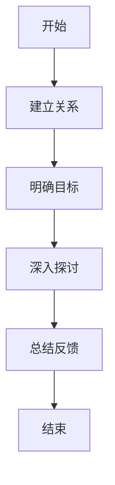
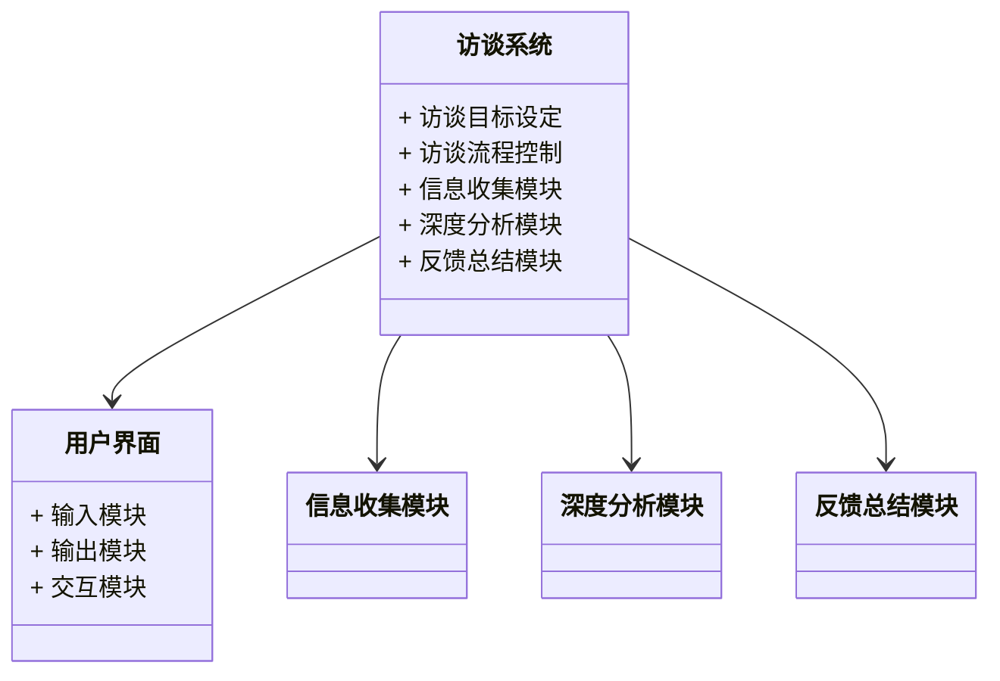
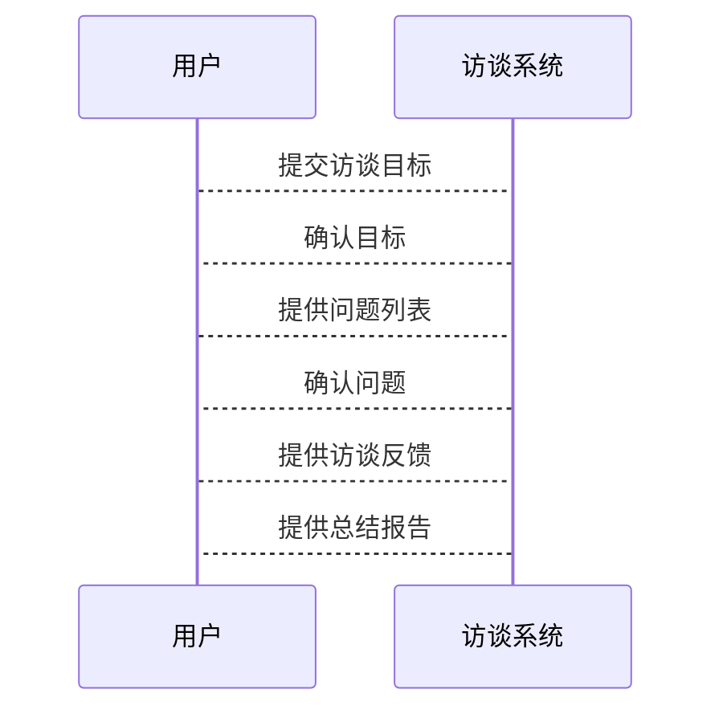

                 


# 《费雪的公司访谈技巧》

## 关键词：公司访谈技巧、费雪模型、职场沟通、管理效率、员工关系

## 摘要：《费雪的公司访谈技巧》系统介绍了费雪在公司访谈领域的创新方法，深入剖析了其模型的核心原理，结合实际案例，详细讲解了如何在职场中应用这些技巧以提升管理效率和优化员工关系。本书通过数学模型、系统架构和项目实战，全面阐述了费雪访谈技巧的理论基础和实践应用，为职场人士提供了实用的指导。

---

## 目录大纲

### 第一部分: 费雪的公司访谈技巧概述

#### 第1章: 公司访谈技巧的背景与意义

##### 1.1 费雪的公司访谈技巧的起源
- 1.1.1 访谈技巧的历史发展
  - 早期访谈方法的局限性
  - 现代访谈方法的演变
- 1.1.2 费雪在公司访谈领域的贡献
  - 费雪访谈模型的提出
  - 费雪方法的核心思想
- 1.1.3 访谈技巧在现代职场中的重要性
  - 提升公司管理效率
  - 优化员工关系
  - 促进公司文化构建

##### 1.2 公司访谈的核心概念
- 1.2.1 访谈的基本定义与分类
  - 面试、会谈、讨论的区别
  - 结构化访谈与非结构化访谈的定义
- 1.2.2 费雪访谈技巧的独特性
  - 以问题为导向的深度访谈
  - 结构化与灵活性的平衡
- 1.2.3 访谈在公司管理中的作用
  - 收集信息
  - 解决问题
  - 促进沟通

##### 1.3 费雪访谈技巧的应用价值
- 1.3.1 提升公司管理效率
  - 提高决策的准确性
  - 减少沟通障碍
- 1.3.2 优化员工关系
  - 建立信任
  - 提高员工满意度
- 1.3.3 促进公司文化构建
  - 强化企业价值观
  - 增强团队凝聚力

#### 第2章: 费雪公司访谈技巧的核心模型

##### 2.1 费雪访谈模型的结构
- 2.1.1 模型的组成要素
  - 目标设定
  - 问题设计
  - 深度分析
  - 反馈总结
- 2.1.2 模型的逻辑关系
  - 目标驱动问题
  - 问题引导分析
  - 分析支持反馈
- 2.1.3 模型的适用范围
  - 适用于公司内部管理
  - 适用于团队建设
  - 适用于跨部门沟通

##### 2.2 费雪访谈模型的流程图


##### 2.3 模型属性对比表
| 模型属性 | 费雪模型 | 对比模型 |
|----------|----------|----------|
| 目标     | 深入理解公司文化 | 收集基本信息 |
| 方法     | 引导式提问 | 直接提问 |
| 结果     | 公司文化洞察 | 基本信息收集 |

#### 第3章: 费雪访谈技巧的数学模型与公式

##### 3.1 访谈效果评估公式
$$ 访谈效果 = \frac{信息收集量 \times 深度}{时间} $$

##### 3.2 模型优化公式
$$ 优化系数 = \frac{新模型效果}{旧模型效果} $$

##### 3.3 示例分析
- 通过具体案例，分析如何通过公式优化访谈效果，例如：
  - 原模型效果：$$ 信息收集量 = 50，深度 = 3，时间 = 60分钟 $$
  - 优化后：$$ 信息收集量 = 70，深度 = 5，时间 = 60分钟 $$

### 第二部分: 费雪访谈技巧的系统分析与架构设计

#### 第4章: 系统分析与架构设计方案

##### 4.1 问题场景介绍
- 访谈目标设定
- 访谈流程设计
- 访谈结果分析

##### 4.2 项目介绍
- 项目目标
- 项目范围
- 项目团队
- 项目工具

##### 4.3 系统功能设计
- 功能模块划分
- 模块功能描述
- 模块交互流程

##### 4.4 系统架构设计


##### 4.5 系统接口设计
- API接口定义
- 接口调用流程
- 接口测试用例

##### 4.6 系统交互设计


### 第三部分: 费雪访谈技巧的项目实战

#### 第5章: 项目实战

##### 5.1 环境安装
- 安装必要的软件
- 配置开发环境
- 安装测试工具

##### 5.2 系统核心实现源代码
```python
def fisher_interview_analysis(target, questions):
    info_collected = 0
    depth_analysis = 0
    for q in questions:
        response = input(q)
        info_collected += 1
        depth_analysis += len(response.split())
    return info_collected, depth_analysis
```

##### 5.3 代码应用解读与分析
- 代码功能说明
- 代码优化建议
- 代码测试结果

##### 5.4 实际案例分析
- 案例背景介绍
- 案例实施过程
- 案例结果分析

##### 5.5 详细讲解剖析
- 实战经验总结
- 实战中的常见问题
- 实战解决方法

### 第四部分: 费雪访谈技巧的最佳实践

#### 第6章: 最佳实践与注意事项

##### 6.1 最佳实践
- 准备充分
- 运用灵活
- 注重反馈

##### 6.2 小结
- 总结本书的主要内容
- 强调费雪访谈技巧的重要性
- 展望未来的应用方向

##### 6.3 注意事项
- 避免常见错误
- 注意访谈对象的心理状态
- 保持访谈的客观性

#### 第7章: 拓展阅读与深入思考

##### 7.1 拓展阅读
- 推荐相关书籍
- 推荐专业文章
- 推荐在线资源

##### 7.2 深入思考
- 访谈技巧的未来发展
- 其他相关领域的应用
- 个人实践中的创新

---

### 作者：AI天才研究院/AI Genius Institute & 禅与计算机程序设计艺术 /Zen And The Art of Computer Programming

