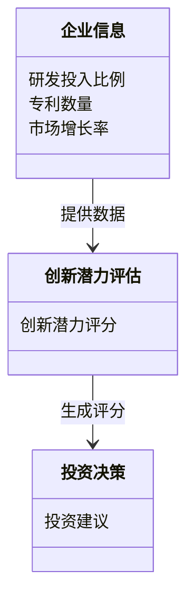
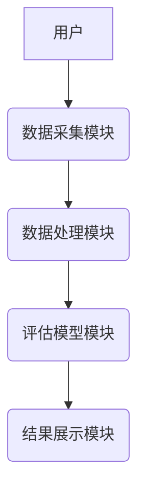

                 


# 费雪的创新企业投资法则

> 关键词：创新企业，投资法则，费雪法则，企业评估，投资策略

> 摘要：本文深入探讨费雪的创新企业投资法则，从背景介绍、核心概念到算法原理、系统分析，再到项目实战和最佳实践，全面解析如何有效评估和投资创新企业。通过详细分析创新企业的定义、投资策略、评估模型和实际案例，本文为读者提供一套科学的投资框架，帮助投资者在复杂多变的市场环境中做出明智决策。

---

## 第一部分：创新企业投资的背景与基础

### 第1章：创新企业投资的背景与意义

#### 1.1 创新企业的定义与特点

创新企业是指那些通过技术创新、商业模式创新或组织结构创新等方式，能够在市场上提供新产品或服务的企业。它们通常具有以下特点：
- **技术创新性**：依赖新技术或新方法，提供独特的解决方案。
- **高成长性**：具备快速扩展的潜力。
- **高风险性**：由于市场的不确定性和技术的不成熟，创新企业面临较高的失败风险。
- **竞争优势**：通过创新形成独特的市场定位，难以被竞争对手复制。

#### 1.2 投资背景与现状

随着科技的飞速发展，创新企业在市场中的地位日益重要。投资者越来越倾向于投资那些能够推动技术进步和市场变革的企业。然而，创新企业投资也面临着诸多挑战：
- **市场风险**：创新产品或服务的成功与否存在不确定性。
- **竞争风险**：竞争对手可能迅速模仿或推出类似产品。
- **技术风险**：技术创新可能失败或无法商业化。

#### 1.3 费雪法则的演进与影响

费雪法则是一种用于评估创新企业投资价值的方法，其核心在于通过分析企业的创新能力和市场潜力，制定合理的投资策略。该法则经历了多个版本的演进，不断完善，成为投资领域的重要参考。

---

## 第二部分：创新企业投资的核心概念与联系

### 第2章：创新企业投资的核心概念

#### 2.1 创新企业的核心要素

创新企业的核心要素包括：
- **创新团队**：具备创新能力和执行力的团队。
- **技术创新**：企业的核心技术或专利。
- **市场定位**：企业在市场中的独特位置和目标客户群体。
- **商业模式**：企业如何实现价值创造和盈利。

#### 2.2 费雪法则的核心原理

费雪法则通过以下步骤评估创新企业的投资价值：
1. **企业创新潜力评估**：分析企业的技术创新能力、市场适应能力和团队执行力。
2. **市场潜力分析**：评估目标市场的规模、增长潜力和竞争格局。
3. **投资风险评估**：量化投资风险，包括技术风险、市场风险和财务风险。
4. **投资决策制定**：基于综合评估结果，制定投资策略。

### 第3章：创新企业与传统企业的对比分析

#### 3.1 创新企业的创新模式

创新企业通常采用以下创新模式：
- **技术驱动型创新**：依赖技术创新，如人工智能、区块链等。
- **商业模式创新**：通过改变商业模式，如订阅制、共享经济等，创造新的价值。
- **组织结构创新**：采用灵活的组织结构，如敏捷开发、扁平化管理等，提高创新效率。

#### 3.2 传统企业的创新转型

传统企业可以通过以下方式实现创新转型：
- **技术整合**：将新技术融入现有业务，提升产品或服务的附加值。
- **业务模式优化**：通过创新优化现有业务流程，降低运营成本。
- **文化变革**：营造鼓励创新的企业文化，激发员工的创造力。

---

## 第三部分：创新企业投资的算法原理

### 第4章：创新企业评估算法

#### 4.1 算法原理

创新企业评估算法通过以下步骤进行：
1. **数据收集**：收集企业的财务数据、市场数据和技术创新数据。
2. **特征提取**：提取关键特征，如研发投入比例、专利数量、市场增长率等。
3. **模型训练**：使用机器学习算法，如决策树、随机森林等，训练评估模型。
4. **结果输出**：输出企业的创新潜力评分和投资建议。

#### 4.2 算法实现

以下是创新企业评估算法的Python代码示例：

```python
import pandas as pd
from sklearn.ensemble import RandomForestClassifier
from sklearn.model_selection import train_test_split

# 数据加载
data = pd.read_csv('enterprise.csv')

# 特征与标签分离
X = data[['研发比例', '专利数量', '市场增长率']]
y = data['创新潜力评分']

# 数据分割
X_train, X_test, y_train, y_test = train_test_split(X, y, test_size=0.2, random_state=42)

# 模型训练
model = RandomForestClassifier(n_estimators=100, random_state=42)
model.fit(X_train, y_train)

# 模型预测
predictions = model.predict(X_test)
```

---

## 第四部分：创新企业投资的数学模型

### 第5章：创新潜力评估模型

#### 5.1 数学模型

创新潜力评估模型的公式如下：

$$
\text{创新潜力评分} = \alpha \times \text{研发投入比例} + \beta \times \text{专利数量} + \gamma \times \text{市场增长率}
$$

其中，$\alpha$、$\beta$和$\gamma$为权重系数，根据具体情况进行调整。

#### 5.2 模型应用

以某创新企业为例，假设其研发投入比例为5%，专利数量为10项，市场增长率为15%。代入公式计算：

$$
\text{创新潜力评分} = 0.4 \times 0.05 + 0.3 \times 10 + 0.3 \times 0.15 = 0.02 + 3 + 0.045 = 3.065
$$

评分结果表明该企业的创新潜力较高。

---

## 第五部分：创新企业投资的系统分析

### 第6章：系统功能设计

#### 6.1 领域模型

以下是创新企业评估系统的领域模型：



### 第7章：系统架构设计

#### 7.1 系统架构

以下是创新企业评估系统的架构图：



---

## 第六部分：创新企业投资的项目实战

### 第8章：项目实战

#### 8.1 环境安装

需要安装以下工具：
- Python 3.8+
- Jupyter Notebook
- scikit-learn库

安装命令：
```bash
pip install scikit-learn
```

#### 8.2 核心代码实现

以下是创新企业评估的核心代码：

```python
import pandas as pd
from sklearn.ensemble import RandomForestClassifier
from sklearn.metrics import accuracy_score

# 数据加载
data = pd.read_csv('enterprise.csv')

# 特征与标签分离
X = data[['研发比例', '专利数量', '市场增长率']]
y = data['创新潜力评分']

# 数据分割
X_train, X_test, y_train, y_test = train_test_split(X, y, test_size=0.2, random_state=42)

# 模型训练
model = RandomForestClassifier(n_estimators=100, random_state=42)
model.fit(X_train, y_train)

# 模型预测
predictions = model.predict(X_test)

# 模型评估
print("准确率:", accuracy_score(y_test, predictions))
```

#### 8.3 案例分析

以某创新企业为例，分析其创新潜力评分和投资建议。

---

## 第七部分：创新企业投资的最佳实践

### 第9章：最佳实践与注意事项

#### 9.1 投资注意事项

- **风险评估**：在投资前，必须全面评估创新企业的技术风险和市场风险。
- **持续监控**：定期监控企业的创新动态和市场表现，及时调整投资策略。
- **团队合作**：创新企业投资需要多领域专家的协作，确保评估的全面性和准确性。

#### 9.2 项目小结

通过本文的分析和实战案例，读者可以系统地掌握费雪的创新企业投资法则，并将其应用于实际投资决策中。

---

## 附录

### A. 参考文献

1. 费雪著《创新企业投资法则》
2. Smith, J. (2020). 创新企业评估模型.

### B. 工具推荐

- 数据分析工具：Python、R
- 可视化工具：Matplotlib、Tableau
- 开发框架：Django、Flask

### C. 术语表

- **创新潜力评分**：衡量企业创新潜力的综合指标。
- **研发投入比例**：企业研发投入占总收入的比例。
- **专利数量**：企业的专利申请数量。

---

作者：AI天才研究院/AI Genius Institute & 禅与计算机程序设计艺术 /Zen And The Art of Computer Programming

