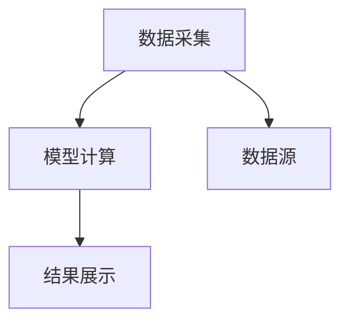

                 


# 费雪的创新企业投资法：把握科技革命

> 关键词：费雪投资法，创新企业，科技革命，投资策略，数学模型，系统架构，项目实战

> 摘要：本文系统介绍了费雪的创新企业投资法，探讨了如何在科技革命中把握投资机会。通过详细讲解创新企业的评估方法、投资策略、数学模型和系统架构，结合实际项目案例，帮助读者掌握费雪投资法的核心思想和应用技巧。文章还提供了最佳实践建议和注意事项，帮助读者在实际投资中规避风险，实现稳健收益。

---

## 第一部分：费雪投资法的核心理念

### 第1章：背景与起源

#### 1.1 费雪投资法的背景
费雪投资法是一种以基本面分析为基础的投资策略，强调对企业内在价值的评估。随着科技革命的推进，创新企业在市场中的地位愈发重要，费雪投资法为企业投资者提供了新的视角。

#### 1.2 核心思想
费雪投资法的核心在于寻找那些具有强大创新能力、良好管理团队和广阔市场前景的企业。通过深入分析企业的财务状况、技术实力和市场策略，投资者可以识别出具有长期增长潜力的标的。

#### 1.3 科技革命的影响
科技革命催生了大量创新企业，这些企业在技术、市场和管理方面具有独特优势。费雪投资法通过对企业创新潜力的评估，帮助投资者在科技革命中抓住机遇，规避风险。

### 第2章：创新企业的评估方法

#### 2.1 评估维度
创新企业的评估需要从技术创新能力、市场竞争力和管理能力三个维度入手。技术创新能力决定了企业的核心竞争力，市场竞争力反映了企业的市场地位，而管理能力则影响企业的持续发展。

#### 2.2 关键指标
在评估创新企业时，投资者需要关注多个关键指标，包括但不限于市盈率（P/E）、市净率（P/B）、研发投入占比、专利数量等。这些指标能够帮助投资者全面评估企业的价值和潜力。

#### 2.3 预测模型
费雪投资法通过构建创新潜力预测模型，将企业的财务数据、技术指标和市场表现进行综合分析。模型的核心是通过加权计算，得出企业的潜在价值，从而为投资决策提供依据。

### 第3章：投资策略

#### 3.1 组合投资
费雪投资法强调分散投资，通过构建多元化投资组合来降低风险。投资者应选择不同行业、不同阶段的创新企业，以分散市场波动带来的影响。

#### 3.2 风险管理
在科技革命中，创新企业的风险较高，因此风险管理尤为重要。投资者需要通过设定止损点、定期调整投资组合等方式，有效控制风险。

#### 3.3 长期视角
费雪投资法倡导长期投资，避免短期波动的干扰。通过长期持有优质创新企业，投资者能够分享企业的成长收益。

---

## 第二部分：数学模型与算法

### 第4章：数学模型

#### 4.1 模型介绍
费雪创新潜力预测模型通过对企业各项指标的加权计算，得出企业的潜在价值。模型公式如下：
$$
\text{潜在价值} = \sum_{i=1}^{n} w_i \times x_i
$$
其中，\(w_i\) 是各项指标的权重，\(x_i\) 是各项指标的具体数值。

#### 4.2 数据来源
模型的数据来源包括企业的财务报表、专利数量、研发投入占比等。这些数据能够全面反映企业的创新能力和市场潜力。

#### 4.3 应用案例
以下是一个具体的计算示例：
$$
\text{潜在价值} = 0.4 \times \text{市盈率} + 0.3 \times \text{研发投入占比} + 0.3 \times \text{专利数量}
$$
假设某企业的市盈率为20，研发投入占比为5%，专利数量为100，则：
$$
\text{潜在价值} = 0.4 \times 20 + 0.3 \times 5 + 0.3 \times 100 = 8 + 1.5 + 30 = 39.5
$$

### 第5章：算法实现

#### 5.1 算法流程
费雪投资法的算法流程如下：
1. 数据采集：收集企业的各项指标数据。
2. 指标计算：根据公式计算企业的潜在价值。
3. 模型评估：对比实际价值与潜在价值，评估投资可行性。

#### 5.2 Python代码实现
以下是Python代码实现示例：

```python
def calculate_potential_value(pe, r_d, patents):
    weight_pe = 0.4
    weight_rd = 0.3
    weight_patents = 0.3
    potential_value = (weight_pe * pe) + (weight_rd * r_d) + (weight_patents * patents)
    return potential_value

# 示例数据
pe = 20
r_d = 5
patents = 100

result = calculate_potential_value(pe, r_d, patents)
print("潜在价值:", result)
```

#### 5.3 结果分析
通过上述代码，我们可以计算出企业的潜在价值，并据此制定投资策略。如果潜在价值高于当前市场价格，则企业具有投资价值。

---

## 第三部分：系统架构与项目实战

### 第6章：系统架构设计

#### 6.1 系统介绍
费雪投资法系统旨在帮助企业投资者快速评估创新企业的潜力。系统包括数据采集、模型计算和结果展示三个模块。

#### 6.2 功能设计
- 数据采集模块：从企业财报和专利数据库中获取数据。
- 模型计算模块：根据公式计算企业的潜在价值。
- 结果展示模块：以图表形式展示评估结果。

#### 6.3 架构图



### 第7章：项目实战

#### 7.1 环境安装
需要安装Python和相关库（如Pandas、Matplotlib）。

#### 7.2 核心代码实现
以下是核心代码实现：

```python
import pandas as pd
import matplotlib.pyplot as plt

def calculate_potential_value(pe, r_d, patents):
    weight_pe = 0.4
    weight_rd = 0.3
    weight_patents = 0.3
    potential_value = (weight_pe * pe) + (weight_rd * r_d) + (weight_patents * patents)
    return potential_value

# 示例数据
data = {
    '公司': ['A', 'B', 'C'],
    '市盈率': [20, 15, 25],
    '研发投入占比': [5, 10, 3],
    '专利数量': [100, 80, 120]
}

df = pd.DataFrame(data)

# 计算潜在价值
df['潜在价值'] = df.apply(lambda row: calculate_potential_value(row['市盈率'], row['研发投入占比'], row['专利数量']), axis=1)

# 可视化结果
plt.figure(figsize=(10, 6))
plt.bar(df['公司'], df['潜在价值'])
plt.title('潜在价值对比')
plt.xlabel('公司')
plt.ylabel('潜在价值')
plt.show()
```

#### 7.3 案例分析
以某科技公司为例，计算其潜在价值并绘制对比图。通过分析结果，投资者可以判断该公司的投资价值。

---

## 第四部分：最佳实践与总结

### 第8章：最佳实践

#### 8.1 投资策略
- 长期视角：避免短期波动，选择具有长期增长潜力的企业。
- 组合投资：分散投资以降低风险。
- 风险管理：设定止损点，定期调整投资组合。

#### 8.2 注意事项
- 数据质量：确保数据来源可靠，避免因数据错误导致决策失误。
- 模型局限性：费雪模型适用于大多数情况，但在极端情况下可能失效。

### 第9章：总结

费雪的创新企业投资法是一种科学的投资策略，通过对企业创新潜力的评估，帮助投资者在科技革命中抓住机遇。本文详细讲解了费雪投资法的核心理念、数学模型和系统架构，并通过实际案例展示了其应用方法。投资者在实际操作中应结合市场变化，灵活调整投资策略，以实现稳健收益。

---

## 作者

作者：AI天才研究院 & 禅与计算机程序设计艺术

---

这篇文章系统地介绍了费雪的创新企业投资法，从理论到实践，为投资者提供了全面的指导。希望对您在科技革命中的投资有所帮助！

