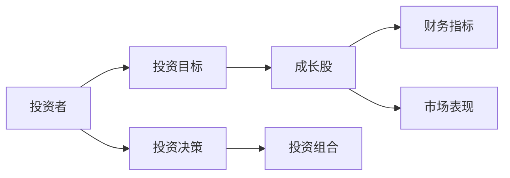
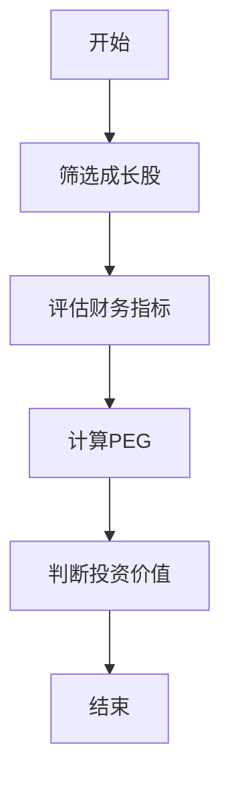
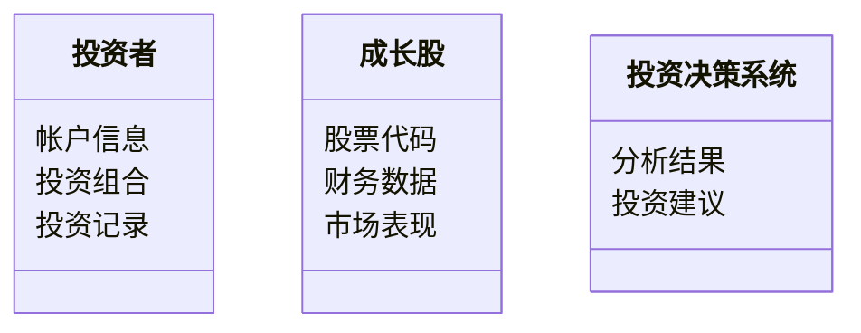

                 


# 费雪的创新企业投资策略

## 关键词
- 费雪投资策略  
- 成长股投资  
- 创新企业  
- 投资算法  
- 财务分析  

## 摘要
本文深入解析了费雪的创新企业投资策略，从背景、核心概念、算法原理到系统设计和实战案例，全面阐述了该策略的理论基础和实际应用。通过详细的技术分析和丰富的图表，帮助读者理解如何通过成长股投资实现长期价值增长。文章结合了理论与实践，适合投资者和程序员参考。

---

## 第一部分: 费雪的创新企业投资策略概述

### 第1章: 费雪投资策略的背景与核心理念

#### 1.1 投资领域的演变与挑战
##### 1.1.1 传统投资策略的局限性
传统投资策略主要依赖于市场趋势和短期价格波动，这种方法在市场波动剧烈时表现不佳，尤其是在科技和创新企业快速崛起的时代，传统策略难以捕捉成长股的长期价值。

##### 1.1.2 创新投资策略的兴起
随着科技和创新企业的快速发展，投资者开始关注企业的长期增长潜力，而非仅仅关注短期收益。这种背景下，以费雪为代表的成长股投资策略应运而生。

##### 1.1.3 费雪投资策略的背景与意义
费雪的投资策略基于对创新企业的深入研究，强调通过分析企业的财务数据和市场表现，找到具有持续增长潜力的公司。这种方法为投资者提供了更科学的投资依据。

#### 1.2 费雪投资策略的核心理念
##### 1.2.1 长期价值投资的重要性
费雪认为，投资的最终目标是通过持有优质资产实现长期价值增长，而非短期收益的最大化。这种理念强调了对企业基本面的深入分析。

##### 1.2.2 成长股投资的核心要素
成长股是指那些收入和利润持续增长的企业股票。费雪策略的核心在于通过分析企业的财务数据和市场地位，识别出具有持续增长潜力的公司。

##### 1.2.3 费雪策略的创新性与独特性
与传统投资策略不同，费雪策略强调通过对企业基本面的深入分析，结合市场趋势和行业特点，找到具有长期增长潜力的企业。

#### 1.3 费雪投资策略的目标与边界
##### 1.3.1 投资目标的定义与分类
费雪策略的目标是通过投资于具有持续增长潜力的企业，实现投资组合的长期价值增长。

##### 1.3.2 费雪策略的应用边界
尽管费雪策略在成长股投资中表现优异，但在市场波动剧烈或企业基本面恶化的情况下，该策略可能面临较大的风险。

##### 1.3.3 策略的适用场景与限制
费雪策略适用于成长型企业较多的行业，如科技、医疗和新兴制造业。但在周期性较强的行业，该策略的表现可能不佳。

---

### 第2章: 费雪投资策略的核心概念与联系

#### 2.1 核心概念原理
##### 2.1.1 成长股的定义与特征
成长股是指那些收入和利润持续增长的企业股票。其核心特征包括高增长率、 strong market position and strong financial health.

##### 2.1.2 费雪策略的核心要素
- 企业基本面分析
- 市盈率与盈利增长率的匹配
- 企业的长期增长潜力

##### 2.1.3 投资决策的关键指标
- 市盈率（P/E）
- 盈利增长率（ROE）
- 市盈率相对盈利增长比率（PEG）

#### 2.2 核心概念属性对比表格
##### 表2-1: 成长股与价值股的对比分析
| 属性         | 成长股          | 价值股          |
|--------------|----------------|----------------|
| 市盈率（P/E） | 高             | 低             |
| 盈利增长率（ROE） | 高             | 低             |
| 投资逻辑     | 未来增长潜力   | 当前低估值      |

##### 表2-2: 费雪策略与其他投资策略的对比
| 策略         | 成长股投资 | 价值投资 | 技术投资 |
|--------------|------------|----------|----------|
| 核心逻辑     | 未来增长   | 当前估值  | 技术指标  |
| 适用场景     | 高成长行业 | 低估值行业 | 市场趋势 |

#### 2.3 实体关系图（ER图）


---

### 第3章: 费雪投资策略的算法原理

#### 3.1 算法流程图


#### 3.2 算法实现代码
```python
def fisher_growth_analysis(financial_data):
    # 计算PEG
    peg = financial_data['市盈率'] / financial_data['盈利增长率']
    if peg < 1.5:
        return "投资机会"
    else:
        return "观望"
```

#### 3.3 数学模型与公式
##### 3.3.1 市盈率（P/E）计算
$$ P/E = \frac{股票价格}{每股净收益} $$

##### 3.3.2 市盈率相对盈利增长比率（PEG）
$$ PEG = \frac{P/E}{盈利增长率} $$

---

### 第4章: 系统分析与架构设计方案

#### 4.1 问题场景介绍
##### 4.1.1 投资者需求分析
投资者希望找到具有长期增长潜力的企业，实现投资组合的长期价值增长。

##### 4.1.2 系统目标与范围
系统的目标是通过分析企业的财务数据和市场表现，识别出具有长期增长潜力的公司。

##### 4.1.3 约束条件与假设
- 数据来源的可靠性
- 计算模型的准确性
- 市场环境的稳定性

#### 4.2 系统功能设计
##### 4.2.1 领域模型（类图）


---

### 第5章: 项目实战

#### 5.1 环境安装与配置
```bash
pip install pandas numpy matplotlib
```

#### 5.2 系统核心实现源代码
```python
import pandas as pd
import numpy as np

def calculate_pe(stock_data):
    return stock_data['股价'] / stock_data['每股净收益']

def calculate_peg(pe, growth_rate):
    return pe / growth_rate

def main():
    stock_data = pd.read_csv('stock.csv')
    pe = calculate_pe(stock_data)
    peg = calculate_peg(pe, stock_data['盈利增长率'])
    investment_decision = '投资机会' if peg < 1.5 else '观望'
    print(investment_decision)

if __name__ == "__main__":
    main()
```

#### 5.3 代码应用解读与分析
- 代码首先读取股票数据，计算市盈率和PEG，最后根据PEG值做出投资决策。

#### 5.4 实际案例分析
以科技行业为例，分析某创新企业的财务数据，计算其PEG值，并根据结果给出投资建议。

---

## 结论与展望

费雪的创新企业投资策略通过深入分析企业的财务数据和市场表现，识别出具有长期增长潜力的公司。这种方法不仅适用于科技行业，还可以扩展到其他高成长行业。未来，随着人工智能和大数据技术的发展，费雪策略将更加精准和高效。

---

## 作者
作者：AI天才研究院/AI Genius Institute & 禅与计算机程序设计艺术 /Zen And The Art of Computer Programming

