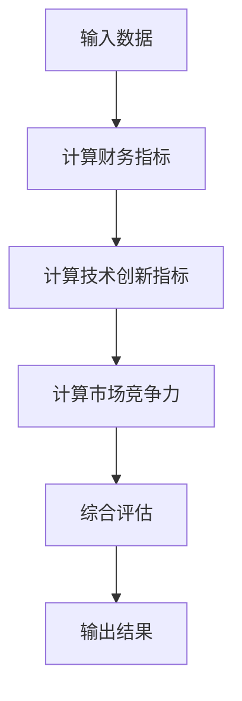
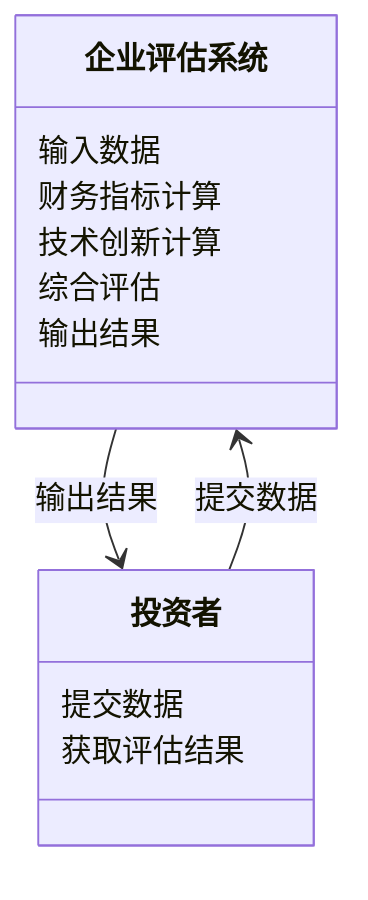
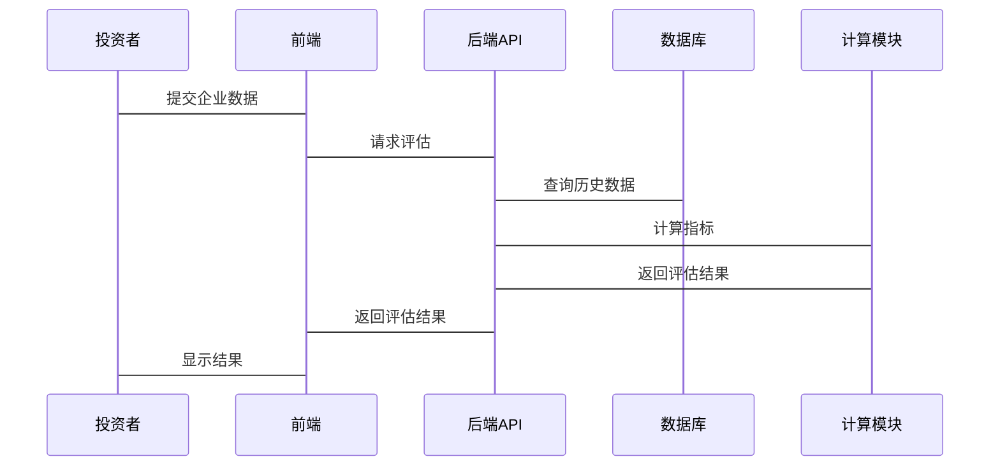

                 


# 费雪的创新企业评估：技术革新时代的投资机会

> 关键词：费雪投资理论，技术创新，企业评估，技术变革，投资机会

> 摘要：本文探讨了在技术革新时代，如何结合费雪的投资理论，评估创新企业并识别投资机会。通过分析技术创新对企业价值的影响，构建创新企业评估模型，并通过案例分析提供实际应用。

---

# 第一章: 费雪投资理论与技术创新的结合

## 1.1 费雪投资理论概述

### 1.1.1 费雪的投资理念与方法

菲利普斯·费雪（Philip Fisher）是20世纪著名的投资理论家，他提出了“成长股投资”理念，强调选择具有持续增长潜力的企业。其核心观点包括：

1. **成长股投资**：投资那些具有持续增长潜力的企业，而非仅仅关注短期收益。
2. **管理层质量**：重视企业管理层的诚信与能力。
3. **竞争优势**：选择那些在行业内具有竞争优势的企业。

### 1.1.2 技术创新对企业价值的影响

技术创新是推动企业增长的核心动力。在技术革新时代，企业通过技术创新可以实现产品升级、成本降低和市场扩展。技术创新不仅提升企业的盈利能力，还可能改变行业的竞争格局。

### 1.1.3 费雪理论在现代投资中的应用

费雪的理论在现代投资中依然具有重要价值，尤其是在技术驱动的市场中。投资者需要将技术创新作为评估企业的重要因素，结合企业的财务状况、管理层能力和市场地位，进行综合判断。

---

## 1.2 技术变革对企业评估的核心影响

### 1.2.1 技术创新与企业竞争优势

技术创新是企业建立竞争优势的关键。例如，一家成功开发出颠覆性技术的企业，可能在短时间内改变行业格局，获取超额利润。

### 1.2.2 技术变革对企业生命周期的影响

技术变革会影响企业的生命周期。企业需要不断创新，否则可能在竞争中被淘汰。技术创新能力强的企业更有可能延长生命周期。

### 1.2.3 技术对企业估值模型的重构

传统的估值模型（如PE、PB）在技术驱动的市场中显得不足。创新企业需要新的估值模型，考虑技术潜力、研发投入和市场扩展能力。

---

# 第二章: 创新企业的评估方法

## 2.1 创新企业的核心评估指标

### 2.1.1 财务指标分析

- 营业收入增长率：反映企业市场扩展能力。
- 净利润率：衡量企业盈利能力。
- 研发投入占比：体现企业技术创新投入。

### 2.1.2 技术创新指标

- 技术专利数量：衡量技术创新能力。
- 技术领先性：是否处于行业技术前沿。
- 技术团队能力：团队的专业性和创新能力。

### 2.1.3 市场竞争力分析

- 市场占有率：企业在市场中的地位。
- 竞争对手分析：分析主要竞争对手的技术和市场策略。
- 客户满意度：客户对企业产品和服务的评价。

---

## 2.2 技术创新与企业估值模型

### 2.2.1 传统估值模型的局限性

传统模型忽视了技术创新的未来影响，难以准确评估创新企业的价值。

### 2.2.2 费雪创新企业估值模型的构建

费雪模型将技术创新纳入估值，考虑企业的研发能力、市场潜力和竞争优势。

### 2.2.3 案例分析：某技术创新企业的估值实践

以某科技公司为例，分析其研发投入、技术领先性和市场扩展能力，结合财务指标，评估其潜在价值。

---

# 第三章: 技术变革对企业投资策略的影响

## 3.1 技术变革对企业投资决策的影响

### 3.1.1 技术变革对投资周期的影响

技术变革缩短了投资周期，投资者需要更频繁地评估和调整投资组合。

### 3.1.2 技术变革对企业风险评估的重构

技术创新降低了技术风险，但增加了市场和管理风险。

### 3.1.3 技术变革对投资组合优化的启示

投资者应分散投资，平衡技术创新型企业和传统企业的比例。

---

## 3.2 费雪创新企业评估模型的算法原理

### 3.2.1 模型输入与输出

**输入**：企业财务数据、技术创新指标、市场数据  
**输出**：企业价值评估、投资建议

### 3.2.2 模型算法流程图（mermaid）



### 3.2.3 模型数学公式

企业价值 \( EV \) 计算公式：
$$ EV = \alpha \times \text{收入增长率} + \beta \times \text{技术创新指标} $$

其中，\( \alpha \) 和 \( \beta \) 是权重系数。

---

# 第四章: 费雪创新企业评估模型的系统架构设计

## 4.1 系统功能设计

### 4.1.1 领域模型（mermaid类图）



### 4.1.2 系统架构设计（mermaid架构图）

```mermaid
dataflowDiagram
    前端 --> 后端API: 发送企业数据
    后端API --> 数据库: 查询历史数据
    后端API --> 计算模块: 计算指标
    计算模块 --> 后端API: 返回评估结果
    后端API --> 前端: 返回评估结果
```

### 4.1.3 系统接口设计

- API接口：接收企业数据，返回评估结果。
- 数据格式：JSON格式。

### 4.1.4 系统交互设计（mermaid序列图）



---

## 4.2 系统实现与代码分析

### 4.2.1 环境安装与配置

- Python 3.8+
- 安装依赖：pip install flask, pymongo, scikit-learn

### 4.2.2 核心算法实现（Python源代码）

```python
def calculate_ev(finance_data, tech_data):
    alpha = 0.7
    beta = 0.3
    ev = alpha * finance_data['revenue_growth'] + beta * tech_data['patents_count']
    return ev

# 示例
finance_data = {'revenue_growth': 0.2}
tech_data = {'patents_count': 10}
ev = calculate_ev(finance_data, tech_data)
print(f"企业价值评估：{ev}")
```

### 4.2.3 代码解读与优化建议

- **代码解读**：计算企业价值，权重系数α和β根据经验设定。
- **优化建议**：引入更多指标，如研发投入占比，动态调整权重。

---

# 第五章: 技术创新企业的实际案例分析

## 5.1 案例分析：技术创新企业的评估与投资策略

### 5.1.1 案例背景与问题描述

选择一家科技公司，分析其财务状况、技术创新能力和市场竞争力。

### 5.1.2 评估模型的应用与结果

使用费雪模型评估，得出其企业价值和投资建议。

### 5.1.3 投资策略的制定与优化

基于评估结果，制定长期和短期投资策略。

## 5.2 案例分析：传统企业转型中的技术创新评估

### 5.2.1 转型背景与挑战

传统企业面临技术落后、竞争力下降的问题。

### 5.2.2 技术创新评估模型

评估转型中的技术创新能力，预测企业未来的市场地位。

---

# 第六章: 投资策略与风险管理

## 6.1 投资策略

### 6.1.1 长期投资策略

选择具有持续技术创新能力的企业，长期持有。

### 6.1.2 短期投资策略

关注技术创新带来的短期股价波动，进行波段操作。

## 6.2 风险管理

### 6.2.1 技术风险

评估技术创新的可行性，避免投资失败的技术项目。

### 6.2.2 市场风险

分散投资，降低市场波动带来的风险。

---

# 第七章: 未来趋势与挑战

## 7.1 未来趋势

### 7.1.1 人工智能与自动化

AI和自动化将改变企业运营模式，创造新的投资机会。

### 7.1.2 区块链技术

区块链技术将提升企业信任度和效率，具有广阔的应用前景。

## 7.2 挑战

### 7.2.1 技术快速迭代

技术更新换代快，企业需要持续创新，投资者需要及时调整策略。

### 7.2.2 法律与伦理问题

技术创新可能引发法律和伦理问题，影响企业的长期发展。

---

# 结论

在技术革新时代，费雪的投资理论为创新企业评估提供了重要指导。通过结合技术创新和企业基本面分析，投资者可以更好地识别投资机会，制定科学的投资策略。未来，随着技术的进一步发展，创新企业评估将更加依赖于综合分析和风险管理。

---

# 作者

作者：AI天才研究院（AI Genius Institute） & 禅与计算机程序设计艺术（Zen And The Art of Computer Programming）

---

**注**：由于篇幅限制，以上内容未详细展开所有部分，具体实现可根据实际需求进一步补充。

