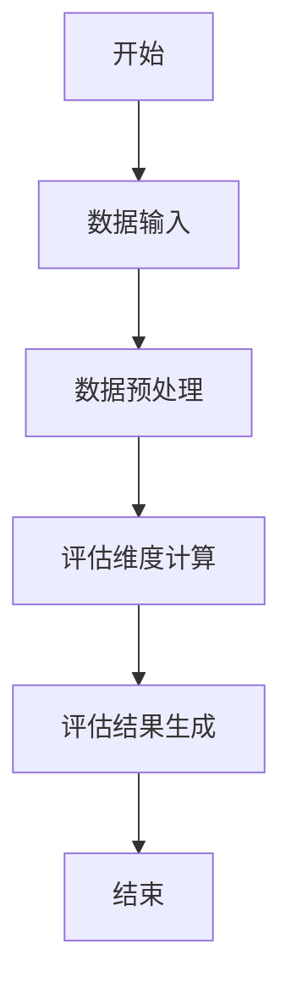
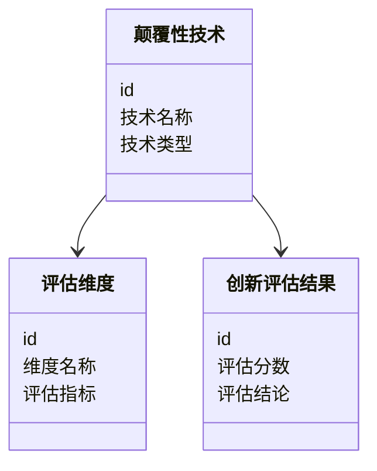

                 


# 费雪的创新评估体系：应对颠覆性技术的影响

> 关键词：创新评估体系，颠覆性技术，技术可行性，市场潜力，商业可行性

> 摘要：本文介绍费雪创新评估体系，详细阐述其背景、核心概念、算法原理、系统架构，并通过实际案例展示其应用。体系帮助企业识别和应对颠覆性技术的影响，确保在技术快速变化的环境中保持竞争力。

---

## 第1章: 颠覆性技术与创新评估的背景

### 1.1 颠覆性技术的定义与特征

颠覆性技术是指能够改变现有市场格局或创造新市场的技术。与延续性技术不同，颠覆性技术通常以非线性的方式发展，可能取代现有技术或市场。其核心特征包括：

- **低成本**：颠覆性技术往往能够以更低的成本实现更高的价值。
- **高潜力**：具有改变行业规则的潜力。
- **非连续性**：发展路径不同于现有技术。

例如，智能手机的出现颠覆了传统手机行业，改变了人们的通信方式和生活习惯。

### 1.2 创新评估体系的必要性

创新评估体系是帮助企业识别和评估创新机会的关键工具。在面对颠覆性技术时，企业需要快速判断其潜在影响，制定相应的战略。创新评估体系的作用包括：

- **技术可行性分析**：评估技术的成熟度和潜力。
- **市场潜力分析**：预测技术在市场中的表现。
- **商业可行性分析**：评估技术的商业价值和盈利能力。

### 1.3 费雪创新评估体系的提出

费雪创新评估体系是一种针对颠覆性技术的评估方法。它通过多维度的分析，帮助企业识别潜在的技术威胁和机会。体系的核心目标是通过科学的评估模型，指导企业在技术变革中做出明智决策。

---

## 第2章: 费雪创新评估体系的核心概念与联系

### 2.1 颠覆性技术的评估维度

颠覆性技术的评估可以从以下几个维度进行：

- **技术可行性**：技术是否成熟，能否大规模应用。
- **市场潜力**：技术在市场中的需求和增长空间。
- **商业可行性**：技术的商业模式和盈利能力。

**对比表格：**

| 维度 | 技术可行性 | 市场潜力 | 商业可行性 |
|------|------------|----------|------------|
| 焦点 | 技术成熟度 | 市场需求 | 商业模式   |
| 示例 | 人工智能的成熟度 | 智能手机的市场需求 | 人工智能的商业模式 |

### 2.2 费雪评估模型的原理

费雪评估模型通过加权计算，综合考虑技术可行性、市场潜力和商业可行性，得出技术的整体评估分数。模型的输入变量包括：

- 技术成熟度
- 技术潜力
- 市场需求量
- 技术渗透率
- 成本效益比

**计算公式：**

- 技术可行性 = (技术成熟度 + 技术潜力) / 2
- 市场潜力 = 市场需求量 × 技术渗透率
- 商业可行性 = (成本效益比 + 市场竞争力) / 2

### 2.3 ER实体关系图

```mermaid
er
    entity(颠覆性技术) {
        id
        技术名称
        技术类型
    }
    entity(评估维度) {
        id
        维度名称
        评估指标
    }
    entity(创新评估结果) {
        id
        评估分数
        评估结论
    }
    relation(属于) between 颠覆性技术 和 评估维度
    relation(影响) between 颠覆性技术 和 创新评估结果
```

---

## 第3章: 费雪创新评估体系的算法原理

### 3.1 评估算法的流程



### 3.2 算法的数学模型

- 技术可行性的计算公式：
  $$ 技术可行性 = \frac{技术成熟度 + 技术潜力}{2} $$

- 市场潜力的计算公式：
  $$ 市场潜力 = 市场需求量 \times 技术渗透率 $$

- 商业可行性的计算公式：
  $$ 商业可行性 = \frac{成本效益比 + 市场竞争力}{2} $$

---

## 第4章: 系统分析与架构设计方案

### 4.1 问题场景介绍

在企业面对颠覆性技术时，需要快速评估其影响。例如，电动汽车技术的出现可能颠覆传统汽车行业。

### 4.2 系统功能设计

系统功能包括数据输入、预处理、评估维度计算和结果生成。系统架构设计如下：



### 4.3 接口设计与交互

系统接口设计包括数据输入接口、评估结果输出接口和用户交互界面。用户可以通过界面提交技术信息，系统返回评估结果。

---

## 第5章: 项目实战与案例分析

### 5.1 环境安装与核心代码实现

环境安装：
- 安装Python和相关库（如numpy、pandas）。
- 安装Mermaid图表生成工具。

核心代码实现：

```python
# 技术可行性计算
def calculate_technical_feasibility(maturity, potential):
    return (maturity + potential) / 2

# 市场潜力计算
def calculate_market_potential(demand, penetration):
    return demand * penetration

# 商业可行性计算
def calculateCommercialFeasibility(cost_effectiveness, market_competition):
    return (cost_effectiveness + market_competition) / 2
```

### 5.2 代码应用解读与分析

代码解读：
- `calculate_technical_feasibility`函数计算技术可行性，参数为技术成熟度和潜力。
- `calculate_market_potential`函数计算市场潜力，参数为市场需求和技术渗透率。
- `calculateCommercialFeasibility`函数计算商业可行性，参数为成本效益比和市场竞争力。

### 5.3 案例分析与详细讲解

以电动汽车为例：
- 技术成熟度：高
- 技术潜力：高
- 市场需求：高
- 技术渗透率：中
- 成本效益比：高

计算结果：
- 技术可行性 = (高 + 高) / 2 = 高
- 市场潜力 = 高 × 中 = 高
- 商业可行性 = (高 + 高) / 2 = 高

结论：电动汽车具有高技术可行性和市场潜力，商业可行性高，值得投资。

---

## 第6章: 最佳实践、小结与注意事项

### 6.1 小结

费雪创新评估体系通过多维度分析，帮助企业识别和应对颠覆性技术的影响。体系的应用需要结合实际案例，进行详细的计算和分析。

### 6.2 注意事项

- 数据的准确性：评估结果依赖于输入数据的准确性。
- 模型的适用性：不同技术可能需要调整评估维度和权重。
- 评估的及时性：及时进行评估，以应对快速变化的技术环境。

### 6.3 拓展阅读

推荐书籍：
- 《创新者的窘境》
- 《技术预见的未来》

---

## 作者：AI天才研究院/AI Genius Institute & 禅与计算机程序设计艺术/Zen And The Art of Computer Programming

---

通过本文，读者可以深入了解费雪创新评估体系的核心内容和应用方法，帮助企业在技术快速变化的环境中做出明智决策。

