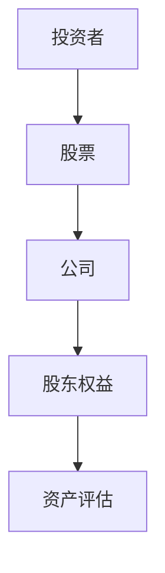
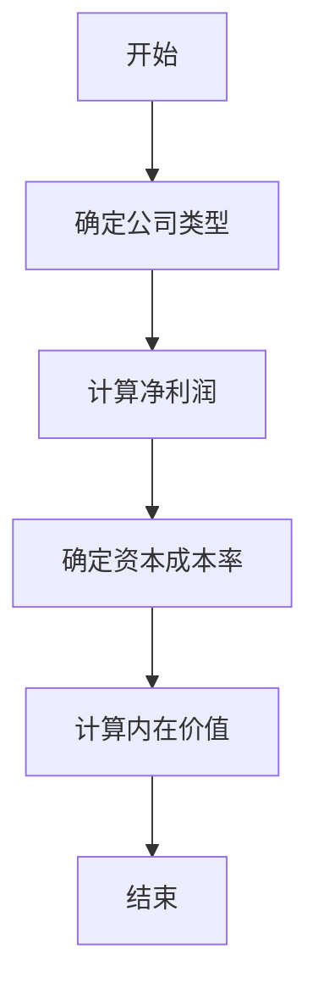
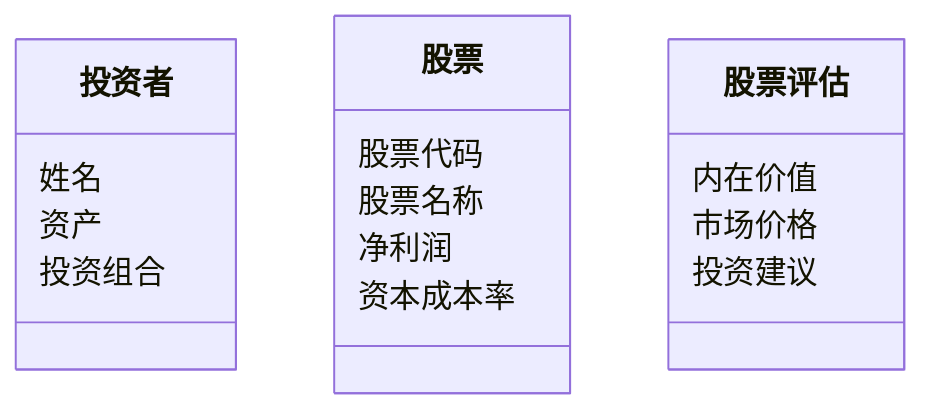
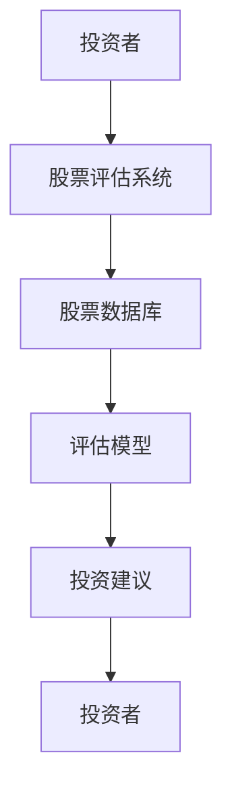

                 


# 费雪的十五个投资原则

> 关键词：费雪投资原则，价值投资，股票评估，资本成本率，投资决策

> 摘要：本文深入探讨了费雪的十五个投资原则，从背景介绍、核心概念、算法原理、系统分析、项目实战到总结，全面解析了这些原则的理论基础、数学模型、应用场景和实践技巧，帮助读者更好地理解和应用这些投资原则。

---

## 第一部分: 投资基础与费雪投资原则概述

### 第1章: 投资的基本概念与方法论

#### 1.1 投资的基本概念

##### 1.1.1 投资的定义与分类
投资是指将资金投入到某个资产或项目中，以期获得未来收益的行为。根据资产类型，投资可以分为股票、债券、房地产等多种形式。根据投资期限，投资可以分为短期投资和长期投资。

##### 1.1.2 投资的基本原则
投资的基本原则包括分散投资、长期持有、价值评估和风险管理。这些原则是投资者在进行投资决策时需要遵循的核心指导思想。

##### 1.1.3 投资与投机的区别
投资强调长期价值和基本面分析，而投机则更关注短期价格波动和市场情绪。投资更注重风险控制，而投机则更注重快速获利。

#### 1.2 费雪及其投资理念

##### 1.2.1 费雪的生平简介
菲利普·费雪（Philip Fisher）是20世纪著名的投资大师之一，他提出了许多经典的投资原则，尤其在成长型股票投资方面具有深远影响。

##### 1.2.2 费雪的投资哲学
费雪主张投资具有强大成长潜力的公司，注重公司的管理团队、财务状况和市场前景。他认为，投资的成功取决于对公司基本面的深入研究和长期持有。

##### 1.2.3 费雪投资理念的核心思想
费雪的核心思想是通过深入分析公司的基本面，选择那些具有持续增长潜力的公司，并长期持有这些股票，以实现资本增值。

#### 1.3 费雪的十五个投资原则概述

##### 1.3.1 原则的总体框架
费雪的十五个投资原则涵盖了投资的各个方面，包括公司基本面分析、股票估值、风险控制和投资策略。

##### 1.3.2 原则的核心要点
- 选择具有强大成长潜力的公司。
- 注重公司的管理团队和财务状况。
- 长期持有优质股票，避免频繁交易。
- 分散投资以降低风险。

##### 1.3.3 原则的实践意义
费雪的投资原则为投资者提供了科学的投资方法，帮助他们在复杂的市场环境中做出明智的投资决策。

---

## 第二部分: 费雪投资原则的核心概念与联系

### 第2章: 费雪投资原则的核心概念与联系

#### 2.1 费雪投资原则的核心概念

##### 2.1.1 价值投资
价值投资是指以低于内在价值的价格购买优质资产，长期持有以实现资本增值。

##### 2.1.2 股东权益
股东权益是公司资产减去负债后的净值，反映了股东在公司中的权益。

##### 2.1.3 资产评估
资产评估是通过对公司财务状况、盈利能力和发展潜力的综合分析，确定资产的内在价值。

#### 2.2 费雪投资原则的概念属性特征对比

##### 2.2.1 股票与债券的对比
股票代表公司的所有权，债券代表债权关系。股票的风险和回报通常高于债券。

##### 2.2.2 长期与短期投资的对比
长期投资注重资本增值，而短期投资更关注价格波动。长期投资的风险较低，回报周期较长。

##### 2.2.3 高风险与低风险投资的对比
高风险投资回报潜力大，但风险也高；低风险投资回报稳定，但潜力较小。

#### 2.3 费雪投资原则的ER实体关系图



---

## 第三部分: 费雪投资原则的算法原理

### 第3章: 费雪投资原则的算法原理

#### 3.1 费雪投资原则的数学模型

##### 3.1.1 股票内在价值的计算公式
股票的内在价值可以通过以下公式计算：

$$ V = \frac{E}{k} $$

其中，\( V \) 是股票的内在价值，\( E \) 是公司的净利润，\( k \) 是资本成本率。

##### 3.1.2 净利润的计算
净利润可以通过以下公式计算：

$$ \text{净利润} = \text{收入} - \text{成本} - \text{税金} $$

##### 3.1.3 资本成本率的确定
资本成本率可以通过以下步骤确定：
1. 确定公司的资本结构。
2. 计算债务成本和股权成本。
3. 结合资本结构确定综合资本成本率。

#### 3.2 股票价值评估的流程图



#### 3.3 费雪投资原则的算法实现

##### 3.3.1 算法步骤

1. 确定公司的基本面数据。
2. 计算公司的净利润。
3. 确定资本成本率。
4. 计算股票的内在价值。
5. 比较内在价值与市场价格。
6. 作出投资决策。

##### 3.3.2 Python实现代码

```python
def calculate_intrinsic_value(net_profit, capital_cost):
    return net_profit / capital_cost

net_profit = 1000000  # 假设净利润为100万元
capital_cost = 0.1     # 假设资本成本率为10%
intrinsic_value = calculate_intrinsic_value(net_profit, capital_cost)
print(f"股票的内在价值为: {intrinsic_value}")
```

---

## 第四部分: 系统分析与架构设计

### 第4章: 系统分析与架构设计

#### 4.1 投资决策系统的场景描述

##### 4.1.1 系统目标
构建一个基于费雪投资原则的投资决策支持系统，帮助投资者进行股票评估和投资决策。

##### 4.1.2 系统用户
系统用户包括个人投资者、机构投资者和金融分析师。

##### 4.1.3 系统功能
系统功能包括股票评估、投资建议、风险评估和投资组合优化。

#### 4.2 系统功能设计

##### 4.2.1 领域模型



#### 4.3 系统架构设计



---

## 第五部分: 项目实战

### 第5章: 项目实战

#### 5.1 环境安装

1. 安装Python和相关库（如pandas、numpy）。
2. 安装Mermaid和系统架构工具。

#### 5.2 系统核心实现源代码

```python
import pandas as pd
import numpy as np

def calculate_intrinsic_value(net_profit, capital_cost):
    return net_profit / capital_cost

# 示例数据
data = {
    '股票代码': ['AAPL', 'MSFT', 'GOOGL'],
    '净利润': [1000000, 1500000, 2000000],
    '资本成本率': [0.1, 0.12, 0.08]
}

df = pd.DataFrame(data)

# 计算内在价值
df['内在价值'] = df.apply(lambda x: calculate_intrinsic_value(x['净利润'], x['资本成本率']), axis=1)

print(df)
```

#### 5.3 代码应用解读与分析

上述代码通过Pandas数据框读取股票的基本数据，并使用自定义函数计算股票的内在价值。计算结果可以帮助投资者评估股票的合理价格。

#### 5.4 实际案例分析

以苹果公司为例，假设其净利润为1000万元，资本成本率为10%。根据公式计算，其内在价值为：

$$ V = \frac{10000000}{0.1} = 100000000 $$

如果市场价格低于100000000元，则该股票具有投资价值。

#### 5.5 项目小结

通过实际案例分析，我们可以看到费雪投资原则在实际投资中的应用价值。投资者可以通过深入分析公司的基本面，选择具有成长潜力的股票进行投资。

---

## 第六部分: 总结与注意事项

### 第6章: 总结与注意事项

#### 6.1 总结

费雪的十五个投资原则为投资者提供了科学的投资方法，帮助他们在复杂的市场环境中做出明智的投资决策。通过深入分析公司的基本面，选择具有成长潜力的股票，并长期持有，投资者可以实现资本的稳定增值。

#### 6.2 注意事项

1. 投资者需要不断学习和更新自己的知识，以适应市场变化。
2. 投资决策需要结合市场环境和公司实际情况。
3. 投资者应避免盲目跟风，注重风险控制。

---

## 作者

作者：AI天才研究院/AI Genius Institute & 禅与计算机程序设计艺术 /Zen And The Art of Computer Programming

