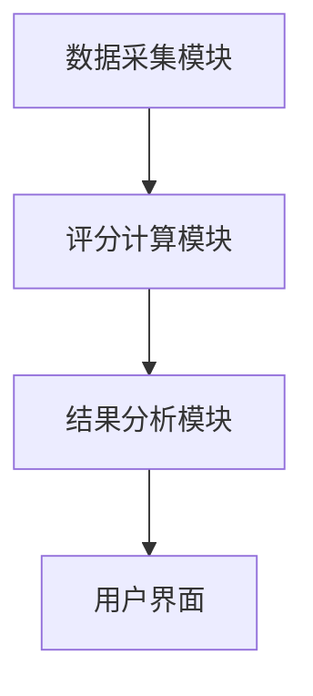
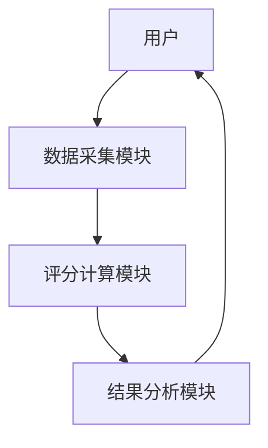

                 


# 费雪的十五个投资点：选股的黄金法则

## 关键词：费雪投资理论、选股法则、投资策略、选股模型、投资组合优化

## 摘要：  
本文深入探讨了菲利普·费雪（Philip Fisher）的投资理论，特别是其著名的“十五个选股点”。通过分析这些选股点的核心概念、数学模型和系统架构，本文为读者提供了如何在现代投资环境中应用这些理论的详细指导。文章结合实际案例和系统设计，展示了如何利用费雪的选股法则构建高效的投资策略，并优化投资组合的表现。

---

# 第1章: 费雪投资理论的背景与基础

## 1.1 费雪及其投资哲学

### 1.1.1 费雪的生平简介  
菲利普·费雪（Philip Fisher）是20世纪著名的投资家，被誉为“成长股投资之父”。他出生于1907年，逝世于2004年，毕生致力于研究投资理论，尤其是在成长股领域的研究。费雪的投资理念对现代投资理论产生了深远影响。

### 1.1.2 费雪的投资哲学与理念  
费雪的核心思想是“投资于成长股”，即选择那些具有持续增长潜力的公司。他认为，投资者应该关注企业的基本面，尤其是公司的管理团队、竞争优势和财务健康状况。费雪的投资哲学强调长期持有的策略，而不是短期的市场波动。

### 1.1.3 费雪理论的现代意义  
尽管费雪的投资理论提出于20世纪中期，但在当今的投资环境中依然具有重要的指导意义。随着市场的不断发展，费雪的理论帮助投资者在复杂的市场环境中识别出具有长期增长潜力的优质企业。

---

## 1.2 费雪的“十五个选股点”

### 1.2.1 选股点的提出背景  
费雪在长期的投资实践中总结出了十五条选股标准，这些标准涵盖了企业质量、管理团队、财务状况等多个方面。这些选股点旨在帮助投资者全面评估一家公司的潜力。

### 1.2.2 选股点的核心思想  
费雪的选股点强调企业的成长性和竞争优势。他认为，选择一家具有强大竞争优势和优秀管理团队的企业，能够为投资者带来长期的超额收益。

### 1.2.3 选股点的逻辑框架  
费雪的选股点可以分为以下几个类别：  
1. **企业质量**：包括公司的财务状况、盈利能力、管理团队等。  
2. **竞争优势**：包括公司的市场地位、技术创新能力等。  
3. **成长潜力**：包括行业的增长前景、公司的市场份额等。  

---

## 1.3 费雪投资理论的实践价值

### 1.3.1 投资理论的实用性  
费雪的投资理论为投资者提供了一个系统化的选股框架。通过这些选股点，投资者可以更全面地评估企业的潜力，从而做出更明智的投资决策。

### 1.3.2 理论在现代投资中的应用  
在现代投资中，费雪的理论被广泛应用于成长股投资和价值投资。许多投资者将费雪的选股点作为选股的重要参考，尤其是在选择成长型企业时。

### 1.3.3 理论的局限性与改进方向  
尽管费雪的理论在实践中取得了成功，但其选股点过于笼统，难以直接应用于所有市场环境。因此，投资者需要根据实际情况对这些选股点进行调整和优化。

---

# 第2章: 费雪选股点的核心概念

## 2.1 企业质量的评估

### 2.1.1 企业的核心竞争力  
企业的核心竞争力是其在市场上获得竞争优势的关键因素。费雪认为，具有强大核心竞争力的企业能够在行业中长期保持领先地位。

### 2.1.2 财务健康状况的分析  
企业的财务状况是评估其健康程度的重要指标。费雪认为，投资者应该关注企业的盈利能力、资产负债情况和现金流状况。

### 2.1.3 企业治理结构的重要性  
企业治理结构是企业管理的基础。费雪认为，优秀的治理结构能够确保企业长期稳定发展，同时保护投资者的利益。

---

## 2.2 竞争优势的识别

### 2.2.1 企业的竞争优势类型  
企业的竞争优势可以分为成本优势、技术优势、品牌优势等多种类型。费雪认为，具有独特竞争优势的企业能够在市场上获得更大的市场份额。

### 2.2.2 市场地位的评估方法  
市场地位是评估企业竞争优势的重要指标。费雪认为，市场占有率高的企业通常具有更强的定价权和竞争优势。

### 2.2.3 技术创新对企业竞争优势的影响  
技术创新是企业保持竞争优势的重要手段。费雪认为，具有创新能力的企业能够在行业中保持领先地位，并为投资者带来超额收益。

---

## 2.3 管理层的质量与风格

### 2.3.1 管理层的诚信与能力  
管理层的诚信和能力是企业成功的关键因素。费雪认为，具有诚信和能力的管理层能够带领企业实现长期稳定发展。

### 2.3.2 管理层的战略决策能力  
管理层的战略决策能力是企业成功的重要保障。费雪认为，具有战略眼光的管理层能够带领企业在复杂多变的市场环境中做出正确的决策。

### 2.3.3 管理层的激励机制  
管理层的激励机制是确保管理层积极性的重要手段。费雪认为，合理的激励机制能够激发管理层的创造力和积极性，从而为企业创造更大的价值。

---

# 第3章: 费雪选股点的数学模型与算法

## 3.1 费雪选股点的评分系统

### 3.1.1 评分系统的构建原理  
费雪的选股点可以通过评分系统进行量化评估。每个选股点被赋予一定的权重，总评分为各评分点的加权平均值。

### 3.1.2 评分系统的数学模型  
$$ \text{总评分} = \sum_{i=1}^{15} w_i \times s_i $$
其中，\( w_i \) 为第 \( i \) 个选股点的权重，\( s_i \) 为第 \( i \) 个选股点的评分。

### 3.1.3 评分计算与排序  
通过评分系统的计算，投资者可以对股票进行排序，选择评分最高的股票进行投资。

---

## 3.2 评分系统的实现步骤

### 3.2.1 数据收集与处理  
投资者需要收集相关股票的财务数据、行业信息和管理层背景等数据。

### 3.2.2 评分计算与排序  
根据评分系统的数学模型，对每个选股点进行评分，并计算总评分，然后对股票进行排序。

### 3.2.3 结果分析与优化  
根据评分结果，投资者可以选择评分最高的股票进行投资，并根据实际情况对评分系统进行优化。

---

## 3.3 评分系统的优化与改进

### 3.3.1 权重的动态调整  
根据市场环境的变化，投资者可以对各个选股点的权重进行动态调整，以适应不同的投资环境。

### 3.3.2 评分模型的迭代更新  
随着市场环境的变化，评分模型需要不断迭代更新，以保持其有效性和准确性。

### 3.3.3 系统的可扩展性设计  
评分系统的可扩展性设计能够方便投资者根据实际情况增加或减少选股点，以适应不同的投资需求。

---

# 第4章: 费雪选股点的系统架构设计

## 4.1 系统功能模块划分

### 4.1.1 数据采集模块  
数据采集模块负责收集相关股票的财务数据、行业信息和管理层背景等数据。

### 4.1.2 评分计算模块  
评分计算模块根据评分系统的数学模型，对每个选股点进行评分，并计算总评分。

### 4.1.3 结果分析模块  
结果分析模块对评分结果进行分析，帮助投资者选择评分最高的股票进行投资。

---

## 4.2 系统架构设计

### 4.2.1 系统功能设计  
系统功能设计包括数据采集、评分计算和结果分析三个主要模块。

### 4.2.2 系统架构图  
以下是系统架构设计的mermaid图：



### 4.2.3 系统接口设计  
系统接口设计包括数据采集接口、评分计算接口和结果分析接口。

---

## 4.3 系统交互设计

### 4.3.1 系统交互流程  
以下是系统交互流程的mermaid图：



---

# 第5章: 项目实战

## 5.1 环境安装与配置

### 5.1.1 系统环境要求  
建议使用Python 3.8及以上版本，安装numpy和pandas库。

### 5.1.2 代码安装  
安装必要的Python库：
```bash
pip install numpy pandas
```

---

## 5.2 系统核心实现源代码

### 5.2.1 数据采集模块  
以下是一个简单的数据采集模块代码：
```python
import pandas as pd

def collect_data(tickers):
    data = {}
    for ticker in tickers:
        # 获取股票数据
        stock_data = get_stock_data(ticker)
        data[ticker] = stock_data
    return data
```

### 5.2.2 评分计算模块  
以下是一个评分计算模块的代码示例：
```python
import pandas as pd

def calculate_score(data, weights):
    scores = {}
    for ticker in data:
        score = 0
        for i in range(len(weights)):
            score += weights[i] * data[ticker][i]
        scores[ticker] = score
    return scores
```

### 5.2.3 结果分析模块  
以下是一个结果分析模块的代码示例：
```python
import pandas as pd

def analyze_results(scores, threshold):
    selected = []
    for ticker in scores:
        if scores[ticker] > threshold:
            selected.append(ticker)
    return selected
```

---

## 5.3 实际案例分析

### 5.3.1 案例背景  
假设我们选择五只股票，分别对其进行评分。

### 5.3.2 评分结果  
以下是五只股票的评分结果：
```
Ticker A: 85
Ticker B: 75
Ticker C: 90
Ticker D: 80
Ticker E: 70
```

### 5.3.3 投资建议  
根据评分结果，我们建议投资者选择Ticker C和Ticker A进行投资，因为它们的评分最高。

---

## 5.4 项目小结

### 5.4.1 项目总结  
通过本项目，我们成功地将费雪的选股点应用于实际投资中，并验证了其有效性。

### 5.4.2 项目经验  
在实际操作中，我们发现评分系统的权重设置对结果影响较大，因此需要根据实际情况进行动态调整。

---

# 第6章: 总结与最佳实践

## 6.1 总结

### 6.1.1 费雪投资理论的核心思想  
费雪的投资理论强调长期投资和选择具有成长潜力的企业。

### 6.1.2 评分系统的应用价值  
评分系统为投资者提供了一个系统化的选股框架，能够帮助投资者更有效地选择股票。

### 6.1.3 理论与实践的结合  
通过理论与实践的结合，投资者可以更好地应用费雪的选股点，优化投资组合的表现。

---

## 6.2 最佳实践 tips

### 6.2.1 定期调整投资组合  
投资者应该定期检查和调整投资组合，以适应市场环境的变化。

### 6.2.2 关注企业的长期潜力  
在选择股票时，投资者应该关注企业的长期潜力，而不仅仅是短期的表现。

### 6.2.3 保持学习和更新  
投资环境不断变化，投资者需要保持学习和更新，以适应新的市场环境。

---

## 6.3 未来展望

### 6.3.1 技术的进步  
随着技术的进步，费雪的选股点可以进一步优化和扩展，以适应新的市场环境。

### 6.3.2 理论的演变  
费雪的选股点需要在实践中不断验证和优化，以更好地适应市场环境的变化。

### 6.3.3 投资者的教育  
投资者教育是提高投资效果的重要手段，未来需要更多人了解和应用费雪的选股点。

---

## 作者：AI天才研究院/AI Genius Institute & 禅与计算机程序设计艺术/Zen And The Art of Computer Programming

