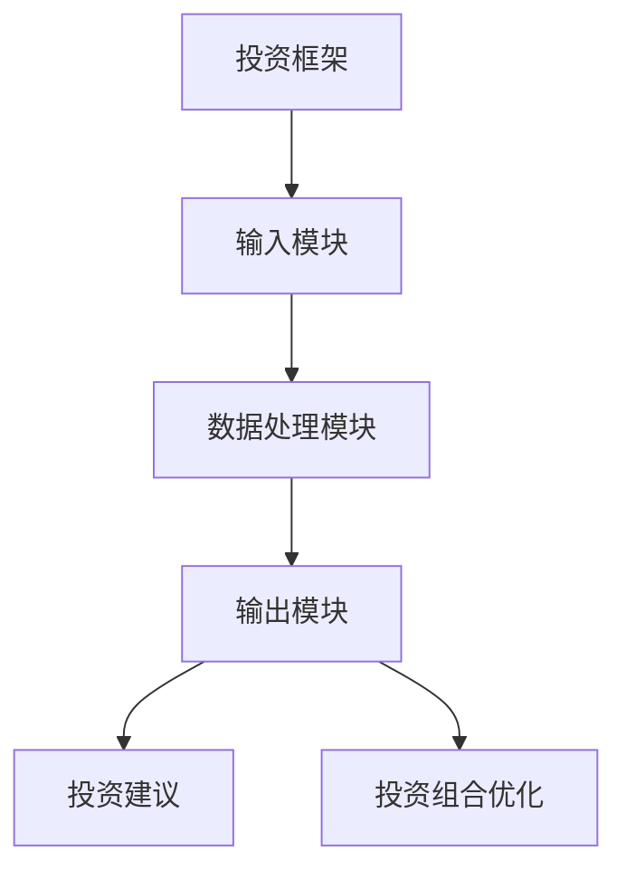

                 

# 费雪的十五个投资点：选股策略详解

> 关键词：价值投资，成长性分析，竞争优势，内在价值，投资策略，投资组合管理，风险管理

> 摘要：本文详细解析了费雪的十五个投资点，从投资理念到选股策略，结合数学模型、系统架构和实战案例，深入探讨了如何通过内在价值、成长性、竞争优势等核心要素进行投资决策。文章内容丰富，逻辑清晰，旨在为投资者提供科学的投资策略和实战指导。

---

## 正文

### 第一部分：投资理念与背景

#### 第1章：费雪投资理念概述

##### 1.1 费雪投资理念的核心思想

费雪（Philip Fisher）是20世纪最伟大的投资家之一，他提出了“成长性投资”理念，强调长期投资于具有强大竞争优势和持续成长潜力的企业。其核心思想包括：

- **长期投资**：关注企业的长期价值，而非短期市场波动。
- **成长性优先**：选择具有持续增长潜力的企业。
- **竞争优势**：投资于具有独特竞争优势的企业。

##### 1.2 费雪投资方法的核心要素

费雪提出了著名的“三步分析法”，即：

1. **确定企业的内在价值**：通过现金流折现法计算企业的内在价值。
2. **评估企业的成长性**：分析企业的营收增长率、净利润增长率等指标。
3. **选择具有竞争优势的企业**：寻找具有护城河的企业。

##### 1.3 费雪投资理念的实际应用价值

费雪的投资理念在现代投资中仍然具有重要价值，尤其是在科技、医疗等高成长性行业。其核心思想包括：

- **投资于未来**：选择那些能够持续创新的企业。
- **长期视角**：忽略短期市场波动，关注企业的长期价值。
- **风险管理**：通过分散投资降低风险。

---

### 第二部分：费雪的十五个投资点详解

#### 第2章：投资点1：企业内在价值的重要性

##### 2.1 企业内在价值的定义与计算

内在价值是企业未来现金流的现值，公式如下：

$$
\text{内在价值} = \sum_{t=1}^{n} \frac{\text{现金流}_t}{(1 + r)^t}
$$

其中，$r$ 是折现率，$t$ 是时间跨度。

##### 2.2 内在价值与市场价格的关系

- 当市场价格低于内在价值时，企业具有投资价值。
- 当市场价格高于内在价值时，企业被高估。

##### 2.3 内在价值的局限性与改进

- **局限性**：内在价值模型假设未来现金流可预测，但实际中存在不确定性。
- **改进**：引入情景分析和敏感性分析，评估不同假设下的内在价值变化。

---

#### 第3章：投资点2：成长性与收益能力

##### 3.1 企业成长性的定义与衡量指标

- **营收增长率**：$$\text{营收增长率} = \frac{\text{本期营收} - \text{上期营收}}{\text{上期营收}}$$
- **净利润增长率**：$$\text{净利润增长率} = \frac{\text{本期净利润} - \text{上期净利润}}{\text{上期净利润}}$$

##### 3.2 收益能力与投资决策

- **市盈率**：$$\text{市盈率} = \frac{\text{股价}}{\text{每股收益}}$$
- **市净率**：$$\text{市净率} = \frac{\text{股价}}{\text{每股净资产}}$$

##### 3.3 成长性分析的误区与风险

- **误区**：仅关注成长性，忽视估值。
- **风险**：高成长性企业可能面临高估值风险。

---

#### 第4章：投资点3：竞争优势与护城河

##### 4.1 企业竞争优势的定义与分类

- **技术壁垒**：企业通过技术创新形成竞争优势。
- **品牌优势**：通过品牌影响力吸引客户。
- **成本优势**：通过规模效应降低成本。

##### 4.2 护城河的构建与维持

- **技术创新**：持续研发投入，保持技术领先。
- **品牌建设**：通过营销和客户关系管理提升品牌影响力。
- **成本控制**：通过规模化生产降低成本。

##### 4.3 竞争优势与投资策略

- **选择具有宽护城河的企业**：如科技龙头、消费巨头。
- **竞争优势的持续性评估**：关注行业变化和竞争格局。

---

#### 第5章：投资点4：管理层能力与治理结构

##### 5.1 管理层能力的评估标准

- **领导力**：管理层是否具有战略眼光和决策能力。
- **诚信**：管理层是否诚信，是否有良好的道德记录。
- **过往业绩**：管理层过往的业绩表现。

##### 5.2 治理结构对投资的影响

- **股权结构**：分散股权可能降低控制权风险。
- **董事会结构**：独立董事的作用。
- **透明度**：企业信息披露的完整性和及时性。

##### 5.3 管理层能力与投资策略

- **选择具有优秀管理层的企业**。
- **关注管理层的稳定性**。

---

### 第三部分：系统分析与投资策略

#### 第6章：系统架构与投资框架

##### 6.1 投资框架设计

- **输入**：企业基本面数据、市场数据。
- **处理**：计算内在价值、评估成长性、分析竞争优势。
- **输出**：投资建议、投资组合优化。

##### 6.2 系统架构图

##### 6.3 投资框架实现

- **数据输入**：收集企业财务数据、行业数据。
- **数据处理**：计算内在价值、评估成长性。
- **结果输出**：生成投资建议。

---

### 第四部分：实战案例分析

#### 第7章：科技行业投资策略

##### 7.1 科技行业分析

- **行业特点**：高成长性、高波动性。
- **代表企业**：苹果、谷歌、亚马逊。

##### 7.2 投资策略

- **选择具有强大技术壁垒的企业**。
- **关注管理层能力和治理结构**。

##### 7.3 实战案例：苹果公司分析

- **内在价值**：通过现金流折现法计算。
- **成长性**：分析营收和净利润增长率。
- **竞争优势**：苹果的技术壁垒和品牌优势。

---

### 结论

费雪的十五个投资点为投资者提供了科学的投资框架，通过内在价值、成长性、竞争优势等核心要素进行选股。本文结合数学模型、系统架构和实战案例，深入探讨了费雪投资理念的实践应用。未来，随着市场的变化，投资者需要不断优化自己的投资策略，以应对新的挑战。

---

作者：AI天才研究院/AI Genius Institute & 禅与计算机程序设计艺术 /Zen And The Art of Computer Programming

