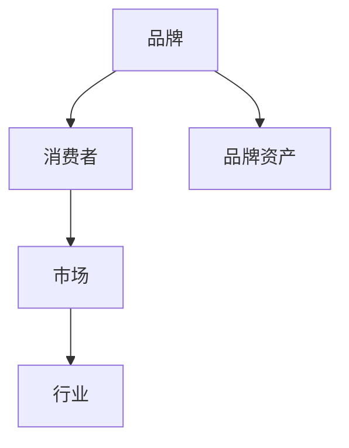
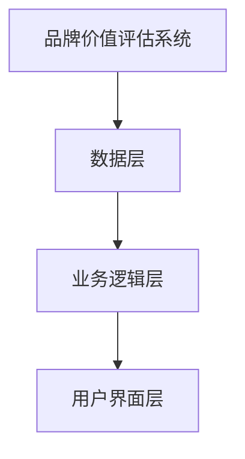
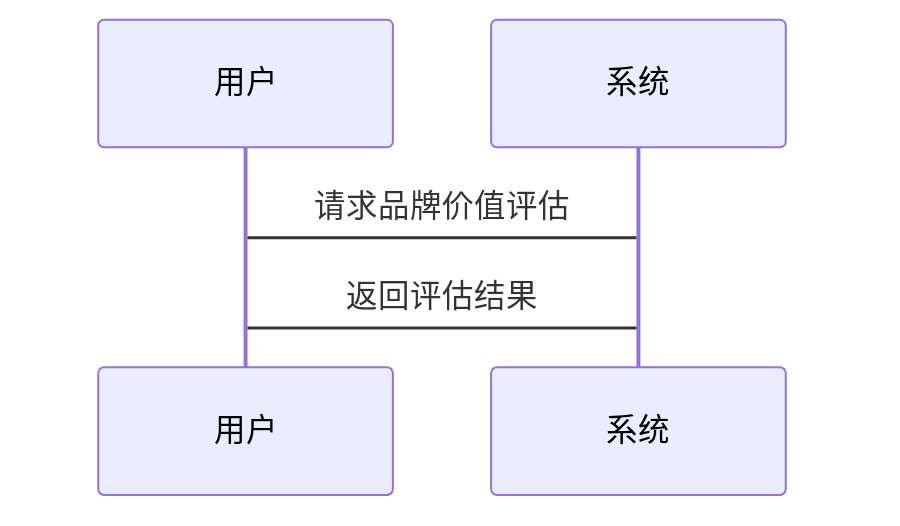

                 


# 目录大纲：《费雪的品牌价值评估》

## 第一部分：品牌价值评估的背景与核心概念

### 第1章：品牌价值评估的定义与背景

#### 1.1 品牌价值评估的定义
- **1.1.1 品牌价值的定义**：品牌价值是指品牌在市场上的影响力和客户认知度的量化表现。
- **1.1.2 品牌价值评估的重要性**：品牌价值是企业决策的重要依据，直接影响企业战略和投资决策。
- **1.1.3 品牌价值评估的边界与外延**：明确品牌价值评估的范围，包括品牌资产、品牌影响力等。

#### 1.2 品牌价值评估的核心要素
- **1.2.1 品牌知名度**：品牌在目标市场中的认知程度。
- **1.2.2 品牌忠诚度**：客户对品牌的忠诚程度。
- **1.2.3 品牌资产与品牌影响力**：品牌资产包括品牌名称、标志等，品牌影响力则是品牌的市场扩展能力。

#### 1.3 品牌价值评估的理论基础
- **1.3.1 品牌价值评估的理论模型**：介绍几种经典的理论模型，如AFC模型。
- **1.3.2 品牌价值评估的核心概念结构**：分析品牌价值评估的各要素之间的关系。
- **1.3.3 品牌价值评估的多维度分析框架**：从市场、消费者、竞争对手等多个维度进行分析。

## 第二部分：品牌价值评估的核心概念与联系

### 第2章：品牌价值评估的核心要素与属性特征对比表格

#### 2.1 核心概念原理
- **品牌价值的构成要素**：包括品牌知名度、品牌忠诚度等。
- **品牌价值评估的关键指标**：如市场份额、客户保留率等。
- **品牌价值评估的数学模型**：介绍数学模型的基本框架。

#### 2.2 核心概念属性特征对比表格
| 核心概念 | 定量特征 | 定性特征 | 财务特征 | 非财务特征 |
|----------|----------|----------|----------|------------|
| 品牌知名度 | 市场份额 | 品牌认知度 | 品牌广告投入 | 品牌声誉 |
| 品牌忠诚度 | 客户保留率 | 品牌偏好度 | 客户忠诚计划 | 品牌情感 |

#### 2.3 实体关系图（ER图）


## 第三部分：品牌价值评估的算法原理

### 第3章：品牌价值评估的算法原理

#### 3.1 品牌价值评估的数学模型
- **3.1.1 品牌价值评估的多因子模型**：介绍多因子模型的基本原理。
- **3.1.2 品牌价值评估的公式推导**：详细推导评估公式的数学过程。
- **3.1.3 品牌价值评估的数学表达式**：给出具体的数学表达式。

#### 3.2 品牌价值评估的算法流程


#### 3.3 品牌价值评估的Python代码实现
```python
import pandas as pd
import numpy as np
from sklearn.metrics import pairwise_distances

# 示例数据
data = {
    '品牌': ['A', 'B', 'C'],
    '市场份额': [0.3, 0.4, 0.2],
    '品牌忠诚度': [0.8, 0.7, 0.6]
}

df = pd.DataFrame(data)

# 计算品牌价值
def calculate_brand_value(brand_data):
    # 示例模型：品牌价值 = 0.5*市场份额 + 0.5*品牌忠诚度
    brand_value = []
    for i in range(len(brand_data)):
        value = 0.5 * brand_data['市场份额'][i] + 0.5 * brand_data['品牌忠诚度'][i]
        brand_value.append(value)
    return brand_value

brand_values = calculate_brand_value(df)
print("品牌价值:", brand_values)
```

#### 3.4 品牌价值评估的数学公式
$$ 品牌价值 = \sum_{i=1}^{n} w_i \cdot x_i $$
其中，$w_i$ 是权重，$x_i$ 是各个指标的值。

## 第四部分：品牌价值评估的系统分析与架构设计

### 第4章：品牌价值评估系统分析

#### 4.1 问题场景介绍
- **问题描述**：介绍品牌价值评估的实际应用场景。
- **项目介绍**：描述一个品牌价值评估系统的开发背景和目标。

#### 4.2 系统功能设计
- **领域模型**：用mermaid类图展示系统中的各个实体及其关系。


#### 4.3 系统架构设计
- **系统架构图**：展示系统的分层架构。


#### 4.4 系统接口设计
- **API接口**：定义系统提供的API接口。
- **交互流程图**：用mermaid序列图展示用户与系统之间的交互流程。


## 第五部分：品牌价值评估的项目实战

### 第5章：项目实战

#### 5.1 环境安装
- **安装Python**：安装Python 3.x及以上版本。
- **安装相关库**：安装pandas、numpy、scikit-learn等库。

#### 5.2 系统核心实现
```python
import pandas as pd
import numpy as np

# 数据预处理
data = pd.read_csv('brand_data.csv')
data = data.dropna()
data = pd.get_dummies(data)

# 特征选择
features = ['市场份额', '品牌忠诚度']
X = data[features]
y = data['品牌价值']

# 模型训练
from sklearn.linear_model import LinearRegression
model = LinearRegression()
model.fit(X, y)

# 模型预测
new_brand = {'市场份额': 0.35, '品牌忠诚度': 0.8}
new_brand_df = pd.DataFrame([new_brand])
predicted_value = model.predict(new_brand_df)
print("预测的品牌价值:", predicted_value)
```

#### 5.3 实际案例分析
- **案例分析**：分析一个实际的品牌价值评估案例，展示系统的应用效果。

#### 5.4 项目总结
- **成果总结**：总结项目的主要成果。
- **不足之处**：分析项目的不足之处。
- **经验教训**：总结在项目实施过程中获得的经验和教训。

## 第六部分：最佳实践与总结

### 第6章：最佳实践与总结

#### 6.1 最佳实践
- **数据质量**：强调数据质量和数据清洗的重要性。
- **模型选择**：建议选择合适的模型，并进行模型调优。
- **持续监测**：建议定期更新模型和重新评估品牌价值。

#### 6.2 小结
- 总结全文的主要内容，强调品牌价值评估的重要性。

#### 6.3 注意事项
- **数据隐私**：提醒读者注意数据隐私和安全问题。
- **模型局限性**：提醒读者注意模型的局限性和适用范围。

#### 6.4 拓展阅读
- **推荐书籍**：推荐一些相关的书籍和资源，供读者进一步学习。

## 作者

作者：AI天才研究院/AI Genius Institute & 禅与计算机程序设计艺术 /Zen And The Art of Computer Programming

