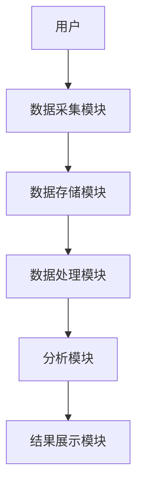

                 


# 费雪的品牌忠诚度分析：消费者行为的洞察

## 关键词：品牌忠诚度，消费者行为，数据分析，市场研究，客户保留

## 摘要：  
品牌忠诚度是企业在竞争激烈的市场环境中生存和发展的关键因素之一。本文通过费雪的品牌忠诚度分析方法，结合消费者行为学的理论与实践，深入探讨品牌忠诚度的核心要素、影响因素及其测量与提升策略。本文不仅从理论上分析了品牌忠诚度的内涵与外延，还通过实际案例和数据分析，展示了如何通过消费者行为洞察来优化品牌忠诚度，为企业制定精准的市场策略提供科学依据。

---

## 第一部分：品牌忠诚度的基本概念与理论基础

### 第1章：品牌忠诚度的定义与内涵

#### 1.1 消费者行为分析的基本方法  
消费者行为分析是研究消费者在购买、使用和评价产品或服务时的行为模式和心理过程。以下是消费者行为分析的基本方法：  
- **观察法**：通过观察消费者的实际行为（如购买记录、使用频率等）来分析其行为特征。  
- **问卷调查法**：通过设计结构化的问卷，收集消费者对品牌、产品和服务的评价和偏好。  
- **实验法**：通过实验设计（如A/B测试）来观察消费者在不同情境下的行为差异。  

#### 1.2 品牌忠诚度的定义与内涵  
品牌忠诚度是指消费者在购买决策中对某一品牌的一贯选择和偏好程度。它不仅包括消费者在实际购买行为上的重复选择，还包括消费者对品牌的情感依赖和认知信任。  

##### 品牌忠诚度的层次划分  
品牌忠诚度可以分为以下几个层次：  
1. **情感忠诚**：消费者对品牌的情感依赖和信任。  
2. **行为忠诚**：消费者在实际购买行为中对品牌的重复选择。  
3. **理性忠诚**：消费者基于理性判断（如性价比、质量等）对品牌的忠诚。  

#### 1.3 品牌忠诚度的影响因素  
品牌忠诚度的影响因素可以从消费者行为的角度进行分析：  
- **产品质量**：产品质量是影响消费者行为的最直接因素。高质量的产品会增强消费者的信任感和满意度。  
- **品牌认知**：消费者对品牌的认知和品牌形象直接影响其忠诚度。  
- **服务质量**：优质的售后服务和客户支持会提升消费者的满意度和忠诚度。  

---

### 第2章：消费者行为的洞察方法

#### 2.1 消费者行为分析的步骤  
消费者行为分析的步骤如下：  
1. **数据收集**：通过问卷调查、焦点小组、在线数据分析等方式收集消费者行为数据。  
2. **数据整理与清洗**：对收集到的数据进行清洗和预处理，确保数据的准确性和完整性。  
3. **数据分析**：使用统计分析和机器学习算法对数据进行建模和分析。  
4. **结果解读**：根据分析结果制定市场策略和优化方案。  

#### 2.2 品牌忠诚度的测量方法  
品牌忠诚度的测量方法包括：  
- **调查问卷法**：通过设计问卷收集消费者对品牌的满意度、忠诚度和偏好度。  
- **行为数据法**：通过分析消费者的购买记录、重复购买率等行为数据来衡量品牌忠诚度。  
- **综合评价法**：结合定量和定性数据，对品牌忠诚度进行综合评价。  

#### 2.3 消费者行为的预测模型  
消费者行为的预测模型可以分为以下几类：  
1. **线性回归模型**：用于预测消费者对品牌的购买概率。  
2. **逻辑回归模型**：用于分类消费者的行为类型（如忠诚客户与非忠诚客户的区分）。  
3. **时间序列分析模型**：用于分析消费者行为的时间趋势和周期性。  

---

## 第二部分：品牌忠诚度分析的算法与数学模型

### 第3章：品牌忠诚度分析的核心算法

#### 3.1 品牌忠诚度指数计算  
品牌忠诚度指数（Brand Loyalty Index，BLI）是衡量消费者对品牌忠诚程度的重要指标。其计算公式如下：  
$$
\text{BLI} = \frac{\text{重复购买次数}}{\text{市场渗透率}}
$$  
其中，重复购买次数是指消费者在一定时间内对品牌的重复购买次数，市场渗透率是指品牌在市场中的占有率。  

#### 3.2 基于消费者行为的预测模型  
##### 3.2.1 简单线性回归模型  
简单线性回归模型用于预测消费者对品牌的购买概率：  
$$
y = \beta_0 + \beta_1x + \epsilon
$$  
其中，$y$是消费者的购买概率，$x$是品牌忠诚度指数，$\beta_0$是截距，$\beta_1$是回归系数，$\epsilon$是误差项。  

##### 3.2.2 逻辑回归模型  
逻辑回归模型用于分类消费者的行为类型：  
$$
P(y=1|x) = \frac{e^{\beta_0 + \beta_1x}}{1 + e^{\beta_0 + \beta_1x}}
$$  
其中，$P(y=1|x)$是消费者对品牌忠诚的概率，$x$是品牌忠诚度指数，$\beta_0$和$\beta_1$是模型参数。  

#### 3.3 聚类分析在品牌忠诚度中的应用  
##### 3.3.1 K-means聚类算法  
K-means聚类算法可以将消费者分为不同的群体，从而识别出不同忠诚度水平的客户群体。  

##### 3.3.2 层次聚类算法  
层次聚类算法通过逐步合并相似的客户群体，形成品牌忠诚度的层次结构。  

##### 3.3.3 聚类结果的可视化  
聚类结果可以通过可视化工具（如Python中的matplotlib）进行展示，帮助更好地理解消费者群体的特征。  

---

### 第4章：品牌忠诚度分析的数学模型

#### 4.1 基于因子分析的品牌忠诚度模型  
因子分析是一种统计方法，用于提取影响品牌忠诚度的核心因素。通过因子分析，可以将多个测量指标（如产品质量、品牌认知、服务质量）归类为几个核心因子。  

#### 4.2 基于神经网络的品牌忠诚度预测模型  
神经网络是一种强大的机器学习模型，可以用于品牌忠诚度的预测。其基本结构如下：  
$$
y = f(Wx + b)
$$  
其中，$y$是输出层，$x$是输入层，$W$是权重矩阵，$b$是偏置向量，$f$是激活函数。  

---

## 第三部分：品牌忠诚度分析的系统架构与项目实战

### 第5章：品牌忠诚度分析的系统架构

#### 5.1 系统功能设计  
品牌忠诚度分析系统的功能模块包括：  
1. **数据采集模块**：收集消费者行为数据（如购买记录、问卷调查数据）。  
2. **数据处理模块**：对数据进行清洗和预处理。  
3. **分析模块**：使用机器学习算法对数据进行建模和分析。  
4. **结果展示模块**：将分析结果以可视化的方式呈现给用户。  

#### 5.2 系统架构设计  
品牌忠诚度分析系统的架构设计如下：  


#### 5.3 项目实战  
##### 5.3.1 数据预处理  
使用Python对消费者行为数据进行预处理：  
```python
import pandas as pd
data = pd.read_csv('consumer_behavior.csv')
data = data.dropna()  # 删除缺失值
data = pd.get_dummies(data)  # 将分类变量转换为虚拟变量
```

##### 5.3.2 模型训练  
使用逻辑回归模型对品牌忠诚度进行预测：  
```python
from sklearn.linear_model import LogisticRegression
model = LogisticRegression()
model.fit(X_train, y_train)
```

##### 5.3.3 结果分析  
分析模型的预测结果，并制定优化策略。  

---

## 第四部分：品牌忠诚度分析的最佳实践

### 第6章：品牌忠诚度分析的实践总结

#### 6.1 小结  
品牌忠诚度是企业市场竞争中的重要优势，通过消费者行为分析可以有效提升品牌忠诚度。  

#### 6.2 注意事项  
在实际应用中，需要注意数据的准确性和模型的适用性，避免过度依赖单一模型。  

#### 6.3 拓展阅读  
推荐阅读相关书籍和文献，进一步深入学习品牌忠诚度分析的方法和应用。  

---

## 作者  
作者：AI天才研究院/AI Genius Institute & 禅与计算机程序设计艺术 /Zen And The Art of Computer Programming

