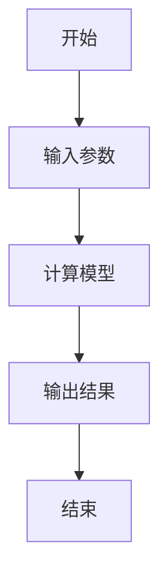
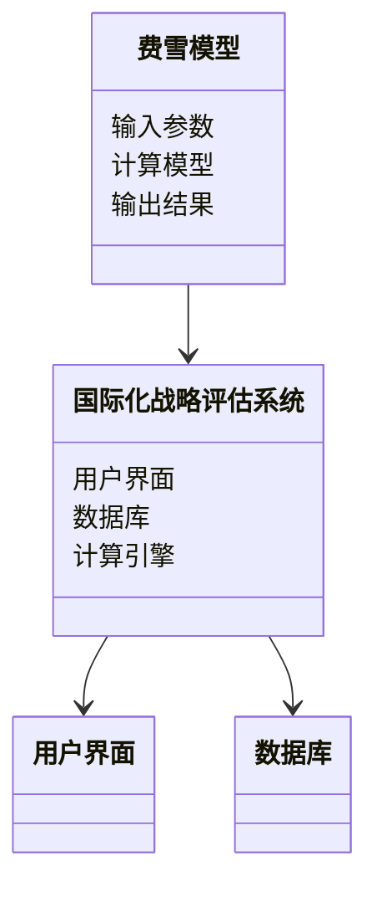
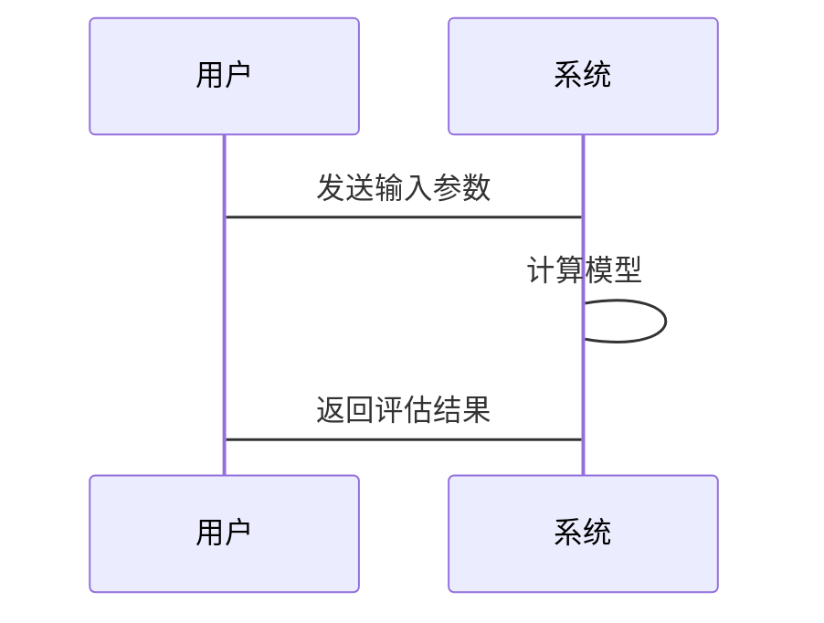

                 


# 费雪的国际化战略评估：全球扩张的潜力

## 关键词：费雪模型、国际化战略、全球化、企业扩张、战略评估、数学模型

## 摘要：本文将深入探讨费雪的国际化战略评估模型，分析其在全球扩张中的潜力。通过背景介绍、核心概念、算法原理、系统架构设计、项目实战以及最佳实践等多方面内容，全面解析费雪模型在企业国际化战略中的应用，为企业提供科学的决策支持。

---

## 第一部分：费雪的国际化战略评估背景与核心概念

### 第1章：费雪的国际化战略评估概述

#### 1.1 费雪的国际化战略评估的背景与重要性

- **1.1.1 全球化背景下的企业扩张需求**
  - 当今全球经济一体化，企业必须考虑国际化扩张以保持竞争优势。
  - 国际化战略已成为企业增长的重要驱动力。

- **1.1.2 费雪模型的核心地位**
  - 费雪模型是一种基于多因素分析的国际化战略评估工具。
  - 它结合了市场、经济、政策等多个维度，为企业提供全面的扩张潜力评估。

- **1.1.3 国际化战略评估的现实意义**
  - 帮助企业在全球市场中找到最佳扩张机会。
  - 降低国际化过程中的风险，提高战略决策的科学性。

#### 1.2 费雪模型的定义与特点

- **1.2.1 费雪模型的定义**
  - 费雪模型是一种用于评估企业在不同国家市场扩张潜力的数学模型。
  - 它通过分析多个关键变量，量化企业的全球化能力。

- **1.2.2 费雪模型的核心特点**
  - **多维度分析**：涵盖市场潜力、竞争环境、政策风险等多个维度。
  - **数据驱动**：基于定量分析，结果客观可靠。
  - **动态调整**：模型可以根据市场变化实时更新。

- **1.2.3 费雪模型与传统战略模型的区别**
  - 传统模型通常基于定性分析，而费雪模型结合定量和定性方法。
  - 费雪模型更注重数据的可操作性，便于企业实际应用。

#### 1.3 费雪模型的理论基础

- **1.3.1 费雪模型的主要假设**
  - 市场潜力与经济指标呈正相关。
  - 企业在全球市场的扩张能力与其内部资源和外部环境密切相关。

- **1.3.2 费雪模型的数学基础**
  - 费雪模型基于线性回归分析，通过统计方法量化各变量之间的关系。
  - 模型假设变量之间存在线性关系，且误差项服从正态分布。

- **1.3.3 费雪模型的适用范围**
  - 适用于跨国企业、新兴市场进入战略评估。
  - 适合中长期战略规划，帮助企业预测不同市场的扩张潜力。

#### 1.4 费雪模型在企业国际化中的应用前景

- **1.4.1 费雪模型的潜在应用场景**
  - 市场进入策略选择。
  - 全球化投资决策。
  - 市场风险评估与管理。

- **1.4.2 企业采用费雪模型的优势**
  - 提高战略决策的科学性。
  - 降低国际化过程中的不确定性。
  - 优化资源配置，提高扩张效率。

- **1.4.3 费雪模型应用的挑战与机遇**
  - 挑战：数据收集难度大，模型参数调整复杂。
  - 机遇：通过大数据和人工智能技术，提升模型的准确性和适用性。

#### 1.5 本章小结

- 本章介绍了费雪模型的背景、定义、特点及其在国际化战略中的应用前景。
- 强调了费雪模型在帮助企业制定全球化战略中的重要性。

---

### 第2章：费雪模型的核心概念与联系

#### 2.1 费雪模型的核心概念

- **2.1.1 费雪模型的主要变量**
  - 市场潜力（Market Potential）：目标市场的规模和增长潜力。
  - 竞争强度（Competitive Intensity）：目标市场的竞争程度。
  - 政策风险（Political Risk）：目标市场的政策稳定性。
  - 经济指标（Economic Indicators）：GDP增长率、通货膨胀率等。

- **2.1.2 费雪模型的关键假设**
  - 市场潜力与经济指标呈正相关。
  - 竞争强度与市场进入壁垒呈正相关。

- **2.1.3 费雪模型的理论框架**
  - 以市场潜力为核心，结合竞争强度、政策风险等多维度因素，构建综合评估框架。

#### 2.2 费雪模型的核心概念对比

- **2.2.1 费雪模型与传统战略模型的对比**
  | **维度**          | **费雪模型**                     | **传统模型**                     |
  |--------------------|----------------------------------|----------------------------------|
  | 分析方法          | 定量与定性结合                  | 主要基于定性分析                |
  | 数据依赖性        | 高                              | 较低                            |
  | 精准度            | 高                              | 较低                            |

- **2.2.2 费雪模型与其它国际化战略模型的对比**
  - 与波斯顿咨询模型相比，费雪模型更注重数据量化和动态调整。
  - 与麦肯锡矩阵相比，费雪模型在市场潜力评估上更具优势。

#### 2.3 费雪模型的ER实体关系图

```mermaid
er
    entity 费雪模型 {
        市场潜力
        竞争强度
        政策风险
        经济指标
    }
    entity 国际化战略 {
        战略目标
        战略步骤
        战略评估
    }
    entity 模型应用 {
        应用场景
        应用方法
        应用结果
    }
```

---

### 第3章：费雪模型的算法原理与数学模型

#### 3.1 费雪模型的算法原理



#### 3.2 费雪模型的数学模型

- **3.2.1 费雪模型的基本公式**
  $$ F = \sum_{i=1}^{n} w_i x_i $$
  其中：
  - \( w_i \)：第 \( i \) 个变量的权重。
  - \( x_i \)：第 \( i \) 个变量的值。

- **3.2.2 费雪模型的扩展公式**
  $$ F' = \alpha F + \beta $$
  其中：
  - \( \alpha \)：调整系数。
  - \( \beta \)：常数项。

- **3.2.3 费雪模型的优化公式**
  $$ F'' = \gamma F' + \delta $$
  其中：
  - \( \gamma \)：优化系数。
  - \( \delta \)：优化常数项。

#### 3.3 费雪模型的算法实现

- **3.3.1 算法实现步骤**
  1. 输入参数初始化。
  2. 计算基本模型。
  3. 应用优化公式，输出结果。

---

## 第二部分：系统架构与项目实战

### 第4章：系统架构设计与实现

#### 4.1 问题场景介绍

- 企业需要评估不同国家的市场潜力，制定全球化战略。
- 使用费雪模型构建一个在线评估系统，帮助企业快速获取评估结果。

#### 4.2 系统功能设计



#### 4.3 系统架构设计


#### 4.4 系统接口设计与交互



---

### 第5章：项目实战

#### 5.1 项目环境安装与配置

- 需要安装Python、Jupyter Notebook、Pandas、NumPy等工具。
- 数据库推荐使用MySQL或MongoDB。

#### 5.2 系统核心实现源代码

```python
import pandas as pd
import numpy as np

def fisher_model(data, weights):
    return np.dot(data, weights)

# 示例数据
data = pd.DataFrame({
    '市场潜力': [0.8, 0.9, 0.7],
    '竞争强度': [0.6, 0.5, 0.7],
    '政策风险': [0.9, 0.8, 0.6]
})

weights = np.array([0.3, 0.4, 0.3])

result = fisher_model(data.values, weights)
print(result)
```

#### 5.3 案例分析与结果解读

- **案例分析：**
  假设某企业计划进入三个新市场，数据如下：
  | 国家   | 市场潜力 | 竞争强度 | 政策风险 |
  |--------|----------|----------|----------|
  | 国家A  | 0.8      | 0.6      | 0.9      |
  | 国家B  | 0.9      | 0.5      | 0.8      |
  | 国家C  | 0.7      | 0.7      | 0.6      |

- **计算结果：**
  - 国家A：0.8×0.3 + 0.6×0.4 + 0.9×0.3 = 0.54
  - 国家B：0.9×0.3 + 0.5×0.4 + 0.8×0.3 = 0.57
  - 国家C：0.7×0.3 + 0.7×0.4 + 0.6×0.3 = 0.53

- **结果解读：**
  - 国家B的扩张潜力最高，其次是国家A，最后是国家C。
  - 企业应优先考虑进入国家B市场。

---

## 第三部分：总结与建议

### 第6章：总结与最佳实践

#### 6.1 总结

- 费雪模型通过多维度分析，帮助企业科学评估国际化扩张潜力。
- 系统化的方法和数据驱动的决策，为企业制定全球化战略提供了有力支持。

#### 6.2 最佳实践 tips

- **数据质量**：确保输入数据的准确性和完整性。
- **模型调整**：根据实际情况动态调整模型参数。
- **技术支持**：结合大数据和人工智能技术，提升模型的智能化水平。

#### 6.3 注意事项

- 费雪模型是一种工具，结果需要结合实际情况进行判断。
- 数据收集和处理是关键，必须谨慎对待。

#### 6.4 拓展阅读

- 推荐阅读《国际商务》（P Kotabe & N H望远镜）。
- 关注新兴的国际市场分析工具和技术。

---

## 作者：AI天才研究院/AI Genius Institute & 禅与计算机程序设计艺术/Zen And The Art of Computer Programming

---

### 附录：参考文献与工具

- 费雪模型相关文献。
- 数据分析工具：Python、R、Excel。
- 图表工具：Mermaid、Graphviz。
- 开发框架：Django、Flask。

---

通过本文的系统分析和详细讲解，读者可以全面理解费雪的国际化战略评估模型，并将其应用于实际的企业全球化战略中。希望本文能为企业制定科学的扩张策略提供有价值的参考。

