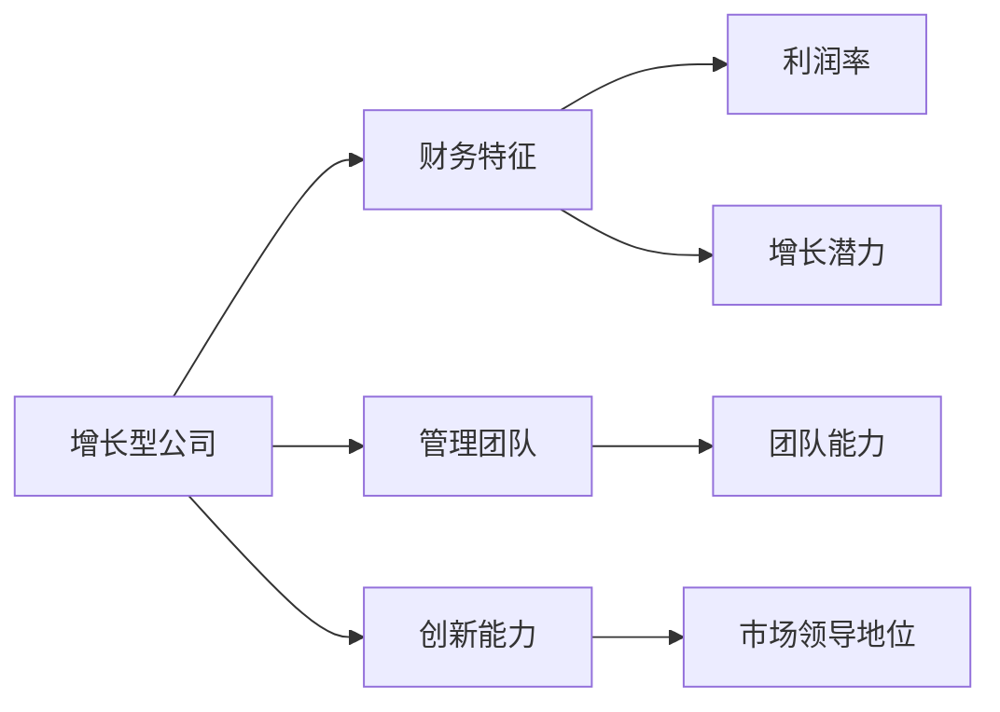

                 


# 费雪的增长型公司特征分析

## 关键词：增长型公司、费雪、投资分析、公司特征、投资策略

## 摘要：  
本文深入分析了菲利普·费雪的增长型投资理念，探讨了增长型公司的核心特征，并结合实际案例，详细阐述了如何识别和评估具有高增长潜力的公司。文章从理论到实践，系统地介绍了增长型公司的分析方法，帮助投资者更好地理解和应用费雪的投资策略。

---

# 第一部分: 费雪的增长型公司特征分析背景介绍

## 第1章: 费雪的增长型投资概述

### 1.1 增长型投资的背景与意义

#### 1.1.1 传统投资与增长型投资的对比  
传统投资策略通常关注于价值投资，即寻找被市场低估的公司。而增长型投资则关注于公司未来的增长潜力，尤其适合科技、互联网等高成长行业的公司。  

| 投资类型 | 价值投资 | 增长型投资 |
|----------|-----------|------------|
| 核心关注点 | 当前价值 | 未来增长 |
| 适用场景 | 稳定行业 | 高成长行业 |
| 风险 | 较低 | 较高 |

#### 1.1.2 费雪的投资理念  
菲利普·费雪是增长型投资的鼻祖，他提出了“成长股投资法”，强调投资那些具有持续创新能力、高利润率和优秀管理团队的公司。  

#### 1.1.3 增长型公司的定义与边界  
增长型公司是指那些在未来几年内有潜力实现收入和利润快速增长的公司。其边界包括行业前景、公司规模和财务健康状况。  

### 1.2 费雪的投资策略与方法

#### 1.2.1 费雪的投资策略概述  
费雪的策略基于对公司基本面的深入分析，尤其是对公司管理团队和创新能力的关注。  

#### 1.2.2 费雪的“三步走”投资方法  
1. **第一步**：筛选出具有高增长潜力的公司。  
2. **第二步**：深入分析公司的财务状况和管理团队。  
3. **第三步**：长期持有，等待价值实现。  

#### 1.2.3 费雪的增长型公司筛选标准  
- **高利润率**：净利润率高于行业平均水平。  
- **创新能力**：公司有持续的创新能力和市场领导地位。  
- **管理团队**：管理团队能力强，公司治理优秀。  

### 1.3 本章小结  
本章介绍了增长型投资的背景、费雪的投资理念以及增长型公司的定义和筛选标准，为后续分析奠定了基础。

---

# 第二部分: 增长型公司特征的核心概念与联系

## 第2章: 增长型公司的核心特征分析

### 2.1 增长型公司的核心特征

#### 2.1.1 高利润率与持续盈利能力  
高利润率是增长型公司的核心特征之一，通常反映在净利润率上。  

#### 2.1.2 创新能力与市场领导地位  
创新能力强的公司能够持续推出新产品或服务，占据市场领导地位。  

#### 2.1.3 管理团队与公司治理  
优秀的管理团队和良好的公司治理是公司长期增长的关键。  

### 2.2 增长型公司特征的对比分析

#### 2.2.1 不同行业增长型公司的特征对比  
以科技行业为例，增长型公司通常具有较高的研发投入和创新能力。  

#### 2.2.2 公司规模与增长潜力的关系  
小公司通常有更大的增长潜力，但风险也更高。  

#### 2.2.3 财务指标与增长能力的关联  
通过财务指标如ROE（净资产收益率）和收入增长率，可以评估公司的增长潜力。  

### 2.3 增长型公司特征的ER实体关系图  



### 2.4 本章小结  
本章详细分析了增长型公司的核心特征，并通过对比和ER图展示了各特征之间的关系。

---

# 第三部分: 增长型公司特征的算法原理

## 第3章: 增长型公司特征的算法分析

### 3.1 费雪增长型公司筛选算法

#### 3.1.1 算法概述  
费雪的增长型公司筛选算法基于财务指标和非财务指标的综合评估。  

#### 3.1.2 算法步骤  
1. **收集数据**：收集公司的财务数据和非财务数据。  
2. **计算得分**：根据各项指标计算公司得分。  
3. **筛选公司**：根据得分筛选出符合增长型公司标准的公司。  

#### 3.1.3 算法实现的Python代码示例  

```python
def fisher_growth_analysis(financial_data, management_data, innovation_data):
    # 计算财务得分
    financial_score = financial_data['net_profit_margin'] * 0.4 + financial_data['revenue_growth'] * 0.2
    # 计算管理得分
    management_score = management_data['team_strength'] * 0.3 + management_data['governance_quality'] * 0.1
    # 计算创新得分
    innovation_score = innovation_data['R&D_ratio'] * 0.5 + innovation_data['market_position'] * 0.3
    # 综合得分
    total_score = financial_score + management_score + innovation_score
    # 筛选公司
    if total_score > 70:
        return "符合增长型公司特征"
    else:
        return "不符合增长型公司特征"
```

### 3.2 增长型公司特征的数学模型

#### 3.2.1 利润率与增长潜力的数学关系  

$$ \text{增长潜力} = \alpha \times \text{利润率} + \beta \times \text{创新指数} $$  

其中，$\alpha$ 和 $\beta$ 是权重系数，通常根据行业特点和公司实际情况确定。  

### 3.3 本章小结  
本章通过算法和数学模型，展示了如何量化评估增长型公司的特征。

---

# 第四部分: 增长型公司特征的系统分析与架构设计

## 第4章: 增长型公司特征的系统分析

### 4.1 问题场景介绍  
我们希望通过系统分析，构建一个能够自动筛选增长型公司的系统。  

### 4.2 系统功能设计

#### 4.2.1 功能模块  
- 数据采集模块：收集公司数据。  
- 数据处理模块：清洗和预处理数据。  
- 特征分析模块：计算各项特征得分。  
- 结果展示模块：输出筛选结果。  

### 4.3 系统架构设计  


### 4.4 系统接口设计  
- 输入接口：接收公司数据。  
- 输出接口：输出筛选结果。  

### 4.5 系统交互设计  


### 4.6 本章小结  
本章通过系统架构设计，展示了如何构建一个自动化的增长型公司筛选系统。

---

# 第五部分: 项目实战与案例分析

## 第5章: 项目实战

### 5.1 项目环境安装  
需要安装Python和相关库（如Pandas、NumPy）。  

### 5.2 系统核心实现源代码  

```python
import pandas as pd
import numpy as np

def calculate_growth_potential(financial_data, innovation_data):
    # 计算财务得分
    financial_score = financial_data['net_profit_margin'] * 0.4 + financial_data['revenue_growth'] * 0.2
    # 计算创新得分
    innovation_score = innovation_data['R&D_ratio'] * 0.5 + innovation_data['market_position'] * 0.3
    # 综合得分
    total_score = financial_score + innovation_score
    return total_score

# 示例数据
financial_data = {
    'net_profit_margin': 20,
    'revenue_growth': 15
}
innovation_data = {
    'R&D_ratio': 10,
    'market_position': 8
}

# 计算并输出结果
growth_potential = calculate_growth_potential(financial_data, innovation_data)
print(f"增长潜力得分：{growth_potential}")
```

### 5.3 代码实现解读与分析  
上述代码计算了公司的增长潜力得分，得分越高表示增长潜力越大。  

### 5.4 案例分析  

#### 5.4.1 案例背景  
以某科技公司为例，分析其增长潜力。  

#### 5.4.2 数据分析  
- 净利润率：20%  
- 营收增长率：15%  
- R&D投入比例：10%  
- 市场占有率：8%  

#### 5.4.3 结果解读  
增长潜力得分：20*0.4 + 15*0.2 + 10*0.5 + 8*0.3 = 8 + 3 + 5 + 2.4 = 18.4  

得分低于70，因此不符合增长型公司特征。  

### 5.5 本章小结  
本章通过实际案例，展示了如何应用前面的理论和方法进行分析。

---

# 第六部分: 最佳实践与总结

## 第6章: 最佳实践

### 6.1 小结  
- 增长型公司分析需要结合财务和非财务指标。  
- 费雪的筛选方法提供了有效的框架。  

### 6.2 注意事项  
- 数据来源要可靠。  
- 分析时要结合行业特点。  
- 长期投资需要耐心。  

### 6.3 拓展阅读  
- 《成长股投资》——菲利普·费雪  
- 《投资中最简单的事》——彼得·林奇  

### 6.4 本章小结  
本章总结了文章的核心内容，并提出了实际操作中的注意事项和进一步阅读的建议。

---

# 结语  
通过对费雪的增长型公司特征分析，我们能够更好地识别和投资具有高增长潜力的公司。希望本文能够为投资者提供有价值的参考。

---

# 作者：AI天才研究院/AI Genius Institute & 禅与计算机程序设计艺术 /Zen And The Art of Computer Programming

