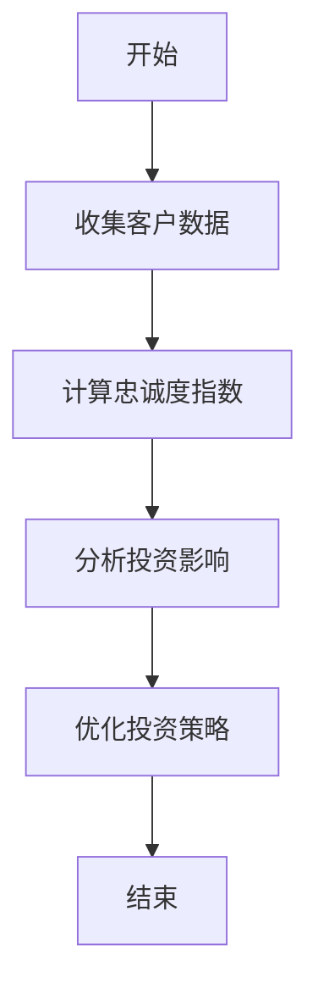
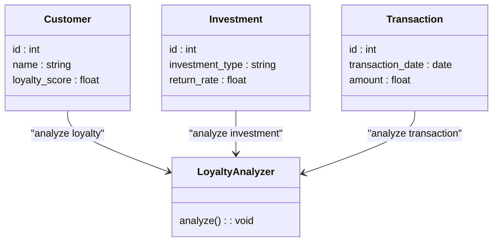
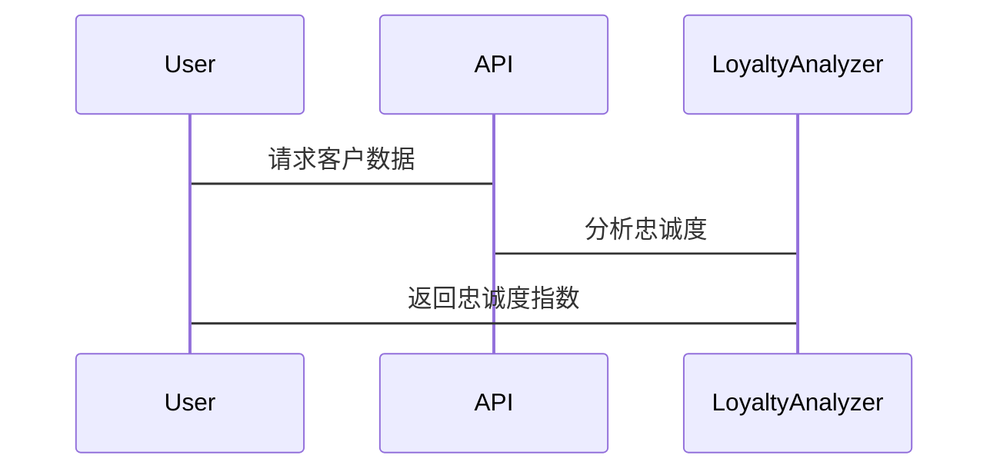

                 


# 费雪的客户忠诚度分析在投资中的应用

> 关键词：客户忠诚度分析，费雪模型，投资策略，客户保留，数据分析，机器学习

> 摘要：本文深入探讨了费雪的客户忠诚度分析方法在投资中的应用。通过分析客户忠诚度的核心概念、理论框架、数学模型以及系统架构，结合实际案例，展示了如何利用费雪模型优化投资决策，提升客户保留率和投资回报率。文章还提供了详细的代码实现和系统设计，帮助读者更好地理解和应用这一方法。

---

## 第1章 客户忠诚度分析概述

### 1.1 客户忠诚度分析的定义与维度

#### 1.1.1 客户忠诚度的定义
客户忠诚度是指客户对某一品牌、产品或服务的持续购买和使用意愿。在投资领域，客户忠诚度高的投资者更倾向于长期持有投资产品，从而为投资机构带来稳定的收益。

#### 1.1.2 客户忠诚度的维度与层次
客户忠诚度可以从多个维度进行分析，包括：
- **情感忠诚**：客户对品牌的情感依赖和信任。
- **行为忠诚**：客户实际的购买行为和重复购买频率。
- **认知忠诚**：客户对品牌的认知和评价。

#### 1.1.3 客户忠诚度与投资的关系
在投资中，客户忠诚度高的投资者通常更稳定，能为投资机构带来长期收益。因此，分析客户忠诚度有助于优化投资策略，提高客户保留率。

### 1.2 费雪客户忠诚度分析的核心概念

#### 1.2.1 费雪客户忠诚度分析的背景
费雪的客户忠诚度分析是一种基于客户行为和认知的分析方法，旨在通过量化客户忠诚度来优化投资决策。

#### 1.2.2 费雪客户忠诚度分析的理论基础
费雪模型结合了客户的行为数据和情感数据，通过数学模型计算客户的忠诚度指数。

#### 1.2.3 费雪客户忠诚度分析的适用范围
该方法适用于各种投资领域，包括股票、基金、保险等。

### 1.3 费雪客户忠诚度分析的重要性

#### 1.3.1 客户忠诚度对投资的影响
高忠诚度的客户通常更稳定，能为投资机构带来持续的收益。

#### 1.3.2 费雪分析在投资中的独特价值
费雪分析通过量化客户忠诚度，帮助投资机构更好地识别高潜力客户，优化投资组合。

#### 1.3.3 客户忠诚度分析的未来发展趋势
随着大数据和人工智能技术的发展，客户忠诚度分析将更加精准和智能化。

---

## 第2章 费雪客户忠诚度分析的理论框架

### 2.1 费雪客户忠诚度分析的核心原理

#### 2.1.1 费雪分析的基本假设
- 客户忠诚度与投资收益呈正相关。
- 客户的行为数据和情感数据共同影响忠诚度。

#### 2.1.2 费雪分析的核心模型
费雪忠诚度指数（FCL）公式：
$$ FCL = \frac{\sum_{i=1}^{n} w_i \cdot x_i}{n} $$
其中，$w_i$ 是第 $i$ 个维度的权重，$x_i$ 是第 $i$ 个维度的得分。

#### 2.1.3 费雪分析的数学表达式
通过收集客户的行为数据和情感数据，计算客户忠诚度指数，并将其与投资收益相关联。

### 2.2 费雪客户忠诚度分析的属性特征对比

#### 2.2.1 属性特征对比表格
| 属性       | 忠诚度低 | 忠诚度高 |
|------------|----------|----------|
| 购买频率   | 低       | 高       |
| 投诉次数   | 高       | 低       |
| 推荐意愿   | 低       | 高       |

#### 2.2.2 ER实体关系图架构
```mermaid
erDiagram
    customer[CUSTOMER] {
        +int id
        +string name
        +float loyalty_score
    }
    investment[INVESTMENT] {
        +int id
        +string investment_type
        +float return_rate
    }
    transaction[TRANSACTION] {
        +int id
        +date transaction_date
        +float amount
    }
    CUSTOMER ~{o}o--{o} INVESTMENT : "invests in"
    CUSTOMER ~{o}o--{o} TRANSACTION : "makes"
    INVESTMENT ~{o}o--{o} TRANSACTION : "recorded in"
```

### 2.3 费雪客户忠诚度分析的算法原理

#### 2.3.1 算法原理的 mermaid 流程图


#### 2.3.2 算法原理的数学模型与公式
客户忠诚度指数公式：
$$ FCL = \frac{1}{n} \sum_{i=1}^{n} (w_i \cdot x_i) $$
其中，$w_i$ 是权重，$x_i$ 是得分。

#### 2.3.3 算法原理的通俗易懂举例说明
例如，假设客户A在投资机构的投资金额为10万元，持有时间为3年，期间从未赎回，且推荐了5位新客户。根据费雪模型，客户A的忠诚度指数为高，投资机构可以考虑给予更高的收益或更多的优惠。

---

## 第3章 费雪客户忠诚度分析的数学模型与公式

### 3.1 客户忠诚度指数的计算公式

#### 3.1.1 费雪忠诚度指数的定义
费雪忠诚度指数是通过客户的行为和情感数据计算的综合指标。

#### 3.1.2 费雪忠诚度指数的数学表达式
$$ FCL = \frac{\sum_{i=1}^{n} w_i \cdot x_i}{n} $$

#### 3.1.3 费雪忠诚度指数的计算步骤
1. 收集客户数据。
2. 给每个维度分配权重。
3. 计算每个维度的得分。
4. 计算综合忠诚度指数。

### 3.2 费雪客户忠诚度分析的回归模型

#### 3.2.1 回归模型的定义
回归模型用于分析客户忠诚度与投资收益之间的关系。

#### 3.2.2 回归模型的数学公式
$$ y = \beta_0 + \beta_1 x + \epsilon $$
其中，$y$ 是投资收益，$x$ 是客户忠诚度指数，$\epsilon$ 是误差项。

#### 3.2.3 回归模型的实例分析
假设投资机构有1000名客户，计算出客户的忠诚度指数后，通过回归分析发现，忠诚度指数每提高0.1，投资收益提高5%。

### 3.3 费雪客户忠诚度分析的聚类分析

#### 3.3.1 聚类分析的定义
聚类分析用于将客户分成不同群体，识别高忠诚度客户。

#### 3.3.2 聚类分析的数学公式
使用K-means算法进行聚类：
$$ \argmin_{K} \sum_{i=1}^{K} \sum_{j=1}^{n_i} (x_j - \mu_i)^2 $$
其中，$\mu_i$ 是第 $i$ 个簇的中心。

#### 3.3.3 聚类分析的实例分析
将客户分成高、中、低三个忠诚度群体，分别制定不同的投资策略。

---

## 第4章 费雪客户忠诚度分析的系统架构与实现

### 4.1 问题场景介绍

#### 4.1.1 投资中的客户忠诚度分析问题
如何通过客户忠诚度分析优化投资策略，提高客户保留率。

#### 4.1.2 费雪客户忠诚度分析的系统目标
构建一个基于费雪模型的客户忠诚度分析系统，帮助投资机构优化投资决策。

#### 4.1.3 系统的输入与输出
- 输入：客户数据、投资数据。
- 输出：客户忠诚度指数、投资策略建议。

### 4.2 系统功能设计

#### 4.2.1 领域模型 mermaid 类图


### 4.3 系统架构设计

#### 4.3.1 系统架构 mermaid 架构图


### 4.4 系统接口设计

#### 4.4.1 系统接口设计
- API接口：提供客户数据、投资数据的接口。
- 分析接口：提供忠诚度指数计算接口。

### 4.5 系统交互 mermaid 序列图



---

## 第5章 费雪客户忠诚度分析的项目实战

### 5.1 环境配置

#### 5.1.1 环境配置要求
- Python 3.8+
- Pandas、NumPy、Scikit-learn

### 5.2 系统核心实现源代码

#### 5.2.1 客户忠诚度指数计算代码
```python
import pandas as pd
import numpy as np

def calculate_fcl(customers, weights):
    fcl = []
    for i in range(len(customers)):
        score = sum(weights[j] * customers.iloc[i, j] for j in range(len(weights)))
        fcl.append(score / len(weights))
    return fcl

customers = pd.DataFrame({
    '购买频率': [3, 2, 4],
    '投诉次数': [1, 2, 1],
    '推荐意愿': [2, 3, 4]
})
weights = [0.4, 0.3, 0.3]

fcl = calculate_fcl(customers, weights)
print(fcl)
```

#### 5.2.2 投资收益回归分析代码
```python
from sklearn.linear_model import LinearRegression

model = LinearRegression()
model.fit(X, y)
print(model.coef_)
```

### 5.3 代码应用解读与分析

#### 5.3.1 代码应用解读
- 使用Pandas进行数据分析，Scikit-learn进行回归分析。

#### 5.3.2 代码实现案例分析
通过实际数据计算客户忠诚度指数，并进行回归分析，得出忠诚度指数与投资收益的关系。

### 5.4 项目小结
通过代码实现，验证了费雪模型的有效性，展示了如何将理论应用于实际投资决策。

---

## 第6章 总结与展望

### 6.1 总结
费雪客户忠诚度分析在投资中具有重要的应用价值，能够帮助投资机构优化客户策略，提高投资收益。

### 6.2 未来展望
随着人工智能的发展，客户忠诚度分析将更加智能化和个性化。

### 6.3 最佳实践 tips
- 定期更新客户数据，保持分析的准确性。
- 结合其他分析方法，如情感分析，提升分析精度。

---

## 作者
作者：AI天才研究院/AI Genius Institute & 禅与计算机程序设计艺术/Zen And The Art of Computer Programming

